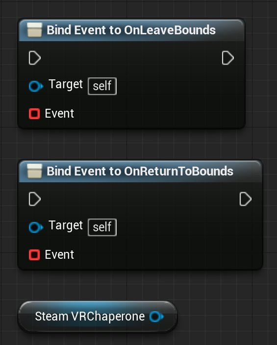
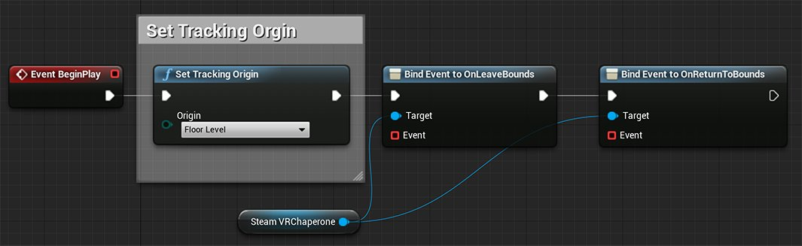
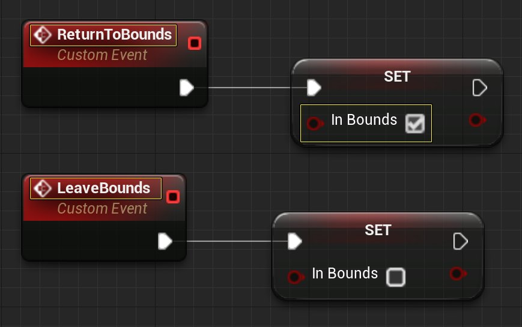
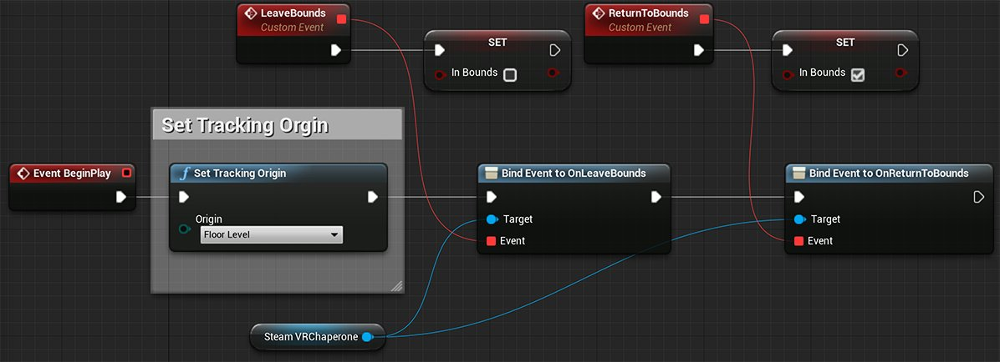

# 检测SteamVR Chaperone系统启动

> 路径：虚幻引擎5.7文档 / 分享和发布项目 / XR开发 / 支持的XR设备 / SteamVR开发 / Steam VR 指南 / 检测SteamVR Chaperone系统启动

> 原始页面：https://dev.epicgames.com/documentation/unreal-engine/detect-steamvr-chaperone-system-activation-in-unreal-engine

SteamVR Chaperone系统用于显示VR交互区的边界。追踪设备靠近边界时，SteamVR Runtime将自动进行可视提示，告知用户。以下指南将说明如何显示交互和其他显示提示，告知用户其中一个设备已处于/或即将处于互动区之外。

> [!NOTE]
> 需要设置 **Room Scale** VR使用SteamVR工具才能使Chaperone系统正常工作。如需了解详细操作方法，请参见[HTC Vive](https://www.vive.com/us/support/category_howto/setting-up-room-scale-play-area.html)设置页面。

> [!WARNING]
> **不可** 在UE中禁用Chaperone系统，此操作不可取。然而，您可以调整用户靠近边界时UE作出的响应。

## 步骤

1. 必须先了解用户的设备已靠近SteamVR Chaperone边界，才能将其显示。可以使用 **Bind Event to OnRetunToBounds** 和 **Bind Event to OnLeaveBounds** 节点在虚幻引擎中实现此功能。在您的玩家Pawn蓝图中，将以下节点添加到 **事件图表**。

   

   点击查看全图。

   | 节点名称 | 数值 |
   | --- | --- |
   | **Bind Event to OnReturnToBounds** | N/A |
   | **Bind Event to OnLeaveBounds** | N/A |
   | **SteamVRChaperone** | N/A |
2. 在 **变量（Variables）** 面板中新建一个名为 **inBounds** 的 **布尔** 变量，以便追踪玩家进出Chaperone边界。
3. 接下来要在关卡开始时进行检查，确定用户是否靠近边界。为实现此功能，我们需要将Bind Event to OnRetunToBounds和Bind Event to OnLeaveBounds节点连接起来，然后将 **SteamVRChaperone** 对象引用连接到两个Bind Event节点上的 **Target** 输入。最后将OnLeaveBounds节点的Bind Event输入连接到Set Tracking Origin节点的输入。完成时，Pawn蓝图应与下图类似：

   

   点击查看全图。
4. 现在需要创建一些蓝图逻辑，在用户离开或进入边界时进行追踪，以便显示正确的消息。首先我们需要新建两个名为 **ReturnToBounds** 和 **LeaveBounds** 的 **自定义事件** 节点。接下来需要在返回边界时将 **In Bounds** 变量设为 **True**，在离开边界时则设为 **False**。完成后，Pawn蓝图应与下图相似。

   

   点击查看全图。
5. 接下来我们需要将ReturnToBounds和LeaveBounds事件输出连接到Bind Event节点的相应输入上，以便在用户返回或离开Chaperone边界时进行追踪。完成后，您的Pawn蓝图应与下图相似。

   

   点击查看全图。
6. 现在我们需要用一种方式来告知用户其已经离开或返回追踪区。我们可以使用 **Print String** 节点在每个Tick处显示消息到屏幕上，让用户确认自己是否处于追踪区内。要在Pawn蓝图中进行设置，首先需要将以下节点添加到事件图表。

   | 节点名称 | 数值 |
   | --- | --- |
   | **Event Tick** | N/A |
   | **Branch** | N/A |
   | **Print String** x 2 | N/A |
   | **InBounds** | N/A |
7. 将Event Tick输出连接到Branch节点上的输入，并将 **InBounds** 连接到 **Condition** 输入，然后将Print String节点连接到Branch节点上的 **True** 和 **False** 输出。在Print String节点中输入一些文本，描述发生的情况。在此例中我们使用的是 **You have returned to the tracking bounds** 和 **You have left the tracking bounds**，但在实际操作中可以使用任何内容。

   完成后，您的Pawn蓝图应与下图相似。

   点击图片复制蓝图节点。

## 最终结果

现在即可戴上HTC Vive头戴显示器，拿起运动控制器，用VR预览运行项目。项目启动后，缓慢向Chaperone边界移动其中一个运动控制器，靠近边界时，屏幕上显示的画面便会发生改变。类似于以下视频的展示。

## UE项目下载

可使用以下链接下载用于创建此例的UE项目。

- SteamVR Chaperone启动示例项目
