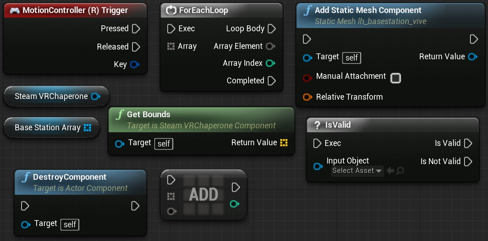
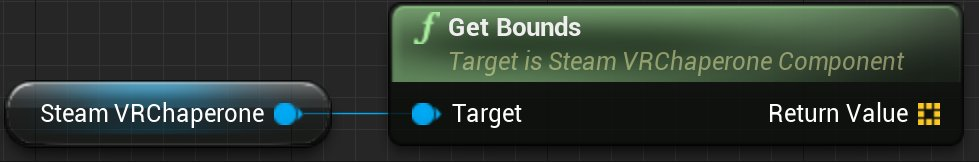
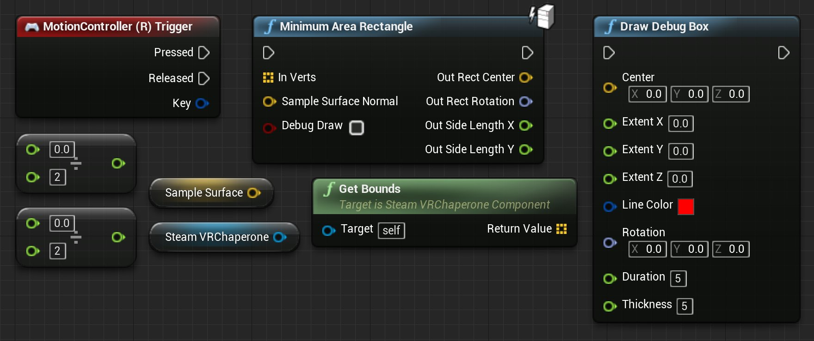

# 与SteamVR Chaperone系统进行交互

> 路径：虚幻引擎5.7文档 / 分享和发布项目 / XR开发 / 支持的XR设备 / SteamVR开发 / Steam VR 指南 / 与SteamVR Chaperone系统进行交互

> 原始页面：https://dev.epicgames.com/documentation/unreal-engine/interact-with-the-steamvr-chaperone-system-in-unreal-engine

SteamVR Chaperone系统用于显示虚拟现实交互区的边界。追踪设备靠近边界时，SteamVR Runtime将自动进行可视提示，告知用户。以下指南将说明如何以两种不同方式向用户展示VR互动区。

> [!TIP]
> 需要设置 **Room Scale** VR使用SteamVR工具才能使Chaperone系统正常工作。如需了解详细操作方法，请参见[HTC Vive](https://www.vive.com/us/support/category_howto/setting-up-room-scale-play-area.html)设置页面。

> [!WARNING]
> **不可** 在UE中禁用Chaperone系统，此操作不可取。然而，您可以调整用户靠近边界时UE作出的响应。

## 步骤

以下将说明如何在VR交互区的4个角落生成静态网格体，并绘制一系列大小形状与VR交互完全相同的线条。

> [!NOTE]
> 可用以下链接下载此指南中使用的Lighthouse Basestation静态网格体和纹理。[Lighthouse Basestation静态网格体和纹理](https://epicgames.box.com/s/3n6yilg2is2f7nq8ju27z0wbxhkvyms1)

1. 首先打开玩家Pawn蓝图并新添加一个名为 **baseStationArray** 的 **Static Mesh Component** 变量。创建baseStationArray变量时，此变量将用于保存在VR交互区四角处生成的静态网格体，因此需要将 **Variable Type** 设为 **Array**。
2. 接下来将带以下值的节点添加到 **事件图表**：

   

   点击查看全图。

   | 节点名称 | 数值 |
   | --- | --- |
   | **Motion Controller (R) Trigger** | N/A |
   | **SteamVRChaperone** | N/A |
   | **baseStationArray** | N/A |
   | **Get Bounds** | N/A |
   | **ForEachLoop** | N/A |
   | **Add Static Mesh Component** | Static Mesh: lh_basestation_vive |
   | **Destroy Component** | N/A |
   | **Array Add** | N/A |
   | **IsValid** | N/A |
3. 接下来需要设置一种方式来获取用户所设置的SteamVR交互区的信息。在Pawn蓝图中进行操作，将 **SteamVRChaperone** 变量输出连接到 **Get Bounds** 节点上的输入，这样便能与组成SteamVR Chaperone边界的点进行交互。

   

   点击查看全图。
4. 能够获取组成VR交互区的点后，接下来我们将设置一个ForEachLoop，它将遍历SteamVRChaperone的每个角，并在按下 **右控制器扳机键** 后添加一个静态网格体。要在Pawn蓝图中完成此操作，需要根据下图进行事件图表的设置。
5. 能够在VR交互区的四个边角处显示静态网格体后，接下来将设置一些蓝图逻辑，检查是否有需要移除的有效静态网格体。如有，则将其移除。要在Pawn蓝图中完成此操作，需要根据下图进行事件图表的设置。
6. 首先在 **变量（Variables）** 部分中创建一个名为 **SampleSurface** 的新 **矢量** 变量，用于保存VR交互区的表面法线。
7. 接下来将带以下值的节点添加到 **事件图表**：

   

   点击查看全图。

   | 节点名称 | 数值 |
   | --- | --- |
   | **Motion Controller (R) Trigger** | N/A |
   | **SteamVRChaperone** | N/A |
   | **GetBounds** | N/A |
   | **Float / Float x 2** | 0,2 |
   | **SampleSurface** | N/A |
   | **MinimumAreaRectangle** | N/A |
   | **DrawDebugBox** | N/A |
8. 将需要的节点添加事件图表后，接下来要把它们连接起来，以便在按下右运动控制器扳机键时对组成VR交互区的顶点位置进行采样，然后围绕它们来绘制方框。照下图设置节点即可在蓝图中实现此功能。

## 最终结果

全部设置妥当后，按下VR Preview键启动关卡，戴上HTC Vive头戴显示器，然后拿起运动控制器。现在按下右运动控制器上的扳机键后将显示SteamVR交互区的边界，如下方视频所示。

## UE项目下载

可使用以下链接下载用于创建此例的UE项目。

- SteamVR Chaperone交互示例项目
