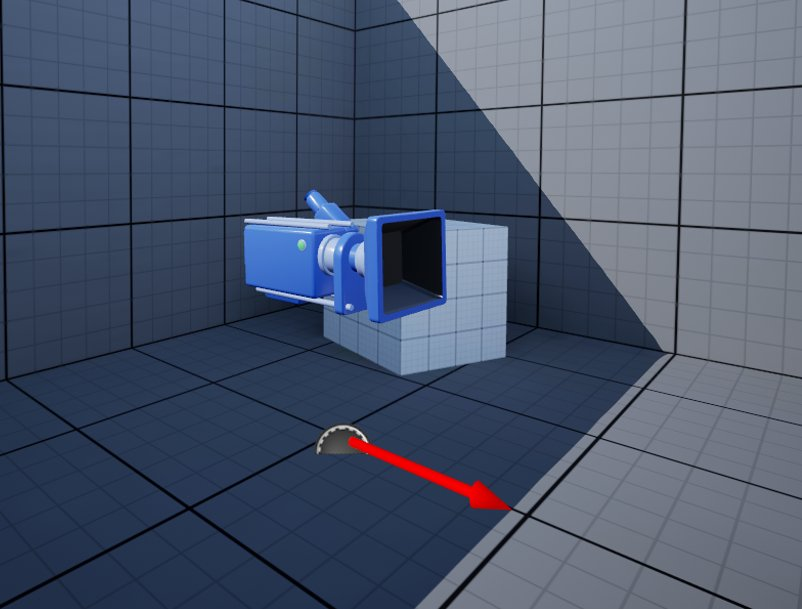
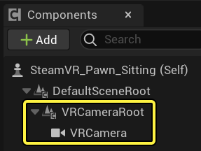
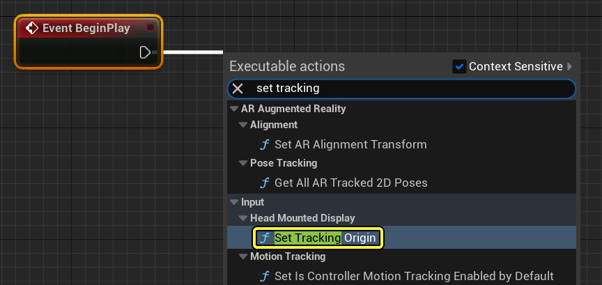
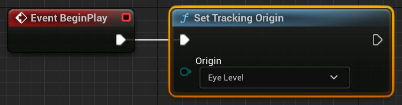
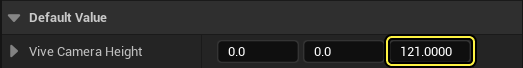
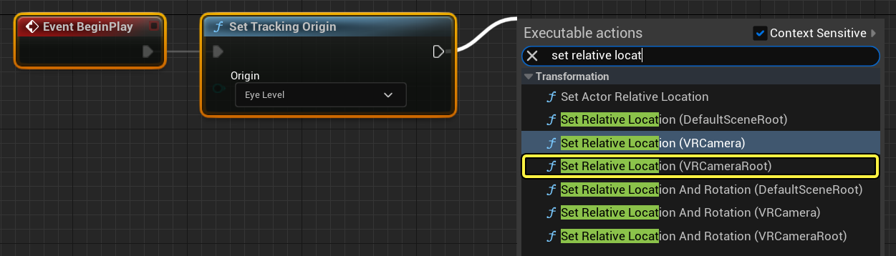
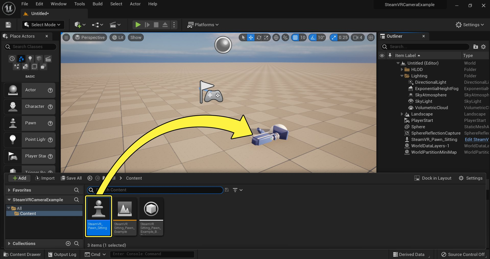
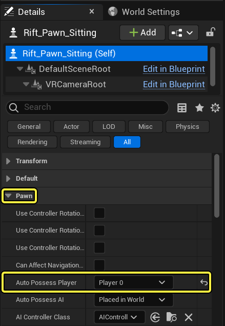

# 设置SteamVR的坐立式相机

> 路径：虚幻引擎5.7文档 / 分享和发布项目 / XR开发 / 支持的XR设备 / SteamVR开发 / Steam VR 指南 / 设置SteamVR的坐立式相机

> 原始页面：https://dev.epicgames.com/documentation/unreal-engine/set-up-a-seated-camera-for-steamvr-in-unreal-engine

开始用UE4开发SteamVR上的VR项目时，首先要考虑的一点便是确定该体验为坐立式还是站立式。以下指南将讲述如何设置坐立式SteamVR 体验的UE4项目VR相机。

## 步骤

以下内容将讲述如何进行坐立式SteamVR体验的Pawn设置。

1. 首先，打开或新建Pawn蓝图，然后前往 **视口（Viewport）** 选项卡的 **组件（Component）** 部分。在此处用以下命名添加以下两个组件，并将VRCamera设为VRCameraRoot的子项：

   | 组件命名 | 值 |
   | --- | --- |
   | **场景** | VRCameraRoot |
   | **相机** | VRCamera |

   

   > [!NOTE]
   > 由于VR相机能在不实际移动相机的情况下实现相机位置偏移，因此无论使用何种VR头戴显示器，Epic推荐均此方式设置VR相机。
2. 接下来，打开Pawn蓝图（如未打开），然后在 **Event Graph** 中从 **Event Begin Play** 节点连出引线，显示可执行操作（Executable Actions）列表。在列表中搜索 **Set Tracking Origin** 节点，点击将其添加到事件图表。

   

   点击查看大图。
3. Set Tracking Origin节点有两个选项：Floor Level和Eye Level。针对坐立式体验，需要将 **Set Tracking Origin** 节点的 **Origin** 设为 **Eye Level**。

   

   点击查看大图。
4. 接下来在 **我的蓝图** 选项卡的 **变量（Variables）** 部分中新建名为 **ViveCameraHeight** 的 **向量** 变量，并将 **Z** 轴值设为 **121**。

   

   > [!NOTE]
   > 对坐立式SteamVR体验而言，需将相机的高度设为真实世界中用户的坐立高度（以厘米计）。
5. 然后从 **Set Tracking Origin** 节点的输出连出引线，搜索 **Set Relative Location**节点，选择 **SetRelativeLocation(VRCameraRoot)** 选项。

   

   点击查看大图。
6. 将 **ViveCameraHeight** 变量连接到Set Relative Location节点上的 **New Location** 输入，然后按下 **编译（Compile）** 按钮。操作完成后，事件图表应下图类似。

   > [!TIP]
   > 点击上图左上角并按下 **CRTL + C** 即可复制完成的蓝图。复制后前往蓝图事件按下 **CTRL + V** 进行粘贴。
7. 将Pawn蓝图从内容侧滑菜单拖入关卡，将其放置在关卡中0,0,0的位置。

   

   点击查看大图。
8. 选中放置在关卡中的Pawn蓝图，然后在 **Pawn** 设置下的 **细节** 面板中，将 **自动拥有玩家（Auto Possess Player）** 从 **禁用（Disabled）** 设为 **玩家0（Player 0）**。

   

   点击查看大图。

## 最终结果

最后，前往 **主工具栏（Main Toolbar）** 将 **播放模式（Play Mode）** 改为 **VR预览（VR Preview）**，然后按下 **播放（Play）** 按钮。戴上HTC Vive头戴显示器，坐下观察关卡时，将看到与以下视频类似的内容。

## 项目下载

下文链接可用于下载示例中的虚幻引擎项目。

- SteamVR坐立式VR相机范例项目
