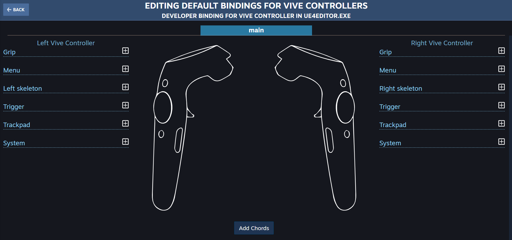
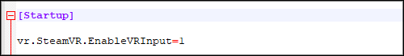
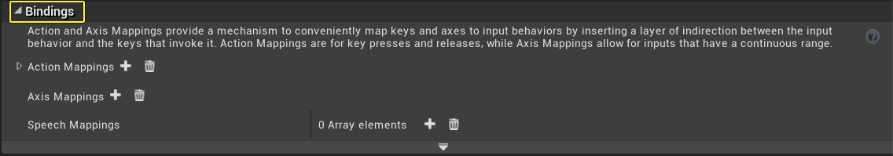
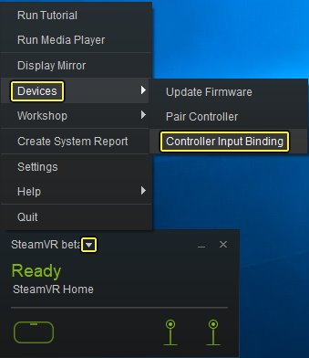
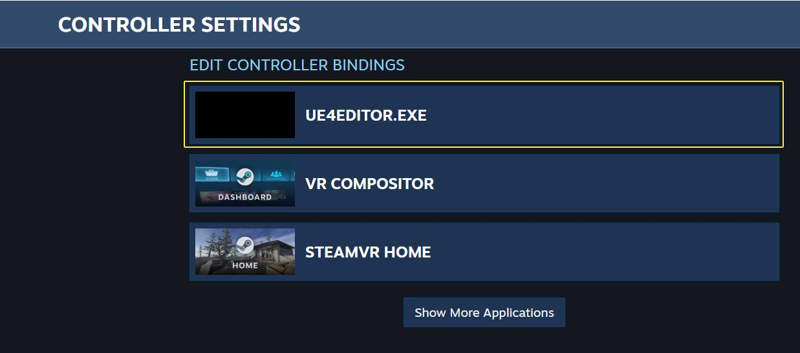
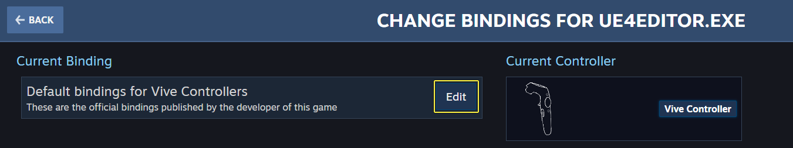
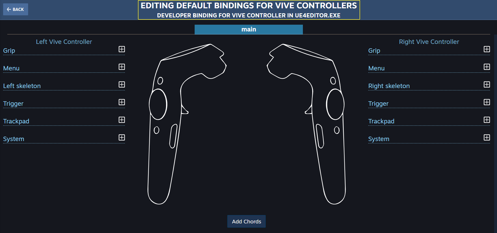

# 设置SteamVR输入系统

> 路径：虚幻引擎5.7文档 / 分享和发布项目 / XR开发 / 支持的XR设备 / SteamVR开发 / Steam VR 指南 / 设置SteamVR输入系统

> 原始页面：https://dev.epicgames.com/documentation/unreal-engine/set-up-the-steamvr-input-system-in-unreal-engine

虚幻引擎4的输入操作和事件系统现在包含对SteamVR输入系统的实验性支持。用户可用SteamVR输入系统为最喜欢的游戏构建绑定配置，甚至可为游戏编写时并不存在的控制器构建绑定配置。启用后，UE4输入设置中定义的操作和轴映射可绑定至SteamVR绑定编辑器工具中的设备。

欲知更多信息，请参阅Steam的SteamVR输入系统初始公告：[控制器：介绍SteamVR输入](https://steamcommunity.com/games/250820/announcements/detail/3809361199426010680)

> [!NOTE]
> 为保持与现有项目的向后兼容性，默认情况下新SteamVR输入系统的支持已禁用。

## 步骤

1. 新SteamVR输入系统与现有项目不兼容，因此必须显式启用。若要启用SteamVR输入，请在虚幻引擎的 **ConsoleVariables.ini** 文件(*\Engine\Config\ConsoleVariables.ini*)中将控制台变量 **vr.SteamVR.EnableVRInput* 设为 *1*。

   

   点击查看大图。
2. 在 **项目设置（Project Settings）> 引擎（Engine）> 输入（Input）> 绑定（Bindings）** 下，为要处理的输入操作设置[操作和轴映射](https://www.unrealengine.com/en-US/blog/input-action-and-axis-mappings-in-ue4)。

   

   点击查看大图。

   > [!NOTE]
   > 由于最终按键绑定在SteamVR中是通过 **输入绑定（Input Bindings）** 来执行，因此只要将某些按键绑定至各个操作和轴即可，实际指定给 **输入操作和轴映射（Input Action and Axis Mappings）** 的按键无关紧要。
3. 保存设置，并重新启动SteamVR和虚幻编辑器。

   > [!TIP]
   > 停止SteamVR后，还可能需要编辑 *C:\Program Files (x86)\Steam\config\steamvr.vrsettings*，移除为虚幻编辑器生成的操作清单设置缓存数据块。
4. 在 **SteamVR** 的 **设备（Devices）** 下，点击 **控制器输入绑定（Controller Input Binding）**。在上方，运行中应用程序的下面，找到您的应用程序。使用UI创建一些绑定，然后保存。

- 在 **SteamVR beta** 下，选择 **设备（Devices）**，然后选择 **控制器输入绑定（Controller Input Bindings）**。

  

  点击查看大图。
- 选择应用程序的绑定进行编辑(UE4EDITOR.EXE)。

  

  点击查看大图。
- 选择 **编辑（Edit）** 编辑现有绑定。

  

  点击查看大图。
- 更改现有绑定并进行保存。

  

  点击查看大图。

> [!NOTE]
> **关于2D轴（About 2D Axes）**：虚幻引擎只有1维轴输入，而Steam支持最多3维输入。如果在输入设置中定义了绑定到同一控制器对应X和Y的两个轴，则可纠正此不匹配。举例而言，假设 *MoveRight* 绑定至 *Motion Controller Thumb Stick X*，而 *MoveForward* 绑定至 *Motion Controller Thumb Stick Y*。SteamVR控制器实际上将生成三个操作，即一个名为 *MoveRight* 的 *vector1* 操作，一个名为 *MoveForward* 的 *vector1* 操作，以及一个名为 *MoveRightForward* 的组合 *vector2* 操作。而根据需要的输入类型（1维或2维），您可选择仅绑定其中一项，或两项皆绑定。

## 最终结果

使用[操作输入API](https://www.unrealengine.com/en-US/blog/input-action-and-axis-mappings-in-ue4)操作的游戏现在应对SteamVR输入系统中定义的绑定作出响应。
