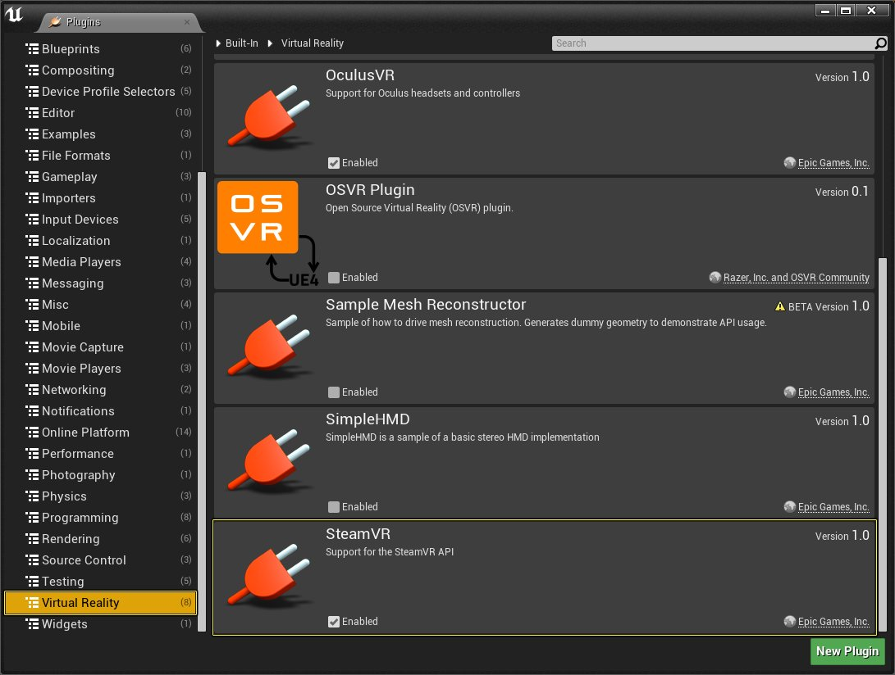
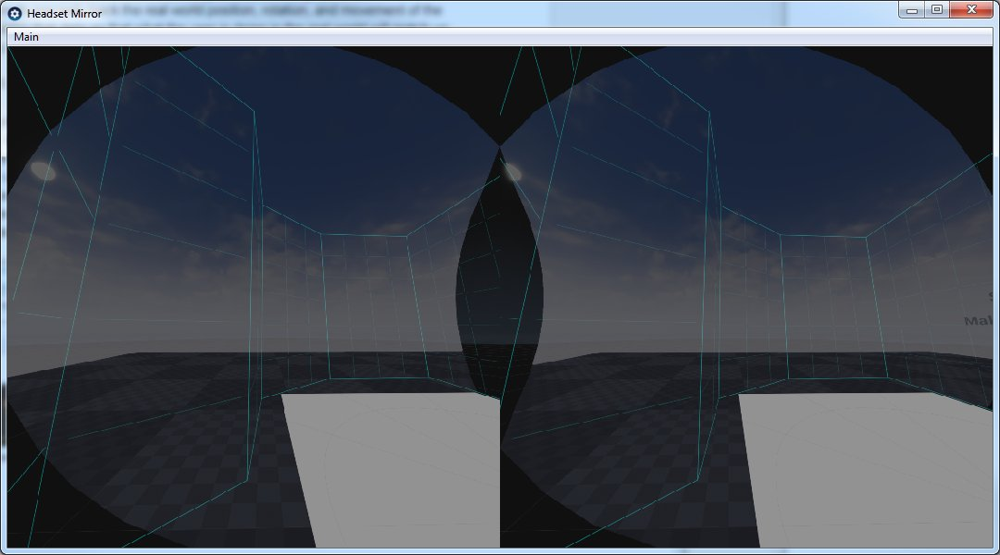

# SteamVR最佳实践

> 路径：虚幻引擎5.7文档 / 分享和发布项目 / XR开发 / 支持的XR设备 / SteamVR开发 / SteamVR最佳实践

> 原始页面：https://dev.epicgames.com/documentation/unreal-engine/steamvr-best-practices-in-unreal-engine

SteamVR SDK不同于其他虚幻引擎(UE)的虚拟现实SDK，因为它并不一定要与特定的头戴显示器(HMD)一起使用。因此，为SteamVR开发的UE项目可以与任何支持SteamVR的HMD一起使用。以下指南将帮助重点介绍在为SteamVR和UE开发内容时需要了解的一些信息。

## SteamVR Beta

为了确保您已经安装了最新版本的SteamVR，通过右键单击SteamVR工具进入 **属性（Properties）** > **Beta（Betas）** 确保您选择了SteamVR Beta，然后选择 **beta - SteamVR Beta更新（beta - SteamVR Beta Update）** 选项。

## SteamVR HMD目标帧率

下面，您将找到在使用SteamVR时您的UE项目必须满足的帧率。

| HMD设备 | 目标帧率 |
| --- | --- |
| **HTC Vive** | 90 FPS |
| **Oculus Rift** | 90 FPS |

## SteamVR健全性检查

如果插入了支持的HMD并且启用了SteamVR插件，虚幻引擎将自动使用SteamVR。如果由于某种原因，SteamVR不能正常工作，那么首先检查一下是否启用了SteamVR插件。您可以在[插件](../../../../../production-pipeline/plugins/index.md)菜单的 **虚拟现实（Virtual Reality）** 部分下找到SteamVR插件。

单击显示全图。

## 使用SteamVR查看工作

SteamVR将无法使用UE编辑器的任何视口或默认的"在编辑器中运行(PIE)"会话。要使用SteamVR查看项目，您需要使用 **VR预览（VR Preview）** 选项。要访问VR预览（VR Preview）选项，您需要在UE编辑器中执行以下操作：

1. 在 **播放（Play）** 部分的主工具栏中，单击播放（Play）按钮旁边的白色小三角形。
2. 从下拉菜单中，选择 **VR预览（VR Preview）** 选项，然后戴上Rift以在VR中查看项目。

   > [!NOTE]
   > 一旦您将播放模式切换到VR预览（VR Preview）选项，您的项目将始终在VR中启动，即使使用像 **ALT + P** 这样的快捷方式也是如此。

## SteamVR镜像模式

SteamVR头戴设备镜像让您可以看到用户在HMD中看到的内容。如果您需要记录您在UE项目和SteamVR合成器中所看到的内容，那么启用此模式尤为有用。要启用镜像，需要执行以下操作：

1. 首先，找到SteamVR工具，然后右键单击它们来显示菜单并选择 **显示镜像（Display Mirror）** 选项。
2. 然后，将在一个名为 **头戴设备镜像（Headset Mirror）** 的新窗口中显示镜像，如下图所示。

   

   上图准确地显示了用户在HMD中看到的内容。

## SteamVR开发者链接

下面是一组链接，它们将提供与SteamVR有关的硬件或软件问题等事项的有用信息。

- SteamVR开发者支持
- HTC Vive开发者支持
