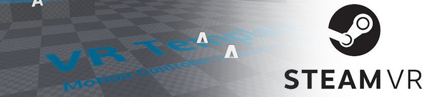
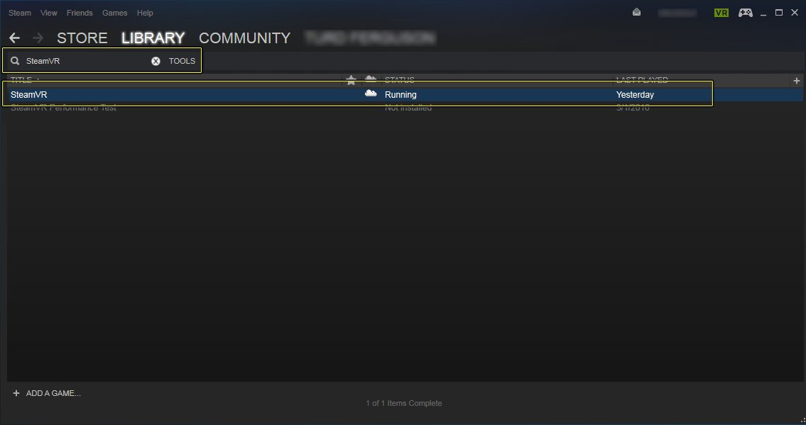

# SteamVR快速入门

> 路径：虚幻引擎5.7文档 / 分享和发布项目 / XR开发 / 支持的XR设备 / SteamVR开发 / SteamVR快速入门

> 原始页面：https://dev.epicgames.com/documentation/unreal-engine/steamvr-quick-start-in-unreal-engine

## 目标

SteamVR快速入门将带领您了解如何设置虚幻引擎4(UE4)项目，以便与SteamVR和Vive头戴式显示器(HMD)头戴设备一起使用。

## 目的

- 创建一个新的UE4项目，专门针对SteamVR开发。
- 进行必要的项目设置，以便您的项目可以与SteamVR一起使用。

## 1 - SteamVR初始设置

在下面部分，我们将介绍如何设置SteamVR，以便它可以与虚幻引擎4（UE4）一起使用。

### 步骤

> [!NOTE]
> 对于每个SteamVR开发工具包，Valve都提供了[详细说明](http://media.steampowered.com/apps/steamvr/vr_setup.pdf)，向您展示如何正确设置所有内容。如果您还没有阅读此文档，请在进行任何进一步操作之前先阅读此文档，因为下面的信息不能替代Valve创建文档中包含的信息。

1. 确保头戴式显示器（HMD）、Steam控制器、接线盒和Lighthouse基站均已按照Valve提供的[说明](http://media.steampowered.com/apps/steamvr/vr_setup.pdf)拆包、通电、连接和设置。
2. 如果您还没有这样做，请确保在您的开发PC上下载并安装[Steam客户端](http://store.steampowered.com/about/)。
3. 要安装 **SteamVR** 工具，请使用鼠标悬停在 Steam **库（Library）** 选项上，并从显示的菜单中，选择 **工具（Tools）** 选项。
4. 进入"工具（Tools）"部分后，使用顶部的搜索栏搜索 **SteamVR**。找到SteamVR后，双击它以下载并安装。

   

   单击显示全图。

   您还可以单击位于Steam客户端右上角的 **VR** 图标并按照提供的说明操作，来安装SteamVR。
5. 双击工具（Tools）菜单中的 **SteamVR** 选项，将启动SteamVR工具，如下图所示。

   > [!NOTE]
   > 当SteamVR显示所有设备为绿色时（如上图所示），表示一切都正常运行。如果某个设备显示为灰色，则此设备存在问题。如果您将鼠标悬停在显示为灰色的设备上，SteamVR将告诉您它有什么问题。
6. 您必须先设置SteamVR交互区域，之后方可将SteamVR与UE4一起使用。为此，右键单击SteamVR窗口，选择 **运行空间设置（Run Room Setup）**，并按照屏幕上的指示设置SteamVR交互区域。

### 最终结果

完成后，即表示您已设置好SteamVR，可以与UE4一起使用了。

## 2 - 设置UE4以配合SteamVR一起使用

在下面部分，我们将介绍如何设置一个新的虚幻引擎4（UE4）项目来与SteamVR一起使用。

### 步骤

> [!NOTE]
> 如果您尚未进行此操作，请确保运行SteamVR **空间设置（Room Setup）** 来建立和校准VR跟踪区域。否则，可能会导致SteamVR和UE4不能正常配合工作。

1. 使用

   游戏（Games）> 空白（Blank）

   模板新建一个项目，并使用以下设置：

*启用 **蓝图（Blueprint）*** 启用 **可缩放的3D或2D（Scalable 3D or 2D）** *启用 **移动/平板设备（Mobile / Tablet）*** 启用 **不含初学者内容（No Starter Content）**

1. 加载项目后，单击

   运行（Play）

   按钮旁边的小三角形，然后从显示的菜单中选择

   虚拟现实预览（VR Preview）

   选项。

### 最终结果

当虚拟现实预览（VR Preview）启动时，戴上您的HMD，您现在应该看到显示的基本关卡。您应该还能够朝任何方向旋转您的头部，如下方视频中所示。

## 3 - 看你的了！

现在您可以使用SteamVR和HTC Vive查看UE4项目，请尝试将以下项目添加到您的项目中。

- 使用[迁移工具](../../../../../understanding-the-basics/assets-and-content-packs/migrating-assets/index.md)将内容从其中一个移动内容示例移到您的项目中以使用。
- 添加对[运动控制器](../../../making-interactive-xr-experiences/motion-controller-component-setup/index.md)的支持，以便用户可以像在现实中一样在VR中移动对象。
- 使用[GPU分析器](https://dev.epicgames.com/documentation/404)帮助您在构建项目时追踪项目的性能。

下面有一些额外的资源，它们可以为在虚幻引擎4中开发VR项目提供有用的信息。

### 文档

- 虚拟现实开发

  - [VR速查表](../../../getting-started-with-xr-development/xr-best-practices/index.md)
  - [SteamVR最佳实践](../../../getting-started-with-xr-development/xr-best-practices/index.md)
- SteamVR文档

  - [用户指南](https://steamcommunity.com/steamvr)
  - [开发者指南](https://steamcommunity.com/steamvr)

### 可尝试内容

|  |  |
| --- | --- |
| CouchKnights | Showdown |
|  |  |
| VR模式 |  |
