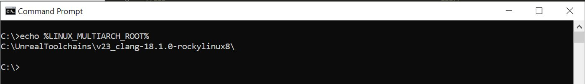

# Linux开发要求

> 路径：虚幻引擎5.7文档 / 分享和发布项目 / Linux游戏开发 / Linux开发要求

> 原始页面：https://dev.epicgames.com/documentation/unreal-engine/linux-development-requirements-for-unreal-engine

本页面包含为Linux设备开发虚幻引擎（UE）项目所需的软件开发工具包（SDK）和硬件要求。

## 推荐硬件

|  |  |
| --- | --- |
| **Recommended Operating System** | Ubuntu 22.04 |
| **Processor** | Quad-core Intel or AMD, 2.5 GHz or faster |
| **Memory** | 32 GB RAM |
| **Graphics Card** | GeForce 2080 |
| **Graphics RAM** | 8 GB or more |
| **RHI Version** | Vulkan: AMD (RADV minimum 24.2.8+, recommended 25.0.0+) and NVIDIA (570+) |

## 针对Linux开发的推荐软件

运行引擎或编辑器的最低要求如下。

| 运行引擎 |  |
| --- | --- |
| **操作系统** | Rocky Linux 8 / Redhat Linux 8或更高版本 |
| **Linux Kernel版本** | 内核4.18或更高版本 |
| **其他依赖项** | glibc 2.28或更高版本 |

> [!NOTE]
> 如果虚幻编辑器或虚幻引擎游戏的安装程序启动时间过长，请检查你的`glibc`是否为2.35或更高版本，因为其早期版本对于`dlopen`的实现较慢。

程序员使用该引擎开发的要求如下。

| 使用引擎开发 |  |
| --- | --- |
| **操作系统** | Ubuntu 22.04、Rocky Linux 8 |
| **编译器** | clang 18.1.0 |
| 可选 |  |
| **IDE** | Visual Studio Code、Rider |

## 交叉编译工具链

**交叉编译**让游戏开发者可以在Windows上对Linux进行开发。 目前，交叉编译仅支持Windows，而Mac用户目前只能使用[原生编译](index.md#native-toolchain)。 此外，我们支持、测试并提供了适用于Linux-x86_64平台的库和工具链。

### 使用交叉编译的理由

**交叉编译**使得在以Windows工作流程为中心的游戏开发者能够以Linux为目标。 目前，交叉编译仅支持Windows。 Mac用户目前只能使用原生编译。 我们支持、测试并提供了适用于Linux-x86_64平台的库和工具链。

### 获取工具链

要下载交叉编译工具链，请参阅此页面[版本历史记录](index.md#version-history)小节中表格里的下载链接。

### 安装交叉编译SDK后

执行`%LINUX_MULTIARCH_ROOT%`即可验证安装。

## 原生工具链

虚幻引擎的安装shell脚本（`Setup.sh`）会自动下载原生工具链，这可保证你的编译器和连接器能够处理我们的代码库。 凭借原生工具链，你可以针对固定sysroot（最起码为`glibc`）进行编译，因此，举例来说，如果你在Ubuntu 22.04上编译游戏，你就能够在Rocky Linux 8上启动二进制文件。

## 性能说明

以下系统规格取自Epic的一台常用设备（采用Lenovo P620 Content Creation Workstation标准版）。 它能够为使用UE5开发游戏的人员提供较合理的指导：

- 操作系统：Ubuntu 22.04
- 电源：1000W电源
- 内存：128GB DDR4-3200
- 处理器：AMD Ryzen Threadripper Pro 3975WX处理器 - 128MB缓存，3.5 GHz base / 4.2 GHz turbo，32核/64线程, 280w TDP
- 操作系统硬盘：1 TB M.2 NVMe3 x4 PCI-e SSD
- 数据硬盘：4 TB Raid Array - 2 x 2TB NVMe3 x4 PCI-e SSD in Raid 0
- GPU：Nvidia RTX 3080 - 10GB
- NIC 1GBPS on-board + Intel X550-T1 10G PCI-e以太网适配器
- TPM兼容

## UE5渲染功能要求

| UE5功能 | 系统要求 |
| --- | --- |
| **Lumen全局光照、Lumen反射和MegaLights** | 项目设置中必须启用**SM6**。以下显卡之一：NVIDIA RTX-2000系列或更高版本。AMD RX-6000系列或更高版本。Intel® Arc™ A系列显卡或更高版本。Lumen硬件光线追踪现在需要在项目设置中设置SM6。如需了解详情，请参阅[Lumen技术细节](../../../building-virtual-worlds/lighting-the-environment/global-illumination/lumen-global-illumination-and-reflections/lumen-technical-details/index.md)。 |
| **路径追踪** | 项目设置中必须启用**SM6**。以下显卡之一：NVIDIA RTX-2000系列或更高版本。AMD RX-6000系列或更高版本。如需了解详情，请参阅[路径追踪](../../../building-virtual-worlds/lighting-the-environment/ray-tracing-and-path-tracing-features/path-tracer/index.md)。 |
| **Nanite虚拟几何体和虚拟阴影贴图** | 支持VK_KHR_shader_atomic_int64 Vulkan拓展的GPU。项目设置中必须启用**SM6**。 （在新项目中默认开启。）最新显卡驱动程序。如需了解详情，请参阅[Nanite虚拟几何体](../../../designing-visuals-rendering-and-graphics/optimizing-and-debugging-projects-for-realtime-rendering/nanite/nanite-virtualized-geometry/index.md)和[虚拟阴影贴图](../../../building-virtual-worlds/lighting-the-environment/shadowing/virtual-shadow-maps/index.md)。 |

## 版本历史记录

> [!WARNING]
> 如果你将5.5版本的项目迁移到5.6版本，则必须将交叉编译工具链更新至v25版本，以避免出现依赖性问题。 此外，由于存在未定义的行为，我们不建议将v24（clang 19）用于5.6版本。

| UE版本 | 推荐操作系统 | 推荐IDE | 编译器 | 交叉编译工具链 | 原生工具链 |
| --- | --- | --- | --- | --- | --- |
| 5.6 | Ubuntu 22.04、Rocky Linux 8 | Visual Studio Code、Rider | clang 18.1.0 | v25 [clang-18.1.0-based](https://cdn.unrealengine.com/CrossToolchain_Linux/v25_clang-18.1.0-rockylinux8.exe) | v25 [clang-18.1.0-based](https://cdn.unrealengine.com/Toolchain_Linux/native-linux-v25_clang-18.1.0-rockylinux8.tar.gz) |
| 5.5 | Ubuntu 22.04、Rocky Linux 8 | Visual Studio Code、Rider | clang 18.1.0 | **v23**[基于clang-18.1.0](https://cdn.unrealengine.com/CrossToolchain_Linux/v23_clang-18.1.0-rockylinux8.exe) | **v23**[基于clang-18.1.0](https://cdn.unrealengine.com/Toolchain_Linux/native-linux-v23_clang-18.1.0-rockylinux8.tar.gz) |
| 5.3-5.4 | Ubuntu 22.04、CentOS 7 | Visual Studio Code、Rider | clang 16.0.6 | **v22**[基于clang-16.0.6](https://cdn.unrealengine.com/CrossToolchain_Linux/v22_clang-16.0.6-centos7.exe) | **v22**[基于clang-16.0.6](https://cdn.unrealengine.com/Toolchain_Linux/native-linux-v22_clang-16.0.6-centos7.tar.gz) |
| 5.2 | Ubuntu 22.04、CentOS 7 | Visual Studio Code、Rider | clang 15.0.1 | **-v21**[基于clang-15.0.1](https://cdn.unrealengine.com/CrossToolchain_Linux/v21_clang-15.0.1-centos7.exe) | **-v21**[基于clang-15.0.1](http://cdn.unrealengine.com/Toolchain_Linux/native-linux-v21_clang-15.0.1-centos7.tar.gz) |
| 5.1 | Ubuntu 22.04、CentOS 7 | Visual Studio Code、Rider | clang 13.0.1 | **-v20**[基于clang-13.0.1](https://cdn.unrealengine.com/CrossToolchain_Linux/v20_clang-13.0.1-centos7.exe) | **-v20**[基于clang-13.0.1](https://cdn.unrealengine.com/Toolchain_Linux/native-linux-v20_clang-13.0.1-centos7.tar.gz) |
| 5.0.2+ | Ubuntu 22.04、CentOS 7 | Visual Studio Code、Rider | clang 13.0.1 | **-v20**[基于clang-13.0.1](https://cdn.unrealengine.com/CrossToolchain_Linux/v20_clang-13.0.1-centos7.exe) | **-v20**[基于clang-13.0.1](https://cdn.unrealengine.com/Toolchain_Linux/native-linux-v20_clang-13.0.1-centos7.tar.gz) |
| 5.0 | Ubuntu 20.04、CentOS 7 | Visual Studio Code、Rider | clang 11.0.1 | **-v19**[基于clang-11.0.1](https://cdn.unrealengine.com/CrossToolchain_Linux/v19_clang-11.0.1-centos7.exe) | **-v19**[基于clang-11.0.1](https://cdn.unrealengine.com/Toolchain_Linux/native-linux-v19_clang-11.0.1-centos7.tar.gz) |
