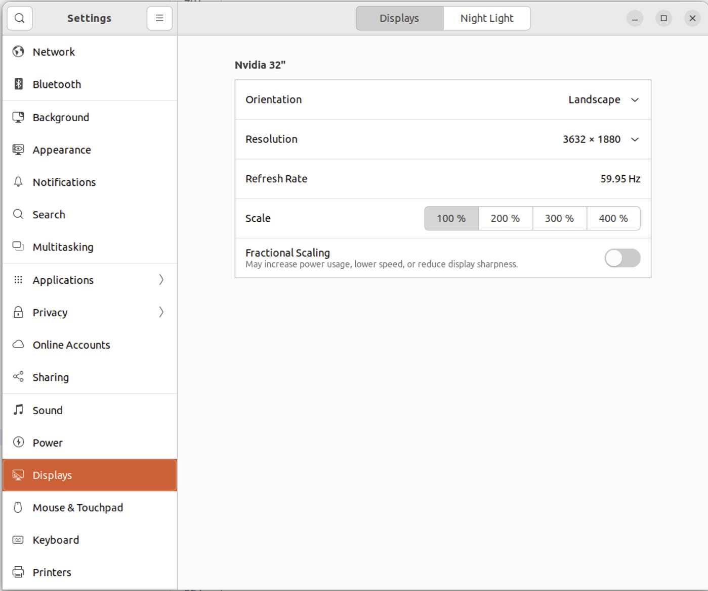
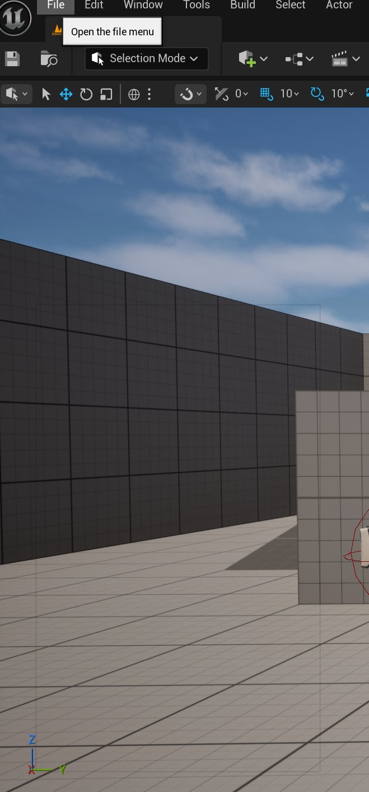
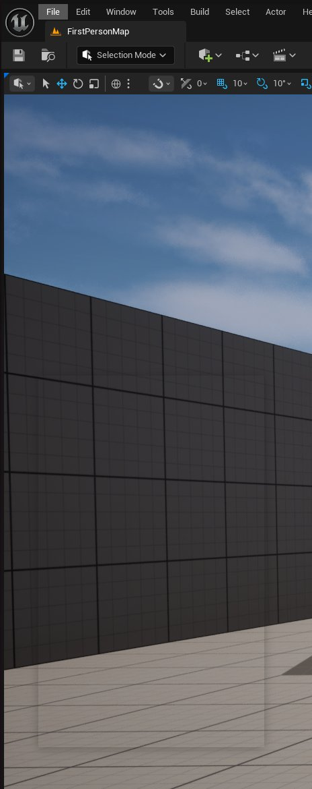

# Updating Unreal Engine on Linux to SDL3

> 路径：虚幻引擎5.7文档 / 分享和发布项目 / Linux游戏开发 / Updating Unreal Engine on Linux to SDL3

> 原始页面：https://dev.epicgames.com/documentation/unreal-engine/updating-unreal-engine-on-linux-to-sdl3

该页面没有可用的官方中文版本；以下内容保留原文，并按本项目人工译文规则逐步回译。

We’ve updated Unreal Engine 5.7 for Linux to use SDL3 build 3.2.10. This document gives more information on this change and what to expect.

## 编译和必需代码更改

需要在 build.cs 文件中将所有 SDL2 模块用法改为 SDL3。

SDL 的主头文件也已改变：

`#include “SDL.h”` 或 `#include <SDL.h>`

需要改为：

`#include “SDL3/SDL.h”` 或 `#include <SDL3/SDL.h>`

All SDL header files are under the SDL3 subdir now. Including the SDL3 module adds the correct include paths to your code.

SDL3 includes a number of API changes. The best guide for what has changed and how to update code is this web page:

[迁移到 SDL 3.0](https://wiki.libsdl.org/SDL3/README-migration)

One of the bigger changes is the return values from SDL functions. Functions no longer return negative values, they return success/failure booleans. Be sure to read the notes in the migration guide.

## 构建 SDL3

x86-64 和 Arm64 的 SDL3 二进制文件都已提交到 Unreal Engine 中。

`/Engine/Source/ThirdParty/SDL3/SDL-gui-backend/lib/Unix/aarch64-unknown-linux-gnueabi`

`/Engine/Source/ThirdParty/SDL3/SDL-gui-backend/lib/Unix/x86_64-unknown-linux-gnu`

如果需要重建这些库，需要使用以下目录中的 Epic 脚本：`/Engine/Source/ThirdParty/SDL3/docker`

如果运行 `/Engine/Source/ThirdParty/SDL3/docker/RunMe.sh` 它会创建 Docker 容器，并从 `/Engine/Source/ThirdParty/SDL3/SDL-gui-backend` 开始，为两种处理器变体使用正确选项构建 SDL 库，并将结果复制到正确目录。这是重建 Unreal Engine 所用 SDL 库的唯一受支持方式。

docker 目录中还有一个脚本 `/Engine/Source/ThirdParty/SDL3/docker/local_build.sh` that builds the x86-64 version of the library using the Linux environment you are in. This means you have to have installed all the various libraries and tools to build SDL3. The local build script **并不** 适合构建用于再分发的库，但它是开发测试时快速重建 SDL3 库的更快方式。 **绝不要** 提交用它构建的 SDL3 库二进制版本；它 **仅** 用于开发目的。

## 新增和变更功能

With SDL3, we hooked the SDL logging to Unreal Engine’s logging. This makes any SDL log events visible (under the LogSDL3 category). When running a debug build of Unreal Engine we set the SDL3 logging level to verbose by default. SDL3 is not log intensive so even on verbose the output is minimal. You can control the SDL3 logging using environment variables.

SDL3 handles device DPI and scaling differently than SDL2. As a result you might find that Unreal Editor as well as apps using Slate will appear with 100% scaling where with SDL2 they would often be scaled based on your screen dimensions. With SDL3 the application scaling is set using X Windows options. The easiest way is most likely the settings panel in Ubuntu:



Unreal Editor 会遵循那里配置的内容。

SDL3 会通过几种不同方式查找视频缩放：

- 首先，它检查 SDL Hint `SDL_HINT_VIDEO_X11_SCALING_FACTOR`.
- 如果不存在，则回退到 `Xft.dpi` ，这与 Qt 和 Gtk 等其他应用框架匹配。
- 如果这也不存在，它会尝试 XSETTINGS 键 `Gdk/WindowScalingFactor`.
- 如果这些都未设置或不可用，则会尝试 `GDK_SCALE` 环境变量。

根据 Linux 版本和 X11 窗口管理器不同，可能需要使用不同方式配置 Unreal Editor 和 UE 应用使用的缩放。

使用 SDL3 后，我们增加了通过环境变量切换 `norelativemousemode` using an Environment variable. When running UE-based applications over services like NiceDCV and Teradici, UE requires you start the application with the command line flag `-norelativemousemode`。使用 SDL3 时，也可以通过环境变量设置此选项： `UE_NORELATIVEMOUSEMODE` 可以在`.bashrc` 文件中设置，例如：

Shell

```
export UE_NORELATIVEMOUSEMODE=1
```

未使用远程桌面应用的用户不应需要此项；但如果之前需要 `-norelativemousemode` ，环境变量支持会让设置更容易。

## 已知问题

We entirely removed from this update many of the input and focus workarounds we added to SDL2. It’s possible that some of those issues or new variants of them still remain.

We removed the SDL2 work-around for unintentional double-clicks when CTL-clicking adjacent selected assets. CTL-clicking too fast in the Linux File Browser is now seen as a double click.

While Wayland support is compiled into the SDL3 library, Unreal Editor using pure Wayland is unusable. Mouse click events are not correctly received (though touch events are) and in general there are a number of issues. X11Wayland support is fine and Editor works as normal in that mode, but if you set `SDL_VIDEODRIVER=wayland` and run using a Wayland window manager, Unreal Editor is not functional. Support for game targets using Wayland mode is also still untested.

You might notice a quick window border flash when dropping down menus inside Unreal Editor. This is actually present using SDL2 as well, but with SDL3 the window outline (at least on Ubuntu with the default Window Manager) is much more noticeable.

使用 SDL2 时，它是浅色轮廓。



使用 SDL3 时，它更像阴影轮廓。



- [Motion Design 快速入门指南](../../../motion-design/motion-design-quickstart-guide/index.md) - 开始使用 Motion Design。
- [使用 Motion Design 创建第一个图形](../../../motion-design/your-first-graphic-with-motion-design/index.md) - 学习如何使用 Motion Design 创建第一个图形。
