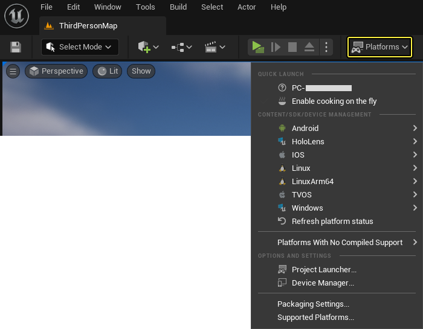

# 在设备上启动项目

> 路径：虚幻引擎5.7文档 / 分享和发布项目 / 游戏的打包（Packaging）和烘焙（Cooking） / 在设备上启动项目

> 原始页面：https://dev.epicgames.com/documentation/unreal-engine/launching-unreal-engine-projects-on-devices

在虚幻编辑器的主工具条右侧，有个标签为 **平台（Platforms）** 的按钮，它有一个下拉菜单。

在该下拉菜单中，你将看到一系列可以在其上面启动当前关卡的平台。 通常来说，你不需要Windows或Mac平台，因为你可以使用 **Play（运行）** 按钮来在这些平台上运行关卡，而不需要烘焙数据。 本文主要介绍了关于在移动平台上启动关卡的信息。

对于Android平台来说，有多个选项。 请参照[**Android贴图格式**](../../../mobile-development/android-support/developing-guides-for-android/android-development-basics/index.md#androidtextureformats)页面获得更多信息。

如果你具有多个针对某一特定平台的设备，那么你可以在这里选择设备。 点击该平台(及设备)，编辑器将开始烘焙该关卡，在该设备上安装数据，然后在该设备上运行该地图。

> [!TIP]
> 该方法将仅在设备上安装当前关卡，以便进行快速迭代，且该方法不支持关卡间的切换。 如果你想一次性将你的所有关卡都安装到该设备上，那么请参照 文档。

### 通用UnrealGame应用程序

如果你正在制作一个仅包含内容数据的项目，那么One-Click Deploy（一键部署）所运行的可执行文件实际上是通用的 "UnrealGame" 游戏(因为它可以和任何仅包含内容数据的项目结合使用)。 当它在设备上运行时，所安装图标的标签就是UnrealGame。但是，当我们打包游戏时，会在最终打包版本中使用你的项目名称。 当你安装该打包后的版本时，图标将具有你的项目名称(如果你更新了默认图标，那么将显示你的图标。)

## 高级模式 (UnrealFrontend)

还有一个附加工具，可以用于执行高级编译、烘焙、部署、打包及启动选项。 它是UnrealFrontend，以下是针对不同平台它所处的位置：

| 平台 | 位置 |
| --- | --- |
| PC | [ENGINE INSTALL LOCATION]\\Engine\\Binaries\\Win64\\UnrealFrontend.exe |
| Mac | [ENGINE INSTALL LOCATION]\\Engine\\Binaries\\Mac\\UnrealFrontend.app |

该工具使你可以仅烘焙某些特定地图、修改命令行、甚至可以在没有预烘培所有数据的情况下运行游戏。 这些是高级工具，要想获得更多信息，请参照 **[Unreal Frontend](../using-the-unreal-frontend-tool/index.md)**。
