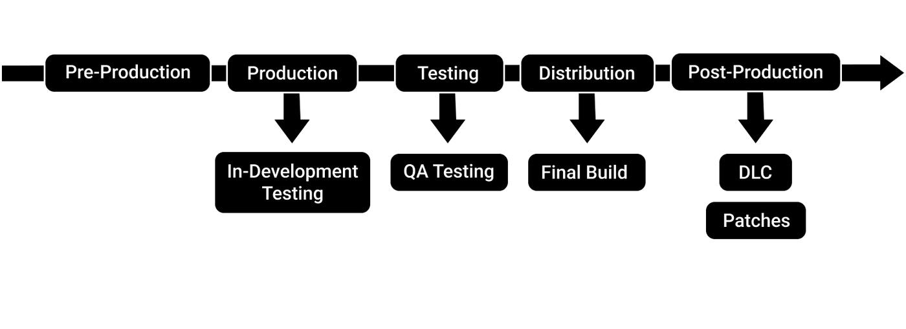
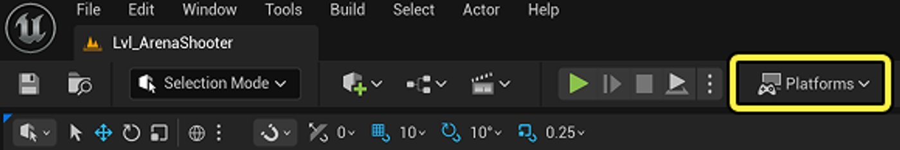
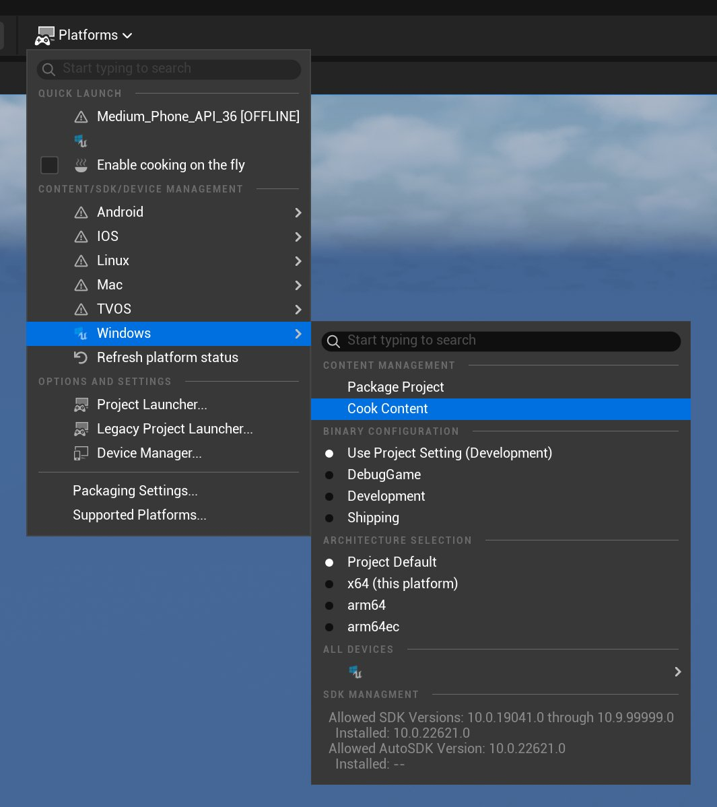
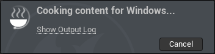
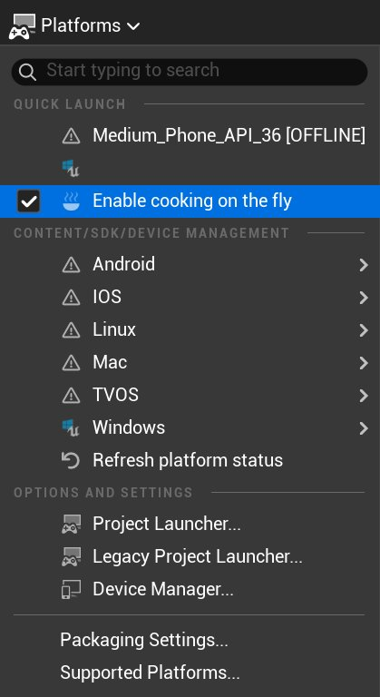

# 打包虚幻引擎项目

> 路径：打包虚幻引擎项目

> 原始页面：https://dev.epicgames.com/documentation/unreal-engine/packaging-your-project

本页面概述了打包关键概念以及有关烘焙和打包的教程。 要跳转至教程，请参阅[内容烘焙教程](index.md#let-s-cook-content)和[项目打包教程](index.md#let-s-package-a-project)。

## 什么是打包？

**打包**是将**虚幻引擎**项目转换为独立可执行文件（`.exe`）或应用程序的过程。

打包过程会将项目内容编译为可在[目标平台](index.md#supported-target-platforms)（如Windows、iOS或主机）上运行的格式。 例如，当你将游戏下载到设备时，所获得的可执行文件和数据文件均经过打包，以确保与操作系统兼容。

打包可在开发流程的多个阶段进行：

- **制作和测试**

  在制作和测试阶段，打包可用于验证项目功能。 例如，在移动平台上进行质量保证（QA）或打包项目测试。
- **发行**

  在发行（也称**发布**）阶段，打包用于准备最终构建以供发布。
- **后期制作**

  在后期制作阶段，打包可用于发行内容更新，例如可下载内容（DLC）和补丁。

> [!TIP]
> **最终构建**是已准备好供用户或玩家使用的项目。

## 支持的目标平台

**目标平台**是指将运行项目的操作系统或主机。 虚幻引擎支持以下目标平台的打包：

- 桌面平台，例如Windows、macOS、Linux。
- 移动平台，例如iOS、iPadOS、tvOS、Android。
- 所有主流主机。
- XR（扩展现实）平台，例如OpenXR、PSVR2、ARKit、ARCore、visionOS。

### 其他软件

开发和打包Windows、macOS平台项目无需额外软件。

开发和打包主机平台项目需要虚幻引擎的源代码构建，无法使用通过Epic Games启动器获取的预编译版本。 源代码构建可从[GitHub](https://www.unrealengine.com/en-US/ue-on-github)下载。

开发和打包部分目标平台（例如Linux、移动平台、XR平台）可能需要额外的软件开发工具包（SDK）和虚幻引擎组件。 如需了解目标平台SDK的详情，请参阅[分享和发布项目](../../index.md)。 如需了解虚幻引擎组件的详情，请参阅[安装虚幻引擎](../../../get-started/install/index.md)。

## 打包的原理是什么？

打包项目是一种[编译操作](index.md#build-operations)。 **编译**、**烘焙**和**暂存**是构成打包流程的编译操作。

- **编译**

  在此阶段，将为目标平台编译项目的代码、插件和二进制文件。 如果项目使用C++，所有代码将被编译为二进制文件。
- **烘焙**

  在此阶段，将项目资产（几何体、材质、纹理、**蓝图**、音频等）保存为可在目标平台运行的格式。 这些资产会被优化以提升加载效率。
- **暂存**

  在此阶段，将编译后的代码和烘焙的内容复制到**暂存目录**。

  > [!TIP]
  > **暂存目录**是打包过程中指定的临时文件夹，位于驱动器上的开发目录之外。
- **打包**

  在此阶段，将编译后的代码和烘焙的内容在暂存目录中捆绑成可发行的文件集。 例如，在Windows上，可发行文件包括安装程序或可执行文件，以及一个包含[Pak](index.md#pak-files-and-pak-file-chunking) （`.pak`）文件的文件夹。
- （可选）**部署**

  项目将被推送到要运行的目标平台。
- （可选）**运行**

  此阶段将在目标平台上从**虚幻编辑器**启动项目。 此操作非常适合在非本地桌面设备上快速迭代和测试。

### 编译操作

虽然每个编译操作都是打包流程的一部分，但它们也可以独立执行。

独立执行时，每个操作在开发的不同阶段都有独特作用。 例如，**烘焙**操作可以优化并保存特定资产，而不是游戏关卡中的所有资产，这使其非常适合发行内容更新（如DLC或补丁）。

各编译操作的适用场景对比如下表所示：

| 编译操作 | 示例用途 |
| --- | --- |
| **编译** | 开发期间编译代码。 |
| **烘焙** | 为QA测试或发行准备项目。为测试或发行准备DLC和补丁。 |
| **暂存** | 为QA测试或发行准备项目。 |
| **打包** | 为QA测试或发行准备项目。 |
| **部署** | 在非本地桌面计算机的平台上（如主机或移动设备）测试项目。 |
| **运行** | 在非本地桌面计算机的平台测试项目。 用户在目标平台运行已发布项目。 |

## 烘焙内容

**烘焙**是一种编译操作，用于准备游戏内容使其可在虚幻编辑器外运行。 它是打包流程的一部分，但也可独立执行。

烘焙是必要操作，原因如下：

- 可确保游戏内容已针对目标平台优化且兼容。
- 是打包最终发行构建前或在移动设备、主机等设备上进行测试前的必要步骤。
- 可将编辑器专用格式转换为运行时就绪格式。

> [!TIP]
> **运行时**指项目在目标平台运行的时间段。

烘焙过程中将执行以下任务：

- 将资产（几何体、材质、纹理、蓝图、音频等）转换为特定平台格式。
- 在可能的情况下对资产进行压缩和优化。
- 排除未使用数据以减少项目的磁盘占用并提升性能。
- 必要时将蓝图编译为原生代码。
- 处理并优化地图与关卡。
- 烘焙的内容将存储在一个或多个[Pak](index.md#pak-files-and-pak-file-chunking) （`.pak`）文件中。

> [!TIP]
> 在烘焙过程中，优化操作会移除项目中游戏关卡或代码未引用的所有内容。 例如，出现在虚幻编辑器**内容浏览器**中但未出现在游戏关卡中的资产将不会进行烘焙。

> [!TIP]
> 当独立烘焙时，文件会被复制到**开发目录**，而非暂存目录。

如需详细了解烘焙过程，请参阅[内容烘焙](../cooking-content/index.md)文档。

### Pak文件和Pak文件分块

**Pak**（`.pak`）文件是虚幻引擎用于存储烘焙内容的归档文件格式。 尽管Pak文件是默认文件类型，但你可在项目的[打包设置（Packaging Settings）](index.md#packaging-settings)中探索其他归档文件类型。

Pak文件可被进一步拆分为更小的Pak文件，称为**文件块**。 使用文件块时，可将项目中的特定资产分配给某个文件块。 此功能在以下情况下非常实用：

- 分离不希望包含在完整打包项目中的DLC内容或补丁。
- 流式安装。 文件块允许自定义优先下载的内容。

> [!TIP]
> **流式安装**是一种允许用户在安装完成前即可与已发布项目交互的方式。 这种方式特别适合主机游戏，能让玩家更快开始游戏。

如需了解Pak文件和Pak文件分块的详情，请参阅[烘焙和分块](../cooking-content-and-creating-chunks/index.md)和[准备资产进行分块](../../patching-content-delivery-and-dlc/general-patching-information/preparing-assets-for-chunking/index.md)。

### 内容烘焙教程

有两种方法可以为项目烘焙内容：

| 烘焙方法 | 说明 |
| --- | --- |
| **按常规烘焙**（默认） | 在为目标平台*打包项目前*，先烘焙项目资产。此流程较慢，建议用于最终构建测试。 |
| **动态烘焙** | 当目标平台请求时，*在运行时*烘焙资产。此过程推荐用于开发期间的快速测试。 |

#### 按常规烘焙

要按常规烘焙内容，请执行以下步骤：

1. 在虚幻编辑器主工具栏中，打开**平台（Platforms）**菜单。

   
2. 从列表中选择目标平台。 此操作仅为所选目标平台烘焙内容。 在**内容管理（Content Management）**下，点击**烘焙内容（Cook Content）**。

   

   点击"烘焙内容（Cook Content）"后，虚幻编辑器右下角会弹出对话框。 这将显示烘焙进度及完成或失败状态。

   烘焙时，对话框将显示**正在为[目标平台]烘焙内容（Cooking content for [target platform]）**。

   

   烘焙完成后，对话框将显示**烘焙完成！（Cooking complete!）**。

   

#### 动态烘焙

要启用动态烘焙，请执行以下步骤：

1. 在虚幻编辑器主工具栏中，打开**平台（Platforms）**菜单。

   
2. 在菜单中，勾选**启用动态烘焙（Enable cooking on the fly）**复选框。

   

启用动态烘焙后，可使用与[按常规烘焙](index.md#cooking-by-the-book-br)相同的步骤执行烘焙。

## 编译配置

要打包项目，必须选择**编译配置**。 编译配置是一种预设，用于确定项目的编译方式以及可用的代码和内容。

每个配置在开发的不同阶段都有其用途，因为它们优先考虑不同因素，包括：

- 性能
- 优化级别
- 项目文件大小
- 调试工具的访问权限

例如，**发布（Shipping）**配置适合发行游戏，可禁止玩家使用破坏游戏的控制台命令。 包含控制台命令在内的**调试**和**开发**配置，适合在开发期间优化和测试游戏。

所有编译配置的对比详见下表：

| 编译配置 | 说明 | 开发阶段 | 示例用途 |
| --- | --- | --- | --- |
| **调试** | 编译引擎和项目源代码。禁用优化。 这导致项目体积更大、运行更慢，但易于调试。包含所有额外信息和调试符号。 | 开发。 此配置不适合发行。 | 引擎和项目调试。调试速度最慢的配置。 |
| **调试游戏** | 编译项目源代码。禁用优化。包含部分额外信息和调试符号。 | 开发。 此配置不适合发行。 | 项目调试性能比"调试"配置更快。不适用于纯蓝图项目。 |
| **开发**（默认） | 启用除最耗时优化外的所有优化。包含最小化调试信息。支持在编辑器中查看对项目做出的代码变更。 | 开发。 此配置不适合发行。 | 开发期测试。性能比"调试"和"调试游戏"更快。 |
| **测试** | 包含调试工具，例如控制台命令、统计数据、性能分析工具。启用所有优化。 | 用于内部测试构建，以避免产生完整调试工具的开销。 | 项目QA测试。性能接近"发布"配置但略低。 |
| **发布** | 禁用预期不用于终端用户的控制台命令、统计数据和性能分析工具。启用所有优化。 | 发行。 此配置不适合开发。 | 用于向用户发布项目。性能最快。 |

如需了解编译配置的详情，请参阅[编译配置参考](../../../get-started/install/downloading-source-code/build-configurations-reference/index.md)。

## 打包设置

编译配置等预设以及用于自定义打包流程的许多其他选项，可在**项目设置（Project Settings）> 打包（Packaging）**中找到。

在虚幻编辑器中，可通过以下两种方式访问该窗口：

- 从编辑器主工具栏点击**平台（Platforms）**菜单。 然后，点击**打包设置（Packaging Settings）**。

  > 图片已省略：虚幻编辑器打包设置
- 从编辑器菜单栏中，点击**编辑（Edit）> 项目设置（Project Settings）**。 **项目设置**窗口将打开。 在左侧导航菜单中，点击**打包（Packaging）**。

  > 图片已省略：项目设置打包

"打包（Packaging）"分段包含但不限于以下选项：

- 自定义编译预设
- 编译配置
- 编译目标
- 调试符号
- 可执行文件
- 本地化
- 压缩
- 烘焙
- 配置文件(`.ini`)
- 着色器
- 归档文件类型（Pak、Chunk、Utoc、Ucas）
- [Zen存储服务器](../../../production-pipeline/zen-storage-server/index.md)
- 影片（如Gameplay前播放的预渲染影片）

如需了解打包选项的详细说明，请参阅[项目](../../../understanding-the-basics/project-settings/project-section-of-the-unreal-engine-project-settings/index.md)的"打包"小节。

## 项目打包教程

在本教程中，你将学习如何使用**打包**编译操作和**开发**编译配置为Windows平台打包项目。

通过完成以下任务，你可以将在前几节学到的理论知识付诸实践：

1. [设置游戏的默认地图](index.md#setting-a-game-default-map)
2. [设置编译配置](index.md#setting-a-build-configuration)
3. [创建打包项目](index.md#creating-a-packaged-project)
4. [运行、测试和退出可执行文件](index.md#running-and-exiting-your-executable)

教程结束时，你将获得一个可以运行、测试和退出的游戏可执行文件。 此工作流程模拟了在制作过程中对虚幻引擎游戏进行测试的实际场景。

要完成本教程，你需要：

- 一台运行Windows系统的计算机
- 虚幻引擎
- 使用**竞技场射击游戏（Arena Shooter）**变体中**第一人称（First Person）**模板的虚幻引擎项目。

> [!NOTE]
> 在本教程中，游戏可执行文件将使用与项目相同的名称。 本教程以名称"MyProject"为例。
>
> > 图片已省略：虚幻项目浏览器

### 开始之前

在虚幻编辑器中打开你的项目。

### 设置游戏的默认地图

**游戏默认地图**是打包项目启动时加载的地图。 每个项目在打包前必须设置游戏默认地图，否则运行时项目将无内容可加载。

如果未设置游戏默认地图，项目启动时将显示黑屏。 例外情况是，使用项目模板时会自动设置游戏默认地图。

你可以按照以下步骤更改地图：

1. 从编辑器菜单栏中，点击**编辑（Edit）> 项目设置（Project Settings）**。

   > 图片已省略：虚幻编辑器项目设置
2. 在**项目设置（Project Settings）**窗口中，在左侧导航菜单的**项目（Project）**标题下，点击**地图和模式（Maps & Modes）**。

   > 图片已省略：项目设置地图和模式
3. 展开**默认地图（Default Maps）**标题，并点击**游戏默认地图（Game Default Map）**下拉菜单。 搜索并选择`Lvl_ArenaShooter`。

> [!TIP]
> 你也可以在**内容浏览器**中选择地图来对地图进行设置，然后在项目设置（Project Settings）窗口中点击**使用内容浏览器中的所选资产**图标。

### 设置编译配置

**编译配置**决定项目的编译方式。 每个项目在打包前必须设置编译配置。 除非你进行了更改，否则虚幻引擎将默认使用**开发（Development）**配置。

1. 仍在**项目设置（Project Settings）**窗口中，在左侧导航菜单中点击**打包（Packaging）**。

   > 图片已省略：项目设置打包
2. 展开**项目（Project）**标题。 确认**编译配置（Build Configuration）**设置为**开发（Development）**。 如果不是，点击下拉菜单选择并将设置为开发（Development）。

   > 图片已省略：项目设置编译配置

通过使用"开发"配置，你可以在运行时访问游戏内控制台。 在本教程的后续部分中，你将使用游戏内控制台执行控制台命令。

> [!TIP]
> **游戏内控制台**是一种命令行界面，允许在运行时与引擎交互。

### 创建打包项目

打包操作会利用虚幻引擎项目创建独立可执行文件或应用程序。 在这种情况下，你将为目标平台Windows进行打包，并创建一个可执行文件，你将在本教程的后续部分启动该可执行文件。

要打包项目，请执行以下步骤：

1. 在编辑器主工具栏中，点击**平台（Platforms）**菜单。 在**内容/SDK/设备管理（Content/SDK/Device Management）**下，查看平台列表。 本教程选择**Windows**。

   > 图片已省略：虚幻编辑器平台Windows

   > [!NOTE]
   > 根据所开发的平台和已安装的SDK不同，**内容/SDK/设备管理（Content/SDK/Device Management）**下列出的平台可能有所不同。
2. 在新弹出的上下文菜单中，在**二进制文件配置（Binary Configuration）**下确认已选择**使用项目设置（开发）（Use Project Setting (Development)）**。 括号内显示打包设置中当前选中的编译配置。

   > 图片已省略：平台二进制文件配置

   > [!TIP]
   > 你可以从**平台（Platforms）**菜单快速更改编译配置，而无需返回**项目设置（Project Settings）**。
3. 在**内容管理（Content Management）**下，选择**打包项目（Package Project）**。

   > 图片已省略：平台打包项目
4. 在**打包项目（Package project）**对话框中，选择或创建一个文件夹作为驱动器上的**暂存目录**，项目打包文件将保存在此处。 点击**选择文件夹**确认暂存目录并启动打包流程。

流程启动后，虚幻编辑器右下角会弹出名为**为[所选目标平台]打包项目（Packaging project for [selected target platform]）**的对话框。

> 动图已省略：打包GIF

打包期间，可随时点击弹出对话框中的**显示输出日志（Show Output Log）**链接打开**输出日志**。 日志窗口将显示引擎在打包过程中执行的任务，包括错误记录。

> 动图已省略：e4ab7bdf5c04798a755fb3cf2f6765e67b4915a2461d24385231cc2819341dbe

流程完成后，你将看到表示打包成功或失败的提示消息。

|  |  |
| --- | --- |
| [打包完成](https://dev.epicgames.com/community/api/documentation/image/f26a6e6d-8c05-420d-8c85-db7519b8962c?resizing_type=fit) | [打包失败](https://dev.epicgames.com/community/api/documentation/image/a90b48bd-2339-4c80-af27-92df321d4cc9?resizing_type=fit) |

#### （可选）取消打包流程

点击弹出对话框中的**取消（Cancel）**按钮可随时停止打包。

> 图片已省略：打包取消

取消成功后，虚幻编辑器右下角将显示以下消息。

> 图片已省略：打包已取消

#### （可选）调试打包错误

[输出日志](index.md#the-output-log)和[消息日志](index.md#the-message-log)会显示打包错误。 在打包过程中，你可以点击弹出对话框上的**显示输出日志（Show Output Log）**链接来打开**输出日志（Output Log）**。

> 图片已省略：打包显示输出日志

你也可以随时通过以下方式访问这些日志：从编辑器菜单栏中点击**窗口（Window）> 消息日志（Message Log）**或**窗口（Window）> 输出日志（Output Log）**。

> 图片已省略：Windows消息日志

##### 输出日志

**输出日志**记录了引擎的实时消息，其中将显示调试信息、编译器消息、警告、错误消息、事件及资产加载详情。

由于输出日志是实时日志，所以可以为打包前、打包中、打包后发生的操作提供额外的背景线索。

##### 消息日志

**消息日志**可存储错误和警告等重要消息。 它可以帮助你识别调试调查的起点。 你可以在左侧导航菜单的**打包结果（Packaging Results）**标题下查看所有需要处理的错误或警告。

> 图片已省略：消息日志

### 运行并退出可执行文件

完成项目打包后，按以下步骤运行、测试和退出：

1. 找到指定作为暂存目录的文件夹，即打包项目文件的保存位置。

   > 图片已省略：打包的可执行文件

   > [!TIP]
   > 本指南前文提到的Pak文件可以在**[项目名称]（[Project Name]）> 内容（Content）> Pak（Paks）**下的暂存目录中找到。
2. 双击可执行文件（`.exe`）运行项目。 可执行文件与虚幻引擎项目同名。
3. 项目加载后，将显示游戏默认地图（Game Default Map）的窗口化版本。 现在，你可以通过在关卡中移动并与拾取物交互来测试可执行文件。
4. 要退出可执行文件，按下**反引号(`)（Backtick (`)）**键，打开游戏内控制台命令行。 在命令行中，键入以下任意一个控制台命令并按**Enter**键：

   - `quit`
   - `exit`

   > 图片已省略：命令行

> [!NOTE]
> 退出正在运行的可执行文件的方式因你使用的编译配置类型而有所不同。 例如，使用**发布（Shipping）**配置时（无法访问游戏内控制台），项目必须包含用户界面选项（如按钮），才能从应用程序内部退出。

如需了解虚幻引擎中的控制台命令的详情，请参阅[控制台命令参考](../../../cpp-programming/programming-in-the-unreal-engine-architecture/console-variables-cplusplus/unreal-engine-console-commands-reference/index.md)。

## 使用虚幻自动化工具

**虚幻自动化工具（UAT）**是一个主机程序及一组实用脚本库，可用于操作虚幻引擎项目。

例如，当你打包项目时，自动化工具将执行命令`BuildCookRun`，这是所有编译操作的基础脚本。 通过完成[打包项目](index.md#let-s-package-a-project) 教程，你已经使用了自动化工具。

虚幻自动化工具适用于为C#无人值守流程编写脚本，例如为持续集成（CI）管线执行烘焙和自动化测试。

如需了解UAT的详情，请参阅[自动化工具](../../../production-pipeline/using-the-unreal-engine-build-pipeline/unreal-automation-tool/unreal-automation-tool-overview/index.md)。

## 使用项目启动程序

**项目启动程序**是用于创建自定义**启动配置文件**的工具。 自定义启动配置文件支持在单一位置对多平台的编译、烘焙、打包和部署操作进行自动化控制。 这可以提升开发和测试阶段的效率和迭代能力。

在虚幻引擎中，要访问项目启动程序，点击编辑器主工具栏中的**平台（Platforms）**按钮。 在**选项和设置（Options and Settings）**下，点击**项目启动程序（Project Launcher）**。

> 图片已省略：平台项目启动程序

如需了解使用项目启动程序的详情，请参阅[项目启动程序](../using-the-project-launcher/index.md)。

## 项目发行

发行（或发布）是指在数字发行平台向用户发布项目，通常发生在开发流程的收尾阶段。

根据你所开发的目标平台，有许多数字发行平台可供选择。 例如，桌面平台项目可在**Epic游戏商城**或Steam发行。 iOS和Android项目可在App Store或Google Play商店发行。

每个数字发行平台对项目发布有独特的工作流程、要求和法律协议。 将虚幻引擎项目发布到Epic游戏商城可享受特定优势。 如需了解发布到Epic Games商城的更多信息，请参阅[在Epic游戏商城发行游戏](https://store.epicgames.com/en-US/distribution)。

如需了解目标平台及关联数字发行平台的详情，请参阅[分享和发布项目](../../index.md)。

## 其他信息

- [分享和发布项目](../../index.md)
- [移动端优化指南](../../../mobile-development/debugging-and-optimization-for-mobile/index.md)
- [项目启动程序](../using-the-project-launcher/index.md)
- [内容烘焙](../cooking-content/index.md)
- [准备资产进行分块](../../patching-content-delivery-and-dlc/general-patching-information/preparing-assets-for-chunking/index.md)
- [烘焙和分块](../cooking-content-and-creating-chunks/index.md)
- [编译配置参考](../../../get-started/install/downloading-source-code/build-configurations-reference/index.md)
- [控制台变量参考](../../../cpp-programming/programming-in-the-unreal-engine-architecture/console-variables-cplusplus/unreal-engine-console-commands-reference/index.md)
- [Zen存储服务器](../../../production-pipeline/zen-storage-server/index.md)
- [在Epic游戏商城发行游戏](https://store.epicgames.com/en-US/distribution)
- [访问Github上的虚幻引擎源代码](https://www.unrealengine.com/en-US/ue-on-github)
