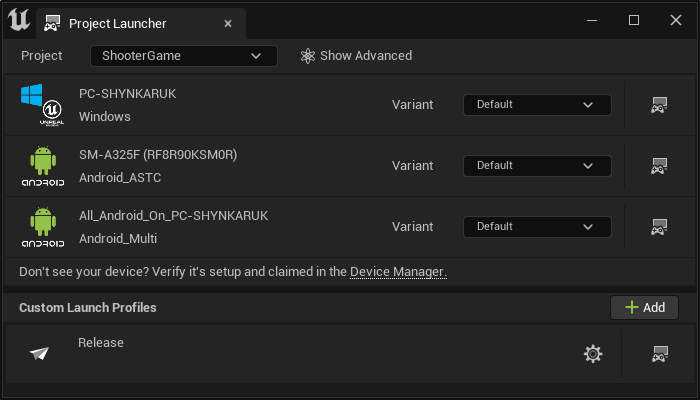
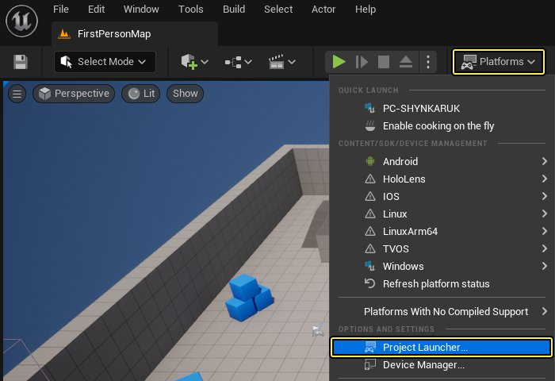
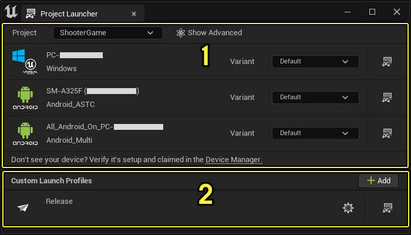
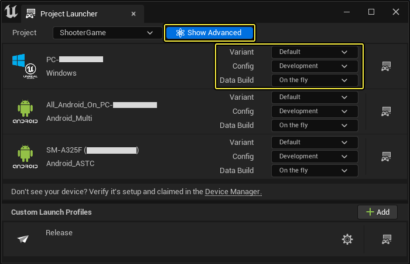
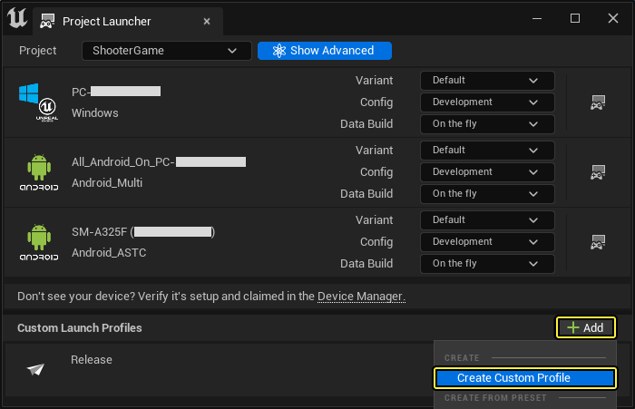
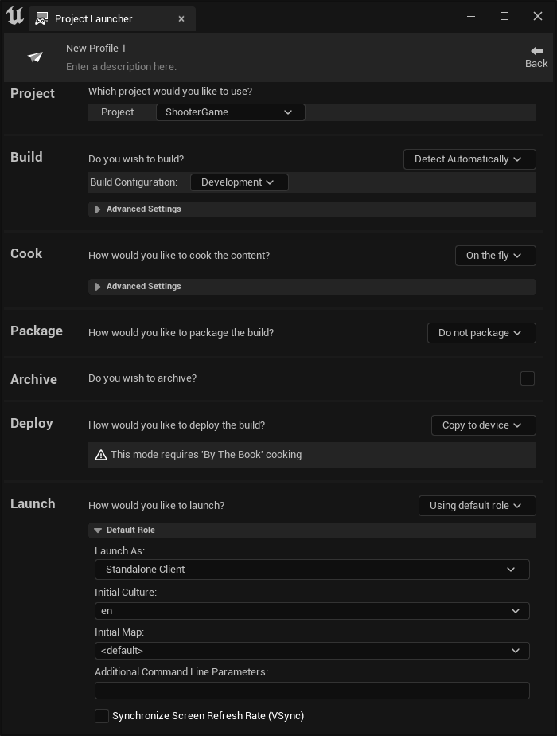
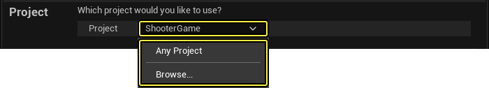

# 项目启动程序

> 路径：虚幻引擎5.7文档 / 分享和发布项目 / 游戏的打包（Packaging）和烘焙（Cooking） / 项目启动程序

> 原始页面：https://dev.epicgames.com/documentation/unreal-engine/using-the-project-launcher-in-unreal-engine

项目启动程序用于转化项目的构建版并将其部署到指定的平台，以便测试、调试和发布项目。以下参考页面详细介绍了构成项目启动程序的元素，以及在创建自定义启动配置文件以将内容部署到不同平台时可以使用的设置。

## 项目启动程序界面

要打开项目启动程序，请点击 **平台（Platform）** 并选择 **项目启动程序（Project Launcher）**。

项目启动程序界面可以分为两个主要区域：

1. 默认启动配置文件
2. 自定义启动配置文件

在 **默认启动配置文件（Default Launch Profiles）** 窗口中，可以查看可用的平台，并选择构建要部署到的设备。在此窗口的顶部，可以指定 **项目（Project）** （如果不是已打开的当前项目）以及切换这些默认启动配置文件的 **高级（Advanced）** 设置。

单击 **高级（Advanced）** 切换按钮时，在默认启动配置文件旁边将显示更多选项，你可以从中选择 **构建配置（Build Configuration）** 和 **转化（Cook）** 方法。

在 **自定义启动配置文件（Custom Launch Profiles）** 窗口中，可以创建自己的配置文件，为内容的构建和部署指定更多选项，请参阅 [自定义启动配置文件](#%E8%87%AA%E5%AE%9A%E4%B9%89%E5%90%AF%E5%8A%A8%E9%85%8D%E7%BD%AE%E6%96%87%E4%BB%B6) 部分了解详细信息。

## 自定义启动配置文件

在项目启动程序中，可以创建 **自定义启动配置文件（Custom Launch Profile）**，以便与所有平台甚至特定的平台（如Nintendo Switch）配合使用。借助这些配置文件，可以使用可用的构建操作设置内容的转化、打包甚至部署方式，从而以特定方式构建内容。

要添加自己的自定义启动配置文件，请点击 **自定义启动配置文件（Custom Launch Profiles）** 分段中的 **+添加**（+Add）按钮。

完成后，你的自定义启动程序配置文件将立即打开。请确保为它命名，方便以后查找。

### 名称和说明

在标头栏中显示可应用于此自定义配置文件的 **名称（Name）** 和 **说明（Description）**。要对其进行编辑，双击任一部分的文本即可开始编辑。

### 项目

在 **项目（Project）** 部分，可以指定要与此配置文件关联的项目，或者是否可以将其用于任何项目。默认情况下，设置为 **任何项目（Any Project）**，但也可以将其设置为特定项目。在为多个平台开发项目，并且这些平台需要特定的方式来部署、测试、调试甚至发布项目时，该功能非常有用。

### 构建

在 **构建（Build）** 部分，可以根据项目的开发进度以及测试、调试或发布项目的方式来指定要构建和部署的配置类型。

> 图片已省略：Build section

| 设置 | 说明 |
| --- | --- |
| **构建配置（Build Configuration）** | 从要构建的可用配置中进行选择，并使用项目进行测试。 Settings of the Build Configuration **调试游戏（DebugGame）**：此配置按最优方式编译引擎，但游戏代码为可调试状态。它仅适用于调试各种游戏模块。 **开发（Development）**：此配置等同于发布构建版。虚幻编辑器默认采用开发配置。如采用此配置编译项目，可在编辑器中看到项目代码的变化情况。 **交付（Shipping）**：这是最佳性能配置，用于交付游戏。此配置剥离了控制台命令、统计数据和性能分析工具。此配置应在准备好发布游戏时使用。 |
| **构建UAT（Build UAT）** | 启用后，[虚幻自动化工具（Unreal Automation Tool）](../../../testing-and-optimizing-content/automation-test-framework/index.md)将创建为构建版的组成部分。 |
| **其他命令行参数（Additional Command Line Parameters）** | 此处的参数将在启动时被传递到应用程序。 |

### 转化

在 **转化（Cook）** 部分，可通过两种方式转化项目内容：**按常规（By the Book）** 和 **动态（On the fly）**。

#### 按常规

**按常规（By the Book）** 转化选项可指定应转化的内容，并在启动游戏之前转化所有内容。

> 图片已省略：Cook By the Book option

| 设置 | 说明 |
| --- | --- |
| **转化平台（Cooked Platform）** | 从列出的可用目标平台中选择希望此自定义启动配置文件针对哪个平台转化内容。 |
| **转化文化（Cooked Cultures）** | 从可用的本地化文化中选择希望此内容针对哪种文化进行转化。 |
| **转化贴图（Cooked Maps）** | 从作品的可用贴图中选择要转化的贴图。 |
| 发布/DLC/补丁设置 |  |
| **创建游戏的发行版以用于分发（Create a release version of the game for distribution）** | 你可以创建作品的发行版，以用于分发。 |
| **要创建的新发行版的名称（Name of the new release to create）** | 为发行版指定新的名称，以在转化期间使用。 |
| **作为基础的发行版（Release version this is based on）** | 这是作为下一版本/DLC/补丁基础的发行版。 |
| **生成补丁（Generate Patch）** | 如果启用，会将内容与原内容对比，只有更改的文件将包含在新的pak文件中。 |
| **构建DLC（Build DLC）** | 如果启用，构建的DLC将不包含原始游戏发布的内容。 |
| **要构建的DLC的名称（Name of the DLC to build）** | 为将要构建的DLC命名。 |
| **包含引擎内容（Include Engine Content）** | 如果启用，DLC将包含原始版本中未包含的引擎内容。如果未选中，从 **引擎（Engine）** 目录访问内容时将发生错误。 |
| 高级设置 |  |
| **迭代转化：仅转化根据上次转化更改的内容（Iterative Cooking: Only cook content modified from previous cook）** | 如果启用，则仅会转化更改的内容，从而缩短转化时间。建议尽可能启用此选项。 |
| **暂存基本发行版pak文件（Stage base release pak files）** | 如果启用，将暂存基本发行版中未更改的pak文件。 |
| **压缩内容（Compress Content）** | 如果启用，将压缩生成的内容。这些内容会变得更小，但在解压缩时可能需要较长时间才能加载。 |
| **添加新的补丁层（Add a new patch tier）** | 如果启用，将使用补丁内容生成新编号的pak文件。 |
| **保存软件包但没有版本号（Save Packages Without Versions）** | 如果启用，则在加载时假定版本为当前版本。这存在潜在危险，但会减小补丁大小。 |
| **将所有内容存储到单个文件（UnrealPak）（Store all content in a single file (UnrealPak)）** | 如果启用，内容将部署为单个UnrealPak文件，而不是许多单独的文件。 |
| **加密INI文件（仅在启用了"使用Pak文件"时）（Encrypt INI files (only with Use Pak File enabled)）** | 如果启用，存储在UnrealPak文件中的ini文件将被加密。 |
| **生成文件块（Generate Chunks）** | 如果启用，内容将部署为多个UnrealPak文件，而不是许多单独的文件。 |
| **不要在构建版中包含编辑器内容（Don't include Editor content in the build）** | 如果启用，转化程序将跳过编辑器内容，不将其包含在构建中。 |
| **HTTP文件块安装数据路径（HTTP Chunk Install Data Path）** | **创建HTTP文件块安装数据（Create HTTP Chunk Install Data）**：如果启用，内容将拆分成多个Pak文件并存储为可下载的数据。 **创建HTTP文件块安装数据路径（HTTP Chunk Install Data Path）**：指定文件块安装数据的文件路径。 **HTTP文件块安装发行版名称（HTTP Chunk Install Release Name）**：此版本HTTP文件块安装数据的名称。 |
| **转化程序构建配置（Cooker Build Configuration）** | 设置用于转化程序命令行开关的构建配置。 |
| **更多转化程序选项（Additional Cooker Options）** | 可在此处指定更多转化程序命令行参数。 |

#### 动态

**动态（on the fly）** 转化选项允许在将内容发送到设备之前根据需要在运行时进行转化。

> 图片已省略：Cook On the Fly option

| 设置 | 说明 |
| --- | --- |
| **仅转化更改的内容（Only Cook Modified Content）** | 如果启用，则仅会转化更改的内容，从而缩短转化时间。建议尽可能使用此选项。 |
| **更多转化程序选项（Additional Cooker Options）** | 可在此处指定更多转化程序命令行参数。 |

### 打包

在 **打包（Package）** 部分，可选择构建版的打包方式以及将其存储在本地还是存储在可访问的共享元库中。

> 图片已省略：Package section

#### 打包方式

| 设置 | 说明 |
| --- | --- |
| 打包并本地存储 |  |
| **本地目录路径（Local Directory Path）** |  |
| **此构建是否用于公开发布（Is this build for distribution to the public）** | 如勾选此项，构建将被标记为公开发布（分发）。 |
| **包含打包游戏依赖项的安装程序（Include an installer for prerequisitea of packaged games）** | 如勾选此项，构建将在支持的平台上包含依赖项的安装程序。 |
| **使用容器文件优化加载（I/O存储）（Use container files for optimized loading (I/O Store)）** | 如勾选此项，构建将使用容器文件优化加载（I/O存储）。 |
| **制作二进制配置文件以缩短运行时启动时间（Make a binary config file for faster runtime startup times）** | 将配置（带插件的.ini）数据和可选的自定义数据烘焙到二进制文件中。 |
| **Optional I/O Store Reference Block Database:** | 之前发布的I/O存储容器的目录中全局UTOC的路径。 用于解码引用块容器（如需要）的加密JSON文件的路径。 |
| 打包并存储在元库中 |  |
| **元库路径（Repository Path）** |  |

### 归档

在 **归档（Archive）** 部分，可指定是否归档构建版和目录路径（如果要将其归档以供以后参考）。

> 图片已省略：Archive section

### 部署

在 **部署（Deploy）** 部分，需要决定将当前版本部署到设备的方式，是使用 **文件服务器**、**复制到设备**，还是 **复制元库**。

请使用以下选项确定要使用的部署方式：

> 图片已省略：Deploy method selection

- 文件服务器（File Server）

  将在运行时根据设备需要烘焙和部署内容。
- 复制到设备（Copy to Device）

  会将整个已烘焙构建复制到设备。
- 不部署（Do Not Deploy）

  在烘焙和打包完成后不会将此版本部署到设备。
- 复制仓库（Copy Repository）

  将从指定的文件位置复制构建以部署到设备。

#### 文件服务器

选择文件服务器时可用的设置。

> 图片已省略：File server deploy method

| 设置 | 说明 |
| --- | --- |
| **默认部署平台（Default Deploy Platform）** | 设置要对其部署内容的默认目标平台。 |
| 高级设置 |  |
| **隐藏文件服务器的控制台窗口（Hide the file server's console window）** | 如果启用，文件服务器的控制台窗口将在桌面上隐藏。 |
| **流送服务器（Streaming Server）（实验性功能）** | 如果启用，文件服务器将使用可同时提供多个文件的实验性实现方案。 |

#### 复制到设备

选择"复制到设备"时可用的设置。

> 图片已省略：Copy to device deploy method

| 设置 | 说明 |
| --- | --- |
| **默认部署平台（Default Deploy Platform）** | 设置要对其部署内容的默认目标平台。 |
| 高级设置 |  |
| **仅部署更改内容（Only Deploy Modified Content）** | 如果启用，则仅会部署更改的内容，从而缩短部署时间。建议尽可能使用此选项。 |

#### 复制元库

选择"复制元库"时可用的设置。

> 图片已省略：Copy repository deploy method

| 设置 | 说明 |
| --- | --- |
| **元库路径（Repository Path）** | 将文件路径设置到要复制到设备的元库。 |
| **默认部署平台（Default Deploy Platform）** | 设置要对其部署内容的默认目标平台。 |

### 启动

> 图片已省略：Launch section

| 设置 | 说明 |
| --- | --- |
| **启动为（Launch As）** | 选择如何启动此构建实例。 Launch As options **独立客户端（Standalone Client）**：将此实例作为独立游戏客户端启动。 **侦听服务器（Listen Server）**：将此实例作为可接受来自其他客户端连接的游戏客户端启动。 **专用服务器（Dedicated Server）**：将此实例作为专用游戏服务器启动。 **虚幻编辑器（Unreal Editor）**：将此实例作为虚幻编辑器启动。 |
| **初始文化（Initial Culture）** | 选择启动构建时最初要使用的目标文化。 |
| **初始贴图（Initial Map）** | 选择在启动构建时希望项目使用的初始贴图。 |
| **附加命令行参数（Additional Command Line Parameters）** | 输入启动构建版时要用的所有必需的命令行参数。 |
| **同步屏幕刷新率（VSync）（Synchronize Screen Refresh Rate (VSync)）** | 为构建版启用此设置，尝试以与正在运行项目的监视器相同的刷新率运行项目。 |
