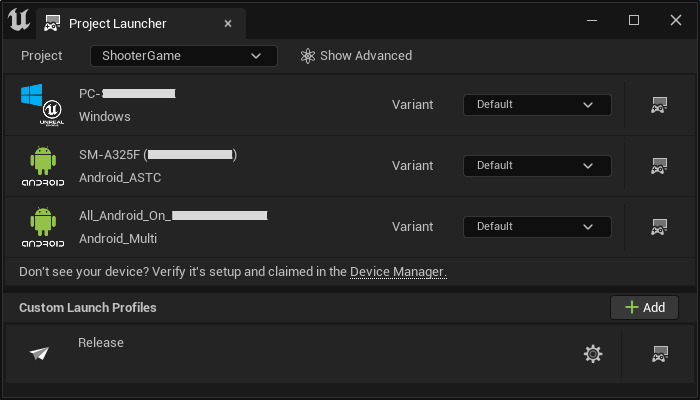
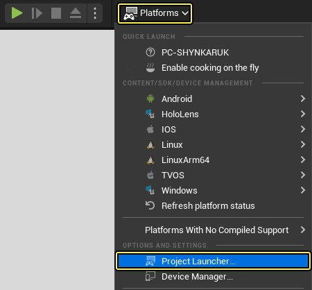
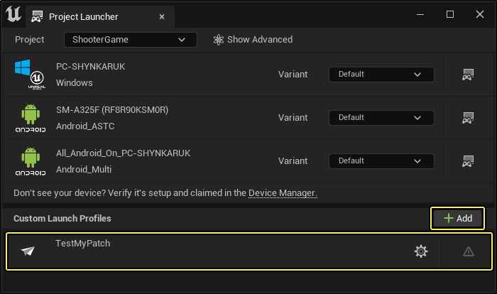
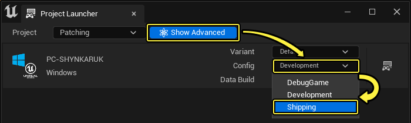
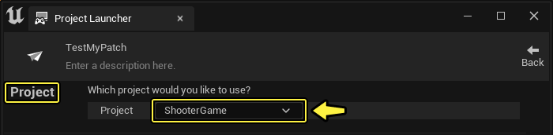
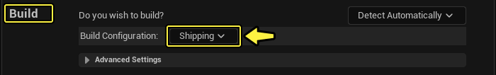
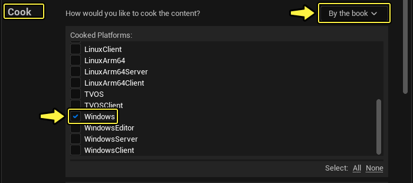
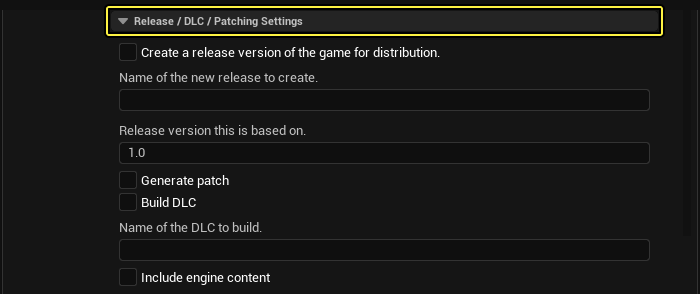

# 如何创建补丁（与平台无关）

> 路径：虚幻引擎5.7文档 / 分享和发布项目 / 补丁和DLC / 常用补丁信息 / 如何创建补丁（与平台无关）

> 原始页面：https://dev.epicgames.com/documentation/unreal-engine/how-to-create-a-patch-in-unreal-engine



在打补丁的过程中， **虚幻引擎** 会将所有后期烘焙内容与最初发布的已烘培内容进行比较，并据此确定补丁中包含的内容。最小的内容块是单个包（如 `.ulevel` 或 `.uasset` ），因此如果包中有任何更改，那么整个包都将被包含在补丁中。获取用户补丁包的 **PAK** ( `.pak` ) 文件的方法将取决于您的发布平台，但是这个过程允许您创建一个较小的PAK文件，其中只包含更新的内容。

您可以使用版本化的发布内容来修补先前发布的项目。需要记住以下几点：

- 发布时锁定序列化代码路径。
- 保留已发布的烘焙内容，因为 **UnrealPak** 工具使用它来确定补丁包文件中应该包含哪些内容。
- 运行时，挂载这两个PAK文件，补丁文件具有更高的优先级，因此首先加载其中的任何内容。

有几种方法可以修补在虚幻引擎中创建的项目。这里使用的方法 **与平台无关** ，这意味着它在技术上可以用于任何平台。然而，您只会对两个平台有意使用这种方法，那就是 **Windows** 和 **Xbox** One。其他平台有特定的修补方法。您可以在目标开发平台的相关文档中找到这些平台的修补方法文档。

> [!NOTE]
> 这种方法最终会使用大量的数据存储空间，因为这种方法保存所有旧文件，并且只将游戏指向存在的最新文件。特定于平台的方法使用的空间通常会更少。

## 如何使用项目启动器创建补丁

此例演示如何为UE项目创建补丁。

### 创建启动配置文件以测试补丁

如果你的项目有基础版本，可在 **项目启动程序（Project Launcher）** 中为补丁创建 **启动配置文件（Launch Profile）** 。你可能想要创建一个启动配置文件用于创建测试版补丁，并为实际的补丁版本创建另一个启动配置文件。

1. 点击 **平台（Platforms）> 项目启动程序（Project Launcher）** ，打开 **项目启动程序（Project Launcher）** 。

   
2. 使用 **+添加（+Add）** 按钮创建新的 **自定义启动配置文件（Custom Launch Profile）** 。这第一个启动配置文件专用于你的测试版补丁。键入 **名称（Name）** 和 **说明（Description）** ，提供清晰的描述。

   
3. 项目启动程序中有很多设置，你可以为启动配置文件自定义这些设置。要进一步自定义各个设置，点击 **显示高级（Show Advanced）** 并使用下拉菜单设置 **高级设置（Advance Settings）** 。也可点击 **烘焙（Cook）** 、 **打包（Package）** 或 **部署（Deploy）** 分段中的顶部下拉菜单，具体可选选项会随你的选择而异。

   

   | 启动配置文件部分名称 | 高级设置的说明 |
   | --- | --- |
   | **项目（Project）** | 您可以浏览到要使用的特定项目，或者使用 **任何项目（Any Project）** 来修补当前项目。 |
   | **构建（Build）** | 选项为 **调试游戏（DebugGame）** 、 **开发（Development）** 和 **发布（Shipping）** 。单击 **高级设置（Advanced Settings）** 下拉菜单以构建虚幻自动工具(UAT)，作为补丁流程的一部分。 |
   | **烘焙（Cook）** | 单击下拉菜单选择 **常规烘焙（Cook by the Book）** 或 **动态烘焙（Cook on the Fly）** 。也可选择 **不烘焙（Do Not Cook）** 。可以单击 **高级设置（Advanced Settings）** 下拉菜单来选择 **仅烘焙修改后内容（Only Cook Modified Content）** 。当您选择 **常规烘焙（Cook by the Book）** 时，显示 **高级设置（Advanced Settings）** 和 **版本（Release）/DLC/补丁（Patching）** 的其他选项。 |
   | **打包（Package）** | 选项为 **打包并存储于本地（Package and Store Locally）** 、 **打包并存储于元库中（Package and Store in Repository）** ，或 **不打包（Do Not Package）** 。 |
   | **存档（Archive）** | 如果要存档构建，请选中本节中的方框。 |
   | **部署（Deploy）** | 选项包括 **复制到设备（Copy to Device）** 、 **复制元库（Copy Repository）** 、 **文件服务器（File Server）** 或 **不部署（Do Not Deploy）** 。 |
   | **启动（Launch）** | 选项为 **使用默认角色（Using Default Role）** 、 **使用自定义角色（Using Custom Roles）** 和 **不启动（Do Not Launch）** 。 |

### 定制启动配置文件

按照以下步骤定制新的启动配置文件。

1. 在 **项目（Project）** 部分中，单击下拉菜单浏览到您的项目。

   
2. 在 **构建（Build）** 部分中，单击下拉菜单并选择 **发布（Shipping）** 。如果您需要构建虚幻自动工具(UAT)作为补丁流程的一部分，因为您在构建机器上创建补丁，那么可以选择展开 **高级设置（Advanced Settings）** 。

   
3. 在 **烘焙（Cook）** 部分中，单击下拉菜单并选择 **常规（By the Book）** 。这为您提供了 **已烘焙的平台（Cooked Platforms）** 、 **已烘焙的文化（Cooked Cultures）** 和 **已烘焙的贴图（Cooked Maps）** 的选项。为您的项目选中烘焙（Cook）设置。

   

   > [!TIP]
   > 烘焙（Cook）设置确定您的项目中哪些内容是为该补丁烘焙的，然后将这些内容与原始包文件进行比较。
4. 单击箭头展开 **版本/DLC/补丁设置（Release/DLC/Patching Settings）** 。

   
5. 在 **基于此版本发行（Release version this is based on）** ，键入发布版本。然后选中 **生成补丁（Generate Patch）** 的方框。

   > 图片已省略：设置版本/DLC/补丁设置
6. 单击箭头展开 **高级设置（Advanced Settings）** 。请确保选中以下框，以及特定项目的分发方法所需的任何其他方框。

   - **压缩内容（Compress Content）**
   - **保存没有版本的程序包（Save Packages Without Versions）**
   - **将所有内容保存在单个文件（UnrealPak）中（Store all content in a single file (UnrealPak)）**

   > 图片已省略：在烘焙分段中设置高级设置
7. 同样在 **高级设置（Advanced Settings）** 中，单击 **烘焙器构建配置（Cooker Build Configuration）** ，并选择 **发布（Shipping）** 。

   > 图片已省略：设置构建配置
8. 在 **打包（Package）** 部分中，单击下拉菜单并选择 **打包并存储于本地（Package and Store Locally）** 。默认输入本地目录；如果您想要更改它，请单击 **浏览（Browse）** 并选择要存储包的目录。

   > 图片已省略：设置打包分段
9. 在 **部署（Deploy）** 部分中，单击下拉菜单并选择 **不部署（Do Not Deploy）** 。

   > 图片已省略：设置部署分段

   > [!NOTE]
   > 选择 **不部署（Do Not Deploy）** 以测试补丁。当您测试了补丁并准备构建一个发布版本时，请遵循本节中的步骤并选择一个不同的部署方法。

### 启动补丁的测试版本

1. 使用右上角的 **返回（Back）** 按钮导航回主配置文件窗口。

   > 图片已省略：找到主项目启动程序窗口
2. 单击 **补丁（Patching）** 配置文件旁的启动图标。

   > 图片已省略：启动补丁过程
3. 项目启动程序将经历构建、烘焙和打包过程。这可能需要一些时间，具体取决于项目的复杂性。

   > 图片已省略：正在进行打包过程
4. 一旦操作完成，关闭窗口或单击 **完成（Done）** 。

   > 图片已省略：打包过程完成

### 创建并定制用于发布补丁的启动配置文件

1. 使用 **加号** ( **+** )按钮创建新的自定义启动配置文件（Custom Launch Profile）。该配置文件是为您的补丁发布的，因此键入 **名称（Name）** 和 **说明（Description）** 以清晰传达。
2. 遵循[定制启动配置文件](#%E5%AE%9A%E5%88%B6%E5%90%AF%E5%8A%A8%E9%85%8D%E7%BD%AE%E6%96%87%E4%BB%B6)部分中的步骤1-11。必要时，如果您的测试版本与您想要发布的版本有显著不同，请更改自定义设置。
3. 在 **部署（Deploy）** 部分中，单击下拉菜单并选择要使用的部署选项。
4. 完成了发布启动配置文件的制作后，遵循[启动补丁的测试版本](#%E5%90%AF%E5%8A%A8%E8%A1%A5%E4%B8%81%E7%9A%84%E6%B5%8B%E8%AF%95%E7%89%88%E6%9C%AC)部分中的步骤。

## 如何使用命令行创建补丁

若要为项目创建与平台无关的补丁，项目启动器不是唯一的选项。您还可以使用UAT命令行指令创建补丁。

首先，您需要创建一个基础构建。这可能是您的发布构建。创建此构建时，您需要使用命令行参数`-Createreleaseversion=<releasenumber>` 。这将创建您项目的1.0版本。

示例：

```
	BuildCookRun <normalbuildcookrunarguments> -build -cook -stage -pak -createreleaseversion=1.0 
```

> [!NOTE]
> 这将在`<ProjectPath>\Releases\1.0\`目录中保存一个构建，生成补丁时需要这个目录。

一旦有了已编号的基础构建，就可以创建基于之前构建的补丁。创建此补丁时，您需要使用命令行参数`-basedonreleaseversion=<releasenumber>` 。

示例：

```
	BuildCookRun <normalbuildcookrunarguments> -build -cook -stage -pak -generatepatch -basedonreleaseversion=1.0 
```

## 安装补丁

与平台无关的修补流程在以下目录中创建一个PAK文件： `[ProjectName]\Saved\StagedBuilds[PlatformName][ProjectName]\Content\Paks` 。根据创建项目的平台，PAK文件包含应该分发给用户的新内容或更改内容。例如，在Windows上，您可以创建一个安装程序以将该PAK文件复制到该用户的'[项目名称]\Releases[版本号][平台名称]'文件夹中，位于原始内容PAK文件旁。

当补丁PAK文件位于 `FPakPlatformFile::GetPakFolders` 中设置的设备上的任何PAK搜索目录中时，将自动挂载该文件。要对补丁进行优先级排序，挂载系统使用文件名末尾的 `_p` 来确定它的优先级高于其他PAK文件。它可以重命名，但您需要在文件名末尾包含`_p.pak` 。

如果您从同一个发布版本构建两个补丁，那么它们都是完整的补丁，因此您应该在安装第二个补丁时移除第一个补丁。
