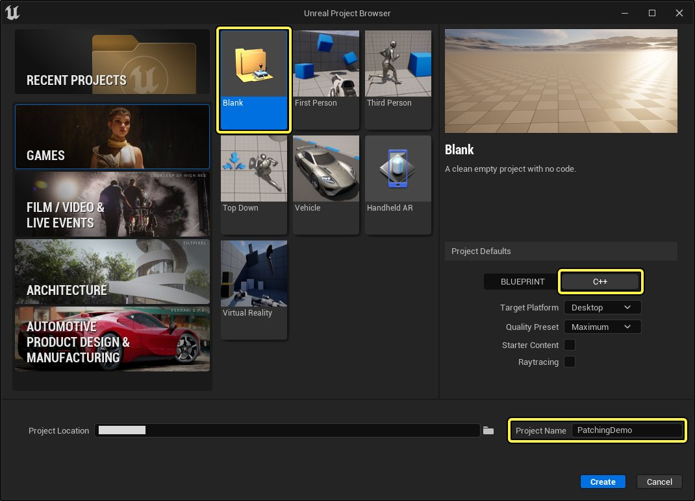

# 设置ChunkDownloader插件

> 路径：虚幻引擎5.7文档 / 分享和发布项目 / 补丁和DLC / 使用ChunkDownloader实现游戏补丁功能 / 设置ChunkDownloader插件

> 原始页面：https://dev.epicgames.com/documentation/unreal-engine/setting-up-the-chunkdownloader-plugin-in-unreal-engine

**ChunkDownloader** 补丁系统是 **虚幻引擎** 的一款内置系统，提供了为游戏打补丁的功能。本文将介绍如何为你的虚幻引擎项目设置 **项目设置** 和 **插件**，以便使用ChunkDowloader。

此示例使用了 **C++项目** 类型和 **空白模板**。项目名称为 **PatchingDemo**。



点击查看大图。

> [!NOTE]
> 此示例使用了 **C++项目** 类型和 **空白模板**。项目名称为 **PatchingDemo**。

## 步骤

1. 打开你的 **项目设置（Project Settings）**，浏览至 **项目（Project）** > **打包（Packaging）**，然后确保 **使用Pak文件（Use Pak File）** 和 **生成文件块（Generate Chunks）** 均已启用。
2. 打开插件窗口并启用 **Chunk Downloader** 插件。重启编辑器，使你的更改生效。
3. 在 **Visual Studio** 中，打开你项目的 `[项目名称]Build.cs` 文件。该文件位于 `[项目名称]/Source/[项目名称]`。
4. 编辑文件，将 **ChunkDownloader** 作为 `PrivateDependencyModuleNames` 加入你的 `ModuleRules`。在本案例中，在 `ModuleRules` 添加以下内容。

   ```
            PrivateDependencyModuleNames.AddRange(new string[] { "ChunkDownloader" } );		
   ```
5. 将你的更改 **保存（Save）** 到这些文件。
6. 右键点击你的 **[ProjectName].uproject** 文件，然后点击 **生成项目文件（Generate Project Files）**。
7. 返回到你在 **Visual Studio** 中的项目解决方案，然后 **构建（build）** 项目。

## 最终结果

现在，你可以在项目中使用ChunkDownloader了。你可以接着在项目代码中实现它们，以便下载和安装包文件，请参见[为数据划分准备资产](../../general-patching-information/preparing-assets-for-chunking/index.md) 。
