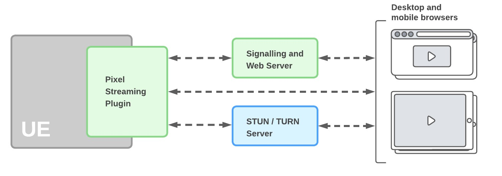
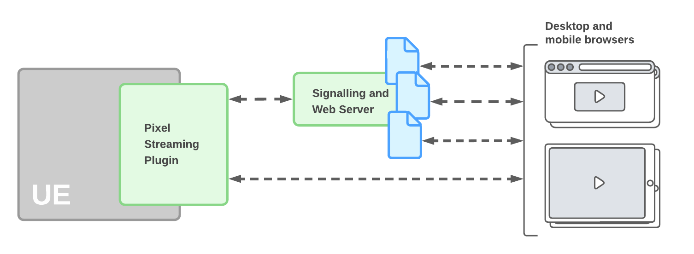
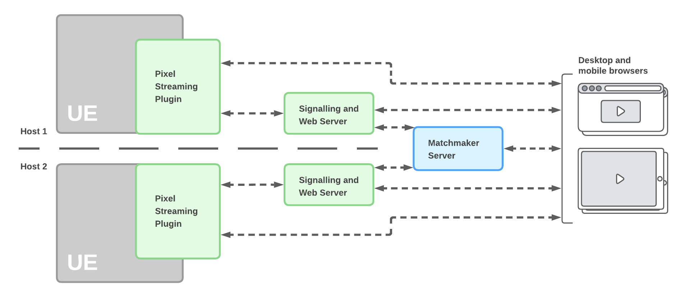
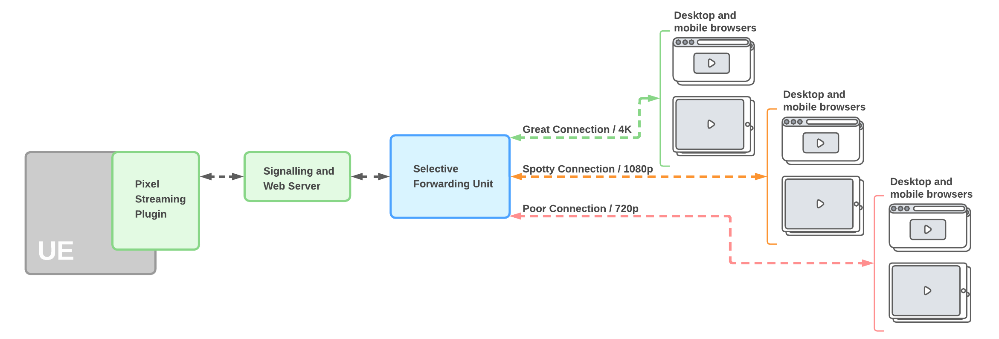

# 创建主机和网络连接指南

> 路径：虚幻引擎5.7文档 / 分享和发布项目 / 像素流送 / 像素流送开发指南 / 创建主机和网络连接指南

> 原始页面：https://dev.epicgames.com/documentation/unreal-engine/hosting-and-networking-guide-for-pixel-streaming-in-unreal-engine

即使没有开发或部署网络服务的经验，浏览[概述](../../starter-guides-for-pixel-streaming/overview-of-pixel-streaming/index.md)和[快速入门](../../starter-guides-for-pixel-streaming/getting-started-with-pixel-streaming/index.md)页面后也能学会如何进行像素流送设置，在简易局域网中开展工作。如要将服务部署到更加复杂的网络或公开网络中，或要改良用户体验和连接流程，建议重新考虑设置。

像素流随附的信令服务器、网络服务器和匹配服务器只是供你参考的实现方案。我们不认为它们能满足所有情况，相反，我们鼓励你按照自身需求修改它们。为此我们在新制作的[像素流送基础设施（外部网站）](https://github.com/EpicGamesExt/PixelStreamingInfrastructure/)中提供了信令服务器、Web服务器和配对器，以便它们可以按照虚幻引擎[终端用户许可协议](https://www.unrealengine.com/zh-CN/eula-reference/unreal-zh-cn)自由分发（请参阅示例的分发和许可转让）。

有关像素流送前端和Web服务器更改的更多详情，请参阅[像素流送基础设施](https://github.com/EpicGamesExt/PixelStreamingInfrastructure)页面。

## STUN和TURN服务器

为确保信令和Web服务器能够在虚幻引擎应用和浏览器间交涉直接连接，双方需互相发送各自的IP地址。浏览器需要访问UE5应用发送的IP地址，反之亦然。

在一个简易局域网中，每个端点通常会假设另一方能够使用自身网卡所知的私有IP地址，以便对该端点进行访问。在公开网络、子网络中，或是网络地址转换（NAT）服务在浏览器和UE5应用间进行干涉时，通常情况却并非如此。相反，每一方需通过查询实现STUN（NAT会话遍历工具）协议的服务器，以找出自身公开可见的IP地址。STUN服务器告知所有端点其自身的公开可见IP地址后，信令和Web服务器可继续中继各自的直接连接。

另外，可使用TURN服务器在UE5应用和浏览器之间中继媒体流。启动TURN协议后，TURN服务器会同时连接UE5应用和浏览器。UE5应用将自身所有流送的数据发送给TURN服务器，后者又将数据传送至浏览器。在此情况下，UE5应用和浏览器间并无直接连接。（如要在无线运营商网络中支持移动设备，或在企业安全网络中支持客户端，只能使用TURN服务器。移动和企业网络通常不支持客户端通过WebRTC协议进行连接。）

STUN和TURN协议共同组成了ICE（交互式连接建立）框架，可以从一个服务器退回到另一服务器。

在网络上可以找到多个STUN和TURN服务器的[开源实现](https://github.com/coturn/coturn)。甚至有免费[公开STUN服务器](https://gist.github.com/mondain/b0ec1cf5f60ae726202e)可供使用，无需另行创建。但在实际操作时，建议谨慎使用非自行创建的服务器。（考虑到通过TURN协议中继媒体时所涉及的容量和带宽，公开TURN服务不太可能完全免费。)

> [!TIP]
> 为方便使用，`SignallingWebServer/platform_scripts/` 目录包含可在Windows、Linux和Mac上运行 **CoTURN** 的脚本。CoTURN 是一款免费开源的 STUN/TURN 服务器（可投入生产）。我们移除了之前发布的 STUN 和 TURN 参考服务器，因为两者还无法达到可实际应用级别。

要设置像素流送以使用ICE连接，需要设置在信令和Web服务器 **peerConnectionOptions** 配置参数中使用的STUN和TURN服务器主机名。欲了解该参数格式化和支持方法的详情，请参阅[像素流送参考](../../unreal-engine-pixel-streaming-reference/index.md#%E4%BF%A1%E4%BB%A4%E6%9C%8D%E5%8A%A1%E5%99%A8%E9%85%8D%E7%BD%AE%E5%8F%82%E6%95%B0)。

此外，如自行创建STUN或TURN服务器，务必确保在 **peerConnectionOptions** 参数中为其指定的IP地址和端口在公开网络中可见。

## 多用户端点

有时需要将所有用户保存在同一个虚幻引擎会话中，但他们却未必都能对会话进行控制。

举例而言，创建展示等体验时，展示者可在自己的浏览器中完全控制虚幻引擎，但其他参与用户只能观看流送；或是创建不同用户的控制自定义设置，以便他们一起实时控制体验的各个方面。

在此类情况中，仅需使用网络服务的一个堆栈来运行一个虚幻引擎实例，便能在信令和Web服务器上创建不同的播放器HTML页面：

在此情况中，可自定义各个不同HTML播放器页面及其JavaScript环境，从而只公开所需的控制。之后，每类用户需要从信令和Web服务器处请求一个不同的URL。举例而言，展示者可能加载的是 `http://yourhostname/presenter.html` ，而其他用户则加载 `http://yourhostname/attendee.html` 。

查阅[自定义播放器网页](../../unreal-engine-pixel-streaming-reference/index.md)，详细了解自定义播放器网页的方法。

## 配对时的多个完整堆栈

> [!NOTE]
> 从虚幻引擎5.5开始，配对器将被废弃。需要配对器的 用户可以使用之前版本的像素流送基础设施。但我们建议你在今后部署自己的解决方案，因为该功能已不再受支持，可能会在未来的某一天不再工作。

有时需要所有用户能拥有各自的交互体验，而非将每个用户都连接到同一流送中。要进行此操作，可为每个用户单独运行他们的像素流送组件的堆栈，并为每个用户单独指定信令和Web服务器，以便开始连接。

可在不同主机上设置像素流送组件的每个堆栈，或在相同主机上放置多个堆栈（前提是在每个堆栈中配置组件的端口设置，以便其可通过不同端口进行通信）。查阅[像素流送参考](../../unreal-engine-pixel-streaming-reference/index.md)，了解此类端口设置的详情。

> [!NOTE]
> 如希望在同一电脑上使用像素流送来运行多个虚幻引擎实例，须注意NVIDIA GeForce系列等诸多应用级显卡一次最多只能运行8个编码器（截止2024年数据）。Quadro和Tesla等专业级显卡则无此类限制。

要进行此类配置的设置，像素流送系统可使用配对服务器来追踪可用的信令和Web服务器，以及它们是否被客户端连接所使用。

各个客户端首先与配对服务器连接，而非需要与自身信令和Web服务器URL连接。配对服务器负责将所有请求程序重新指定到各自信令和Web服务器，以便在客户端与其自身UE5应用间构建对等网络连接。一旦激活连接，配对服务器不再会将任何新的浏览器连接重新定向至相同信令和Web服务器。

像素流送系统包含配对服务器的一项参考实现，该实现在 `PixelStreamingInfrastructure/Matchmaker/` 文件夹中。可直接使用该服务器，而无需设置；也可自定义 `matchmaker.js` 文件来满足需要，前提是对来自信令和Web服务器的相同消息进行处理。

设置配对服务器的步骤：

1. 启动信令和Web服务器前，运行配对服务器的 `run.bat` 文件以启动该服务器。默认情况下，服务器会在端口 **90** 上聆听来自客户端的HTTP连接，而在端口 **9999** 上聆听来自信令和Web服务器的连接。在命令行中输入以下配置参数即可覆盖以上设置：

   | 参数 | 描述 |
   | --- | --- |
   | **--httpPort** | 定义配对服务器聆听传入HTTP连接（来自浏览器）所用的端口。 |
   | **--matchmakerPort** | 定义配对服务器聆听传入状态消息（来自信令和Web服务器）所用的端口。 |

   例如：

   \> node cirrus --HttpPort 88 --MatchmakerPort 9988
2. 为信令和Web服务器设置以下配置参数：

   | 参数 | 描述 |
   | --- | --- |
   | **UseMatchmaker** | 将此参数设为 `true`，以便信令和Web服务器向配对服务器发送自身当前状态。 |
   | **matchmakerAddress** | 将与该信令和Web服务器连接的配对服务器IP地址。 |
   | **matchmakerPort** | 该信令和网络服务器需要向配对服务器发送消息时所用的端口。请确保此数值与配对服务器所设的 **--matchmakerPort** 值相匹配。 |
   | **publicIp** | 信令和Web服务器的公开可见IP地址。配对服务器将用户重新指定到该信令和Web服务器时，其会把它们发送到该IP地址。因此，其必须对连接浏览器可见。 |
   | **httpPort** | 信令和Web服务器聆听HTTP连接所用的端口。配对服务器将用户重新指定到该信令和Web服务器时，其会把它们发送到该端口。 |

   参阅[像素流送参考](../../unreal-engine-pixel-streaming-reference/index.md)，了解此类参数的设置指南。

## 根据需求扩展

要使用之前所述的策略之一，例如单独的完整堆栈为每个新客户端连接提供服务，则不可运行预设数量的虚幻引擎程序。如用户数少于服务器数，则浪费资源；相反，如用户数多于服务器数，在空出连接前用户将需要等待。因此，建议在每次客户端尝试连接时启动一个新的服务器实例。

利用像素流送系统的组件和额外配对服务器，用户应拥有建立类似动态扩展主机系统的所有资源。但目前此类云部署需要用户在自己的云服务提供商上进行设置。

## 什么是SFU？

选择性转发单元（SFU）是在参与者之间智能地路由媒体流的服务器。在像素流送中，SFU的作用是接收来自虚幻引擎应用程序的流数据，并将其交付给接收方对等端（通常是连接的Web浏览器），可选择对数据进行子集设置，以适应每个接收方对等端的当前网络条件。

使用SFU时，像素流送可实现联播策略，以适应流带宽。在联播策略中，虚幻实例会以不同分辨率生成多个流。然后SFU将根据接收方地网络条件选择要传输给接收方的流的质量变体。

> [!NOTE]
> 注意，目前像素流送的SFU功能处于试验阶段。

## 何时使用SFU

SFU支持一对多流，可在其中连接更多对等端，而非以常见的点对点方式将所有对等端连接到像素流送应用程序。当像素流送应用程序需要多个连接的接收方，但这些接收方的网络条件各不相同，需要不同质量流质量级别（例如，较低的比特率、分辨率或帧率）时，通常适合使用SFU。

## SFU配置

要配置SFU，通常可通过修改 `PixelStreamingInfrastructure/SFU/` 中的 `config.js` 文件来实现。

SFU默认配置为提供三个质量级别。一个全分辨率流，一个半分辨率流和一个四分之一分辨率流。可以使用 -SimulcastParameters= （详情请参阅像素流送参考）更改此配置。

> [!NOTE]
> 如果要创建八个以上的联播流，则在消费类GPU上使用H.264硬件编码器时可能会受到限制，因为消费类GPU通常仅限八个编码会话。在Pixel Streaming 2中，8个编码会话之外的流会自动切换到软件编码器。这仅限于Nvidia硬件。

## 主机硬件性能

如选择Amazon（AWS）或Microsoft Azure等服务提供商来创建虚幻引擎程序和像素流送网络服务，可在具有不同硬件性能的多个不同等级主机间进行选择。请注意：主机的性能可能会影响提供的流送质量。

例如，如果你选择GPU或内存较差的设备作为托管服务器，将无法在流送中获取最高质量的视频。
