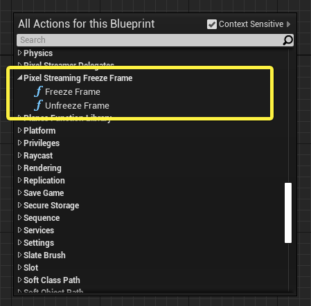
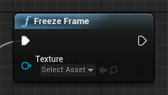
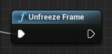
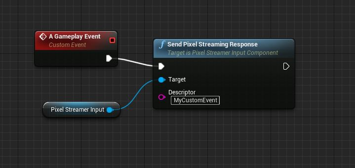
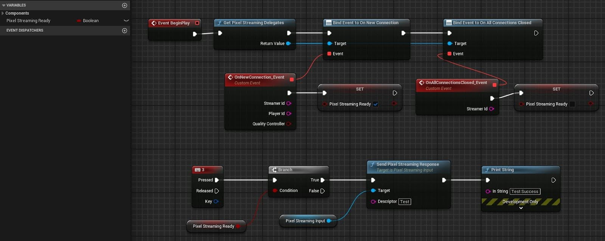
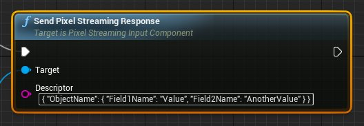
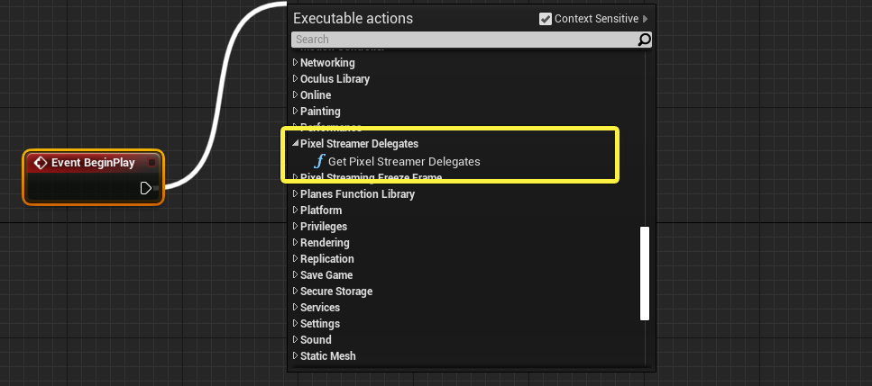
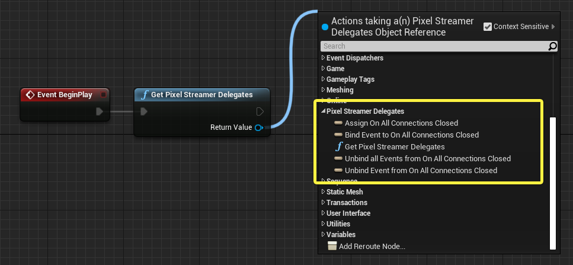

# 与像素流送系统交互

> 路径：虚幻引擎5.7文档 / 分享和发布项目 / 像素流送 / 像素流送开发指南 / 与像素流送系统交互

> 原始页面：https://dev.epicgames.com/documentation/unreal-engine/interacting-with-the-pixel-streaming-system-in-unreal-engine

在按照[快速入门指南](https://dev.epicgames.com/documentation/404)中的说明设置像素流系统时，你无需在虚幻引擎应用程序的游戏代码中执行特殊操作即可在运行时管理系统。但像素流送插件确实提供一些可选方式来控制像素流送系统和与其交互，以达到特定效果。本页介绍这些附加选项。

## 冻结帧

若将虚幻引擎应用程序渲染的每一帧都编码到媒体流送中，会有如下缺点：需要占用运行虚幻引擎的计算机的资产；通过网络发送所有帧会消耗带宽；根据可用带宽，编码可能会降低渲染图像的质量。

为了最大限度减少使用GPU资产和网络带宽，有时可能要暂时禁止像素流插件编码和发送每一帧，选择向已连接的客户端显示一张静态图像。例如：

- 若客户端未与应用程序积极交互，且虚拟场景中没有任何对象在移动，则可能需要应用程序冻结在最后一个渲染帧上，直到发生改变。
- 可能需要向客户端显示任意图像，例如加载屏幕或消息标题。

为此，像素流送插件提供可用于暂停和恢复编码的蓝图节点。可在蓝图编辑器中的 **像素流送冻结帧（Pixel Streaming Freeze Frame）** 类别中找到此类节点：



- 想要用静态图像替换媒体流送时，使用 **Freeze Frame** 节点。

  

  此节点接受对纹理资产的可选引用。若提供一个，已连接的客户端将在播放器窗口中看到指定的纹理。若未提供，连接客户端将看到你调用此节点时虚幻引擎应用程序生成的最后一个渲染帧。
- 想要恢复每帧流送时，使用 **Unfreeze Frame** 节点。

  

> [!NOTE]
> 冻结在单个帧或图像纹理上不会影响来自浏览器的输入。冻结后，默认情况下，播放器页面仍会将键盘和鼠标事件发送到虚幻引擎。

## 从UE5到播放器页面的通信

虚幻引擎应用程序可以向所有连接的播放器HTML页面发送自定义事件，你可在播放器的JavaScript环境中响应这些事件。这样，你可以根据Gameplay事件更改网页UI。

要执行此设置：

1. 在虚幻引擎应用程序中，每当要向播放器页面发送事件时，使用 **Pixel Streaming > Send Pixel Streaming Response** 节点。向该节点指定一个自定义字符串参数，以向播放器页面表明已发生的事件。

   

   点击查看大图。

   或者举个更常见的示例（按3键时，将向播放器发送响应）：

   

   点击查看大图。
2. 在播放器页面的JavaScript中，你将需要写入一个自定义事件处理程序函数，每当该页面从虚幻引擎应用程序收到响应事件时，都将调用此函数。它会收到由 **Send Pixel Streaming Response** 节点发送的原始字符串参数。例如：

   ```
           function myHandleResponseFunction(data) {            console.warn("Response received!");            switch (data) {                case "MyCustomEvent":                    ...// 处理一种事件类型                case "AnotherEvent":                    ...// 处理另一个事件            }        }
   ```
3. 调用 `app.js` 提供的 `addResponseEventListener` 函数来注册监听器函数。为事件监听器向此函数传递一个唯一名称以及你的函数。例如：

   ```
       addResponseEventListener("handle_responses", myHandleResponseFunction);
   ```
4. 如果需要删除你的事件监听器，可调用 `removeResponseEventListener` 并传递同一名称。例如：

   ```
       removeResponseEventListener("handle_responses");
   ```

> [!TIP]
> 若要传递更复杂的数据，可以将你传递给 **Send Pixel Streaming Response** 节点的字符串格式化为JSON。例如：
>
> 

## 响应像素流送事件

像素流送系统向应用程序游戏进程代码提供了一种方法，以便响应像素流送会话过程中发生的选定事件。这些事件有两种版本：蓝图事件和原生C++事件：

### 蓝图事件

这些委托可以通过UE5的蓝图编辑器访问。

| 事件 | 说明 |
| --- | --- |
| **OnNewConnection** | 当新客户端连接到虚幻引擎应用程序的实例时发射。 |
| **OnConnectionClosed** | 在连接到虚幻引擎应用程序的此实例的客户端断开连接时发射。 |
| **所有连接关闭时（On All Connections Closed）** | 当连接此虚幻引擎应用程序实例的最后一个客户端断开连接时发出。发出此事件后，将没有客户端查看应用程序的媒体流送。可利用此机会让游戏逻辑将应用程序重置为初始状态，为加入新客户端做准备。 |
| **OnStatChanged** | 用 `FPixelStreamingPlayerId, FName, float` （播放器ID、统计数据名称和统计数据值）的格式报告不同的像素流统计数据。 |

以下蓝图事件只对Pixel Streaming 2可用。

| 事件 | 说明 |
| --- | --- |
| **OnDataTrackOpen** | 当连接到虚幻引擎应用程序的客户端打开数据追踪时发射。 |
| **OnDataTrackClose** | 当连接到虚幻引擎应用程序的客户端关闭数据追踪时发射。 |
| **OnFallbacktoSoftwareEncoding** | 当循环 引擎应用程序的硬件编码会话耗尽时发射。 |

为了响应此类事件，可利用 **像素流送器委托（Pixel Streamer delegate）** 类进行绑定。通常在游戏开始时设置此绑定；例如，为了响应 **开始播放事件（Event BeginPlay）** 事件。设置绑定后，每当触发绑定事件时将触发自定义事件。

1. 在蓝图图表编辑器中，从任意节点的执行引脚向右拖动，并选择 **Pixel Streamer Delegates> Get Pixel Streamer Delegates** 。

   
2. 从 **返回值（Return Value）** 向右拖动，展开 **像素流送器委托（Pixel Streamer Delegates）** 类别。将看到许多用于绑定和取消绑定事件的新选项。

   
3. 为要响应的事件选择 **绑定...（Bind...）** 选项，例如 **绑定事件至所有连接关闭时（Bind Event to On All Connections Closed）** 。将获得一个带有 **事件（Event）** 输入的新节点。将其输入执行引脚连接到 **Get Pixel Streamer Delegates** 中的输出执行引脚。

   > 图片已省略：绑定委托
4. 若你已有想要触发的自定义事件，则将其标题栏中的 **输出委托（Output Delegate）** 引脚连接到刚创建的 **Bind** 节点上的 **事件（Event）** 输入。否则，从 **事件（Event）** 输入中向左拖动并选择 **添加事件（Add Event）> 添加自定义事件（Add Custom Event）** 以创建新的自定义事件。

   > 图片已省略：自定义事件
5. 将自定义事件连接到想要运行以响应像素流送事件的蓝图逻辑。

例如，此实现调用在同一个蓝图中所定义的自定义函数来将应用程序重置为初始状态：

> 图片已省略：响应自定义事件

### C++事件

开发人员可以将自己的处理程序注册到这些像素流送委托。我们推荐开发人员参阅此页面：[多播代理](../../../../cpp-programming/delegates-and-lambda-functions/multicast-delegates/index.md)，了解有关虚幻引擎中C++委托用法的具体信息。使用像素流送委托的一个简单示例如下：

```
	#include "PixelStreamingDelegates.h" 	void FExample::OnStatChanged(FString PlayerId, FName StatName, float StatValue)	{	//待办事项：针对更改的统计数据执行某个操作。	} 	void FExample::BindToDelegates()	{	// 绑定到OnStatChangedNative委托。	if(UPixelStreamingDelegates* Delegates = UPixelStreamingDelegates::Get())	{	Delegates->OnStatChangedNative.AddRaw(this, &FExample::OnStatChanged);	}	};
```
