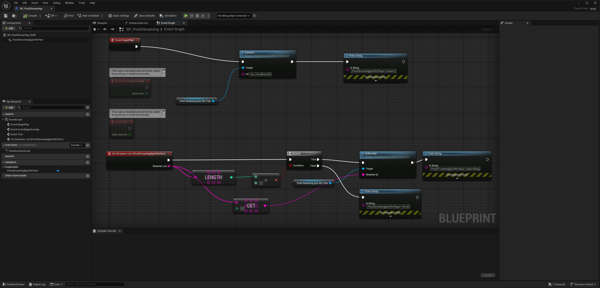

# 像素流送2概述

> 路径：虚幻引擎5.7文档 / 分享和发布项目 / 像素流送 / 像素流送开发指南 / 像素流送2概述

> 原始页面：https://dev.epicgames.com/documentation/unreal-engine/pixel-streaming-2-overview-in-unreal-engine

## 为何选择像素流送2？

从UE 5.5开始，我们引入了一个层，该层在引擎及其外围设备的许多部分中使用，使Epic更容易在内部维护WebRTC。由于原始像素流送插件直接使用WebRTC，因此过渡到使用此新层意味着必须调整或重写插件的许多部分。

我们决定引入新插件，为基于像素流送插件开发了自定义解决方案的开发者实现更好的过渡。目前，原始像素流送插件和像素流送2插件都将随虚幻引擎一起提供，以便用户有时间进行迁移。

## 哪些人受影响？

所有从像素流送插件迁移到新像素流送2插件的用户都应阅读此迁移指南。

## 有什么影响？

在创建新的像素流送2插件时，我们的主要目标之一是尽量减少对现有像素流送用户的影响。

为了实现这一目标，我们保持启动和运行像素流送的流程不变，所有步骤和启动参数均相同。但是，迁移到新插件的用户应留意一些蓝图节点、C++公共API和功能更改。对于C++ API用户来说，最明显的变化是我们删除了所有WebRTC类型。

## 兼容性

像素流送2与现有的[像素流送基础架构](https://github.com/EpicGamesExt/PixelStreamingInfrastructure)直接兼容。我们建议使用与你的虚幻引擎版本相对应的像素流送基础架构分支。对于虚幻引擎5.5版本的像素流送2，你应使用像素流送基础架构的UE5.5分支。

## 哪些内容有更改？

以下列表包含你在迁移至像素流送2时应该注意的一些大致变更：

- 所有蓝图节点均具有像素流送2版本。如果你正在迁移项目，则必须手动重新创建并重新链接蓝图中的相关节点。当整个插件名称发生更改时，重定向器不可用。
- 我们对C++ API进行了重大更改。已添加、删除或重命名多个文件和成员。
- 像素流送设置已变更。我们添加了一些新选项，更改了一些现有选项的默认值，并废弃了一些旧选项。

  - 你现在可以从

    .ini

    、控制台或命令行设置像素流送设置。设置优先顺序为

    .ini

    被命令行重载，命令行被控制台重载。
- 像素流送播放器功能包含在像素流送2中，无需额外的插件。请参阅下面的

  设置像素流送播放器

  小节，了解更多信息。

> [!NOTE]
> 如需深入了解详细更改，包括C++公共API、功能和标记更改，请参阅[此处](https://github.com/EpicGamesExt/PixelStreamingInfrastructure/tree/master/Docs/pixel-streaming-2-migration-guide.md)像素流送基础架构的完整文档。

### 设置像素流送播放器

用于设置PixelStreamingPlayer组件的蓝图实现已发生重大变更。以下步骤概述了对等体订阅第一个可用流送器的示例实现：

1. 启用

   像素流送2

   插件。
2. 创建新的

   蓝图类（Actor）（Blueprint Class (Actor)）

   。
3. 打开

   Actor

   ，并添加

   像素流送对等体（Pixel Streaming Peer）

   组件。
4. 将

   像素流送对等体（Pixel Streaming Peer）

   组件拖入

   事件图表（Event Graph）

   中。
5. 将

   Pixel Streaming Peer

   节点拖到空白处，并创建

   Connect

   节点。
6. 将

   BeginPlay

   节点的

   Exec

   输出引脚连接到

   Connect

   节点的

   Exec

   输入引脚。
7. 在

   Connect

   节点上，执行以下操作：

   1. 将输入

      Exec

      引脚连接到

      BeginPlay's

      输出

      Exec

      引脚。
   2. 在

      Url

      值中输入"ws://localhost:80"。
8. 在

   组件（Components）

   面板中，右键单击

   像素流送对等体（Pixel Streaming Peer）

   组件，并将

   OnStreamerList

   事件添加到

   事件图表（Event Graph）

   。
9. 再次将

   像素流送对等体（Pixel Streaming Peer）

   组件拖入

   事件图表（Event Graph）

   中。
10. 将新的

    Pixel Streaming Peer

    节点拖到空白处，并创建

    Subscribe

    节点。
11. 在

    Subscribe

    节点上，将输入

    Exec

    引脚连接到

    OnStreamerList's

    输出

    Exec

    引脚。
12. 在

    OnStreamerList

    节点上，拖出

    Streamer List

    输出，并创建一个索引为

    0

    的

    Get (a ref)

    节点。
13. 将

    Get

    节点的输出连接到

    Subscribe

    的

    Streamer Id

    输入。
14. 在

    组件（Components）

    面板中，选择

    像素流送对等体（Pixel Streaming Peer）

    组件。
15. 在

    细节（Details）

    面板中，将

    属性（Properties）> 像素流视频消费者（Pixel Streaming Video Consumer）

    设置为

    像素流送媒体纹理（Pixel Streaming Media Texture）

    。这将提示你创建并保存新资产。
16. 将你的

    蓝图Actor（Blueprint Actor）

    拖入关卡中。
17. 创建一个

    平面（Plane）

    对象，并使用变换工具在你的关卡中创建合适的显示。
18. 将你的

    像素流送媒体纹理（Pixel Streaming Media Texture）

    直接从

    内容浏览器（Content Browser）

    拖入关卡中的

    平面（Plane）

    。这会自动创建材质并将其应用于对象。
19. 启动此项目外部的本地像素流。启动信令服务器并使用相关的像素流送参数运行应用程序。
20. 运行你的关卡。现在你应该会看到你的外部像素流显示在你的场景中的 **平面（Plane）** 上。

    

    点击查看大图。
