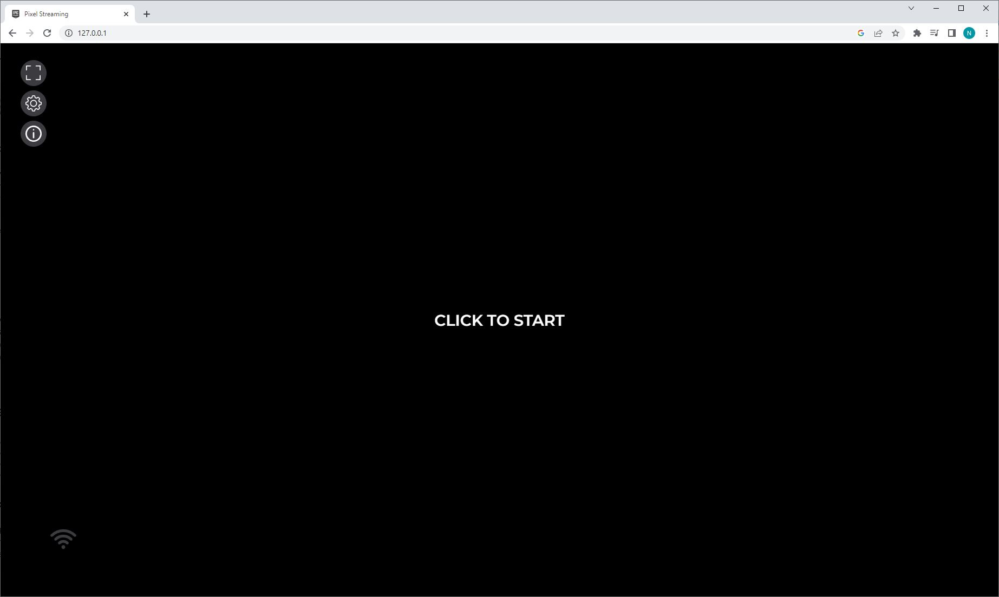
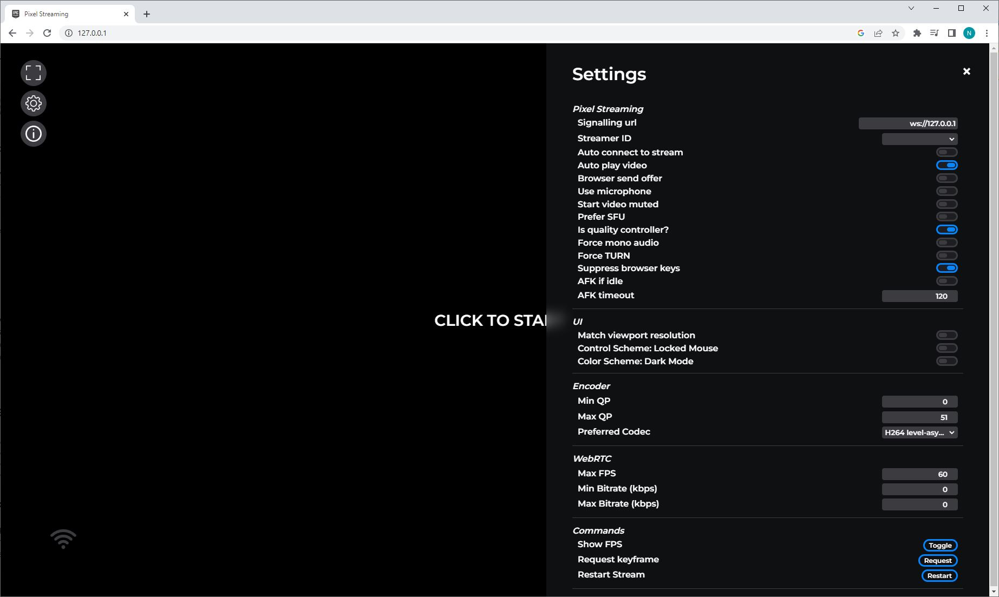
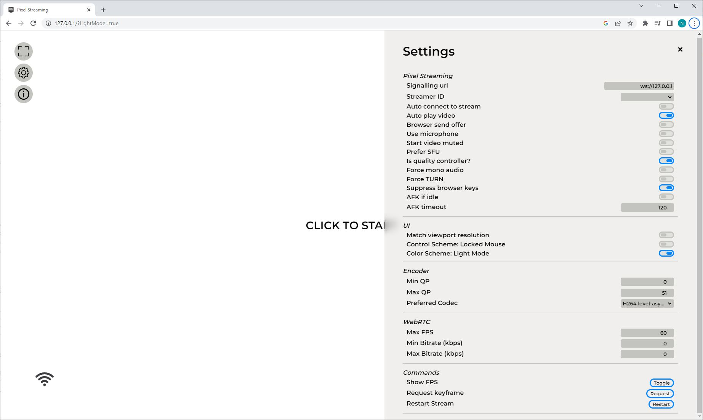
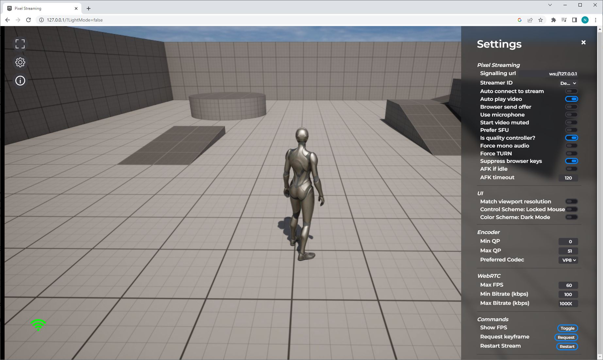
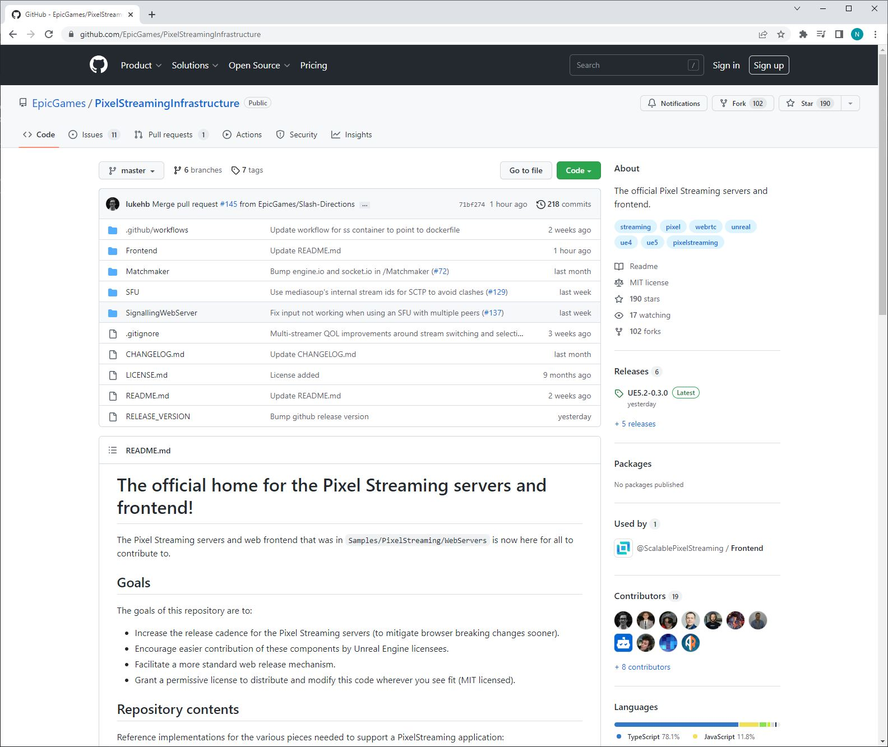

# 自定义播放器网页

> 路径：虚幻引擎5.7文档 / 分享和发布项目 / 像素流送 / 像素流送网络接口 / 自定义播放器网页

> 原始页面：https://dev.epicgames.com/documentation/unreal-engine/customizing-the-player-web-page-in-unreal-engine

有关自定义前端的信息已移至[像素流送基础设施](https://github.com/EpicGamesExt/PixelStreamingInfrastructure/tree/master/Frontend)

## 前端

前端指的是在Web浏览器中运行并可以连接到虚幻引擎像素流送应用程序以及与之交互的HTML、CSS、图像和JavaScript/TypeScript代码。开发人员可以根据自己的像素流送体验需求，在前端库的基础之上修改和扩展。

默认前端。

前端设置面板。

带有设置面板的前端光源模式。

带有活动流连接的前端。

## 位置

我们推出了新的像素流送基础设施仓库，其中包含了像素流送前端元素的所有最新信息。 如果你想自定义像素流送前端，请前往[自定义播放器网页](https://github.com/EpicGamesExt/PixelStreamingInfrastructure/tree/master/Frontend)

## 理由

将"自定义播放器网页"文档移至像素流送基础设施，意味着我们可以独立于虚幻引擎的发行更频繁地动态更新。随着像素流送前端的演变，我们将相应更新相关信息。 请务必经常回来检查基础设施，了解有关前端的新信息。

## 相对于之前版本的更改

过去，像素流送前端依赖两个庞大的Javascript文件： `app.js` 和 `webrtcplayer.js` 。用户很难将其扩展，并且对于试图修改前端的用户来说，它们的参考价值不大。此外，我们的维护难度很大。

从虚幻引擎5.2开始，这些文件现已移至一个TypeScript库，前端在其中已模块化，可轻松扩展。

对于使用虚幻引擎5.2之前的版本的用户，过渡很重要，但对于所有后续版本，我们打算为我们的版本提供稳定的API表面并利用语义版本管理。
