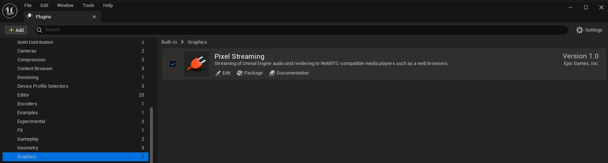
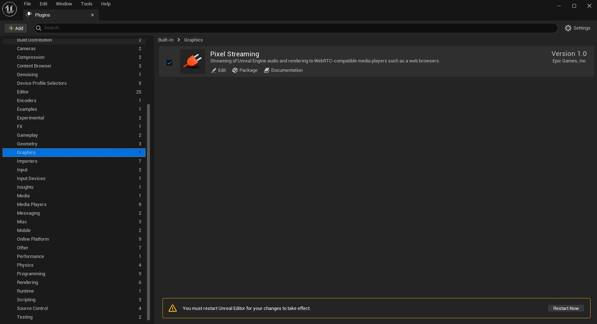
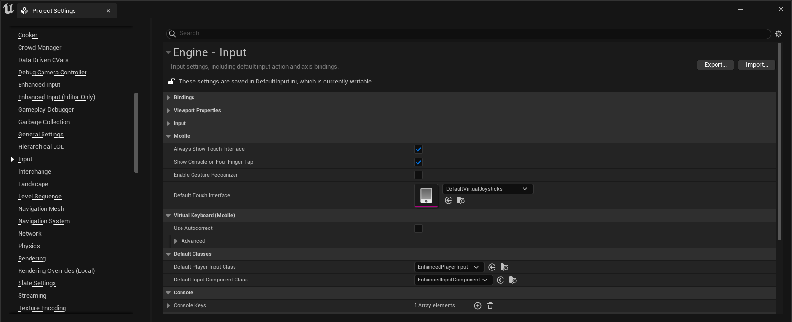
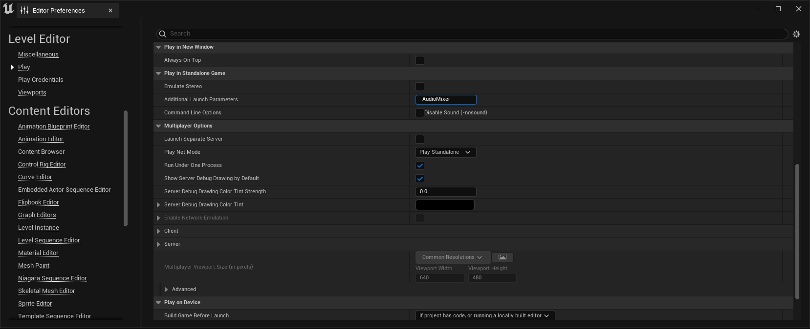
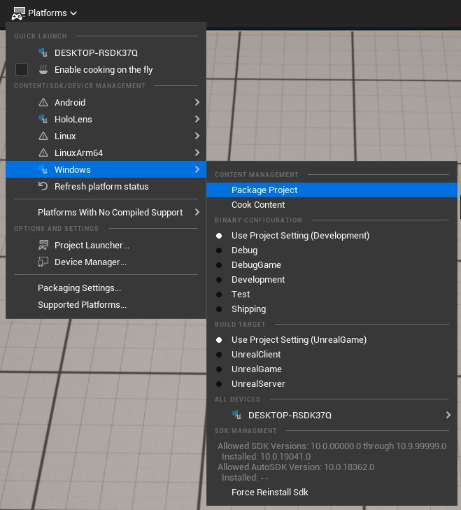
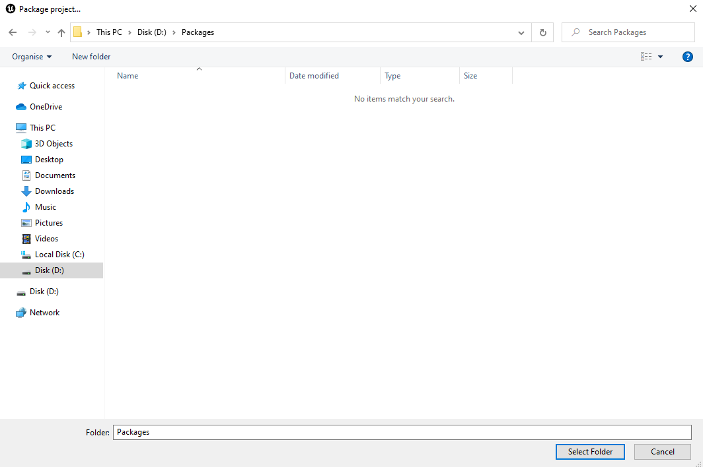
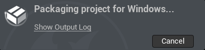
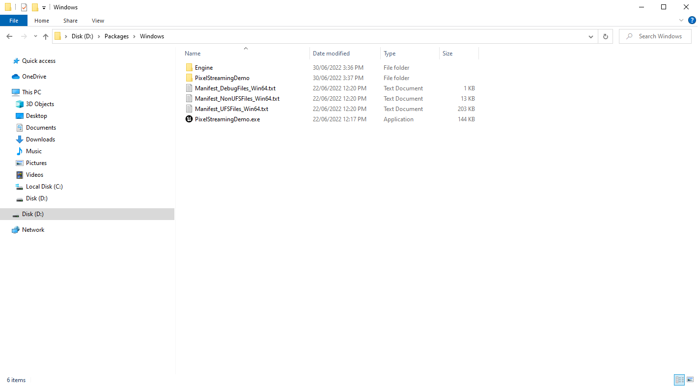

# 虚幻引擎中的像素流送入门

> 路径：虚幻引擎5.7文档 / 分享和发布项目 / 像素流送 / 虚幻引擎像素流送入门指南 / 虚幻引擎中的像素流送入门

> 原始页面：https://dev.epicgames.com/documentation/unreal-engine/getting-started-with-pixel-streaming-in-unreal-engine

执行下面的步骤，通过你的本地网络将虚幻引擎项目中渲染的输出流送到浏览器和移动设备。

> [!NOTE]
> 此页面上各步骤的图像使用从 **第三人称蓝图（Third-Person Blueprint）** 模板构建的项目演示该过程。但是，相同步骤应该适用于所有虚幻引擎项目。

## 先决条件

- 检查你的操作系统和硬件：

  像素流送插件只能在运行Windows、Linux或Mac操作系统并具有特定类型GPU硬件的计算机上编码视频。如需了解详情，请参阅

  像素流送参考

  。
- 打开网络端口：

  确保你打开了以下网络端口，用于在本地网络上通信：80、8888。如果你需要更改这些默认值，请参阅

  像素流送参考

  。
- 停止其他Web服务器：

  如果你的计算机正在运行其他Web服务器，请暂时将其停止。
- IP地址：

  你需要知道计算机的IP地址，才能通过互联网测试像素流送。

  最好首先在LAN或VPN中开始像素流送，这意味着你可以将

  localhost

  或

  127.0.0.1

  用作你的像素流送IP地址。 如果你尝试从不同网络上的计算机连接，你很可能需要配置你的信令服务器，以使用STUN/TURN服务器。请参阅

  像素流送参考

  ，详细了解关于如何使用

  peerConnectionOptions

  配置你的信令服务器，从而指定STUN/TURN服务器。

## 1 - 准备你的虚幻引擎应用程序

在此步骤中，你将为项目创建独立的可执行文件。

> [!NOTE]
> 像素流送插件仅会在你将项目作为打包应用程序运行，或使用 **独立游戏（Standalone Game）** 选项从虚幻编辑器启动它时才适用。
>
> 下面的流程展示了如何为这两种情景进行设置。

1. 在虚幻编辑器中打开你的项目。
2. 在虚幻编辑器中，从主菜单选择

   编辑（Edit）> 插件（Plugins）

   。
3. 在 **图形（Graphics）** 类别下找到 **Pixel Streaming** 或 **Pixel Streaming 2** 插件并勾选 **启用（Enabled）** 框。

   
4. 点击 **立即重启（Restart Now）** ，重启你的项目并应用更改。

   
5. 返回虚幻编辑器，从主菜单选择 **编辑（Edit）> 项目设置（Project Settings）** 。
6. 如果你的项目涉及某个角色，并且你想从手机和平板电脑等触摸设备启用输入，以在关卡内四处移动该角色，你可能需要显示屏上触摸控制器。 在 **引擎（Engine）> 输入类别（Input category）** 下，找到并启用 **总是显示触摸界面（Always Show Touch Interface）** 设置。

   

这是可选操作，不是所有项目都必需。但是，对于第三人称模板这样的项目，这会确保使用触摸设备的用户可以控制流送的应用程序（只要项目的玩家控制器支持触摸输入）。

1. 在主菜单中，选择 **编辑（Edit）> 编辑器偏好设置...（Editor Preferences...）**
2. 在 **关卡编辑器（Level Editor）> 播放（Play）** 类别下，找到 **其他启动参数（Additional Launch Parameters）** 设置，并将其值设置为 `-PixelStreamingURL=ws://127.0.0.1:8888`。

   
3. 为Windows打包你的项目。在虚幻编辑器的主菜单中，选择 **文件（Files）> 打包项目（Package Project）> Windows（64位）（Windows (64-bit)）** 。

   
4. 浏览到计算机上你希望虚幻编辑器放置打包版项目的文件夹，然后点击 **选择文件夹（Select Folder）** 。



1. 虚幻编辑器将开始打包过程。



1. 打包过程完成后，转至你在上面第10步中选择的文件夹。你将找到名为

   Windows

   的文件夹，其内容类似于以下内容：



1. 每次你启动打包的应用程序时，需要向其传递上面的第8步中设置的相同命令行标记。一种做法是设置快捷方式： 1. 按 **Alt** 键并拖动你的 *.exe* 文件，在相同文件夹中（或计算机上你想要的其他任意位置）创建新的快捷方式。

   > 图片已省略：创建快捷方式

2. 右键点击快捷方式，从上下文菜单选择 **属性（Properties）** 。

> 图片已省略：快捷方式属性

3. 在 **快捷方式属性（Shortcut Properties）** 窗口的 **快捷方式（Shortcut）** 选项卡上，在 **目标（Target）** 字段末尾附加文本 `-PixelStreamingURL=ws://127.0.0.1:8888，并点击 **确定（OK）** 。

> 图片已省略：命令行参数

> [!TIP]
> 像素流送系统启动并开始运行后，你可能需要添加 `-RenderOffScreen` 命令行参数。如果你的虚幻引擎应用程序窗口意外被最小化，像素流送输入流可能会停止工作。`-RenderOffScreen` 可避免这种可能性，因为它在没有可见窗口的无头模式中运行应用程序。

### 最终结果

现在你有一个已打包且独立的虚幻引擎应用程序，它启用了像素流送插件，随时可以流送其渲染的帧和音频。

## 2 - 获取像素流送服务器

最近对像素流送的一些更改已将像素流送的前端和Web服务器元素移至外部仓库。我们将其称作像素流送基础设施。

访问像素流送基础设施的方法有多种。

1. 从以下地址直接访问github仓库：

   https://github.com/EpicGamesExt/PixelStreamingInfrastructure
2. 在你偏好的终端中执行

   git clone --branch UEX.Y https://github.com/EpicGamesExt/PixelStreamingInfrastructure.git

   （确保你安装了git）。请将UEX.Y替换为你需要的分支，如5.5.
3. 找到

   \Engine\Plugins\Media\PixelStreaming\Resources\WebServers

   并运行

   get_ps_servers

   命令（确保将相应的

   .bat

   脚本用于Windows，将相应的

   .sh

   脚本用于Linux和Mac）。这会自动将相关像素流送基础设施分支提取到该文件夹中。

> [!NOTE]
> 如需详细了解像素流送前端和Web服务器更改，请参阅[像素流送基础设施](https://github.com/EpicGamesExt/PixelStreamingInfrastructure)

## 3 - 启动服务器

在这一步骤中，你将启动Web服务，以便在虚幻引擎应用程序和客户端浏览器之间建立点对点连接。如果还未完成上一步骤，则无法访问这些服务器。

> [!NOTE]
> 以下步骤假定你使用的是Windows。但Linux和Mac也是同一流程，不同之处仅仅是在 `SignallingWebServer\platform_scripts\bash` 文件夹中运行脚本。

1. 在拉取像素流送基础设施的位置，在文件夹 `SignallingWebServer` 下找到信令服务器的位置。
2. 要为信令服务器做准备，请首先以管理员身份打开PowerShell，并运行 ``SignallingWebServer\platform_scripts\cmd\setup.bat`。这将安装所有必需的依赖性。
3. 运行 `SignallingWebServer\platform_scripts\cmd\start_with_stun.bat` 以启动信令服务器。服务器已启动并准备好接受连接时，你将在控制台窗口中看到以下行：

   ```
           WebSocket listening to Streamer connections on :8888        WebSocket listening to Players connections on :80        Http listening on *: 80
   ```
4. 现在，通过你在之前小节中创建的快捷方式启动虚幻引擎应用程序。如果你偏好通过命令行启动应用程序，请执行以下命令：

   ```
           MyPixelStreamingApplication.exe -PixelStreamingURL=ws://127.0.0.1:8888
   ```

> [!TIP]
> 为方便起见，当你打包虚幻引擎应用程序时，这些服务器还会复制到包含已打包可执行文件的文件夹。它们位于如上所示的相同路径中的 *Engine* 子文件夹下。你可以从其中启动服务器，而不是从虚幻引擎安装文件夹启动。 但是，请记住，如果你需要修改这些文件夹中的文件，尤其是信令和Web服务器的播放器页面或配置文件，你应该在原始位置修改它们。如果你在程序包文件夹中修改，下次你打包应用程序时，你的更改可能会被覆盖。

### 最终结果

当虚幻引擎应用程序连接到信令和Web服务器时，你应该会在信令和Web服务器打开的控制台窗口中看到以下输出行：

`Streamer connected`

这意味着，虚幻引擎应用程序现在是在启用像素流送插件的情况下运行，并且前端信令和Web服务器随时可以将连接的客户端路由到虚幻引擎应用程序。

> [!TIP]
> 你可以根据需要独立停止和重启虚幻引擎应用程序以及信令和Web服务器。只要它们同时都在运行，就应该能够自动重新连接。

此时，你需要的一切都已在你的计算机上设置妥当并正常运行。剩下的就是连接浏览器。

## 4 - 连接！

在此步骤中，你需要将多个不同设备上运行的Web浏览器连接到你的像素流送广播。

1. 在运行虚幻引擎应用程序的那台计算机上，按Alt-Tab键，将焦点从虚幻引擎应用程序切换开，并启动支持的Web浏览器（谷歌浏览器和火狐浏览器是稳妥的选项）。
2. 在地址栏中，前往 `http://127.0.0.1` 。这是本地计算机的IP地址，因此请求应该由信令服务器处理：

   > 图片已省略：连接到本地主机
3. 点击页面以连接，然后再次点击"播放（Play）"按钮以开始流。
4. 现在你将连接到应用程序，并且应该会看到渲染的输出流送到播放器网页的中间：

   > 图片已省略：本地主机的媒体流

   默认播放器页面已经设置为将键盘、鼠标和触摸屏输入转发到虚幻引擎，因此你可以像直接控制应用那样控制应用程序和浏览。
5. 点击窗口左侧的 **添加（Add (+)）** 按钮，展开一些用于控制流的内置选项。如需可用选项的详细讲解，请参阅此处的仓库：[https://github.com/EpicGamesExt/PixelStreamingInfrastructure](https://github.com/EpicGamesExt/PixelStreamingInfrastructure)

   > [!TIP]
   > 要查看前端功能按钮的实现方式，请参阅[前端/](https://github.com/EpicGamesExt/PixelStreamingInfrastructure/tree/master/Frontend)的内容。
6. 现在，查找你的网络中的其他计算机和/或移动设备。重复相同步骤，但不使用 `http://127.0.0.1`，而是将浏览器定向到运行虚幻引擎应用程序和信令服务器的计算机的IP地址。

   > 图片已省略：远程主机的媒体流

### 最终结果

现在你有一个虚幻引擎实例在你的计算机上运行，通过你的本地网络将媒体流广播到多个设备。每个连接的设备会看到同一个关卡的同一个视图，全部在同一个原始桌面PC上渲染。

默认情况下，所有连接的设备会共享对虚幻引擎应用程序的控制，转发所有键盘、鼠标和触摸屏输入。

| 列 1 | 列 2 | 列 3 |
| --- | --- | --- |
|  |  |  |
| 台式机 | iPhone | Android |

## 5 - 自行尝试

上述步骤详细介绍了使用单个服务器主机和一个默认播放器页面的相对简单的设置。你可以轻松大幅优化像素流送系统。例如：

- 你可以根据项目需求完全重新设计播放器HTML页面。控制谁可以将输入发送到虚幻引擎应用程序，甚至在页面上创建将自定义Gameplay事件发射到虚幻引擎的HTML5 UI元素。 如需详情，请参阅[自定义播放器网页](../../pixel-streaming-web-interface/customizing-the-player-web-page/index.md)。如需初步示例，请参阅Epic Games启动程序的 **学习（Learn）** 选项卡中可用的[像素流送演示](../../../../samples-and-tutorials/engine-feature-examples/pixel-streaming-sample-project/index.md)。
- 如果你需要通过开放的互联网或在子网中提供像素流送服务，你很可能需要执行一些更高级的网络配置。 或者，你可能偏好让每个连接的客户端流送单独虚幻引擎实例中的内容，或通过提供不同功能按钮的单独播放器页面流送。 如需有关这类主题的详情，请参阅[托管和网络指南](../../development-guides-for-pixel-streaming/hosting-and-networking-guide-for-pixel-streaming/index.md)。
- 像素流送系统的每个组件都有许多配置属性，可用于控制编码分辨率、屏幕大小、IP地址和通信端口等。 如需了解所有这些属性以及设置方法，请参阅[像素流送参考](../../unreal-engine-pixel-streaming-reference/index.md)。
- 要查看像素流送中试验性的新功能，请参阅[试验性像素流送功能](../../development-guides-for-pixel-streaming/experimental-pixel-streaming-features/index.md)页面。
- [流调优指南](../../development-guides-for-pixel-streaming/stream-tuning-guide/index.md)页面可帮助你进一步掌控流的质量和设置。
