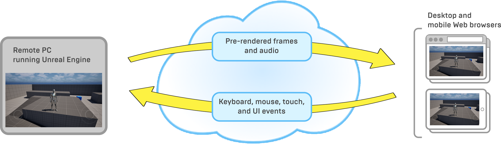
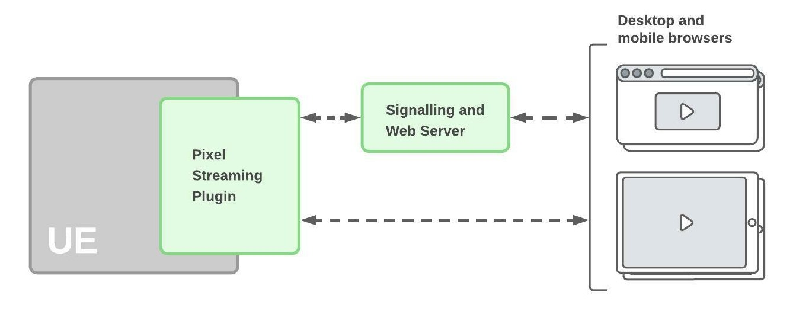

# 像素流送概述

> 路径：虚幻引擎5.7文档 / 分享和发布项目 / 像素流送 / 虚幻引擎像素流送入门指南 / 像素流送概述

> 原始页面：https://dev.epicgames.com/documentation/unreal-engine/overview-of-pixel-streaming-in-unreal-engine

无论你是为桌面平台、移动操作系统还是主机而构建游戏，玩家在体验你的虚幻引擎应用程序时，通常会在同一个设备上运行Gameplay逻辑和将游戏世界渲染到屏幕。多玩家网络游戏可能会在应用程序的多个实例之间分发Gameplay逻辑的各个部分，但每个单独的实例仍为其自己的玩家执行在本地渲染游戏世界的工作。即使你使用HTML5部署选项创建可以在Web浏览器中运行的项目版本，游戏逻辑和渲染仍在每个用户的Web浏览器中本地发生。

但是，使用像素流送时，你会在用户可能永远看不到的计算机上远程运行虚幻引擎应用程序。例如，这可能是贵组织内的某个实体台式机，或云托管服务提供的虚拟机。虚幻引擎会使用可供该计算机使用的资源（CPU、GPU、内存等）运行游戏逻辑并渲染每一帧。它会将此渲染后的输出持续编码为媒体流，该流会通过Web服务的轻量级堆栈。接着，用户可以在其他计算机和移动设备上运行的标准Web浏览器中查看该广播流。

用户的结果就像从YouTube或Netflix等服务观看视频流一样，但有两点不同：

- 流并不是播放预先录制的视频剪辑片段，而是实时播放虚幻引擎生成的渲染帧和音频。
- 用户可以从其浏览器控制体验，将键盘、鼠标和触摸事件以及从玩家网页发射的自定义事件发送回虚幻引擎。

## 优势

使用像素流送系统可带来多项可能的优势：

- 相比于其他方式，它使移动设备和轻量级Web浏览器能够显示质量更高的图形。它们可以使用强大的渲染功能显示高分辨率的复杂场景，这种效果原本仅在具备强大GPU的计算机上使用原生桌面应用程序渲染才可能实现。
- 用户不需要提前下载大型可执行文件或内容文件，并且不需要安装任何东西。用户唯一需要下载的是播放中的媒体流。
- 你可以支持多个平台，而不必创建和分发多个单独的程序包。你为Windows、Linux或Mac打包应用程序一次，用户即可使用任意平台来体验你的内容。用户可以在支持WebRTC连接模式的任意现代浏览器中查看流，包括桌面、iOS和Android平台上的谷歌浏览器和火狐浏览器。（请参阅[像素流送参考](../../unreal-engine-pixel-streaming-reference/index.md)，了解详情。）
- 像素流送系统包含的组件数量极少，任何人都可以相对轻松地在本地网络中进行设置。但是，它足够强大，有部署Web服务的经验的团队可将其用作创建自定义云托管平台的基础。
- 像素流送使用WebRTC点对点通信框架，可在用户和虚幻引擎应用程序之间实现尽可能最低的延迟。

## 架构

下图总结了简单像素流送设置的组件：

### 组件

1. **像素流送插件：** 此插件在虚幻引擎中运行。它使用视频压缩给每个渲染帧的最终结果编码，将这些视频帧与游戏音频一起打包为媒体流，并通过直接点对点连接将该流发送到一个或多个连接的浏览器。
2. **信令和Web服务器：** 信令和Web服务器负责协商浏览器和像素流送插件之间的连接，并为浏览器提供播放媒体流的HTML和JavaScript环境。

### 连接过程

1. 启动所有像素流送组件时，虚幻引擎中运行的像素流送插件会首先建立与信令和Web服务器的连接。
2. 客户端会连接到信令服务器，后者会为其提供一个HTML页面，其中包含玩家控件以及使用JavaScript编写的控制代码。
3. 用户启动流时，信令服务器会在客户端浏览器和虚幻引擎应用程序之间协商建立直接连接。

   > [!NOTE]
   > 要使此连接正常运行，浏览器和虚幻引擎应用程序需要知道彼此的IP地址。如果两者在相同网络上运行，它们通常直接在其自己的IP地址中对彼此可见。但是，两个端点之间运行的网络地址转换（NAT）服务可能会更改任一方的外部可见IP地址。要解决此问题，通常需要使用STUN或TURN服务器，它会告知每个组件其外部可见IP地址。有关详情，请参阅[托管和网络指南](../../development-guides-for-pixel-streaming/hosting-and-networking-guide-for-pixel-streaming/index.md)。
4. 客户端和虚幻引擎应用程序之间建立连接之后，像素流送插件会立即开始直接将媒体流送到浏览器。来自客户端的输入由播放器页面的JavaScript环境直接发送回虚幻引擎应用程序。
5. 即使在媒体流开始播放之后，信令和Web服务器也会维护其与浏览器和虚幻引擎应用程序的连接，这样它就能够处理浏览器引起的连接断开情况。

> [!NOTE]
> 如需关于如上所示设置架构的逐步说明，请参阅[入门](../getting-started-with-pixel-streaming/index.md)。
