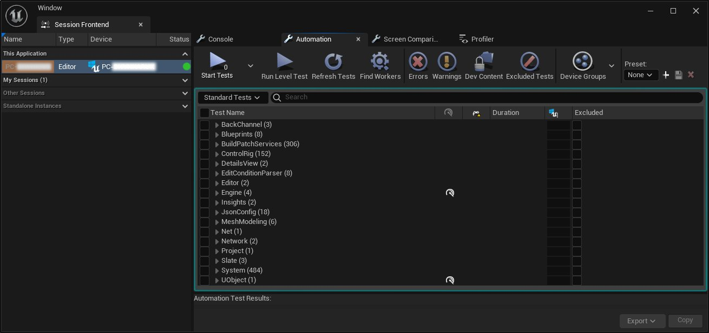
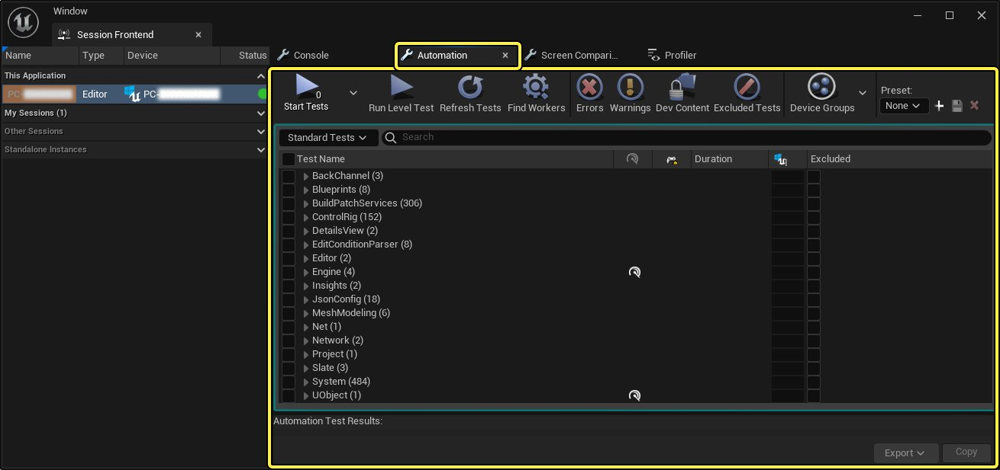
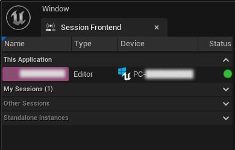
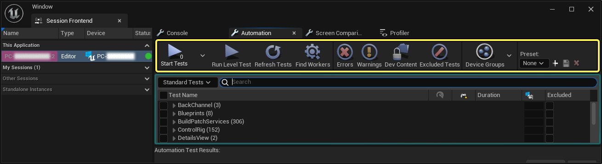
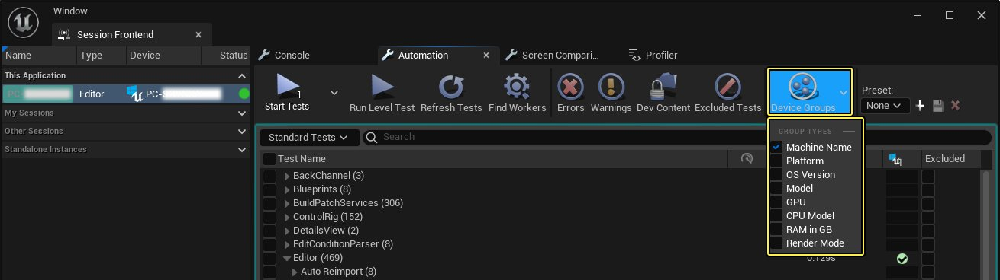
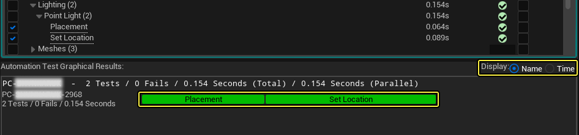
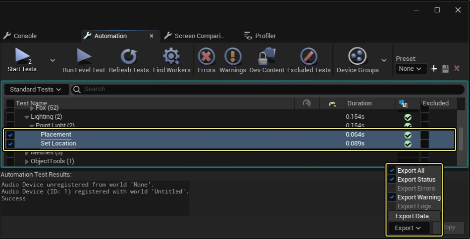

# 自动化系统用户指南

> 路径：虚幻引擎5.7文档 / 测试并优化你的内容 / 自动化系统概述 / 自动化系统用户指南

> 原始页面：https://dev.epicgames.com/documentation/unreal-engine/automation-system-user-guide-in-unreal-engine

焦点位于"自动化（Automation）"选项卡的"会话前端（Session Frontend）"窗口。

**自动化（Automation）** 选项卡位于 **虚幻引擎** 的 **虚幻（会话）前端（Unreal (Session) Frontend）** 窗口中。只要其他设备连接了你的机器，或者其他设备位于你的本地网络中，你就可以使用此选项卡在该设备上运行自动化测试。

你可通过两种方式访问前端套件：

- **会话前端（Session Frontend）** - 将本地编辑器作为自动化辅助应用程序打开，以在外部设备上运行自动化。

  - 找到

    工具（Tools）>会话前端（Session Frontend）
- **虚幻前端（Unreal Frontend）** - 打开包含 **会话前端（Session Frontend）** 、 **设备管理器（Device Manager）** 和 **项目启动程序（Project Launcher）** 的独立版前端。

  - 找到

    [虚幻引擎根目录]

    >

    Engine

    >

    Binaries

    >

    Win64

    >

    UnrealFrontend.exe

## 启动插件

在最新版本的虚幻引擎中，所有 **自动化测试** 都已从 **Engine Content** 文件夹移到了插件中，必须先启用插件才能在 **自动化（Automation）** 选项卡中看到。

| 列 1 | 列 2 |
| --- | --- |
| Open Plugins | [Enable Plugins](https://d1iv7db44yhgxn.cloudfront.net/documentation/images/cc706f9e-01e9-4f7f-8984-aa2cb90fec9a/ue5_1-02-enable-plugins.png) |
| 要启用插件，请选择 **编辑（Edit）>插件（Plugins）>测试（Testing）** 。 | 包含自动化测试的插件浏览器 |

> [!NOTE]
> 如果使用独立版 **虚幻前端（Unreal Frontend）** ，无需额外的启用步骤就可访问所有自动化测试。

## 用户界面

打开 **会话前端（Session Frontend）** 后，你可以访问 **控制台（Console）** 、 **自动化（Automation）** 、 **屏幕截图比较（Screenshot Comparison）** 和 **分析器（Profiler）** 等选项卡。为满足你的所有自动化测试需求， **自动化（Automation）** 选项卡中将包含你所需的所有功能，而且[屏幕截图比较（Screenshot Comparison）](../create-automation-tests/screenshot-comparison-tool/index.md)选项卡下还有一些的额外功能，用于提供功能对比。

点击查看大图。

> [!NOTE]
> 如果 **自动化（Automation）** 选项卡窗口中未列出内容，请从左侧的 **会话浏览器（Session Browse）** 中选择一个活动会话。例如，在 **此应用程序（This Application）** 下面，名称为 **PC-xxx** 的机器处于选中状态。

### 会话浏览器

借助 **会话浏览器（Session Browse）** ，你可以连接到编辑器的特定实例。选择会话之后，你才能在"自动化（Automation）"窗口中看到可用自动化测试。

### 工具栏

借助 **自动化（Automation）** 选项卡中的 **工具栏** ，你可以控制自动化测试如何启动、刷新以及过滤错误和警告。

点击查看大图。

| 图标 | 名称 | 说明 |
| --- | --- | --- |
| 启动测试按钮 | **启动测试（Start Tests）** | 启动或停止已启用且当前已选择的自动化测试。在此按钮下还会显示即将运行的测试数量，供你参考。 |
| 运行关卡测试按钮 | **运行关卡测试（Run Level Test）** | 如果当前加载的关卡是测试地图，你可以单击此按钮来选择测试并立即运行它。 |
| 刷新测试按钮 | **刷新测试（Refresh Tests）** | 单击此按钮可为添加到项目中的所有测试刷新测试名称列表。 |
| 寻找辅助应用程序按钮 | **寻找辅助应用程序（Find Workers）** | 单击此按钮可查找可用于执行测试的本地辅助应用程序。 |
| 错误按钮 | **错误（Errors）** | 单击此按钮可为"测试（Test）"窗口切换过滤器，以显示完成过程中所有出现错误的测试。 |
| 警告按钮 | **警告（Warnings）** | 单击此按钮可为"测试（Test）"窗口切换过滤器，以显示完成过程中所有出现警告的测试。 |
| 开发者内容按钮 | **开发者内容（Dev Content）** | 启用后，将在自动化测试中包含开发者目录。 |
| 设备组按钮 | **设备组（Device Groups）** | 可以按机器名称、平台、操作系统版本等一系列选项对测试进行分组。 |
| 被排除的测试按钮 | **被排除的测试（Excluded Tests）** | 切换是否仅显示被排除的测试。 |
| 预设值面板 | **预设值（Preset）** | 可以使用已选择的测试和设置添加你自己的自动化测试预设值，以便在以后复用。 |

### 测试窗口和结果

在 **自动化测试窗口（Automation Tests Window）** 和 **自动化测试结果（Automation Test Results）** 面板中，你可以看到已运行测试的相关信息，例如完成测试的机器、已运行测试的数量以及失败的数量等。

![Test and Result panel]](../../../../assets/images/b3/b30d6efb597998824d301027389c6eb6aa7c5c767a8e46d0267977f09da05a0c.jpg)

点击查看大图。

> [!TIP]
> 你可以使用 **设备组（Device Groups）** 按钮来确定开始运行新的自动化测试时，信息在结果面板中的分组方式。
>
> 
>
> 点击查看大图。

查看结果时，可使用 **显示（Display）** 选项显示测试的 **名称（Name）** 或完成测试花费的 **时间（Time）** 。

点击查看大图。

### 导出

测试完成后，可通过 **导出（Export）** 下拉菜单将结果导出到 **CSV** 文件中。

点击查看大图。

从可用的过滤器中选择要导出的内容，然后选择 **导出数据（Export Data）** 按钮。

> 图片已省略：导出数据按钮

导出数据后，会有弹窗表明导出是否成功以及 **CSV** 文件的保存位置。

> 图片已省略：导出数据成功消息

> [!NOTE]
> **导出（Export）** 下拉菜单仅在报告生成后才会处于活动状态，而 **导出数据（Export Data）** 按钮仅在有报告满足过滤条件时处于活动状态。

### 复制

测试完成后，你可以选择 **自动化测试结果（Automation Test Results）** 面板中显示的任意多行，单击 **复制（Copy）** 按钮，将这些行复制到剪贴板，然后粘贴到任意位置。

> 图片已省略：Copy Test result

点击查看大图。
