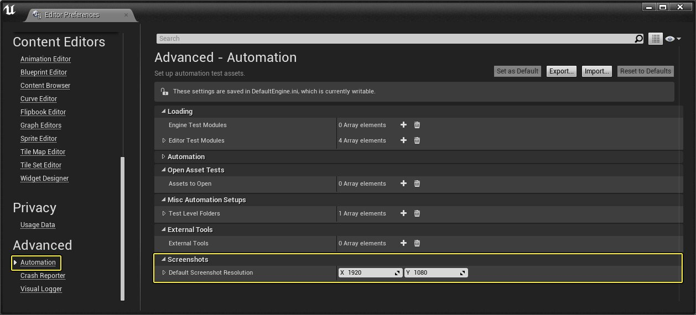
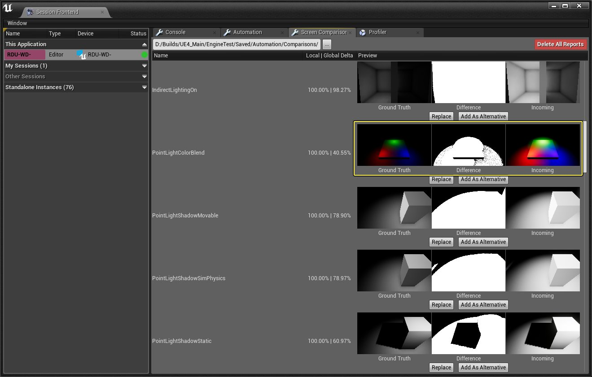
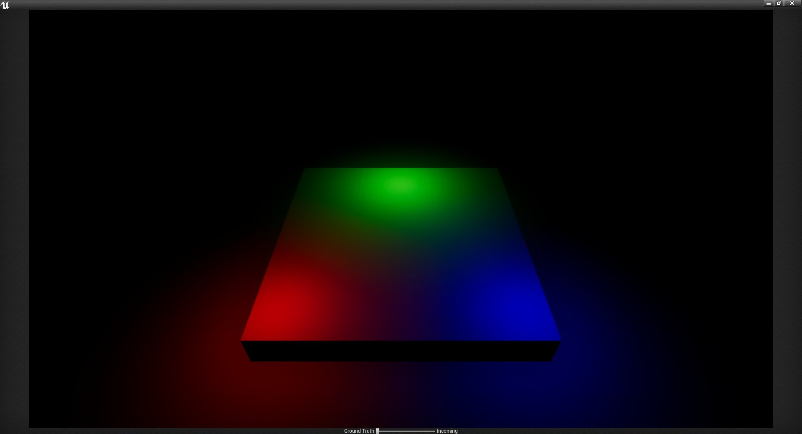
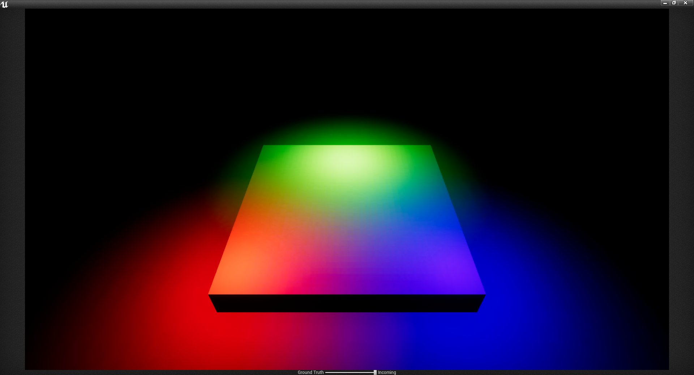
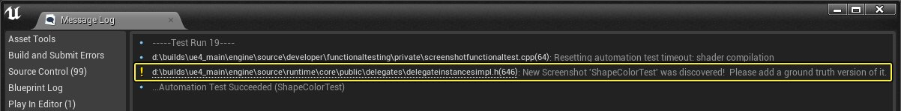
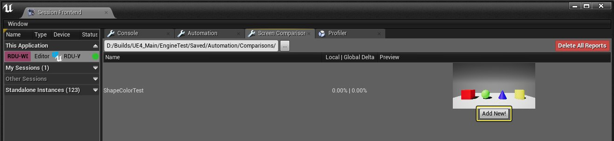
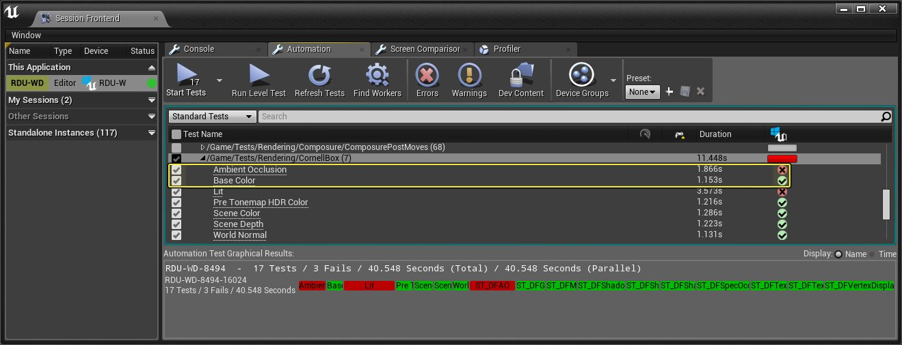
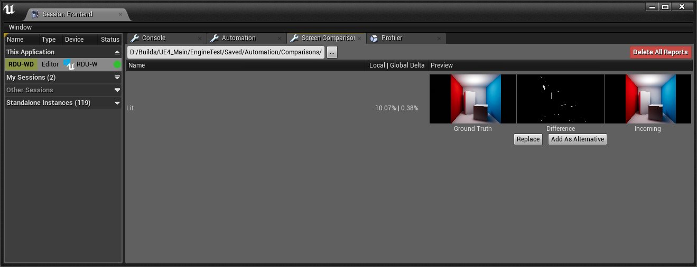

# 屏幕截图比较工具

> 路径：虚幻引擎5.7文档 / 测试并优化你的内容 / 自动化系统概述 / Create Automation Tests / 屏幕截图比较工具

> 原始页面：https://dev.epicgames.com/documentation/unreal-engine/screenshot-comparison-tool-in-unreal-engine

通过 **屏幕截图比较** 浏览器，你或你的质量保证（QA）团队可以快速比较在 **虚幻编辑器** 中截图。通过自动化测试生成的屏幕截图可以使用虚幻（会话）前端工具来查看，该工具会维护屏幕截图的历史记录，允许你识别出不同构建版本中的明显渲染错误。

来自Epic自己的自动化测试项目的填充屏幕截图测试。

## 屏幕截图捕获方法

你可以通过多种方法构造屏幕截图测试；最方便的方法是从使用屏幕截图功能Actor开始，或者在现有的功能测试中提取屏幕截图。

#### 功能测试Actor设置

**功能性屏幕截图测试（Functional Screenshot Test）** Actor 使用摄像机捕获屏幕截图，因为这样可以共享许多现有的后期处理和摄像机设置。 下面列出的设置是用于捕获你所需要的屏幕截图的功能性屏幕截图测试所特有的。

| 设置 | 说明 |
| --- | --- |
| **分辨率（Resolution）** | 需要的屏幕截图分辨率。如果不提供设置，将使用"自动化设置（Automation Settings）"中的平台设置的默认分辨率。 |
| **延迟（Delay）** | 提取屏幕截图之前的延迟。 |
| **禁用产生噪点的渲染功能（Disable Noisy Rendering Features）** | 禁用抗锯齿、动态模糊、屏幕空间反射、眼部适应（自动曝光）和接触阴影，因为如果你是要显式地寻找变化，这些功能造成的噪点会在最终渲染的图像中占很大一部分。 |
| **可视化缓冲区（Visualize Buffer）** | 允许你对非默认最终光照场景图像的缓冲区提取屏幕截图。如果你尝试针对特定的GBuffer构建测试，要判断是否引入了错误会比较困难，那么此设置很有用。 |
| **容差（Tolerance）** | 这些是容差的快速默认值。默认情况下使用"低（Low）"，因为在每个像素的颜色中始终有时空抗锯齿引入的一些差异。 零（Zero） 低（Low） 中（Medium） 高（High） 自定义（Custom） |
| **容差量（Tolerance Amount）** | 对于每个信道和亮度级别，你都可以控制一块颜色基本相同的区域。通常此设置是必要的，因为现代渲染技术为了隐藏锯齿往往会不断引入噪点。 **RGBA信道**：分别设置任何RGBA信道的数值。 **最小亮度（Min Brightness）**：可接受的最小容差亮度值。 **最大亮度（Max Brightness）**：可接受的最大容差亮度值。 |
| **最大局部误差（Maximum Local Error）** | 在你找到颜色容差变化的原因后，需要控制局部的可接受误差。根据在三角形边缘上像素的着色方式，可能有一定比例的像素超出容差级别。与最大全局误差不同，最大局部误差是通过着眼于图像的一小部分来工作的。系统将把这些数据块与局部误差比较，尝试找到会被全局误差忽略的重要更改的热点。 |
| **最大全局误差（Maximum Global Error）** | 在你找到颜色容差变化的原因后，需要控制总体的可接受误差。根据在三角形边缘上像素的着色方式，可能有一定比例的像素超出容差级别。 |
| **忽略抗锯齿（Ignore Anti-Aliasing）** | 如果启用此设置，将会根据可能发生的情况搜索相邻像素，以寻找符合预期的像素，例如像素发生微小漂移。 |
| **忽略颜色（Ignore Colors）** | 如果启用此设置，在屏幕截图测试中将仅比较场景的亮度。 |

#### 编辑器首选项

在 **编辑器首选项（Editor Preferences）** 中，可以为所有已放置的功能性屏幕截图测试Actor设置为了比较而捕获的所有屏幕截图的默认分辨率。可以 转到 **编辑（Edit）** > **编辑器首选项（Editor Preferences）** > **自动化（Automation）** > **屏幕截图（Screenshots）** 来设置此项。

点击查看大图。

> [!NOTE]
> 对个别功能性屏幕截图测试Actor设置的屏幕截图分辨率将覆盖此数值。

### 功能性屏幕截图测试Actor

**功能性屏幕截图测试** Actor是一种可以放置在关卡中的组件，用于在从虚幻前端运行的自动化测试中捕获屏幕截图。 你可以运行两种不同的屏幕截图测试：一种是捕获场景视图的普通屏幕截图，另一种用来捕获你的游戏用户界面（UI）。

要访问这些功能性屏幕截图Actor，请在 **放置Actor（Place Actors）** 面板中将其中一个拖到场景中。你可以在 **所有类（All Classes）** 选项卡中找到"功能性屏幕截图测试（Functional Screenshot Test）"和"功能性UI屏幕截图测试（Functional UIScreenshot Test）"。

|  |  |
| --- | --- |
|  |  |
| 功能性屏幕截图测试 | 功能性UI屏幕截图测试 |

### 在其他功能性测试中提取屏幕截图

除了提取独立的屏幕截图，你还可以在[功能性测试](../functional-testing/index.md)中提取屏幕截图，从而在其他脚本操作期间利用屏幕截图比较。

用于在其他功能性测试中捕获屏幕截图的蓝图示例。

有一点需要记住，你可以自定义在捕获屏幕截图时应用的[屏幕截图设置](#functionaltestactorsettings)。在 捕获Gameplay或渲染功能以进行比较时，你应该考虑将两个有用的蓝图节点设置为默认容差。

用于Gameplay和渲染的 **默认屏幕截图选项（Default Screenshot Options）** 节点可用于设置屏幕截图测试Actor的默认 **容差** 级别。在捕获Gameplay差异时，**Gameplay** 节点可用于禁用镜头和缓冲区中不一定需要的噪点。如果你是在显式地测试渲染功能，那么就应该使用 **渲染（Rendering）** 节点，否则应对关卡中放置的每一个功能性屏幕截图测试Actor实例使用默认设置。

## 屏幕截图浏览器

在屏幕截图比较浏览器中将会出现你的所有屏幕截图比较，当你引入新的比较或者屏幕截图比较失败时，也应该查看此视图。你可以在此浏览器中检查失败，并作出正确决定，例如因为功能更改的需要而更新屏幕截图，或者因为怀疑有问题而输入游戏的bug报告。

要访问屏幕截图比较浏览器，你首先需要打开虚幻（会话）前端。你可以在编辑器中选择 **窗口（Window）** > **开发者工具（Developer Tools）** > **会话前端（Session Frontend）** 来执行此操作。

屏幕截图比较浏览器来自Epic关于自动化测试的内部测试项目。

捕获的屏幕截图将保存在项目的 **Saved** > **Automation** > **Comparisons** 文件夹中。如有必要，你可以使用文本框输入你自己的保存位置。

运行几次测试之后，你就会有自己的填充图像用于比较。如果你已连接到源代码控制，此时你可以访问几个关于要对这些图像进行的操作的选项。 如果你没有连接到任何形式的源代码控制，这些对话框将被禁用。

|  |  |
| --- | --- |
|  |  |
| 添加 | 替换/作为备选项添加 |

| 操作 | 描述 |
| --- | --- |
| **添加（Add）** | 将屏幕截图添加到基准文件夹，并将它添加到源代码控制中的待定更改列表。 |
| **替换（Replace）** | 删除所有基准数据示例，替换为最新的屏幕截图，作为新的基准数据。 |
| **作为备选项添加（Add As Alternative）** | 偶尔会出现两幅图像都正确的情况。这可能是因为硬件或驱动程序的细小差异，甚至可能是因为硬件所支持的扩展。由于我们仅根据 Platform_RHI_ShaderModel 存储屏幕截图，有可能需要进一步的微调。此时 **作为备选项添加（Add As Alternative）** 就可发挥作用。它添加图像的另一个基准版本，系统在比较图像时，始终会根据元数据挑选最接近的基准屏幕截图。如果屏幕截图来自完全相同的设备，此选项将会灰显。 |

> [!TIP]
> 在运行一组新的测试之前，一定要使用 **删除所有报告（Delete All Reports）**。因为该工具会随着时间推移累积报告，它也没有自动清除来自应用程序中先前运行的报告的功能。所以进行此操作可以确保你在运行接下来的测试前拥有干净的记录。

### 基准截图

屏幕截图的 **基准** 版本是你知道正确的版本。为了进行屏幕截图比较，系统将把基准屏幕截图与 后来提取的所有屏幕截图进行对比。如果最新的屏幕截图与其不符，就会造成测试失败。

在你第一次运行屏幕截图自动化测试时，在消息日志和屏幕截图浏览器中将会出现警告信息，表明你需要将新提取的屏幕截图作为基准图像添加。

|  |  |
| --- | --- |
| [undefined](https://d1iv7db44yhgxn.cloudfront.net/documentation/images/c770e606-2ab5-4c85-8fd5-dff5a1572869/messagelog_addnew.png) 点击查看大图 | [undefined](https://d1iv7db44yhgxn.cloudfront.net/documentation/images/de987bc8-44cf-435b-86ac-fc66f7f877d5/warning_addnew.png) 点击查看大图 |
| 消息日志警告 | 屏幕截图浏览器警告 |

在"屏幕截图浏览器（Screenshot Browser）"选项卡中，单击 **添加（Add New）** 按钮，创建用于提交基准图像的更改列表。

> [!NOTE]
> 如果你的 **添加（Add New）** 按钮灰显，请确保连接到源代码控制来启用它。

## 屏幕截图比较视图

在屏幕截图比较浏览器中，如果你单击任何图像，将会打开一个窗口，可用来在基准图像和传入图像之间混合。这样就可以更方便地在相互对比中看出所有差异。

这里的三个图像（从左到右）如下所示：

- 基准（Ground Truth）

  是你知道正确的图像。
- 差异（Difference）

  是用于比较滑块的两个图像之间的差异。
- 传入（Incoming）

  是在运行自动化测试之后最新捕获的屏幕截图。

点击查看大图。

单击这三个图像中的任何一个都可打开比较滑块窗口。你在该屏幕中可以拖动基准屏幕截图和传入屏幕截图之间的滑块进行比较。

基准

新屏幕截图

在此示例中，已知正确的基准图像和最新运行的自动化测试所捕获的传入屏幕截图之间有明显差异。

## 屏幕截图工作流

1. 你首先要选择你希望用于提取屏幕截图的方法：

   - 屏幕截图功能性测试Actor
   - 在其他功能性测试中提取屏幕截图
2. 如果你本地运行测试，或者在构建Farm上运行，将收到一条警告，表明你需要批准第一幅屏幕截图。

   

   点击查看大图。

   在 **屏幕截图浏览器** 中，你要单击 **添加（Add New）** 将它作为基准图像添加。

   

   点击查看大图。

   > [!NOTE]
   > 对于其他平台，构建Farm可以负责初始屏幕截图，而你可以远程批准在这些平台上提取的屏幕截图，方法是就在屏幕截图浏览器中提供网络路径，它就显示在自动化报告的顶端。
3. 下次运行 **屏幕截图比较** 测试时，应该就会得到屏幕截图通过或未通过测试的结果。用屏幕截图浏览器来选择屏幕截图测试并比较差异。

点击查看大图。

如果测试失败，将会自动在"屏幕截图浏览器（Screenshot Browser）"选项卡中显示供比较，这样你就可以选择 **替换（Replace）** 或 **作为备选项添加（Add As Alternative）** 到基准图像。

点击查看大图。

> [!NOTE]
> 如果你使用[源代码控制](../../../../understanding-the-basics/source-control/index.md)，屏幕截图浏览器会将它们添加到待定更改列表，这样你就能在测试完成后检入这些图像。
