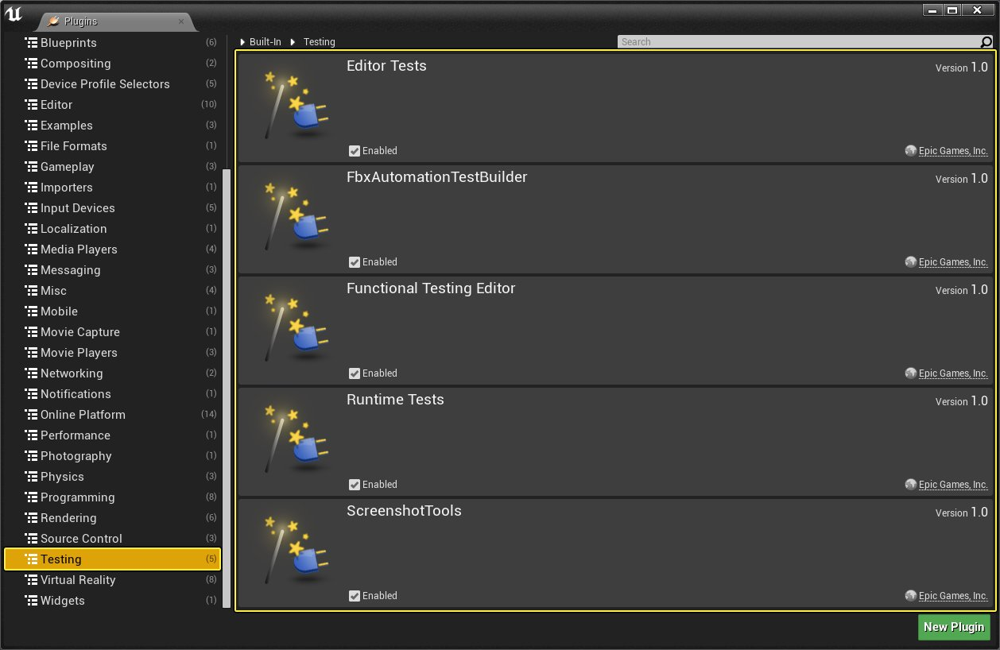
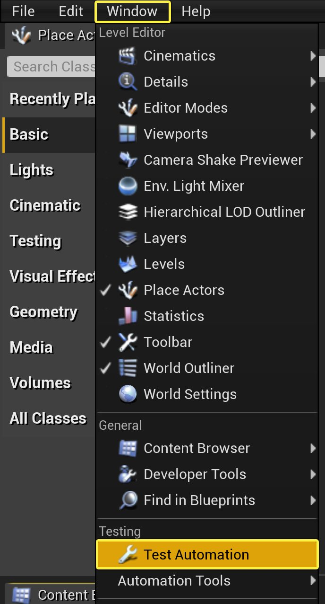
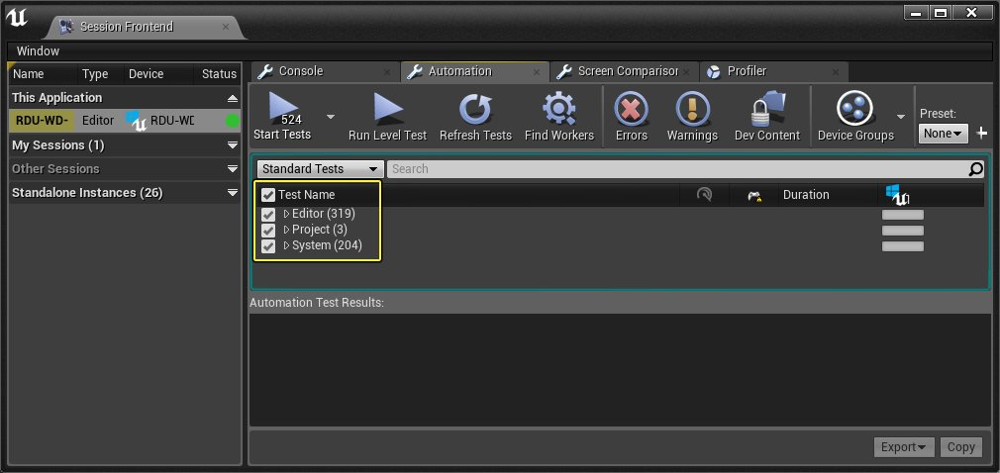
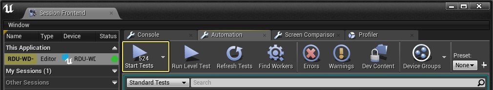
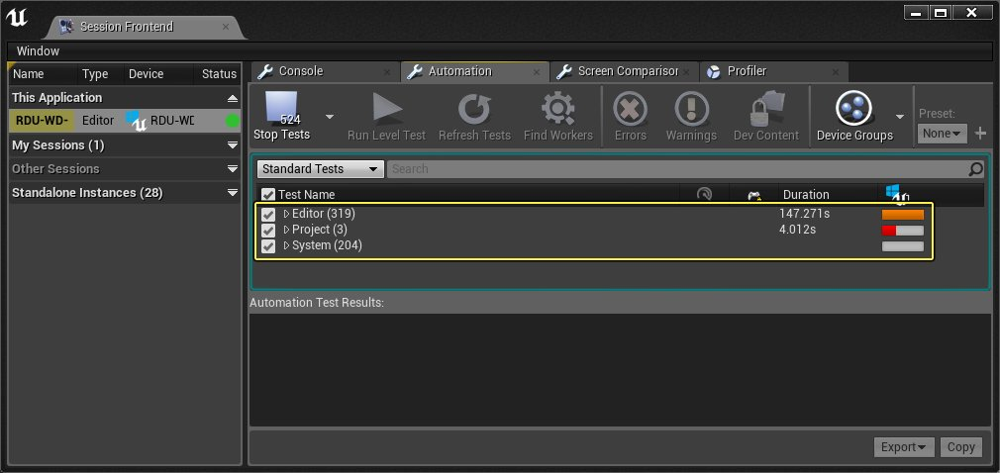

# 自动化系统概述

> 路径：虚幻引擎5.7文档 / 测试并优化你的内容 / 自动化系统概述

> 原始页面：https://dev.epicgames.com/documentation/unreal-engine/automation-test-framework-in-unreal-engine

**自动化系统** 是基于 **功能测试框架** 而构建的，其设计目的是执行一个或多个自动化测试来执行Gameplay关卡测试。编写的大多数测试都是功能测试、低级核心或编辑器测试，这些都是使用自动化框架系统所必需的测试。编写的这些测试可以根据用途或功能划分为以下类别：

| 测试类型 | 说明 |
| --- | --- |
| **单元** | API级别验证测试。请参阅 **TimespanTest.cpp** 或 **DateTimeTest.cpp** 以了解相关示例。 |
| **功能** | 系统层面的测试，验证诸如PIE、游戏内数据和修改分辨率等功能。请参阅 `EditorAutomationTests.cpp` 或 `EngineAutomationTests.cpp` 以了解相关示例。 |
| **冒烟（Smoke）** | 冒烟测试只是实施者的速度承诺。它们的初衷就是尽量快速，因此可以在编辑器、游戏或commandlet_每次_启动时运行。它们也是[UI](automation-system-user-guide/index.md#userinterface)中的默认选项。所有冒烟测试都应在1秒钟内完成。仅将单元测试或快速功能测试标记为冒烟测试。 |
| **内容压力** | 为了避免崩溃而对特定系统的更详尽测试，例如，加载所有贴图，或加载并编译所有蓝图。请参阅 `EditorAutomationTests.cpp` 或 `EngineAutomationTests.cpp` 以了解相关示例。 |
| **截屏比较** | 这允许执行QA测试，快速比较截屏以识别不同版本之间的潜在渲染问题。 |

## 自动化测试已移至插件

长期以来，自动化测试分布于 **虚幻引擎** 和 **编辑器** 的多个位置，意味着您在交付作品时也会包含这些测试。现在，这些测试已经移到自己的插件，可以单独启用。这也表示，由于这些测试位于插件中，您可以在编译时选择将它们包含在封装版本中。插件还可以存储内容，这样就不必保存在引擎内容文件夹中。

由于这一更改，所创建的测试类型将指示应存放在哪里。下表提供了各种测试类型以及它应该与哪个插件一起保存：

| 测试类型 | 用来存储的插件 |
| --- | --- |
| **单元** | 这些可以继续存储在与代码相同的模块中。 |
| **项目不确定性运行时测试** | `RuntimeTests` 插件 |
| **项目不确定性编辑器测试** | `EditorTests` 插件 |
| **功能测试** | `EngineTest` 游戏文件夹 |

> [!NOTE]
> 部分测试仍在引擎中，尚未移到插件。这些测试将陆续移到 **插件浏览器（Plugin Browser）** 中相应的插件， 迁移后会列示在 **测试（Testing）** 部分中。

### 启用自动化测试插件

要为不同的可用测试启用插件，转至文件菜单，选择 **窗口（Window）** >**插件（Plugins）** 以打开 **插件浏览器** （Plugin Browser）窗口。

在左面板中，选择 **测试（Testing）** 类别，启用想要使用的测试插件。

单击查看大图。

选择完成后，系统将提示重新启动编辑器。单击 **立即重启（Restart Now）** 按钮。

## 测试设计准则

在测试游戏或项目时，请参考 **Epic** 在自动化测试时遵循的一些通用准则：

- 不假设游戏或编辑器的状态。测试可以在各机器中无序或并行运行。
- 让磁盘上的文件保持原状态，不要改动。如果测试生成了文件，则在测试完成时将它删除。
- 假设上一次运行测试结束后，测试状态不佳。一种比较好的做法是先生成文件以尝试删除它们，然后再开始测试。

## 运行自动化测试

1. 打开任意项目。
2. 启用可用于测试的[插件](#enablingautomationtestplugins)并重新启动编辑器。
3. 在编辑器中，转至 **窗口（Window）** >**测试自动化（Test Automation）**。

   

   单击查看大图。

   > [!NOTE]
   > 为了显示该菜单中的选项，首先必须至少启用一个[自动化测试插件](#enablingautomationtestplugins)。
4. 在"会话前端"（Sessions Frontend）"自动化"（Automation）选项卡的 **测试名称（Test Name）** 列中，启用以下各项：

   

   单击查看大图。

   - 编辑器（Editor）
   - 项目（Project）
   - 系统（System）
5. 在"自动化"（Automation）选项卡工具栏中，单击 **开始测试（Start Tests）** 按钮。

   

   单击查看大图。

   测试完成过程中，您可以在"测试名称"（Test Name）窗口中关注进度。

   

   单击查看大图。

## 基础

**自动化系统** 提供了使用 **虚幻消息总线** 的功能执行单元测试、功能测试和内容压力测试的能力，以提高稳定性。

- [设置自动化测试报告服务器](setting-up-an-automation-test-report-server/index.md) - 设置自动化测试报告服务器的说明。

- [Gauntlet自动化框架](gauntlet-automation-framework/index.md) - 在虚幻引擎中运行项目会话的框架，可执行测试并验证结果。

- [自动化系统用户指南](automation-system-user-guide/index.md) - 使用自动化系统运行测试的指南。
