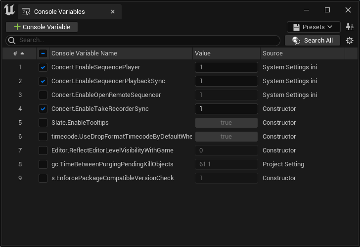
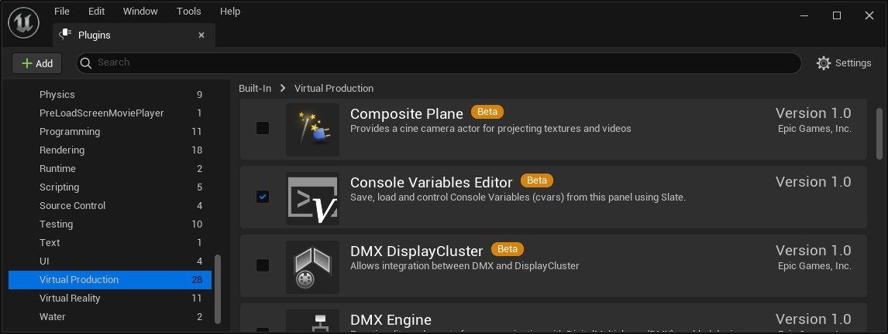
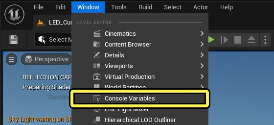
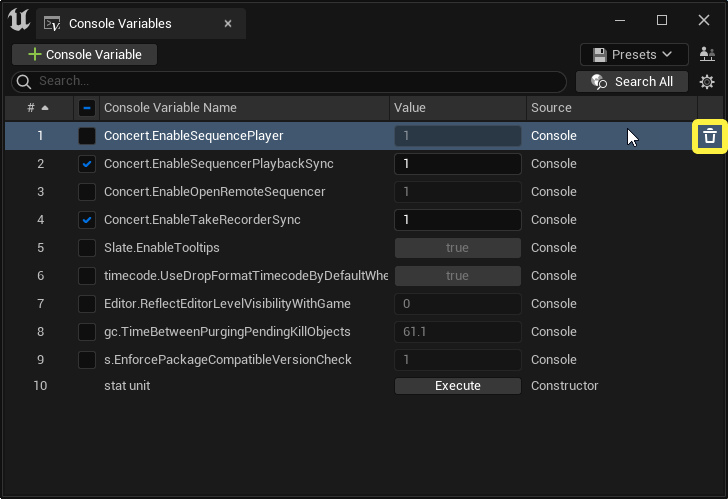
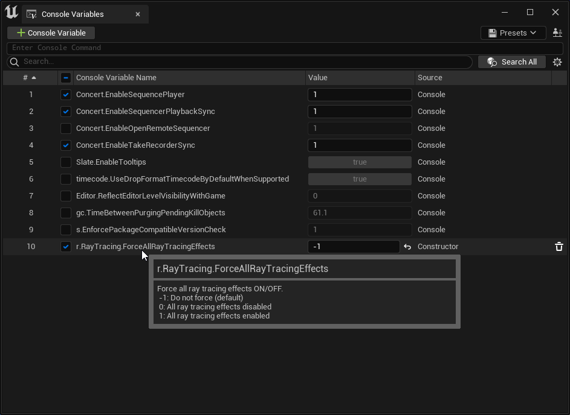
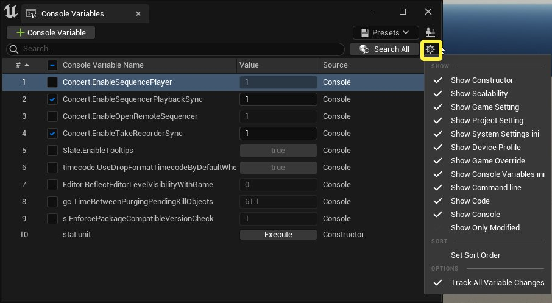
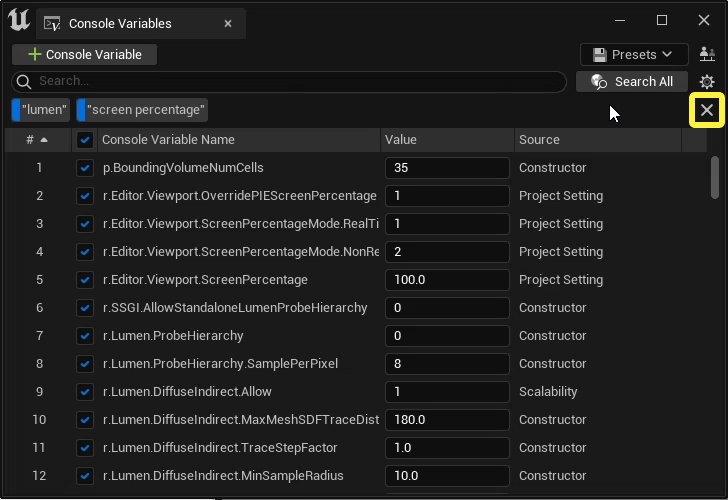
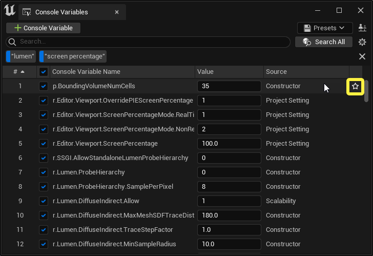

# 控制台变量编辑器

> 路径：虚幻引擎5.7文档 / 测试并优化你的内容 / 控制台变量编辑器

> 原始页面：https://dev.epicgames.com/documentation/unreal-engine/console-variables-editor

**控制台变量编辑器（Console Variables Editor）** 面板显示项目中的所有控制台变量，同时也可以查看和修改这些变量。你可以创建预设来将同样的控制台变量应用到其他项目。控制台变量编辑器也可以使用[多用户](../../production-pipeline/multi-user-editing/index.md)会话来跨越多台电脑操作变量。

控制台变量编辑器插件带有蓝图API用于访问并操作控制台变量编辑器创建的控制台变量预设。更多信息请参阅[蓝图API参考](https://docs.unrealengine.com/5.0/BlueprintAPI/ConsoleVariablesEditor)

要使用控制台变量编辑器，需要在你的项目中启用 **控制台变量编辑器（Console Variables Editor）** 。 如何在项目中启用插件，参阅[使用插件](../../understanding-the-basics/foundational-knowledge-in/working-with-plugins/index.md)

在主菜单中，选择 **窗口（Window） > 控制台变量（Console Variables）** 来打开控制台变量编辑器。你可以将打开的窗口贴靠在虚幻引擎任何地方。

## 控制台变量列表

该列表显示所有正在使用的控制台变量和已经执行过的指令。当你第一次打开控制台变量编辑器的时候，列表中将会加载一个不包括任何变量的空白预设。如果插件设置中 **向当前预设添加所有更改过的控制台变量（Add All Changed Console Variables to Current Preset）** 被选为 **是（True）**，该列表里也会显示一些在项目设置中添加的变量。

要向列表中添加控制台变量和指令，点击 **（+）添加控制台变量（Add Console Variable）** ，然后在输入框中搜索指令或者变量。在你输入文本的时候，输入框下方会自动建议匹配的控制台变量名称，但是诸如'stat unit'之类的控制台指令不会在建议中出现。

如果你输入的控制台变量是有效的，它将会出现在列表中。如果你连同有效的值一同输入控制台变量或指令，该指令会直接用这个值开始运行，而控制台变量会带着新赋予的值出现在列表中。

当你向列表中添加一个变量，当前值便会保存为 **预设值（Preset Value）** 。每一个变量都可以重置为它的初始值，或者通过取消选择它所在行的复选框临时撤回更改。

要移除一个控制台变量，将光标移至其所在行的右侧并点击 **移除（Remove）**。将变量从列表中移除后，其数值会被重置到插件加载时的数值。

将光标移至控制台变量，可以看到相关具体描述和数值含义的提示文本。

控制台变量列表的每一行都包含一组如下排列的表格。你可以通过点击对应的标题按照 **序号（Sort Order Number）**、**控制台变量名称（Console Variable Name）** 和 **源（Source）** 对变量重新排序。

| Column | 说明 |
| --- | --- |
| 序号（Sort Order Number） | 控制台变量在列表中的排序。你可以通过拖拽不同行来改变它们的排序。 如果你通过另一列来排序，你可以点击设置序号（Set Sort Order）来使列表中的排序相匹配。更多信息请参阅[显示选项](#showoptions)。 |
| 复选框（Checkbox） | 取消勾选复选框可以让你临时取消对这一行控制台变量的修改。取消选择后，变量会被重置到插件启动加载时的数值。 当你重新勾选这一行时，变量的数值又会回到取消勾选前的最后数值。没有勾选时对该行变量做出的修改在勾选后并不会体现出来。 当前只有控制台变量可以勾选和取消勾选。 |
| 控制台变量名称（Console Variable Name） | 显示控制台变量的名称。将光标移至名称，若该控制台变量有提示文本，文本便会出现。 |
| 数值（Value） | 与变量或者指令类型相匹配的可编辑的区域。 更改数值区时，控制台指令或者对变量的更改会直接执行。如果多用户启用，其他用户的设备上也会体现出这些变动。 将光标移至数值上时会显示以下数值： 自定义值（Custom Value） 预设值（Preset Value） 初始值（Startup Value） 如果当前数值与预设值不同，数值控件旁会出现重置数值的选项。点击 **重置（Reset）** ，变量便会重置到预设值。 |
| 源（Source） | 描述该变量最近一次是如何被定义的。如果最后一次修改时使用的是控制台变量编辑器，这一列就会显示控制台（Console）。 |

## 显示选项

点击 **显示选项（Show Options）** 来自定义列表中显示哪些行。每个选项的详情如下表。

| 选项 | 描述 |
| --- | --- |
| Show |  |
| 显示构造函数（Show Constructor） | 启用后，在一个引擎类启动并设定了控制台变量的情况下，显示由默认构造函数所设置的控制台变量。 |
| 显示可扩展性（Show Scalability） | 启用后，显示由可扩展性选项设定的控制台变量。 |
| 显示游戏设置（Show Game Setting） | 启用后，显示由'UGameUserSettings(config=GameUserSettings)'设定的控制台变量。 |
| 显示项目设置（Show Project Setting） | 启用后，显示由项目设置所设定的控制台变量。 |
| 显示系统设置文件（Show System Settings ini） | 启用后，显示由系统ini设置文件设定的控制台变量。 |
| 显示设备配置（Show Device Profile） | 启用后，显示由设备配置文件设定的控制台变量。 |
| 显示游戏覆盖（Show Game Override） | 启用后，显示由游戏中覆盖设定的控制台变量，比如一个需要特定数值才能正确运行的平台。 |
| 显示控制台变量设置文件（Show Console Variables ini） | 启用后，显示由'Engine/Config/ConsoleVariables.ini'设置文件中启动部分设定的控制台变量。 |
| 显示指令行（Show Command line） | 启用后，显示由命令行参数设定的控制台变量。 |
| 显示代码（Show Code） | 启用后，显示由构造函数以外的源代码设定的控制台变量，通常来自一个插件。 |
| 显示控制台（Show Console） | 启用后，显示由你使用蓝图、CMD输入、控制台变量编辑器所设定的控制台变量。 |
| 只显示修改（Show Only Modified） | 启用后，显示当前与预设值不同的控制台变量。 |
| Sort |  |
| 设定排序（Set Sort Order） | 选用后，当前列表的控制台变量排序会被保存。 |
| Options |  |
| 追踪所有变量修改（Track All Variable Changes） | 该选项与插件设置中的添加所有修改过的控制台变量至当前预设（Add All Changed Console Variables to Current Preset）相同。 |

## 搜索

搜索分为预设搜索和全局搜索。你输入的任何文本都会变成搜索关键字。'|' 符号可以将关键字用OR分割，空格将关键字用AND合并。

举个例子，输入"lumen|screen percentage"，便会匹配"lumen"或者"screen percentage"关键字。搜索结果会包括含有"lumen"的结果，也会包括同时含有"screen"和"percentage"的结果。

### 预设搜索

搜索时会默认进行预设搜索。预设中 **名称（Name）**、**源（Source）** 或者提示文本不匹配搜索关键字的控制台变量都不会被显示。

### 全局搜索

输入搜索文本后点击 **搜索全部（Search All）** 便会启用全局搜索。虚幻引擎中所有 **名称（Name）** 匹配搜索关键字的控制台变量都会出现在搜索结果中。输入的搜索关键字会出现在搜索框下方。所有匹配的变量都会以行的形式罗列出来，并且可以像在预设中一样进行操作。

点击搜索关键字可以切换是否匹配这个关键字。

**右键** 或者 **Ctrl+左键**点击可以移除单个的搜索关键字。

点击 **移除（Remove）** 会移除全部搜索关键字并返回至预设搜索。

将光标移至控制台变量所在行并点击 **添加CVAR（Add CVAR）**，将会将搜索结果中的变量添加至你的预设。如果你启用了追踪所有变量修改（Track All Variable Changes），在这里修改的变量也会自动添加到当前的预设中。

## 预设

**预设（Presets）** 面板用于保存和加载预设。加载预设时，当前列表中的所有变量都会被清空，但是数值不受影响。新加载进来的变量会保持它们在预设中的数值，除非其所在行的复选框被取消勾选。

> 图片已省略：预设面板

## 多用户

如果你的项目中启用了多用户插件，控制台变量编辑器中会显示多用户选项。你可以将变量修改和指令调用传递至组里的其他用户。

点击多用户控制（Multi-User Controls），多用户相关的设置会出现在控制台变量编辑器下方。在这里可以对组里的每一个用户选择是否进行控制台变量同步。

> 图片已省略：显示多用户选项

## 插件设置

插件设置位于 **项目设置（Project Settings）> 插件（Plugins）** 。其下的 **控制台变量编辑器（Console Variables Editor）** 选项可以用于自定义编辑器的运作和显示。下表描述所有插件设置。

> 图片已省略：控制台变量编辑器插件设置

| 设置 | 描述 |
| --- | --- |
| 未勾选行显示类型（Unchecked Row Display Type） | 判定未勾选行的数值如何显示。未勾选行有以下几种显示方式： 显示当前值（Show Current Value） 显示上一个输入值（Show Last Entered Value） |
| 向当前预设添加所有更改过的控制台变量（Add All Changed Console Variables to Current Preset） | 启用后，在编辑器之外修改过的控制台变量也会被添加到列表中。该方式只适用于控制台变量，编辑器以外输入的控制台指令不会被添加到列表中。 |
| 更改过的控制台变量略过清单（Changed Console Variable Skip List） | 向当前预设添加所有更改过的控制台变量（Add All Changed Console Variables to Current Preset）选项启用时，该清单里的控制台变量不受这个选项影响。如果在编辑器以外被修改，它们不会像正常变量一样被添加到编辑器的列表里。 |
