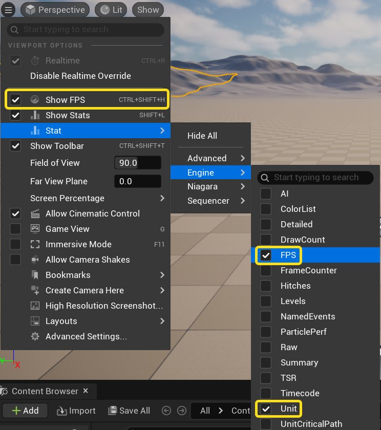
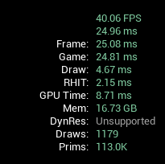
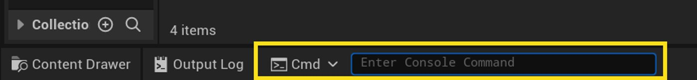
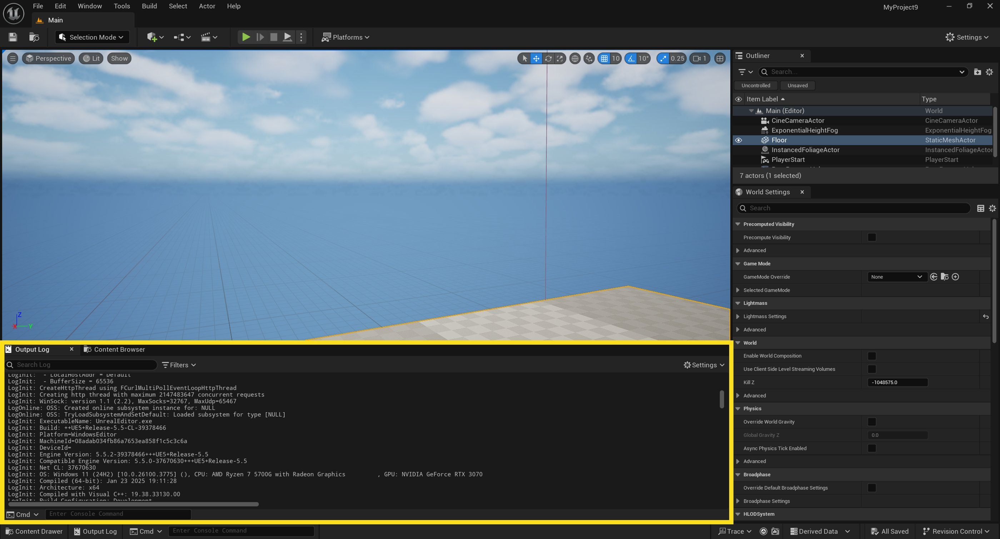

# 性能分析与配置简介

> 路径：虚幻引擎5.7文档 / 测试并优化你的内容 / 性能分析与配置简介

> 原始页面：https://dev.epicgames.com/documentation/unreal-engine/introduction-to-performance-profiling-and-configuration-in-unreal-engine

*性能*描述了项目在目标硬件上运行的流畅程度。 虚幻引擎通过在屏幕上重复绘制或*渲染*游戏世界的图像来模拟实时效果。 就像图像序列视图一样，引擎会快速连续地显示帧，从而产生动态效果。 帧的渲染性能可以用多种方式衡量：即按*每秒帧数*和按*帧时间*。 这些衡量方式可以帮助你了解应用程序的性能，以达到每秒一定帧数的目标，并了解这些帧所花费的时间（以毫秒为单位）。

在一秒钟内渲染的帧越多，用户看到的动作就越流畅，应用程序的响应速度也就越快。 一般来说，在考虑性能预算和目标硬件时，应用程序会以每秒30、60和120帧为目标。 为提供最佳的用户体验，你会希望帧率能尽可能高，但同时也希望帧率能保持稳定。 本文档将介绍关于渲染性能考虑因素的入门知识，同时也会介绍用于分析和管理虚幻引擎应用程序渲染性能的几种工具。

## 理解性能

虚幻引擎中的许多逻辑都取决于两件事：

- 当前帧中正在发生什么
- 距离上一帧过去了多久的时间

举几个例子，当帧渲染时，可能会发生以下情况：

- 用户可能会移动角色或载具。
- 用户可能会与对象互动。
- AI控制的实体可能会移动或执行各种动作。
- 用户看到的UI可能发生变化。
- 屏幕上的对象可能会在动画中向前移动，也可能会将多个动画混合在一起。
- 物理模拟系统可能会改变物理对象的位置或旋转。

所有这些操作都会给计算机在绘制每一帧画面时带来额外工作量。 此外，你还可以使用各种渲染设置来增加或减少绘制每帧画面的复杂程度。 以下是一些可用的调整项：

- 增加对象和纹理的细节，这将使计算机花费更长时间计算每个相关像素的最终颜色。
- 添加后期处理特效，这将在各种渲染阶段给图像带来额外的运行通道。
- 使用保真度更高的光照和着色，这将使场景看起来更逼真，但也会使光照计算更复杂。

应用程序每帧要做的事情越多，渲染每一帧所需的时间就越长。 如果渲染帧所需的时间过长，整体帧率就会降低，使应用程序看起来不那么流畅，响应也不那么灵敏。

### 测量每秒帧数和帧时间

要记录**每秒帧数**和**帧时间**，可以让视口显示下图中的度量项。 转到视口的汉堡菜单，启用**显示FPS（Show FPS）**，点击**统计（Stat）** > **引擎（Engine）**，然后勾选**FPS**和**单位（Unit）**。





### 硬件限制和帧率下降

单帧中的处理过多会导致帧率下降，这通常是因为每次在屏幕上绘制帧时都会发生重复的操作。 你可以把正在渲染的帧想象成一列火车，你安排火车离开车站，几毫秒后将有另一列火车紧随其后。 但所有已购票的乘客都必须上车，这列火车才能离站。 在这一帧中，你所做的每一项操作（无论是Gameplay还是渲染逻辑）都像是一位必须上车的乘客。

单帧中处理时间过长的情况，就如同火车不发车一样，因为你要让太多乘客上车，而他们还没有全部上车。 这就会导致下一列火车无法进站。 屏幕上的结果就是*帧率下降*。 帧率下降可能在短暂地出现，导致屏幕在某一帧停留过久，从而出现明显的*卡顿*；帧率下降也可能在每一帧上持续发生，导致整体帧率偏低。

下列任意一种计算资源都可能造成性能瓶颈：

- **CPU**：在单帧中，计算机的中央处理器（CPU）在一个或多个线程上执行了过多操作。 这表明应用程序的UI、Gameplay逻辑或其他核心逻辑的运行效率低下，或者单帧中执行了太多此类操作。
- **GPU**：计算机的图形处理器（GPU）在单帧中执行了过多的操作。 这表明游戏的渲染或后期处理的运行效率低下，或GPU要执行的操作过多，导致无法跟进。

- **内存大小（RAM）**：计算机的随机存取内存（RAM）已满，在清空之前无法完成操作。 这往往会导致内存不足异常和崩溃，而不是性能卡顿问题。 部分系统（如垃圾回收或资产流送）是弹性的，会动态延迟清理工作。 当RAM已满时，这类系统必须更频繁地执行清理和重新填充操作，从而增加CPU的负载。
- **内存速度（RAM）**：CPU以小块数据进行操作，而这些数据在物理上会被分配到不同的核心位置上，并按需与内存交换这些数据块。 这些操作发生的速度可能比CPU和RAM之间的数据块交换要快得多（例如，在加载一段新数据的时间内，CPU可以对加载的数据进行20次操作）。 RAM速度越慢，逻辑在需要交互的连续内存块之间切换的频率越高，CPU核心在等待内存总线时处于空闲状态的时间就越长。
- **GPU内存（VRAM）**：GPU内存已满，在清空之前无法完成操作。 这通常是纹理内存超载造成的，因为纹理会占用大量空间。
- **硬盘访问**：对象必须先从硬盘或其他存储设备中加载，然后才能被添加到内存中。 频繁访问存储设备会妨碍操作的完成。
- **网络带宽**： 计算机的网络连接速度慢或不稳定，导致每帧需要花费更多的CPU资源来拼凑或重新发送可靠的数据包，这些工作本可以分散在多个帧中完成，现在却集中爆发处理，即使本地性能不存在瓶颈，也会导致视觉效果不流畅。

### 受CPU限制vs. 受GPU限制

我们根据应用程序的性能表现情况将其分为受CPU限制和受GPU限制两类，具体取决于哪一边的性能余量更少。 如果CPU更有可能造成瓶颈，那应用程序就是*受CPU限制*。 如果GPU更有可能造成瓶颈，那应用程序就是*受GPU限制*。 如果你打开了垂直同步，并且CPU和GPU生成帧的速度都比显示器显示帧的速度快，那么你的应用程序就属于*受显示器限制*。 这通常取决于你的目标平台及其资源。

### 处理峰值

处理*峰值*是指CPU或GPU在一帧中花费的时间突然短暂增加的情况。

### 高开销vs. 低开销操作

一般来说，*高开销*操作在执行时需要相对较多的计算资源。 这可能意味着需要更多的处理时间或内存。 *低开销*操作则不需要大量计算资源。 以上术语通常用于比较执行类似操作的进程。

### 实时应用程序中的内存

你可以处理或渲染的所有内容都存在于你的应用程序的内存中，但有些内容除外，如Nanite中的虚拟几何体，它会直接从固态硬盘（SSD）中流出。 简单理解就是，如果你能在屏幕上看到并移动某个对象，那么它的副本就存在于你的计算机内存中，而对象的渲染资源（如纹理、着色器和网格体等）则存在于GPU内存中。

### 性能和功耗

功耗因硬件架构而异，但一般来说，运行更重的处理负载和每秒渲染更多帧数都会导致功耗增加。 对于移动端和HMI设置而言，设备功耗都是一个重大问题，因此你必须尽量让应用程序尽可能高效地运行。 游戏对手机电池的消耗速度越快，玩家就越有可能给出负面评价。 此外，消耗过多电力导致手机发热也会激活温度调节机制，迫使CPU运行变慢，直到手机再次冷却。

## 分析工具

分析是指分析应用程序对系统资源的使用，例如CPU或GPU进程、内存占用或网络带宽。 虚幻引擎提供了多套分析工具：

|  |  |
| --- | --- |
| 工具 | 说明 |
| Unreal Insights | 逐帧记录并审查性能数据。 |
| Stat命令 | 在屏幕上显示性能统计数据。 |

> [!NOTE]
> 如需详细了解如何为Android设备使用Unreal Insights，请参阅 [Android设备上的Unreal Insights](../../mobile-development/debugging-and-optimization-for-mobile/optimization-guides-for-android/how-to-use-unreal-insights-to-profile-android-games/index.md) 页面。

你也可以使用第三方工具进行分析，包括：

|  |  |
| --- | --- |
| 工具 | 说明 |
| [RenderDoc](../../designing-visuals-rendering-and-graphics/optimizing-and-debugging-projects-for-realtime-rendering/using-renderdoc/index.md) | 调试应用程序图形的单帧捕获内容。 |
| [Perfetto](https://perfetto.dev/) | 创建完整的系统描述和进程追踪数据。 |

请记住，分析行为本身也会占用游戏所用的CPU、内存和磁盘资源。 在连接分析程序的情况下运行游戏会小幅影响性能。 不过这也算是一件好事，因为在这种情况下，从表面上看你达到了性能目标，而实际上你已经超过了目标，从而为游戏预留了部分冗余资源，当遇到不可预见的系统波动时，这些冗余资源就能够确保游戏保持既定运行状态。

### Unreal Insights

[Unreal Insights](../../mobile-development/debugging-and-optimization-for-mobile/optimization-guides-for-android/how-to-use-unreal-insights-to-profile-android-games/index.md)是虚幻引擎提供的一套强大分析工具，可用于分析单个线程、内存占用和网络带宽。 你可以查看CPU或GPU上每项单独操作需要消耗的毫秒数、在Memory Insights中查看分配了多少内存，以及在Network Insights中查看遥测和数据包数据的明细。 Unreal Insights还提供了专门的模式，用于分析任务图表、上下文切换和Slate UI元素，可以帮助你深入分析应用程序的性能。

### Stat命令

**Stat**是指一系列控制台命令。你可以在运行中的虚幻引擎应用程序中使用这些命令，并将统计数据输出到屏幕上。 Stat命令适用于各种操作和系统，包括但不限于：

- 内存追踪
- GPU和CPU负载
- Gameplay更新（Tick）数
- UI
- 动画

虽然Stat命令的功能不如Unreal Insights或RenderDoc那般强大，但它是在运行或测试应用程序时获取应用程序运行数据的最快捷方式。

如需获取Stat命令的完整列表，请参阅[Stat命令](../stat-commands/index.md)页面。

### RenderDoc

[RenderDoc](../../designing-visuals-rendering-and-graphics/optimizing-and-debugging-projects-for-realtime-rendering/using-renderdoc/index.md)是一款开源图形调试器，可附加到虚幻引擎，提供单帧捕获的输出。 它可以执行许多操作，具体如下：

- 检查纹理、模型或着色器。
- 显示单个绘制事件。
- 提供捕获帧时应用程序管线状态的明细。

Unreal Insights可以让你大致了解哪些渲染操作占用了最多的处理和内存资源，但RenderDoc更适合为你提供关于渲染操作的详细诊断，并找出发生错误的确切位置。 例如，如果你在目标设备上看到了渲染瑕疵，但在编辑器中运行时却没有，那么你可以使用RenderDoc在两处截取同一帧，比较它们的数据，看看有何不同之处，找出导致瑕疵的原因。

## 性能配置工具

许多调整项目渲染和[可伸缩性设置](../../designing-visuals-rendering-and-graphics/optimizing-and-debugging-projects-for-realtime-rendering/scalability/index.md)的指令都会引用*控制台命令*和*变量*。 本节将介绍如何使用它们，并提供深入了解它们的资源。

### 控制台命令和变量

*控制台*是虚幻引擎中的命令行，可以用来更改设置、运行调试命令、在游戏运行时获取信息。 只需按下**波浪符**（~）键，你就可以在虚幻编辑器中或在已打包项目的开发者或调试构建中使用控制台命令。 这将弹出命令行并提示你输入命令。



虚幻引擎中的命令支持搜索/自动补全功能，让你可以输入部分命令并缩小要查找的命令范围。 例如，只要输入Stat，你就会得到一张Stat命令的列表。

*控制台变量*（即*CVar*）是指可以使用控制台命令编辑的配置变量。 要更改控制台变量，你可以直接在控制台中输入变量的配置路径，然后提供要为该变量设置的值。 例如：

Command Line

```
r.TemporalAA.Quality 0
```

上方命令会将控制台变量`r.TemporalAA.Quality`设为0，从而有效停用时间抗锯齿。 这将使对象的边缘显得更为生硬和像素化。

如需详细了解控制台，请参阅以下页面：

- [控制台变量和命令](../../cpp-programming/programming-in-the-unreal-engine-architecture/console-variables-cplusplus/index.md) – 介绍控制台的详细用法。
- [控制台命令参考](../../cpp-programming/programming-in-the-unreal-engine-architecture/console-variables-cplusplus/unreal-engine-console-commands-reference/index.md) – 控制台命令的完整列表。
- [控制台变量参考](../../cpp-programming/programming-in-the-unreal-engine-architecture/console-variables-cplusplus/unreal-engine-console-variables-reference/index.md) – 控制台变量的完整列表。
- [控制台变量编辑器](../console-variables-editor/index.md) – 让你能直接在虚幻编辑器中编辑控制台变量的插件。

即使控制台功能在发布构建中被禁用，你也可以在蓝图和C++中使用控制台命令，随时更改变量。 这种做法适合用于在应用程序运行时选择性地调整设置。

### 输出日志

当你在虚幻编辑器中使用控制台时，显示输出日志能帮你理解正在发生的事情，因为输出日志包含了命令和日志的记录。

要在虚幻编辑器中查看输出日志，请点击**窗口（Window）** > **输出日志（Output Log）**。 这时输出日志将停靠在编辑器的底部。



日志文件将被保存在项目的`Saved/Logs`文件夹。

### 配置文件

控制台变量将作为键值对保存在你的配置（`.ini`）文件中，为你的游戏的各版构建提供默认设置。 如需更多信息，请参阅[配置文件](../../cpp-programming/programming-in-the-unreal-engine-architecture/configuration-files/index.md)。

### 设备描述

设备描述属于配置文件，负责为项目指定的目标设备提供设置。 所谓目标设备可以是一个宽泛的设备集合，例如`Android_Mid`，也可以精准指向某款具体硬件。 每份设备描述都包含了一系列设置重载项，且仅对指定的设备生效。

虚幻引擎的设备描述主要针对的是GPU系列（例如Adreno 7xx系列），但你也可以添加自定义的设备描述，并根据所支持的硬件按需设定规则。

如需更多信息，请参阅[关于Android项目的自定义设备描述和可伸缩性](../../mobile-development/android-support/packaging-and-publishing-android-projects/customizing-device-profiles-and-scalability-in-e75f27cc/index.md)。

## 延伸阅读

如需详细了解影响应用程序性能的场景和因素，请参阅[常见性能注意事项](../common-memory-and-cpu-performance-considerations/index.md)。

## 提示和最佳实践

### 尽早测试，频繁测试

测试时，请假定你的项目会在你所支持的平台上出现各平台专属的漏洞。 尽管虚幻编辑器致力于提供准确的预览，但直接在目标硬件上分析性能依然是无可替代的做法。 你越长时间不进行实机测试，就越有可能在今后遇到尚未察觉的漏洞。
