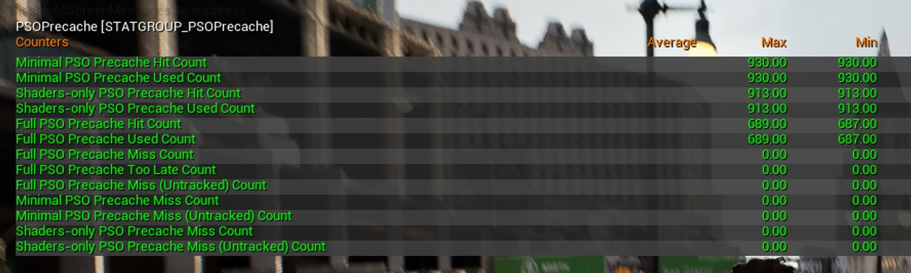
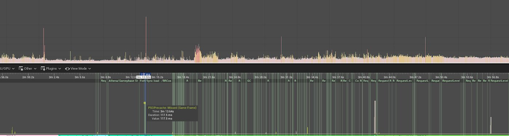
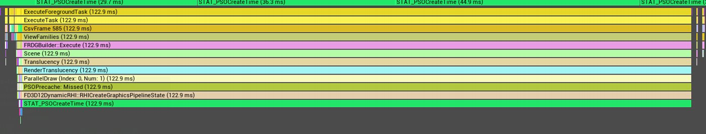
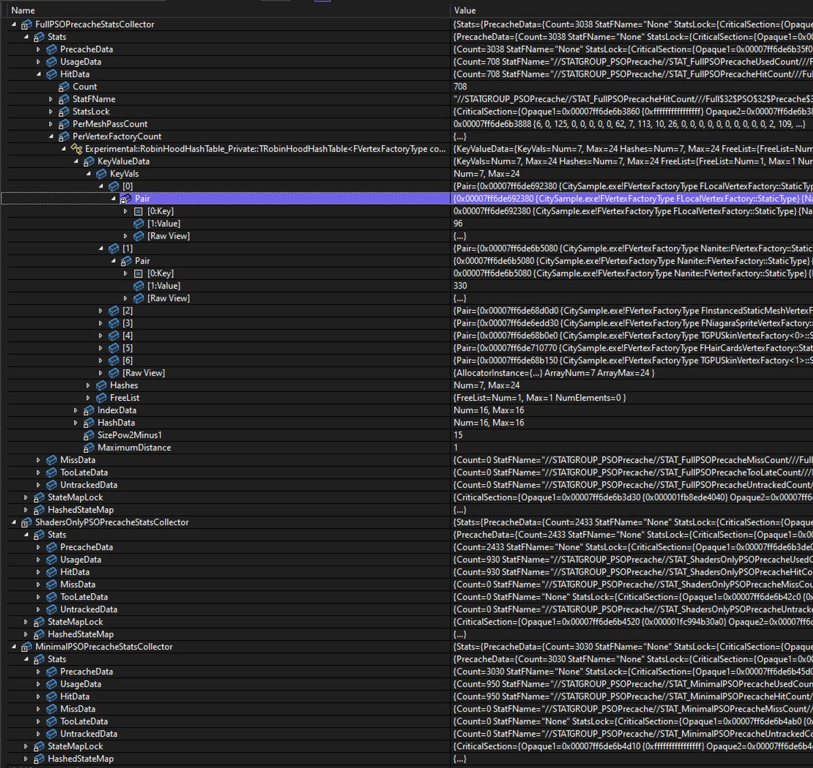

# PSO预缓存

> 路径：虚幻引擎5.7文档 / 测试并优化你的内容 / PSO缓存 / PSO预缓存

> 原始页面：https://dev.epicgames.com/documentation/unreal-engine/pso-precaching-for-unreal-engine

手动**PSO缓存**需要运行游戏的构建以将PSO（管线状态对象）信息收集到[捆绑的缓存](../manually-creating-bundled-pso-caches/index.md)中，而**PSO预缓存**会对可在渲染期间使用的所有PSO自动执行PSO收集和异步编译。

## 配置PSO预缓存

以下控制台变量可控制PSO预缓存：

| 控制台变量 | 说明 | 默认状态 |
| --- | --- | --- |
| `r.PSOPrecaching` | 可启用PSO预缓存的全局控制台变量。 依赖RHI标记`GRHISupportsPSOPrecaching`。 | 启用 |
| `r.PSOPrecache.Components` | 预缓存组件使用的PSO。 | 启用 |
| `r.PSOPrecache.Resources` | 预缓存所有资源（`UStaticMesh`、`USkinnedMesh`等）使用的PSO。 这些PSO的渲染状态可能不正确，因为某些状态仅可从组件派生。 然而，PSO应为驱动程序提供正确的着色器进行编译。 | 禁用（Disabled） |
| `r.PSOPrecache.ProxyCreationWhenPSOReady` | 等待组件代理创建，直至所有必需的PSO完成编译。 如果在创建代理时，PSO仍在编译，这些PSO将标记为高优先级。 | 启用 |
| `r.PSOPrecache.ProxyCreationDelayStrategy` | 当PSO在组件的代理创建期间仍在编译时，此变量会增加将材质替换成默认材质的选项。 依赖`r.PSOPrecache.ProxyCreationWhenPSOReady`。 有关更多信息，请参阅下文的"代理创建延迟策略"。 | 0（见下文） |
| `r.PSOPrecaching.WaitForHighPriorityRequestsOnly` | 加载期间仅等待高优先级PSO。 所有非必要PSO仍将在Gameplay期间编译。 当代理需要某个PSO并且尚未完成编译时，该PSO会被标记为高优先级。 | 禁用（Disabled） |
| `r.PSOPrecache.GlobalShaders` | 在引擎启动期间是否也预缓存全局计算和图形PSO。 | 启用 |

## 全局着色器PSO预缓存

某些**全局着色器**PSO会被预缓存，因为它们在首次使用时可能会造成运行时卡顿。 这些PSO会在引擎启动时被编译，且默认由控制台变量`r.PSOPrecache.GlobalShaders`启用。 游戏中可能用到的所有全局计算着色器变体均会被预缓存。

C++

```
static EShaderPermutationPrecacheRequest ShouldPrecachePermutation(const FShaderPermutationParameters& Parameters)
```

这通常被用于检查给定的排列在运行时是否可用，方法是检查当前的控制台变量设置，以排除某些组合。 默认使用`ShouldCompilePermutation`，因此预缓存的置换项应该是已编译置换项的子集。

大部分全局图形PSO会在加载后的头几帧内创建完成，在这几帧中，可能会观测到明显的卡顿。 使用非常小的PSO捆绑包缓存收集这些全局图形PSO可能会缓解这种情况。 但某些全局图形PSO排列也会在运行时创建和编译，因此这些也应该被预缓存。 对于全局图形PSO，需要特定的SPO收集器来收集所有正确的渲染状态。编译图形PSO需要这些状态。

目前，以下全局着色器类型已实现了PSO预缓存：

- Slate设置
- 延迟光源
- 级联粒子模拟
- 体积雾

> [!NOTE]
> 在启动时编译所有全局PSO需要花费一点时间，通常是在浏览主菜单的过程中完成的。 虽然这不会在启动时阻塞引擎，但它应该属于初始加载屏幕期间PSO编译等待阶段的一部分。

## 组件PSO预缓存

**图元组件**（`UPrimitiveComponent`）会在加载后（PostLoad期间）立即预缓存渲染所需的所有PSO。 预缓存会收集所需的所有管线状态信息来编译PSO，包括：

- 材质
- 顶点工厂
- 顶点元素信息
- 特定的预缓存参数

UE利用此信息遍历可以渲染组件的所有潜在网格体通道处理器。 每个网格体通道处理器都会添加渲染期间可能需要的潜在PSO初始化程序。 后台任务会检查共享PSO缓存，以确保所需数据尚未被预缓存并异步编译这些请求。

单个组件可能需要大量PSO，才能在所有不同通道（如基础通道、自定义深度通道、深度通道、扭曲通道、阴影通道、虚拟阴影贴图通道、速度通道等等）中正确渲染。 重要的是，在组件准备好之前，将所有这些PSO都准备好，以免造成图形瑕疵——例如，组件可能只在一个通道中被渲染，而在另一个通道中却未被渲染。

当虚幻引擎为图元组件创建**图元代理**且其所需PSO仍在编译时，有多个选项可用：

- 延迟代理创建，直至PSO编译完成（默认）。 这样可以有效跳过绘制，直至PSO准备就绪。
- 将材质替换成引擎中的默认材质。
- 继续，并且可能出现卡顿。 绘制将阻止PSO编译。

### 代理创建延迟策略

控制台变量`r.PSOPrecache.ProxyCreationDelayStrategy`依赖控制台变量`r.PSOPrecache.ProxyCreationWhenPSOReady`。 如果`ProxyCreationWhenPSOReady`被设为1（即启用），则`ProxyCreationDelayStrategy`将根据其值运行以下行为：

| 值（Value） | 行为 |
| --- | --- |
| 0 | 跳过绘制，直至PSO准备就绪。 |
| 1 | 退却至引擎的默认材质，直至PSO准备就绪。 |

## 加载屏幕

> [!NOTE]
> 强烈建议在设置初始的加载界面时就将PSO预缓存请求纳入考量。 。

在为游戏设置初始加载屏幕时，你应该使其等待所有当前尚未完成的PSO预缓存请求全部完成。 否则，你可能会看到一些明显的视觉抖动，那些不支持延迟代理创建的组件（比如地形景观）甚至可能会出现运行时卡顿的情况。而在这种情况下，最好不要用默认材质替换这些网格或者不要对其进行渲染。

`FShaderPipelineCache::NumPrecompilesRemaining()`适合用于检查捆绑缓存和PSO预缓存的未完成PSO预缓存编译次数。 你可以修改加载屏幕逻辑以检查此数量，并在达到零之前一直保持加载屏幕显示。 在大多数情况下，具有空驱动缓存的初始PSO编译在中等规格的CPU上花费的时间应少于一分钟。

## 管理系统资源

PSO预缓存依赖使用后台线程进行异步编译，并对系统内存有影响。 本小节旨在介绍用于根据你的项目调整和优化资源使用的可用选项。

### 内存

为节省运行时系统内存，UE会在编译后删除为预缓存编译的PSO。 这是因为如果你的应用程序预缓存的PSO量非常大，若不清理，可能会占用大量的应用程序内存空间（数百MB甚至GB）。

PSO预缓存依赖存在的底层压缩驱动程序缓存。 即使PSO在预缓存后被删除，它们也会被保留在驱动程序缓存中。 如果运行时需要PSO，显卡驱动程序将从其压缩驱动程序缓存加载PSO。 然而，这也可能造成资源耗费，并且从这些缓存进行第一次检索可能需要几毫秒。 你可以使用`D3D12.PSOPrecache.KeepLowLevel`在D3D12中禁用预缓存PSO的删除操作。

从驱动程序缓存创建PSO在某些独立硬件供应商（CIHV）上可能比较缓慢。 对于NVIDIA而言，可以使用`r.PSOPrecache.KeepInMemoryUntilUsed`在内存中保留一定数量的预缓存图形和计算PSO，从而在内存中保留最后`N`个预缓存PSO，进而避免驱动缓存性能下降。 要调整内存中保留的计算和图形PSO数量，请分别使用`r.PSOPrecache.KeepInMemoryGraphicsMaxNum`和`r.PSOPrecache.KeepInMemoryComputeMaxNum`。 如果你决定使用此选项，建议使用不同设置测试应用程序的最终内存开销，从而在PSO创建性能和内存开销间达成可接受的平衡。

### 性能

默认情况下，虚幻引擎使用PSO预缓存线程池来异步编译PSO。 若设置了`r.pso.PrecompileThreadPoolSize`或`r.pso.PrecompileThreadPoolPercentOfHardwareThreads`，则系统将使用线程池。 否则，PSO编译将回退为使用常规后台任务，而这些后台任务将与引擎的其他工作负载被一起调度。

| 控制台变量 | 说明 | 默认状态 |
| --- | --- | --- |
| `r.pso.PrecompileThreadPoolSize` | 设置要在池中使用的具体线程数量。 | 0 |
| `r.pso.PrecompileThreadPoolPercentOfHardwareThreads` | 将线程池大小设置为可用硬件线程的百分比，并创建该大小的线程池。 默认大小为75，表示75%的硬件线程。 | 75 |
| `r.pso.PrecompileThreadPoolSizeMin` | PSO线程池中使用的最少线程数量。 | 2 |
| `r.pso.PrecompileThreadPoolSizeMax` | PSO线程池中使用的最大线程数量。 默认值为`INT_Max`，即无线程数量上限。 | INT_Max |

其他注意事项：

- 由于线程池的线程数量没有上限，在处理器数量多但内存不足的系统上编译PSO时，系统内存可能会被耗尽。 每个编译PSO的线程最多可能占用2GB内存，因此限制线程数量对项目来说是有意义的。
- 在Gameplay过程中，75%的硬件线程就算很多了。 与常规前台线程的争用可能会很明显，从而导致轻微的丢帧。 在加载时提升该值，并在游戏时降低该值可能会有所帮助，但这可能会延迟PSO的编译并增加延迟代理的创建——这应该不会造成运行时卡顿。

你可以使用命令行参数`-clearPSODriverCache`强制清除驱动程序缓存。我们建议在测试游戏首次启动体验时进行此操作。

在具有大量核心的PC上测试时，建议使用命令行参数`-corelimit=N`（其中`N`即核心数），将核心数量限制为8，或适用于消费级PC的其他常规核心数。同时你还可以使用`-processaffinity=n`，确保Windows只会在`n`个物理核心上调度游戏。 这样可以确保你能更准确地复制最终用户的体验。

> [!WARNING]
> 对于评估游戏流畅度的所有测试运行，请始终使用switch函数`-clearPSODriverCache`。 如果没有它，故障可能会被显卡驱动程序所构建和先前运行遗留的PSO缓存掩盖。

## 验证和跟踪

有多个选项可供验证和跟踪PSO预缓存系统的性能。

你可以通过`r.PSOPrecache.Validation`使用以下值启用验证：

| 控制台变量 | 说明 |
| --- | --- |
| 0 | 禁用（Disabled） |
| 1 | 仅采用大概数据的轻量级跟踪。 这对性能影响最小，且可用于发行的产品。 |
| 2 | 详细跟踪并记录PSO预缓存未命中的情况。 |

当PSO预缓存验证激活时，你可以使用控制台命令`stat PSOPrecache`检查收集的统计数据。



*通过PSO预缓存验证系统收集的统计数据。 使用统计数据控制台命令PSOPrecache查看统计数据。*

统计数据分为3组：

| 组 | 说明 |
| --- | --- |
| 仅限着色器PSO（Shader-only PSO） | 这些统计数据仅跟踪所使用的RHI着色器，并忽略PSO中的所有其他状态信息。 对于查看是否至少所有着色器都已预缓存，以及其他渲染状态是否缺失/错误，此组非常有用。 要求`r.PSOPrecache.Validation.TrackMinimalPSOs`。 |
| 最少PSO（Minimal PSO） | 包含着色器和所有渲染统计数据与顶点元素信息（渲染目标信息除外）。 渲染目标信息仅可在绘制时用于验证，但最少PSO统计数据可在MeshDrawCommand构建期间更新和检查。 要求`r.PSOPrecache.Validation.TrackMinimalPSOs`。 |
| 完整PSO（Full PSO） | 图形API使用的完整运行时所需PSO状态。 这和最少PSO相同，但提供额外的渲染目标信息。 |

对于每个组，跟踪以下参数：

| 参数 | 说明 |
| --- | --- |
| 未命中（Missed） | 未预缓存但本应预缓存（因为绘制和调度时需要PSO）的PSO数量。 可能的原因：着色器、渲染目标状态、顶点属性、渲染目标信息错误。 |
| 未跟踪（Untracked） | 未启用预缓存的PSO的数量。 可能的原因：验证被禁用、全局材质、顶点工厂不受支持、网格体通道处理器类型不受支持。 在某些调试信息不可用的发布版本中，未跟踪PSO会显示为未命中。 |
| 命中（Hit） | 运行时使用的已成功预缓存的PSO的数量。 |
| 太迟（Too late） | 排队等待预缓存但未在需要时及时编译的PSO的数量。 |
| 已使用（Used） | 在运行时已使用的PSO的数量（以上所有PSO的总和）。 |
| 已预缓存（Precached） | 已预缓存（但不一定已使用）的PSO的数量。 |

**着色器管线缓存（Shader Pipeline Cache）**也会提供信息，说明检测到多少实际运行时卡顿是因PSO编译本身导致。 如果要编译运行时PSO的编译时间超过一定毫秒数，则PSO编译会被标记为故障。 默认阈值为20毫秒。 你可以使用`r.PSO.RuntimeCreationHitchThreshold`修改此值，但该值应尽可能小。

> [!NOTE]
> 默认值20毫秒为较大值，因为驱动程序缓存的首次命中可能耗费较长时间。

## 收集关于PSO预缓存的信息

你可以使用**日志文件**、**Visual Studio**调试器和**Unreal Insights**获取关于PSO预缓存的更多信息，并查看为何某些PSO仍在运行时引起卡顿。 仅在启用PSO验证（见上文[验证和跟踪](index.md)）时，日志的Insights中才会显示正确的PSO预缓存统计数据。

当发现PSO未命中或"太迟（Too Late）"时，UE将在日志中打印以下信息：

C++

```
PSO PRECACHING MISS:
		Type:				FullPSO
		PSOPrecachingState:		Missed
		Material:				M_AdvancedSkyDome
		VertexFactoryType:		FLocalVertexFactory
		MDCStatsCategory:		StaticMeshComponent
		MeshPassName:			SkyPass
		Shader Hashes:
			VertexShader:		EC68796503F829FDEACC56B913C4CA86C6AD3C16
			PixelShader:		651BF1ABBAEC0B74C8D2A5E917702A00EF29817B
```

Insights工具对于调试PSO预缓存非常有用。 在游戏帧状态序列中添加SOPrecache: Missed和PSOPrecache: Too Late这两个计时器，就能方便地看到在一定时间段内由PSO编译导致的所有卡顿情况。 如下图所示，其中有几次5到10毫秒的卡顿是由PSO缓存未命中引起的，还有一次会被玩家明显察觉到的，117毫秒的大卡顿。 而其他较大的卡顿并非来自PSO编译。



*点击查看大图。*

当我们放大查看时，就会发现它是来自"半透明"通道（而且日志中应该有关于这一点的更多详细信息）：



*点击查看大图。*

你可以在全局PSO验证辅助对象中找到更多详细信息。 当验证设置为全面跟踪（`r.PSOPrecache.Validation=2`）时，系统会根据网格体通道处理器和顶点工厂类型分组数据，这有助于跟踪未命中事件的源头。 这还有助于你更清晰地了解所有预缓存PSO的源头，并找到不应缓存那么多着色器的异常值。

虽然这些每通道和每顶点工厂统计数据未直接公开，但可以在调试期间通过找到收集数据的数据结构检查这些统计数据。 它们具体位于`PSOPrecacheValidation.cpp`之中：

- `FullPSOPrecacheStatsCollector`
- `ShadersOnlyPSOPrecacheStatsCollector`
- `MinimalPSOPrecacheStatsCollector`

下方截图即为示例。



*点击查看大图。*

## 通过引擎功能扩展PSO预缓存

本小节介绍了关于如何为PSO预缓存扩展支持对象的信息。

### UPrimitiveComponent

`UPrimitiveComponent`会收集设置PSO初始化程序所需的所有信息。 需要材质实例、顶点工厂（带可能的顶点元素集）和可能影响`FMeshPassProcessor`中使用的最终着色器和渲染状态的参数集。

参数会被存储在`FPSOPrecacheParams`中，正确的默认值则在`UPrimitiveComponent::SetupPrecachePSOParams`中设置。

PSO预缓存的基础入口函数为：

C++

```
/** Precache all PSOs which can be used by the primitive component */ 	ENGINE_API virtual void PrecachePSOs();
```

在大多数情况下，派生组件不需要实现此函数，只需覆盖预缓存参数收集函数：

C++

```
/**
	 * Collect all the data required for PSO precaching 
	 */

	struct FComponentPSOPrecacheParams

	{

		EPSOPrecachePriority Priority = EPSOPrecachePriority::Medium;
```

你可以在`UStaticMeshComponent::CollectPSOPrecacheData`中找到功能全面的示例，在`WaterMeshComponent::CollectPSOPrecacheData`中找到较简单的用例。

### FVertexFactory

新顶点工厂需要使用`EVertexFactoryFlags::SupportsPSOPrecaching`标记其支持PSO预缓存，该标记由顶点工厂声明宏`IMPLEMENT_VERTEX_FACTORY_TYPE`提供。

然后，顶点工厂必须实现以下函数：

C++

```
static void GetPSOPrecacheVertexFetchElements(EVertexInputStreamType VertexInputStreamType, FVertexDeclarationElementList& Elements);
```

如果未提供明确的顶点元素集，则PSO预缓存期间将使用`FVertexFactory::GetPSOPrecacheVertexFetchElements`。

如果在顶点工厂上设置`EVertexFactoryFlags::SupportsManualVertexFetch`标记，或者如果着色器中使用固定的顶点元素集，则固定顶点元素集将有效。

如果顶点元素列表依赖网格体的顶点缓冲区数据，则需要在`FPSOPrecacheVertexFactoryData`中提供正确的集。 这应在`UPrimitiveComponent::CollectPSOPrecacheData`期间进行。 如需查看示例，请参阅`UStaticMeshComponent::CollectPSOPrecacheData`和`FLocalVertexFactory::GetVertexElements`。

### FMeshPassProcessor

网格体通道处理器必须实现以下函数，以收集在使用给定`FPSOPrecacheParams`绘制某些材质时可能使用的所有PSO：

C++

```
virtual void CollectPSOInitializers(const FSceneTexturesConfig& SceneTexturesConfig, const FMaterial& Material, const FPSOPrecacheVertexFactoryData& VertexFactoryData, const FPSOPrecacheParams& PreCacheParams, TArray<FPSOPrecacheData>& PSOInitializers) override {}
```

其逻辑和`AddMeshBatch`大体相同（理想情况下可以部分共享），但如果在MeshDrawCommand编译时调用AddMeshBatch，PSO预缓存系统会尝试更快地收集信息（组件的PostLoad）。

如需简单示例，请参阅`FDistortionMeshProcessor::CollectPSOInitializers`。如需更复杂的示例，请参阅`FBasePassMeshProcessor::CollectPSOInitializers`。

### IPSOCollector

并非所有材质着色器都会通过网格体通道处理器，也并非所有材质着色器都已定义了`EMeshPass::Type`（比如毛发、Nanite或光线追踪动态几何体更新）。 对于这些情况，可能需要直接从基础接口派生实现。

`IPSOCollector`有一个需要实现的虚拟函数：

C++

```
// Collect all PSO for given material, vertex factory & params	virtual void CollectPSOInitializers(const FSceneTexturesConfig& SceneTexturesConfig, const FMaterial& Material, const FPSOPrecacheVertexFactoryData& VertexFactoryData, const FPSOPrecacheParams& PreCacheParams, TArray<FPSOPrecacheData>& PSOInitializers) = 0;
```

PSO收集器也需要通过全局`FRegisterPSOCollectorCreateFunction`注册以供创建。 引擎中给出了几个简单的示例：`FTranslucentLightingMaterialPSOCollector`、`FRayTracingDynamicGeometryPSOCollector`等等……

### GlobalPSOCollector

如上文所述，一些全局图形PSO在启动时就已预缓存了，我们知道它们能够编译运行时变体。 为此，系统会使用`GlobalPSOCollector`。 它是IPSOCollector的简化版本。 需要声明一个全局的`FRegisterGlobalPSOCollectorFunction`对象，以提供全局PSO收集器功能：

C++

```
typedef void (*GlobalPSOCollectorFunction)(const FSceneTexturesConfig& SceneTexturesConfig, int32 GlobalPSOCollectorIndex, TArray<FPSOPrecacheData>& PSOInitializers);
```

如需获取关于如何使用这些功能的一些示例，请参阅`DeferredLightGlobalPSOCollector`或`RegisterVolumetricFogGlobalPSOCollector`。

## 调试PSO预缓存未命中

查明上述PSO缓存未命中现象的成因，你需要在Visual Studio中采用手动调试的方式进行操作。

调试最少PSO状态时的未命中非常简单，因为这些未命中可以在MeshDrawCommand构建期间触发，而非在绘制时触发。 最终渲染目标信息（计算完整PSO时需要）仅在绘制期间提供，这使得调试难度更大。

函数`LogPSOMissInfo`很适合用来在运行时发生未命中时脱离调试器。 调用堆栈和监视窗口可以给出有关所用材质、渲染通道、顶点工厂和`FPrimitiveSceneProxy`的更多信息。 你也可以使用`ComponentForDebuggingOnly`成员获取有关`UPrimitiveComponent`的信息。 大部分此类数据也会在发现未命中情况时（在该函数中收集）打印到日志文件中。

然而，当`LogPSOMissInfo`运行时，PSO预缓存通常已在该组件上完成。 如果你尝试找到为何在该组件PSO预缓存期间使用的着色器或渲染状态不正确，你需要在PSO预缓存期间为该组件和/或给定通道的材质添加一个断点。

当发现具有给定名称的材质时，`r.PSOPrecache.BreakOnMaterialName`有助于在PSO预缓存过程中进行脱离。这有助于找出为何某些渲染状态与运行时状态存在差异。 你也可以使用`r.PSOPrecache.BreakOnPassName`和`r.PSOPrecache.BreakOnShaderHash`缩小有问题的PSO的范围。 上述提到的这些信息可在日志中找到。

你可以使用`r.PSOPrecache.UseBackgroundThreadForCollection`禁用PSO初始化器收集的后台线程任务，以便在调试PSO预缓存未命中时更轻松地追踪组件信息或其他状态。

> [!NOTE]
> 你可能还需要检查`FPSOPrecacheParams`的值，因为这些值也可能影响PSO中使用的着色器和渲染状态。
