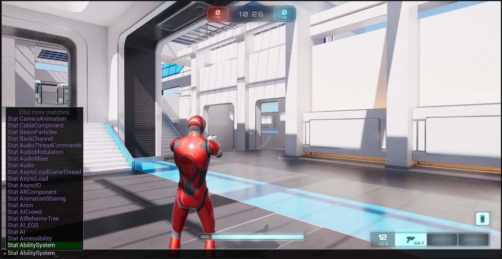
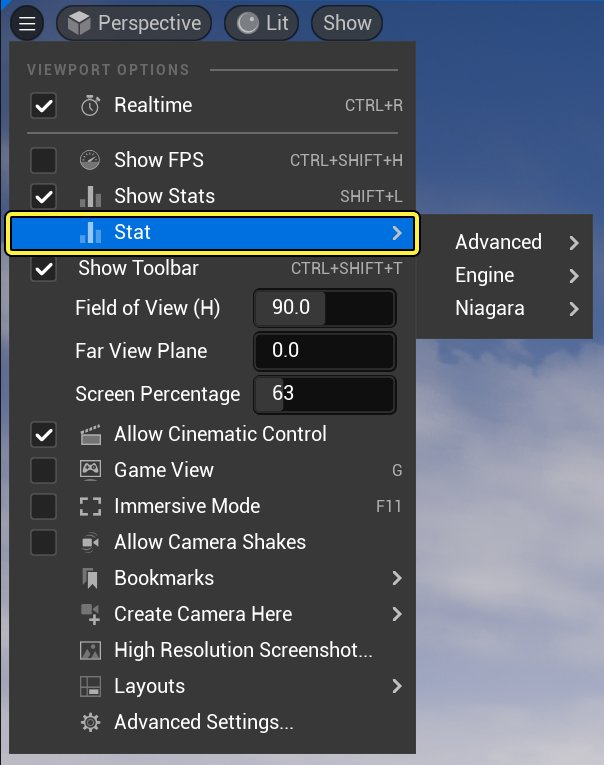
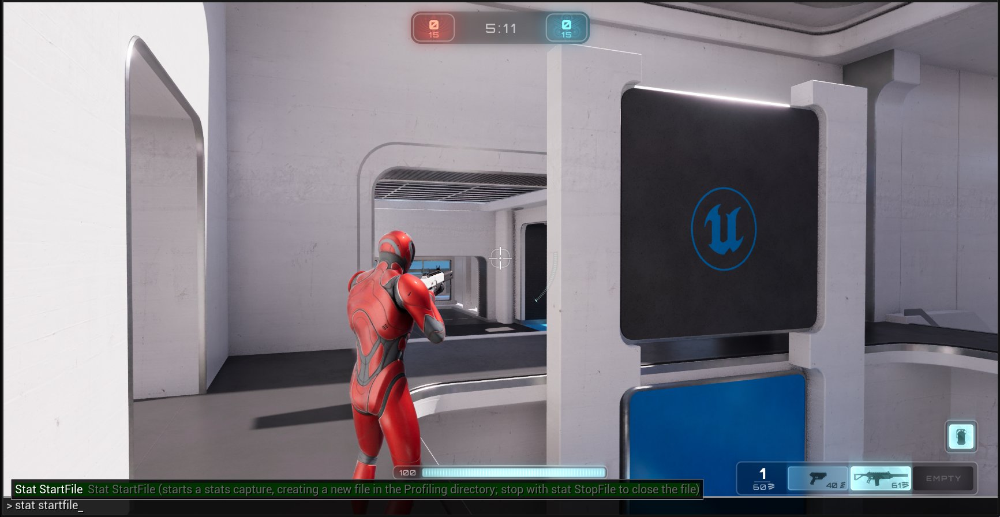
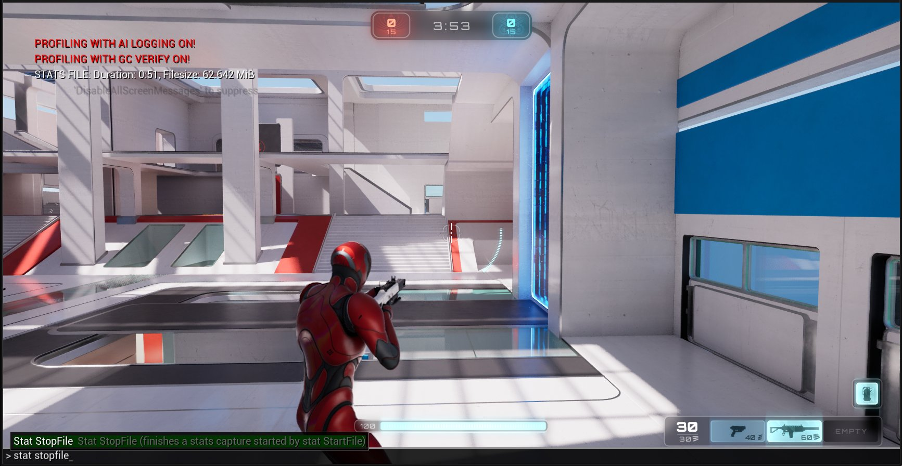
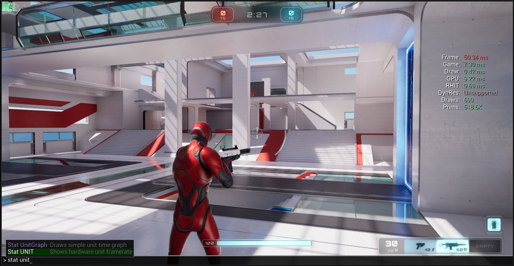

# Stat命令

> 路径：虚幻引擎5.7文档 / 测试并优化你的内容 / Stat命令

> 原始页面：https://dev.epicgames.com/documentation/unreal-engine/stat-commands-in-unreal-engine

要分析 **虚幻引擎（UE）** 项目，开发人员可以在使用 **编辑器中运行（PIE）** 模式运行游戏的同时，在控制台输入以下 **stat命令** 。

单击查看大图。

要从编辑器的 **Stat** 菜单中找到stat命令，选择 **视口设置（Viewport Setting）** 按钮旁边的向下箭头。

单击查看大图。

> [!NOTE]
> **注意：** 利用 `LOG` 命令运行编辑器，开发人员能够从stat **转存** 记录有用信息，为此，编辑器（游戏项目）能够利用 `LOG` 命令（例如 `UnrealEditor.exe -silent LOG=MyLog.txt` ）生成日志文件。

## Stat命令表

输入 `stat` 和一个空格，然后输入以下命令，从而激活它们：

| 命令名称 | 命令说明 |
| --- | --- |
| **AI** | 显示感知系统和整体AI的性能信息。 |
| **AI_EQS** | 显示环境查询系统（EQS）的性能、调试和内存统计数据。 |
| **AIBehaviorTree** | 显示行为树的性能和内存统计数据。 |
| **AICrowd** | 显示群集管理器的性能和步骤信息。 |
| **Anim** | 显示每次tick蒙皮网格体需要多长时间进行计算。 |
| **AsyncLoad**/ **AsyncLoadGameThread** | 显示异步加载的性能统计数据。 |
| **Audio** / **AudioThreadCommands** | 音频统计数据，如声波实例或缓冲区性能。 |
| **Canvas** | 画布统计数据，显示画布用户界面项（例如图块、边框和文本）的性能信息。 |
| **Collision** / **CollisionTags** | 显示碰撞的性能、调试和内存信息。 |
| **CommandListMarkers** | 显示命令列表及命令性能信息。 |
| **Component** | 显示组件列表及组件性能信息。 |
| **Compression** | 显示压缩统计数据。 |
| **CPULoad** | 显示CPU利用率。 |
| **CPUStalls** | 显示有关CPU停转的信息。 |
| **D3D11RHI** | 显示Direct3D 11 RHI统计数据。 |
| **DDC** | 显示派生数据缓存（DDC）统计数据。 |
| **DumpHitches** | 任何时候基于 `t.HitchFrameTimeThreshold` 检测到"卡顿"，都会将它写入日志中。 |
| **Dumpticks** | 关于Tick函数的转储信息。 |
| **Engine** | 显示一般渲染状态，例如帧时间，以及正在渲染的三角形数量的计数器。 |
| **FPS** | 显示每秒帧数（FPS）计数器。 |
| **Game** | 提供有关各个游戏进程Tick需要多长时间的反馈。 |
| **GameplayTags** | 显示游戏进程标签信息。 |
| **GC** | 显示垃圾回收统计数据。 |
| **GeometryCache** | 显示几何体缓存系统的性能和内存统计数据。 |
| **GPU** | 显示帧的GPU统计数据。 |
| **GPUParticles** | 显示GPU粒子的性能信息。 |
| **Help** | 列出所有命令。 |
| **Hitches** | 设置 `t.HitchFrameTimeThreshold` 以定义被认为发生卡顿的时长（单位：秒）。还会将所有卡顿转存到日志/visual studio调试，例如 `[0327.87] LogEngine:Warning:HITCH @ 00m:01s:643ms,1643,72,2` 。 |
| **IMEWindows** | 显示Windows文本输入法系统的信息。 |
| **InitViews** | 显示有关可见性剔除花费了多长时间以及效果如何的信息。可见分段计数是渲染线程性能方面最重要的一个统计量，它由STAT INITVIEWS下的可见静态网格体元素控制；不过，可见动态原语也有影响。 |
| **KismetCompiler** | 显示Kismet编译器信息。 |
| **KismetReinstancer** | 显示Kismet Reinstancer信息。 |
| **[Levels](#%E5%85%B3%E5%8D%A1)** | 显示关卡流送信息。 |
| **LightRendering** | 提供有关渲染光照和阴影需要多长时间的反馈。 |
| **LinkerCount** | 显示连接器计数器。 |
| **LinkerLoad** | 显示连接器加载信息。 |
| **List** | 使用 `<Groups/Sets/Group>` 显示统计数据组、保存的集合或者特定组中的统计数据。 |
| **LLM** | 显示低级内存追踪器（LLM）计数器。 |
| **LLMFull** | 显示整个LLM计数器组。 |
| **LLMOverhead** | 显示LLM开销计数器。 |
| **LLMPlatform** | 显示LLM平台计数器。 |
| **LoadTime** / **LoadTimeVerbose** | 显示加载时间性能信息。 |
| **MapBuildData** | 显示地图的编译数据。 |
| **MathVerbose** | 显示数学运算的性能信息。 |
| **Memory** | 显示有关虚幻引擎中各个子系统使用多少内存的统计数据。 |
| **MemoryAllocator** | 显示内存分配信息。 |
| **MemoryPlatform** | 显示内存平台信息。 |
| **MemoryStaticMesh** | 显示有关静态网格体的内存统计数据。 |
| **NamedEvents** | 为外部分析器启用指定事件。 |
| **Navigation** | 显示导航系统的性能和内存信息。 |
| **NET** | 显示网络系统统计数据。 |
| **Object** / **ObjectVerbose** | 显示对象内存和性能信息。 |
| **Online** | 显示在线系统计数器。 |
| **Pakfile** | 显示Pakfile系统统计数据。 |
| **ParallelCommandListMarkers** | 显示并行命令列表及并行命令性能信息。 |
| **Particles** | 显示粒子系统性能信息。 |
| **Physics** | 显示物理性能统计数据。 |
| **PhysXTasks** | 显示PhysX任务信息。 |
| **PhysXVehicleManager** | 显示PhysX载具管理器的统计数据。 |
| **PlayerController** | 显示玩家控制器性能信息。 |
| **Quick** | 快速显示总体性能数据组。 |
| **RenderTargetPool** | 显示渲染目标池的内存和性能统计数据。 |
| **RenderThreadCommands** | 列出渲染线程命令及性能信息。 |
| **RHI** | 显示RHI内存和性能统计数据。 |
| **RHICMDLIST** | 显示RHI命令列表及性能统计数据。 |
| **SceneMemory** | 显示场景内存计数器。 |
| **SceneRendering** | 显示一般渲染统计数据。这是一个很好的起点，可以发现渲染过程中性能低下的一般方面。 |
| **SceneUpdate** | 显示有关更新场景的信息，包括添加、更新和删除光源以及添加和删除场景中的原语所花费的时间。 |
| **Script** | 显示脚本统计数据。 |
| **ShaderCompiling** | 显示着色器编译信息。 |
| **Shaders** | 显示着色器压缩统计数据。 |
| **ShadowRendering** | 显示阴影计算花费多长时间，该时间不同于 **stat LightRendering** 中包括的实际阴影渲染时间。 |
| **Slate** / **SlateVerbose** | 显示Slate性能统计数据。 |
| **SlateMemory** | 显示Slate内存计数器。 |
| **SoundCues** | 显示活动的Sound Cue。 |
| **SoundMixes** | 显示活动的SoundMix。 |
| **Sounds** | `<?> <sort=distance\|class\|name\|waves\|default> <-debug> <off>` 显示活动的SoundCue和SoundWave。 |
| **SoundWaves** | 显示活动的SoundWave。 |
| **SplitScreen** | 显示分屏信息。 |
| **[StartFile](#startfile)** | 启动统计数据采集，同时在分析目录中创建一个新文件。 **注意：** 利用 **stat StopFile** 命令停止此操作。 |
| **StatSystem** | 显示统计系统的性能和内存信息。 |
| **[StopFile](#stopfile)** | 完成由 **stat StartFile** 启动的统计数据采集，同时关闭在分析目录中创建的文件。 |
| **Streaming** | 显示流送资源的基本统计数据，例如使用了多少内存流送纹理，或者场景中有多少流送纹理。 |
| **StreamingDetails** | 有关流送的更详细的统计信息，例如将一般纹理流分解为更具体的组（光照贴图、静态纹理和动态纹理）。 |
| **StreamingOverview** | 显示流送资源的统计数据概述。 |
| **TargetPlatform** | 显示目标平台信息。 |
| **TaskGraphTasks** | 显示TaskGraph任务的性能数据。 |
| **Text** | 显示文本的性能统计数据。 |
| **TextureGroup** | 显示纹理组内存计数器。 |
| **Threading** | 显示线程处理信息。 |
| **ThreadPoolAsyncTasks** | 显示ThreadPool Async任务计数器。 |
| **Threads** | 显示线程信息。 |
| **Tickables** | 显示Tickable的性能统计数据。 |
| **TickGroups** | 显示Tick组的性能统计数据。 |
| **UI** | 显示UI性能信息。 |
| **[Unit](#%E5%8D%95%E5%85%83)** | 总体帧时间以及游戏线程、渲染线程和GPU时间。 **注意：** 这是一个很好的stat命令，因为它可以帮助开发人员专注于分析工作。 |
| **UnitGraph** | 要查看包含stat单元数据的图表，使用 **stat Raw** 查看未过滤数据。 |
| **UObjectHash** | 显示散列的UObject信息。 |
| **UObjects** | 显示游戏中UObject的性能统计数据。 |

## 选择命令

### 关卡

**stat levels** 命令显示关卡流送信息，这些信息被分组在固定关卡下。

#### 用例

此命令对于希望查看当前活动关卡列表的开发人员非常有用，包括它们是否可见、预加载、加载或卸载。此外，该命令还显示从加载请求到加载完成需要多少秒。

#### 用法

要查看流送关卡信息，在 **PIE控制台** 中输入 `stat levels` 。要确定关卡处于什么状态，请参考下面的关卡颜色代码表。

##### 关卡颜色代码

| 颜色代码 | 说明 |
| --- | --- |
| **绿色** | 关卡已加载并可见。 |
| **红色** | 关卡已卸载。 |
| **橙色** | 关卡正在变成可见的过程中。 |
| **黄色** | 关卡已加载，但不可见。 |
| **蓝色** | 关卡已卸载，但仍驻留在内存中，当发生垃圾回收时将清除它。 |
| **紫色** | 关卡是预加载的。 |

### StartFile

单击查看大图。

**stat startfile** 命令启动统计数据采集，并在 **Profiling** 目录中创建一个新文件。通常，引擎将统计数据采集保存在 `[UE项目目录][项目名称]\Saved\Profiling\UnrealStats` 下。

#### 用例

要使用 **会话前端分析器** 分析项目的性能，采集统计样本并将其记录到 `*.uestats` 文件中。

#### 用法

要采集统计数据并将数据记录到 `*.uestats` 文件中，在 **PIE控制台** 中输入 `stat startfile`。

> [!WARNING]
> 要防止 **StartFile** 因使用较大的 `ue4stats` 文件导致磁盘膨胀，请运行 **stat StopFile** 。此外，即使关闭了PIE模式，StartFile也将继续在后台运行，这可能会导致日志文件膨胀，因此请务必运行 **StopFile** 命令来停止记录项目性能。

#### 加载统计数据

要将统计数据加载到 **会话前端分析器** 中，请执行以下操作：

1. 从

   虚幻编辑器菜单栏（Unreal Editor Menu Bar）

   ，选择

   工具（Tools）> 会话前端（Session Frontend）

   。
2. 打开

   会话前端（Session Frontend）

   后，选择

   分析器（Profiler）

   选项卡。
3. 要打开文件进行分析，请选择

   加载（Load）

   。将显示

   文件资源管理器（File Explorer）

   窗口，供你选择要打开进行分析的

   uestats

   文件。
4. 选择

   uestats

   文件后，点击

   打开（Open）

   加载该文件。

##### 最终结果

**会话前端（Session Frontend）** 加载文件后，捕获数据将在 **分析器（Profiler）** 中可见，可进一步分析。阅读[分析器工具参考](../../sharing-and-releasing-projects/packaging-and-cooking/using-the-unreal-frontend-tool/index.md)，详细了解如何在 **会话前端（Session Frontend）** 中查看配置文件捕获。

- [Unreal Frontend](../../sharing-and-releasing-projects/packaging-and-cooking/using-the-unreal-frontend-tool/index.md)

### StopFile

单击查看大图。

**stat stopfile** 命令停止由 **StartFile** 命令启动的统计数据采集。此外， **StopFile** 命令还关闭在 `Profiling` 目录中创建的文件。

#### 用例

要防止 StartFile 因使用较大的 `ue4stats` 文件导致磁盘膨胀，运行 stat **StopFile** 。此外，即使关闭了PIE模式，StartFile也将继续在后台运行，这可能会导致日志文件膨胀，因此请务必运行 StopFile 命令来停止记录项目性能。

#### 用法

要停止采集和记录统计数据，在 **PIE控制台** 中输入 `stat stopfile` 。

### 单元

#### 用例

通常，开发人员想要确定 **Game** 线程中、 **Draw** （渲染）线程中或 **GPU** 上是否存在瓶颈（负面性能影响）。

单击查看大图。

**stat unit** 命令显示项目的 **Frame** 、 **Game** 、 **Draw** 、 **GPU** 、 **RHIT** 和 **DynRes** 线程的性能信息。

#### 统计数据

| 名称 | 说明 |
| --- | --- |
| **Frame** | 帧时是生成一帧游戏内容所花费的总时间。由于Game线程和Draw线程在完成一帧之前保持同步，帧时往往接近其中一个线程中显示的时间。 |
| **Game** | 如果帧时接近Game线程中显示的时间，则游戏的性能很可能会受到Game线程的阻碍（负面影响）。 |
| **Draw** | 如果帧时接近Draw线程中显示的时间，则游戏的性能很可能会受到渲染线程的阻碍 |
| **GPU** | GPU时间用来衡量显卡渲染场景需要多长时间。由于GPU时间会被同步到帧上，它很可能与帧时相同。 |
| **RHIT** | 通常，RHI线程时间会被同步到帧上，因此它很可能与帧时相同。 |
| **DynRes** | 如果支持（并启用），[动态分辨率](../../designing-visuals-rendering-and-graphics/optimizing-and-debugging-projects-for-realtime-rendering/dynamic-resolution/index.md)将显示主要屏幕百分比和次要屏幕百分比。 |

#### 用法

要确定项目的瓶颈，在非调试编译中启动游戏，并在 **PIE控制台** 中输入 `stat unit` 。
