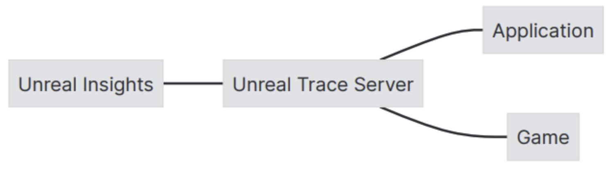
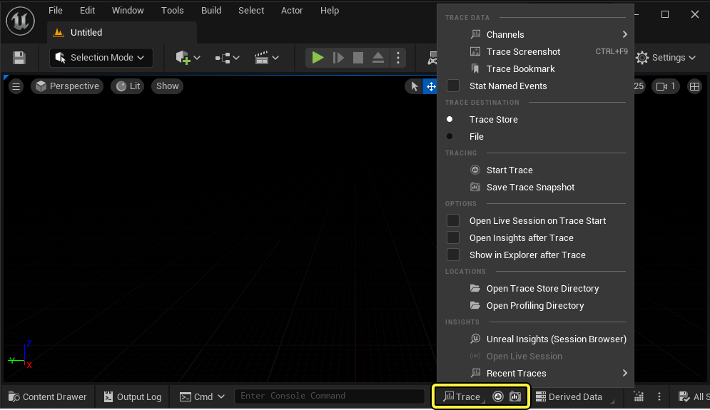
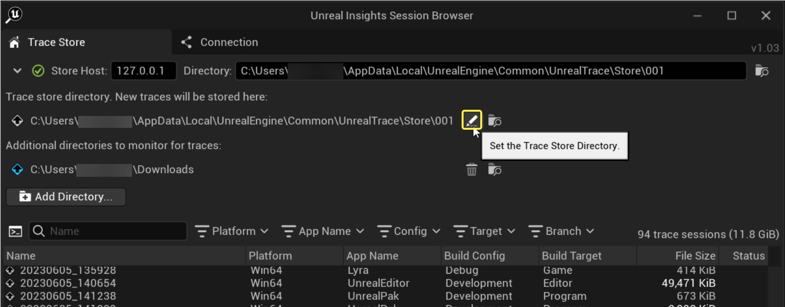
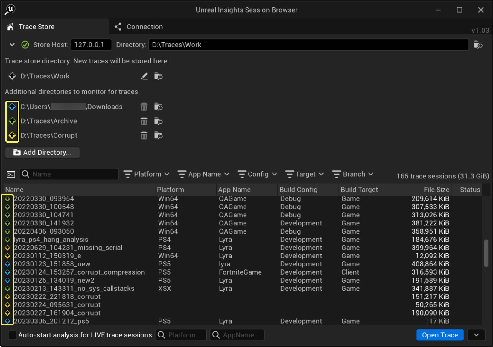
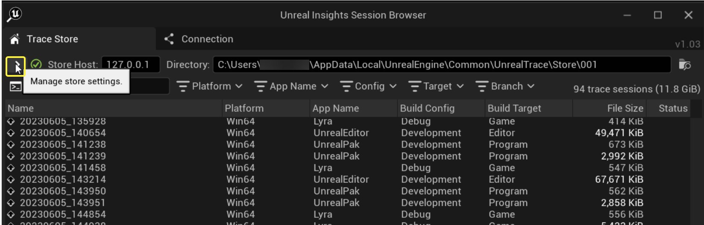
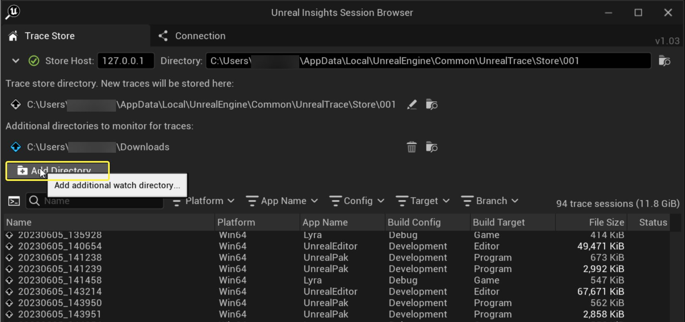
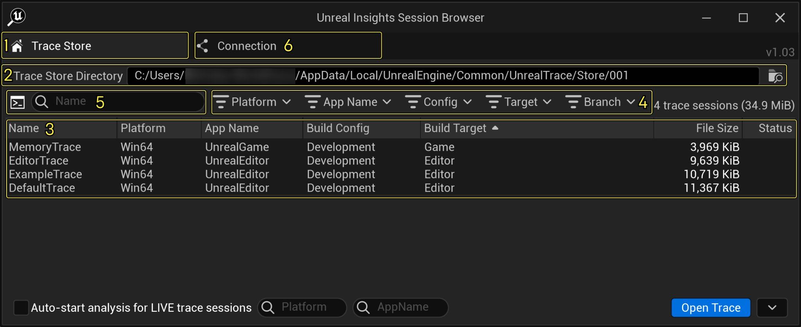
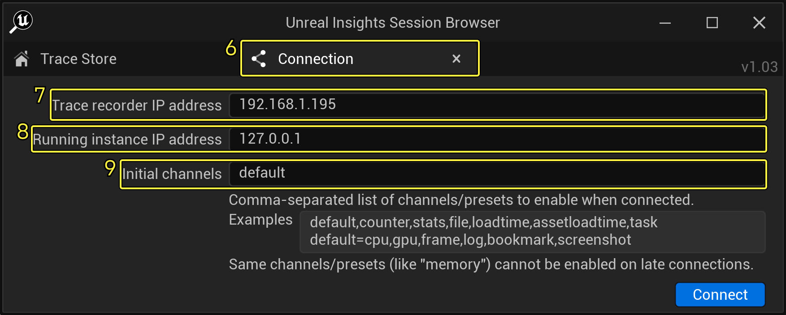

# Unreal Insights

> 路径：虚幻引擎5.7文档 / 测试并优化你的内容 / Unreal Insights

> 原始页面：https://dev.epicgames.com/documentation/unreal-engine/unreal-insights-in-unreal-engine

**Unreal Insights** 是一个遥测捕获和分析套件，它可以从您的项目中以高数据率捕获事件。Unreal Insights可以帮你识别出可能需要优化的数据区域。

Unreal Insights的主要组成部分为:

- Trace事件

  ，包含了

  事件名称

  和

  字段名称

  参数，用于定义一个事件并指定事件应包括的字段。
- Unreal Trace Server

  ，用于记录并保存来自应用程序的踪迹。
- Unreal Insights

  ，对数据进行分析和可视化处理。



Unreal Insights框架的主要组件的可视化。

Trace会话是自描述的，并且与不同的引擎发布版本兼容。它们被存储在 `.utrace` 文件中。任何同时生成的数据都存储在与trace文件相同目录下的 `.ucache` 文件中。

## 设置Unreal Insights

### 从编辑器中启动

要从 **虚幻编辑器** 中启动Unreal Insights，请使用编辑器底部工具栏中的 **Trace/Insights Status Bar Widget** 。



当运行Trace来解析您的项目数据时，你可以从多个工作流程选项中进行选择，这些选项因您的虚幻引擎构建和操作系统而异。关于这些工作流程选项的更多信息。请参阅以下页面：

- Trace
- Trace快速入门指南

### 启用Unreal Insights的预构建。

如果你安装的是虚幻引擎的二进制版本，应该有一个位于以下目录中的Unreal Insights的编译版本：

```
Engine\Binaries[Platform]\UnrealInsights[.exe] 	
```

### 从源代码构建

如果你没有安装二进制版本的引擎，或者你想从源代码编译Unreal Insights，您可以使用以下选项：

- 使用集成开发环境 (Integrated Development Enviroment，即IDE)

  。找到位于Programs文件夹中的UnrealInsights目标文件。
- 在命令提示符中

  。在您的引擎安装文件夹中使用虚幻构建工具构建Unreal Insights:

在Windows上:

```
Engine/Build/BatchFiles/RunUBT.bat UnrealInsights Win64 Development
```

在Linux或Mac上:

```
./Engine/Build/BatchFiles/RunUBT.sh UnrealInsights [Linux|Mac] Development
```

## Trace

**Trace** 是一个结构化的日志框架，用于在运行的进程中追踪检测事件。 **Unreal Trace Server** 作为单独服务器实例在后台运行，可以在多个项目或分支之间共享。它是一个经优化的程序，对性能的影响最小，且不包括用户界面。

**Trace Server** 是由一个单独的服务器进程可执行文件 `UnrealTraceServer.exe` 自动启动的，它位于 `Engine/Binaries/Win64` 目录文件夹下。

**Trace Server** 有两个主要组成部分:

- Trace Recorder

  在1981端口监听传入的跟踪连接并记录实时跟踪流。
- Trace Store

  记录的跟踪信息作为文件存储在一个文件夹中。它检测这个文件夹的变化，并在Unreal Insights的用户界面显示可用的追踪列表。

**Trace Server** 将配置和日志文件保存在以下位置：

- Windows:

  %LOCALAPPDATA%/UnrealEngine/Common/UnrealTrace
- MacOS:

  ~/UnrealEngine/UnrealTrace
- Linux:

  ~/UnrealEngine/UnrealTrace

默认的 `Store` 目录保存在这里。

有关其他文件，请参阅以下页面：

- Trace
- Trace快速入门指南
- Trace开发者指南

### 关闭Trace Server

你可以使用 "kill" 命令关闭Server：

`> UnrealTraceServer kill`

### 配置Unreal Trace Server

你可以配置Unreal Trace Server以添加额外的目录来扫描trace文件，比如下载文件夹或某特定项目的分析目录。在Unreal Insights中，你可以控制这些设置来执行以下操作：

- 设置trace存储目录。这是新trace的保存位置。



- 为trace文件设置其他trace目录和其他源，例如你的用户下载文件夹。



如果配置了额外的监视文件夹，多个trace及其对应的trace文件源将以关联的颜色显示

- 你的计算机关闭或重启时，Unreal Trace Server始终可以存储设置。

> [!NOTE]
> 自UE 5.3开始，所有桌面平台都启用了Unreal Trace Server。自此再无需Linux和Mac版Unreal Insights中托管的存储。

按照以下步骤配置Unreal Trace Server。

1. 打开Unreal Insights。这将在Windows、Mac或Linux上启动Unreal Trace Server（如果尚未运行）
2. 点击 **管理存储设置（Manage store settings）** 下拉按钮，然后点击"设置追踪存储目录（Set Trace Store directory）"按钮，修改默认存储目录。启动新追踪时，文件将存储在此目录中。

   
3. 旧追踪存储目录会自动添加到监视文件夹。
4. 你可以点击 **添加目录（Add directory）** 按钮添加一个或多个监视文件夹。如果新文件夹包含trace文件，它们将显示在会话列表中，附带使用唯一颜色的图标。

   

## Unreal Insights会话浏览器

Unreal Insights[会话浏览器](unreal-insights-session-browser/index.md)是一个观察跟踪数据的界面。要启动浏览器，请前往底部工具栏，然后点击 **Trace** > **Insights** > **Unreal Insights**（**Session Browser**）。

### Trace Store

**Trace Store** 是一个供你观察和管理所有已存储的跟踪会话（Trace Sessions）的界面。所跟踪记录以文件形式存储在一个文件夹中，Unreal Insights监测这个文件夹的任何数据变化，然后将可用的跟踪列表显示在Unreal Insights用户界面中。



### 连接选项卡

连接选项卡允许你通过跟踪服务器连接到一个正在运行的游戏或编辑器。它具有多个选项来改变你的连接设置。



更多详情请参阅[会话浏览器](unreal-insights-session-browser/index.md)页面。

### 加载一个分析用的Trace

加载一个分析用的Trace有多个选项可以选择。你可以：

- 双击Unreal Insights浏览器中的任何跟踪会话。
- 选择一个追踪会话，并点击

  打开追踪（Open Trace）

  。 *通过使用

  打开跟踪（Open Trace）

  下拉箭头，在其他位置搜索

  .utrace

  文件。
- 立即开始对各自的跟踪文件进行分析，从资源管理器中拖放一个.utrace文件到Unreal Insights窗口。

> 图片已省略：追踪下拉菜单

更多详情请参阅[会话浏览器](unreal-insights-session-browser/index.md)页面。

### 实时连接

如果一个实时Trace会话连接到该工具，它也会出现在列表中。实时会话在状态栏中显示 **LIVE** 字样，并在你分析它们时实时更新。否则，它们与预先录制的会话是一样的。

> 图片已省略：实时连接

该工具可以同时连接到多个会话，并在数据流进来时自动记录所有这些会话的数据。要实时分析这些会话，从列表中加载它们，与加载预先录制的会话的方式相同。

更多详情请参阅[会话浏览器](unreal-insights-session-browser/index.md)页面。

## Insights菜单

在Unreal Insights中查看会话时，你可以选择窗口左上角的"菜单"按钮进行访问。

你可以通过该菜单访问一些功能，包括：

- 导入表格（Import Table）

  - 将一个

  .csv

  或

  .tsv

  文件导入Insights表格。
- 会话浏览器（Session Browser）

  - 打开Unreal Insights会话浏览器窗口。
- 打开追踪文件（Open Trace File）

  - 打开指定的追踪文件以供分析。
- 自动打开实时追踪（Auto Open Live Trace）

  - 以后用，将对每个新的实时追踪会话启动分析，并替换当前分析会话。

## Timing Insights窗口

**Timing Insights** 窗口收集性能数据。它显示的是 **CPU** 和 **GPU** 轨道的数据。这些轨道具有多个子菜单，帮助你分类和可视化各种处理任务以及你的项目在执行这些任务时花费的时间。

> 图片已省略：timing-insights窗口

Timing Insights窗口包括帧面板（1）、计时面板过滤器（2）、计时面板（3）、日志面板（4）、计时器和计数器标签（5）以及呼叫和被呼叫面板（6）。

详见[Timing Insights](timing-insights/index.md)

## Memory Insights

**Memory Insights** 组件允许你调查你项目中的内存使用情况和调用堆栈追踪。

> 图片已省略：undefined

Memory Insights对运行期间发生的每个分配、重新分配或空闲事件进行追踪，然后在分析期间重建该内存使用模式。

> 图片已省略：undefined

详见[Memory Insights](memory-insights/index.md) 文件，关于如何设置、跟踪、查询和分类数据的说明。

## Networking Insights

Unreal Insights包括 **Networking Insights** 来分析、优化和调试网络流量。

详见[Networking Insights](networking-insights/index.md)获取更多文件。

## Slate Insights

**Slate Insights** 扩展了Unreal Insights，帮助开发人员提高他们的用户界面的性能。它提供了一些工具来确定特定Slate和UMG更新的根本原因。

详见[Slate Insights](slate-insights/index.md)获取更多文件。

## Asset Loading Insights

**Asset Loading Insights** 提供了一种解析项目的资产加载到UnrealEngine中所需时间的方法。Asset Loading Insights基于从AssetLoadTime跟踪通道中跟踪到的数据。

该分析工具在一些情况下非常有用，包括：

- 按资产类型查看数据集详情。
- 评估包的加载顺序
- 确定AsyncLoading是否按预期遵循了包优先级。
- 过滤资产加载轨道。

## Cooking Insights

**Unreal Cooking Insights** 允许您收集并显示关于您的项目中包的烘培方式的信息。长时间烘焙会大大影响正在进行大型项目的团队的生产力。通过显示每个包所需的时间，你可以观察哪些包需要重点调查并优化。 详见[Cooking Insights](timing-insights/unreal-cooking-insights/index.md)获取更多文件。

## 参考

为了充分利用 **Unreal Insights** 的许多功能，您可以用宏和命令行选项来定制您的项目的输出。

详见[Reference](unreal-insights-reference/index.md) 获取更多文件

## 主题

- [会话浏览器](unreal-insights-session-browser/index.md) - 浏览要使用Unreal Insights分析的Trace会话。

- [Trace Control Tab](using-the-trace-control-tab-in-unreal-insights/index.md) - Use the Trace Control tab to start and control traces for running sessions of a project.

- [追踪](trace/index.md) - 介绍Unreal Insights的Trace日志框架。

- [Timing Insights](timing-insights/index.md) - 介绍Unreal Insights中的Timing Insights窗口。

- [Memory Insights](memory-insights/index.md) - Memory Insights概述

- [Networking Insights](networking-insights/index.md) - 网络性能分析工具Networking Insights概览

- [Slate Insights概述](slate-insights/index.md) - Slate Insights的概述，Slate Insights是Unreal Insights的扩展，可以帮助用户调试Slate和虚幻运动图形（UMG）。

- [Unreal Insights参考](unreal-insights-reference/index.md) - Unreal Insights中快捷键、宏和命令行选项参考。
