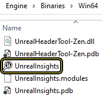
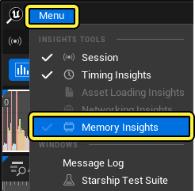
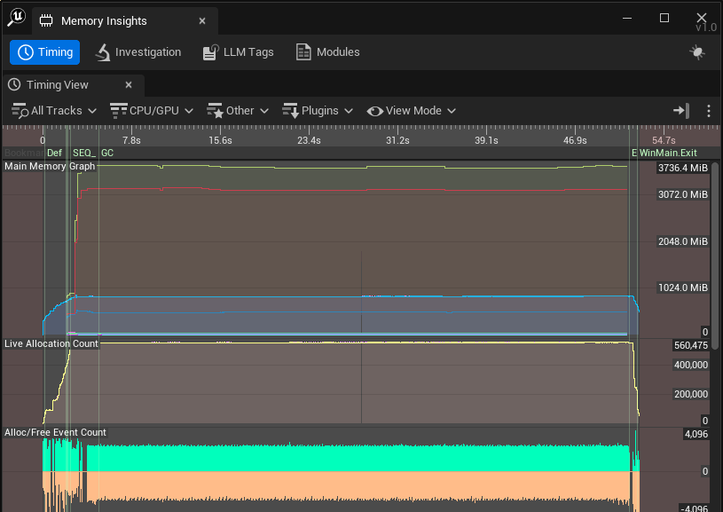

# Memory Insights

> 路径：虚幻引擎5.7文档 / 测试并优化你的内容 / Unreal Insights / Memory Insights

> 原始页面：https://dev.epicgames.com/documentation/unreal-engine/memory-insights-in-unreal-engine

**虚幻引擎5**（UE5）拓展了**Unreal Insights**的功能，为其**Memory Insights**功能添加了更强的内存追踪和分析功能。 开发者现在可以查看更多关于内存分配和释放的详细信息，包括任意时间点上与各个内存块关联的**低级内存（LLM）标签**和调用堆栈。

Memory Insights有一个查询系统，可以查找某个时间点的实时分配，识别内存使用量的增加或减少，区分短期和长期分配，以及查找内存泄漏。

> [!NOTE]
> 虚幻引擎5.4及之后版本都支持为Android项目使用调用堆栈进行内存追踪。

## 记录会话

要开始使用Memory Insights在内存通道中记录追踪（Trace），请按照以下步骤操作：

#### 运行或构建Unreal Insights

找到**开始（Start）** > **命令提示符（Command Prompt）**，然后输入以下内容：

C++

```
Engine\Binaries\Win64\UnrealInsights.exe
```

你也可以找到`Engine\Binaries\Win64`文件夹并双击运行`UnrealInsights.exe`。



#### 使用内存追踪运行你的游戏项目

从操作系统启动**命令提示符（Command Prompt）**并运行你的项目示例：

C++

```
cd C:\MyEngineInstallLocation\ Samples\Games\MyGameSample\Binaries\Win64\MyGameSample.exe -trace=default,memory
```

> [!WARNING]
> 要记录项目的会话，内存追踪通道从流程开始就必须处于激活状态。 否则，无法在延迟连接的会话中开始追踪分配事件。 此外，如果要对打包的项目运行追踪，则需要确保项目是在**开发（Development）**模式下打包的。

你可以使用追踪命令`metadata`和`assetmetadata`为资产名称和类名称提供额外的筛选选项。 例如，你可以计算按资产或类名称计算内存分配情况。

C++

```
Samples\Games\MyGameSample\Binaries\Win64\MyGameSample.exe -trace=default,memory,metadata,assetmetadata
```

#### 从Insights会话浏览器中打开追踪

导航回Unreal Insights的会话浏览器（Session Browser），然后双击你的`.utrace`文件，从而在虚幻引擎的**Timing Insights**窗口中将其打开并进行分析。 选择**菜单（Menu）** > **Memory Insights**以打开Memory Insights窗口。



### 内存分配 - 图表追踪

Unreal Insights会为每个分配事件捕获完整的调用堆栈，从而提供项目内存分配情况的分析。 **Memory Insights**的主界面包含一个时间轴，显示会话期间内存使用情况的概览。



Memory Insights追踪器显示有关内存中实时分配数量的信息。 上图是主内存图表（Main Memory Graph）以及实时分配计数（Live Allocation Count）和空闲事件计数（Free Event Count）。

**主内存图表（Main Memory Graph）**会显示项目中被追踪内存的总量，包括从**LLM**收集的各个标签的信息。 此外，还有显示实时分配总数的图表：

| 图表类型 | 颜色 | 说明 |
| --- | --- | --- |
| 分配的总内存（Total Allocated Memory） | 蓝色 | 根据详细的分配追踪信息显示在每个时间点分配的内存总量。 |
| 实时分配计数（Live Allocation Count） | 黄色 | 显示任何时间点的活跃分配总数。 |
| 分配/空闲事件计数（Allocation/Free Event Count） | 绿色/蓝色 | 显示每个单元的分配和空闲事件数，以时间"切片"表示。 |

这些图表中的每一个都基于详细的分配追踪信息。 它们从时间值0开始，粒度约为1ms。 其他带有LLM前缀标签（RenderTargets、SceneRender、UObject）的图表基于低级内存追踪运行时系统。

这些标签将在会话开始几秒钟后开始追踪，并包含每帧粒度。

> [!NOTE]
> 默认情况下，我们会在每4096个分配/空闲事件中发出一个时间戳，你可以按需更改此数量，方法是修改位于`Engine/Source/Runtime/Core/Private/ProfilingDebugging/MemoryAllocationTrace.cpp`中的MarkerSamplePeriod。 例如，如果将此变量设置为值0，则会在每个分配/空闲事件之后发出一个时间戳。

Memory Insights时间轴支持将追踪叠加到**时序视图（Timing View）**上。 Memory Insights视图提供了四个可用面板，即**时序（Timing）**、**调查（Investigation）**、**LLM标签（LLM Tags）**和**模块（Modules）**面板。

#### 时间视图

点击**时序（Timing）**即可切换**时序视图（Timing View）**窗口的显示。 在此窗口中可以观察和过滤与内存使用相关的不同追踪的性能数据。

#### 调查面板

你可以在**调查（Investigation）**面板中进行与分配相关的各种查询。

#### 低级内存（LLM）标签

**LLM标签（LLM Tags）**面板可控制不同LLM标签的可视性。 此数据直接从操作系统中追踪。

你可以将**LLM标签**、**资产**和**源文件**分组。 此外，你还可以右键点击**LLM标签（LLM Tags）**面板中的任意LLM标签，然后选择**生成新颜色（Generate a New Color）**或**编辑颜色（Edit Color）**，从而自定义显示屏中显示的颜色。

#### 模块

解析调用堆栈符号时，结果存储在缓存文件中。 点击**模块（Modules）**即可查看这些文件。 在此面板中可打开旧的追踪文件并使用符号。

你可以查看**已发现（Discovered）**、**已缓存（Cached）**、**已解决（Resolved）**和**已失败（Failed）**的列，以了解这些符号的数量。 列表中失败的项会以红色高亮显示，正确解析的项则已绿色高亮显示。 黄色说明其中部分符号被解析而部分失败了。

> [!NOTE]
> 之前的内存追踪运行时实现方案是在位于`Engine\Source\Runtime\Core\Public\HAL\LowLevelMemTracker.h`文件夹中的**LowLevelMemTracker**类中实现的。 "LLM标签（LLM Tags）"面板和LLM图表都使用直接从该系统中追踪到的数据。 详细的分配数据来自单独且特定的追踪实现方案。

Memory Insights包含新的查询功能和追踪的内存分配信息。 你可以识别出UE5在特定时间窗口内、特定时刻之前或之后分配和释放的内存块，或检查内存泄漏。 打开追踪日志后，转到**调查（Investigation）**选项卡即可访问查询系统。

> [!TIP]
> 模块（Module）面板底部的状态栏显示了模块的总数和大小。

### 调查 - 分配查询

虽然时间轴提供了内存使用情况的概览，但还是需要通过使用"查询"来评估具体分配在一段时间内的表现。 **查询（Query）**由**规则（Rule）**和一个或多个**时间戳（Timestamps）**定义，例如标签**A**和**B**。

调查面板包含了用于对数据求值的查询规则。

可用的**查询规则**如下：

| 查询规则 | 时间变量 | 说明 |
| --- | --- | --- |
| 活跃分配（Active Alloc） | A | 显示时间A的所有活跃分配。 |
| 前 | A | 显示时间A之前的所有分配。 |
| 后 | A | 显示时间A之后的所有分配。 |
| 下降（Decline） | A和B | 显示在时间A之前分配并在时间A和时间B之间释放的所有分配。 |
| 增长（Growth） | A和B | 显示在时间A和B之间分配并在时间B之后释放的所有分配。 |
| 增长与下降（Growth Vs Decline） | A和B | 表示"增长"分配（在时间A和时间B之间分配并在时间B之后释放）和"下降"分配（在时间A之前分配并在时间A和时间B之间释放）。 下降分配会更改为具有负值大小，因此大小聚合后显示A和B之间的变化。 此查询的结果是将时间A的分配与时间B的分配进行比较的结果。 按标签或调用堆栈对内存分配进行分组将显示每个组的变化(B - A)。 |
| 空闲事件（Free Events） | A和B | 显示在时间A和B之间释放的所有分配。 |
| 分配事件（Alloc Events） | A和B | 显示在时间A和B之间分配的所有分配。 |
| 短期分配（Short Living Allocs） | A和B | 显示在时间A之后分配并在时间B之前释放的所有分配。 此规则可用于识别可能是堆栈分配的分配，也就是识别临时或短期分配。 |
| 长期分配（Long Living Allocs） | A和B | 显示在时间A之前分配并在时间B之后释放的所有分配。 |
| 内存泄漏（Memory Leaks） | A、B和C | 显示在时间A和B之间分配并且直到时间C之后才释放的所有分配。 此规则可用于查找预期会在给定时间（例如在关卡转换期间）释放的内存。 |
| 有限的生命周期（Limited Lifetime） | A、B和C | 显示在时间A和B之间分配并在时间B和C之间释放的所有分配。 |
| 长期分配下降（Decline of Long Living Allocs） | A、B和C | 显示在时间A之前分配并在时间B和时间C之间释放的所有分配。 |
| 特定生命周期（Specific Lifetime） | A、B、C和D | 显示在时间A和B之间分配并在时间C和D之间释放的所有分配。 |

若要查询，请选择规则并将时间轴中有标记的标识拖动到所需位置，或在**调查（Investigation）**选项卡中指定时间。

选择所需的规则和时间后，按调查（Investigation）选项卡中的**运行查询（Run Query）**按钮以进行查询。

根据具体查询和正在捕获的数据集，查询可能需要相当长的执行时间。

### 分配明细视图

运行查询时，会出现一个新窗口，而完成查询后，会在分配（Alloc）表中填充结果。 默认情况下，这些结果将显示在平面列表中。

默认情况下，每种分配视图都会显示其：

- **计数（Count）**
- **大小（Size）**
- **LLM标签（LLM Tag）**
- **分配函数（Function (Alloc)）**
- **分配调用堆栈（Alloc Callstack）**
- **自由函数（Function (Free)）**
- **自由调用堆栈（Free Callstack）**

右键点击表格标题即可在**列可视性（Column Visibility）**标题下按需调整设置，以显示其他参数。 此外，你也可以将鼠标选定在某项分配左侧的项目符号上，查看额外详情。

> [!TIP]
> 你可以在屏幕底部的状态栏中查看所选分配的额外详情，如总数和内存大小。

### 排序

通过单击表格标题，可以按不同的列对列表进行排序。

| 排序列 | 说明 |
| --- | --- |
| 分配层级（Allocation Hierarchy） | 按分配树的层级排序。 |
| 分配计数（Allocation Count） | 按分配的数量排序。 |
| 大小 | 按分配的大小排序。 |
| LLM标签（LLM Tag） | 按分配的LLM标签排序。 |
| 顶层函数（调用堆栈）（Function (Callstack)） | 按分配的调用堆栈中已解析的顶部函数排序。 |
| 调用堆栈大小（CallStack Size） | 调用堆栈帧的数量。 |

### 分组

**预设（Preset）**选项可以将各项分配归为一组。

| 预设选项 | 说明 |
| --- | --- |
| 默认（Default） | 显示默认分配。 |
| 详细（Detailed） | 配置树状图以显示详细的分配信息。 |
| 堆 | 调查不同内存类型的使用情况。 请参阅[多个地址空间](index.md#multiple-address-spaces)。 |
| 大小 | 快速查找所有大型分配。 |
| 标签 | 显示每个系统的分配。 |
| 资产（打包）（Asset (Package)） | 配置树状视图，按打包情况和资产名称元数据显示分配明细。 |
| 类名称（Class Name） | 配置树状视图，按类名称显示分配明细。 |
| 分配调用堆栈（Alloc Callstack） | 配置树状视图，按调用堆栈显示分配明细。 |
| 反向分配调用堆栈（Inverted Alloc Callstack） | 配置树状视图，按反向调用堆栈显示分配明细。 |
| 空闲调用堆栈（Free Callstack） | 配置树状视图，按空闲调用堆栈显示分配明细。 |
| 反向空闲调用堆栈（Inverted Free Callstack） | 配置树状视图，按反向空闲调用堆栈显示分配明细。 |
| 地址（4k页）（Address(4k Page)） | 根据地址将分配分组到4k对齐的内存页中。按调用堆栈或反向调用堆栈分组时，上下文菜单将显示**在Visual Studio中打开（Open in Visual Studio）**操作。按**R**快捷键将展开当前树中的关键路径。 |

找到**层级（Hierarchy）**，点击**全部（All）**将打开一个下拉菜单，可将默认**平面视图（Flat View）**更改为其他替代组。

你可以用下表中的选项对层级结构进行分组。

| 层级分组 | 说明 |
| --- | --- |
| 扁平（Flat） | 创建一个包含所有项目的组。 |
| 大小 | 根据分配的大小对其进行分组。 |
| 标签 | 根据标签层级创建树状图。 |
| 调用堆栈（Callstack） | 根据每个分配的调用堆栈创建树状图。 |
| 反向调用堆栈（Inverted Callstack） | 根据每个分配的调用堆栈创建树状图。 |
| 堆 | 根据堆创建树状图。 根堆可使用分配和堆的子组。 |
| 唯一值 - 事件距离（Unique Values - Event Distance） | 为每个事件距离值创建一个组。 |
| 唯一值 - 开始时间（Unique Values - Start Time） | 为每个开始时间值创建一个组。 |
| 唯一值 - 结束时间（Unique Values - End Time） | 为每个结束时间值创建一个组。 |
| 唯一值 - 时长（Unique Values - Duration） | 为每个时长值创建一个组。 |
| 唯一值 - 地址（Unique Values - Address） | 为每个地址值创建一个组。 |
| 唯一值 - 内存页（Unique Values - Memory Page） | 为每个内存页值创建一个组。 |
| 唯一值 - 大小（Unique Values - Size） | 为每个大小值创建一个组。 |
| 唯一值 - LLM标签（Unique Values - LLM Tag） | 为每个LLM标签值创建一个组。 |
| 唯一值 - 资产（Unique Values - Asset） | 为每个资产值创建一个组。 |
| 唯一值 - 类名称（Unique Values - Class Name） | 为每个类名称值创建一个组。 |
| 唯一值 - 顶层函数（Unique Values - Top Function） | 为每个顶层函数值创建一个组。 |
| 唯一值 - 顶层源文件（Unique Values - Top Source File） | 为每个顶层源文件创建一个组。 |
| 唯一值 - 调用堆栈大小（Unique Values - Callstack Size） | 为每个调用堆栈大小值创建一个组。 |
| 路径明细 - LLM标签（Path Breakdown - LLM Tag） | 根据LLM标签字符串值的结构创建树状层级。 |
| 路径明细 - 资产（Path Breakdown - Asset） | 根据资产标签字符串值的结构创建树状层级。 |
| 路径明细 - 顶层源文件（Path Breakdown - Top Source File） | 根据顶层源文件字符串值的结构创建树状层级。 |

### 高级过滤

搜索文本框提供了一种基于分层节点文本快速过滤结果的方法。 点击搜索文本框旁边的**筛选配置器（Filter Configurator）**即可进一步筛选查询产生的分配集，以便得到一组分配。

还可以使用组和AND/OR关键字构建高级查询。

### 调用堆栈符号解析

项目中的**调用堆栈符号追踪（Call Stack Symbol Tracing）**是使用程序计数器地址完成的。 在分析时，需要将这些地址解析为可读字符串以及关于相应源文件的信息。

这要求Memory Insights可以访问包含调试信息文件的正确版本。 这些文件要么是`.pdb`文件，要么是`.elf`文件（取决于平台）。 Insights将根据以下列表搜索正确的文件：

1. 用户在此会话中输入的任何新路径。
2. 可执行文件的路径（如果在某些平台上可用，它将被编译成二进制文件）。
3. 来自`UE_INSIGHTS_SYMBOLPATH`环境变量的路径。 此变量接受分号分隔的路径。
4. 来自`_NT_SYMBOL_PATH`的路径。
5. 来自用户配置文件的路径。

解析符号后，结果将存储在缓存文件中。 点击**模块（Modules）**面板即可查看这些文件。 然后，可以通过右键单击所选文件并从下拉菜单中选择以下选项之一来打开这些文件。

因此，你可以直接将追踪文件发送给其他用户，而不必要求这些用户具备访问该调试信息的权限。

| 加载方法 | 说明 |
| --- | --- |
| 从文件加载符号 | 通过指定文件来加载模块的符号。 如果成功，则会尝试从同一目录加载其他失败的模块。 |
| 从目录加载符号 | 通过指定目录来加载模块的符号。 如果成功，则会尝试从同一目录加载其他失败的模块。 |

> [!NOTE]
> 符号解析功能目前在Win64、XB1/XSX、PS4/PS5和Switch上可用。

### 多个地址空间

内存追踪将跟踪不同**堆**中的内存。 从概念上讲，所有分配都必须属于**根堆**，代表一种内存类型。 例如，在桌面平台上，一个根堆是系统内存，另一个根堆是显卡的显存。 每个根堆都有自己的地址空间。 在每个根堆下进行可以托管分配的堆分配。 通常，这种分配表示支持分配的虚拟内存分配，但是，块式分配器也可以用堆分配来表示。 这样就可以调查这些内存块的使用情况。

### 导出快照

你可以将内存分配导出为`.csv`或`.tsv`文件。方法是右键点击该项，从上下文菜单中选择**导出快照（Export Snapshot）**。
