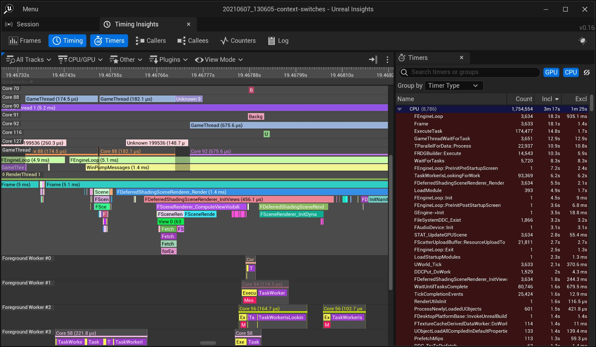
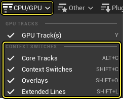
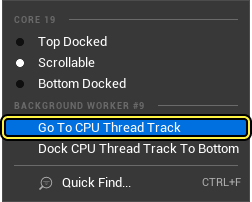
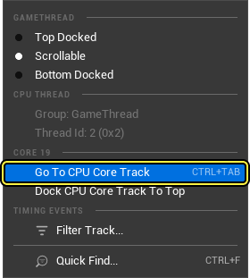

# 上下文切换

> 路径：虚幻引擎5.7文档 / 测试并优化你的内容 / Unreal Insights / Timing Insights / 上下文切换

> 原始页面：https://dev.epicgames.com/documentation/unreal-engine/context-switches-in-unreal-engine-5

## 上下文切换

**上下文切换（Context Switch）** 用于存储进程或线程的状态，以便稍后可以还原和恢复执行。 尝试使用启动程序版本（Launcher Build）来分析上下文切换时，需要确保在相应引擎版本的"选项（Options）"中启用"用于调试的编辑器符号（Editor Symbols for Debugging）"。

> [!NOTE]
> 上下文切换在Windows、XB1/XSX和PS4/PS5平台上受支持。

1. 你可以在命令行中启用 **ContextSwitch** 追踪通道：

   ```
            -trace=default,ContextSwitch		
   ```

   > [!WARNING]
   > 在Windows上，根据你的用户权限设置，你的项目运行时应"以管理员身份运行"。
2. 在Unreal Insights中打开追踪文件，如果某个会话启用了 `ContextSwitch` 追踪事件，则会在Timing Insights视图中显示以下信息：

a) 其他CPU核心轨道。 对于记录的追踪中的每个CPU内核都有一个轨道；其中显示时间事件，指明哪个线程在相应CPU内核上执行。 "未知（Unknown）"时间事件表示从其他应用程序/进程或从操作系统执行线程。

b) 每个CPU线程都有一个头部通道，其中包含内核编号事件，指明相应线程正在哪个内核上执行。 执行线程的时间范围以及被抢占的时间点都将突出显示出来。



c) "CPU/GPU"下拉菜单显示上下文切换的其他选项：



d) CPU线程轨道中"内核（Core）"时间事件的上下文菜单会显示其他选项：



e) CPU内核轨道中"线程（Thread）"时间事件的上下文菜单会显示其他选项：


