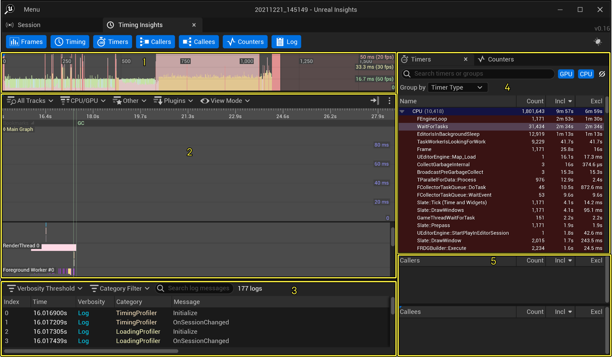
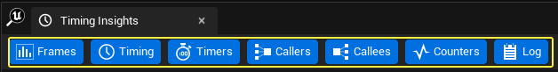
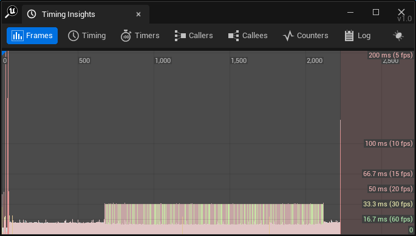
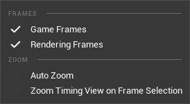
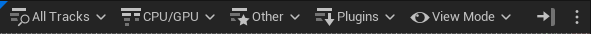
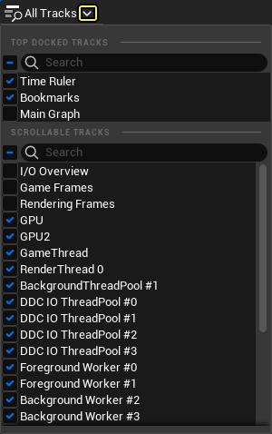
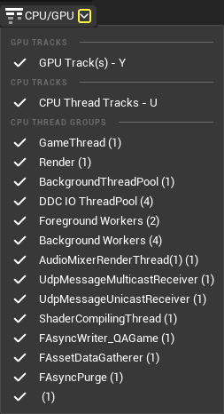
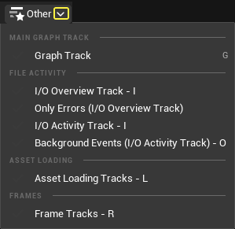

# Timing Insights

> 路径：虚幻引擎5.7文档 / 测试并优化你的内容 / Unreal Insights / Timing Insights

> 原始页面：https://dev.epicgames.com/documentation/unreal-engine/timing-insights-in-unreal-engine-5

在 **Timing Insights** 窗口中，你可以看到包括 **CPU** 轨道和 **GPU** 轨道在内的不同轨道的每帧性能数据。 **时序（Timing）视图** 有新 **工具栏** ，将轨道（Tracks）下拉菜单拆分为多个菜单，你可以在其中查看项目在各种任务上所花费时间的直观呈现。



Timing Insights窗口包含帧（Frames）面板（1）、时序（Timing）面板（2)、日志（Log）面板（3）、定时器（Timers）和计数器（Counters）选项卡（4），以及调用者（Callers）和被调用者（Callees）面板（5）。

## Timing Insights主工具栏

工具栏 提供了选择时间块来聚合查看数据、排列数据或将数据分类，以及查看日志输出的功能。

点击每个相应轨道，你可以切换可视性，显示该帧 **时序（Timing）** 、 **定时器（Timers）** 、 **调用者（Callers）** 、 **被调用者（Callees）** 、 **计数器（Counters）** 和 **日志（Log）** 轨道的数据。



你可以选择时间块来聚合查看数据、显示或隐藏相应面板、排列数据或将数据分类，以及查看日志输出。为此，请在 **帧（Frames）面板** 中点击单个帧，或点击并拖动时序面板顶部推移条的分段，称为 **时间标尺（Time Ruler）** 。

### 帧

**帧（Frames）** 面板使用条形图格式显示每帧所用的总时间。这对于识别一般趋势很有用，例如加载关卡、未优化场景可见，或同时生成大量Actor时性能低下或帧率下降。



帧面板会显示帧、时序、定时器、调用者、被调用者、计数器和日志轨道。

将光标悬停在条形上可显示该帧的索引和运行时间。

> 动图已省略：帧索引

如果右键点击条形，以下 **缩放（Zoom）** 上下文菜单选项将显示：



| 选项 | 说明 |
| --- | --- |
| **自动缩放（Auto Zoom）** | 切换自动缩放，使整个会话时间范围拟合帧显示窗口。 |
| **帧选择的缩放时序视图（Zoom Timing View on Frame Selection）** | 切换选择帧时是否缩放时序视图。 |

> [!NOTE]
> 这些选项在 `UnrealInsightsSettings.ini` 文件中也可供编辑。

### 时序

你可以点击每个轨道旁边的箭头来显示或隐藏轨道。



#### 所有轨道

点击 **所有轨道（All Tracks）** 下拉箭头将显示所有可用轨道的列表。



#### CPU/GPU

点击 **CPU/GPU** 下拉箭头将显示 CPU和GPU轨道和线程组选项。



#### 其他

点击 **其他（Other）** 下拉箭头将显示 **主图表（Main Graph）** 、 **文件活动（File Activity）** 、 **资产加载（Asset Loading）** 和 **帧轨道（Frames Tracks）** 可视性的选项。



#### 插件

点击 **插件（Plugins）** 下拉箭头将显示插件公开的轨道和选项，包括有关 **Slate** 、 **Gameplay** 、 **动画（Animation）** 和 **RDG轨道（RDG Tracks）** 的信息。

> 图片已省略：插件菜单

#### 视图模式

**视图模式（View Mode）** 下拉箭头将显示时序视图的各种选项的功能按钮。

> 图片已省略：视图模式选项

| 时序视图选项 | 说明 |
| --- | --- |
| **紧凑模式（Compact Mode）** （ *快捷键：C* ） | 切换紧凑模式，该模式将显示带有降低高度的支持轨道的时序轨道。 |
| **自动隐藏空轨道** （ *快捷键：V* ） | 自动隐藏没有时序事件的空轨道。此选项对 `UnrealInsightsSettings.ini` 文件是持久的。 |
| **深度限制** （ *快捷键：X* ）* 无限制 / 4通道/单通道 | 切换不同CPU深度选项的显示。 **X** 键可用作循环选择不同CPU深度选项的快捷方式。 |
| **着色模式** （CPU线程轨道） | 你可以根据时长（非独占时间）为CPU/GPU时序事件指定颜色。 颜色键如下： ≥ 10ms：红。 ≥ 1ms：黄。 ≥ 100μs：绿。 ≥ 10μs：青。 ≥ 1μs：蓝。 < 1μs：灰。 |
| **允许在屏幕边缘平移（Allow Panning on Screen Edges）** | 启用后，鼠标光标到达屏幕边缘时，平移会继续。 |

#### 快速查找控件

**快速查找（Quick Find）** 控件用于搜索和筛选 **时序视图（Timing View）** 中显示的事件。控件可以通过右键点击 **时序事件（Timing event）** 从时序（Timing）视图上下文菜单中打开，也可以在时序视图具有焦点时使用 **CTRL** + **F** 快捷键打开。

> 图片已省略：快速查找控件

快速查找（Quick Find）控件搜索逻辑使用 **组** 和 **筛选器** 定义。组节点包含子筛选器节点，并定义应用于子项结果的逻辑。筛选器节点是叶节点，每个节点都包含筛选器。

每个筛选器包含：

- 筛选器类型，可以从下拉菜单中选择。
- 筛选器运算符，也可以使用下拉菜单选择。
- 筛选器值，可以使用文本框输入。

创建筛选器逻辑后，它可以用于从时序视图搜索事件或筛选轨道。

| 筛选器 | 说明 |
| --- | --- |
| **查找第一个（Find First）** | 按事件开始时间的顺序搜索与筛选器匹配的第一个事件。如果找到匹配项，它将被选中，并且时序视图会将其显示在视图中。 |
| **查找上一个（Find Previous）** | 从当前所选事件的开始时间起，搜索与筛选器匹配的上一个事件。如果未选择事件，该筛选器将作为 **查找第一个（Find First）** 来使用。 |
| **查找下一个（Find Next）** | 从当前所选事件的开始时间起，搜索与筛选器匹配的下一个事件。如果未选择事件，该筛选器将作为 **查找最后一个（Find Last）** 来使用。 |
| **查找最后一个（Find Last）** | 按事件开始时间的顺序搜索与筛选器匹配的最后一个事件。如果找到匹配项，它将被选中，并且时序视图会将其显示在视图中。 |
| **元数据（Metadata）** | 提供一个筛选字段，允许根据多个元数据字段进行筛选。更多详情请参见下文的"如何使用元数据筛选器"一节。 |
| **应用筛选器（Apply Filter）** | 突出显示传递轨道筛选器逻辑的所有时序事件。 |
| **清除筛选器（Clear filters）** | 根据筛选器的逻辑停止突出显示事件。 |

> [!NOTE]
> 如果你更改筛选器的逻辑，就必须再次点击 **应用筛选器（Apply Filter）** 才能根据新逻辑突出显示事件。

##### 如何使用元数据筛选器

添加元数据筛选器后，它会提供多个字段。你可以在其中填写想要筛选的元数据。具体字段如下所示：

> 图片已省略：快速查找窗口中的元数据筛选器

| 索引 | 字段 | 说明 |
| --- | --- | --- |
| 1 | **键（Key）** | 包含一个元数据字段。它必须为字符串值且严格匹配。 |
| 2 | **数据类型（DataType）** | 你想要搜索的元数据字段类型。例如，是字符串还是浮点值。 |
| 3 | **运算符（Operator）** | 你想要应用到元数据值以及值（Value）文本框（详见下文）的运算符。可用的运算符取决于所选的数据类型（DataType）。 |
| 4 | **值（Value）** | 你想作为运算符第二成员使用的值。输入的值必须与所选的数据类型（DataType）兼容。 |

作为示例，你可以使用键"AssetPath"，类型"String"以及包含字符串"Pawn"的值创建一个元数据筛选器。

> 图片已省略：搜索键为

下方的第二个示例展示了奖元数据筛选器与其他类型筛选器结合使用的情况。它搜索所有名称为"FRDGBufferPool_CreateBuffer"，并有一个元数据字段的键为"SizeInBytes"、类型为整型（Int），且值大于6500的定时器命名事件。

> 图片已省略：搜索键为

> [!TIP]
> 你可以使用特殊字符串 `*` 显示所有拥有附加元数据的事件，忽略键、类型或值。

### 定时器

**定时器（Timers）** 面板列出了在时序（Timing）面板中指定时间范围内运行的所有定时器事件。除了基于时间范围的分组数据外，列表还可以按激活列中的值升序或降序排列。

| 组名称 | 说明 |
| --- | --- |
| **扁平（Flat）** | 创建单个组。包含所有定时器。 |
| **定时器名称（Timer Name）** | 为一个字母创建一个组。 |
| **定时器类型（Timer Type）** | 为每个定时器类型创建一个组。 |
| **实例数量（Instance Count）** | 为每个对数范围（1-10、10-100、100-1000）创建一个组。 |

要更改排列顺序，或者激活或停用列，请右键点击列。以下选项可用：

| 排序选项 | 其他排序选项 | 说明 |
| --- | --- | --- |
| **升序排序（Sort Ascending）** （按定时器、组名称、实例数量、总独占时间、总非独占时间。） |  | 按升序对列排序。 |
| **降序排序（Sort Descending）** （按定时器、组名称、实例数量、总独占时间、总非独占时间。） |  | 按降序对列排序。 |
| **排序依据（Sort By）** ： | 定时器或组名称 实例数量 总非独占时间 总独占时间 升序排序 降序排序 | 定时器或组的名称。 所选实例的数量。 所选定时器的实例的总非独占时长。 所选定时器的实例的总独占时长。 |

| 列可视性组 | 说明 |
| --- | --- |
| **视图列（View Column）** | 隐藏或显示以下列。 定时器或组名称 元组名称 类型 实例数量 总非独占时间 最大非独占时间 平均非独占时间 中值非独占时间 最小非独占时间 总独占时间 最大独占时间 平均独占时间 中值独占时间 最小独占时间 |
| **显示所有列（Show All Columns）** | 重置树状图以显示所有列。 |
| **将列重置为最小值/最大值/中值预设（Reset Columns to Min/Max/Median Preset）** | 将列重置为最小/最大/中值预设。 |
| **将列重置为默认值（Reset Columns to Default）** | 将列重置为默认值。 |

#### 资产加载时间

从命令行启动Timing Insights时，资产加载时间通道可用于为 `UObject::Serialize` 启用指定的CPU定时器并切换追踪蓝图名称。

> [!NOTE]
> 过去，追踪蓝图名称默认启用，这为追踪运行时事件带来了大量成本。现在，如果你想启用蓝图名称追踪，必须在命令行中开启此参数。

要从命令行启用资产加载时间追踪，你可以使用参数

```
	`-trace=default,AssetLoadTime` 
```

由于在开启蓝图名称时会添加许多定时器，所以蓝图名称在Trace Insights中默认隐藏。

##### 启用蓝图名称

启用资产加载时间追踪后，你可以添加以下参数来显示蓝图名称：

```
	`-statnamedevents` 。
```

#### 在不打开UI的情况下执行命令

Timing Insights可以在不打开UI的情况下直接从命令行运行。你可以直接在命令行中指定单个命令，也可以使用响应文件执行一系列命令。 在每种情况下，都会将一组数据导出到 `.csv` 或 `.tsv` 文件。

| 命令 | 说明 |
| --- | --- |
| `TimingInsights.ExportThreads` | 导出GPU和CPU线程的列表。 |
| `TimingInsights.ExporTimers` | 该命令会导出GPU和CPU定时器的列表。 |
| `TimingInsights.ExportTimingEvents` | 导出GPU和CPU时序事件的列表。导出的事件列表可以按线程、定时器或时间范围筛选。 |
| `TimingInsights.ExportTimerStatistics` | 该命令会导出GPU和CPU定时器及其聚合统计数据的列表。 |

这些命令很适合用于运行自动测试。

#### 导出功能

定时器（Timers）面板具有通过选择一个或多个定时器并右键点击上下文菜单来导出时序事件数据的功能。

> 图片已省略：undefined

**定时器选项（Timer Options）** 包括：

| 选项 | 说明 |
| --- | --- |
| **高亮显示事件（Highlight Event）** | 高亮显示选定定时器的所有时序事件实例。 |
| **剧情定时器（Plot Timer）** |  |
| **查找实例（Find Instance）** | 找到并选中指定时长的事件实例。这包括以下选项： 最大时长实例 -- 选择达到最大时长的事件实例。 最小时长实例 -- 选择达到最小时长的事件实例。 所选项中的最大时长实例 -- 只在用户当前所选项中选择达到最大时长的事件实例。 所选项中的最小时长实例 -- 只在用户当前所选项中选择达到最小时长的事件实例。 |
| **在Visual Studio中开源（Open Source in Visual Studio）** | 在Visual Studio中打开所选消息的源文件。 在使用此选项之前，必须已经打开Visual Studio，否则可能只会打开其开始（Start）页面。 |

其他 **杂项（Miscellaneous）** 导出选项包括以下内容：

| 选项 | 说明 |
| --- | --- |
| **复制到剪贴板（Copy To Clipboard）** （CTRL+C） | 将选择的定时器及其事件复制到剪贴板。 |
| **导出（Export）** (CTRL+S) | 将选定的定时器及其分组统计数据导出到文本文件。 你可以找到时序（Timing）视图，点击并拖动时间栏，从主时间轴视图中标记你有兴趣导出的时间。 观察分组统计信息在定时器（Timers）面板中更新，体现时间选择。 从定时器（Timers）面板中，手动选择你有兴趣保存的定时器，或使用Ctrl+A选择所有定时器。 然后，按CTRL+S，或从上下文菜单中选择"导出（Export）"并选择 `*.tsv` 、 `*.txt` 或 `*.csv` 文件，以保存所选定时器及其聚合统计数据（针对所选时间范围）。 |
| **导出时序事件（Export Timing Events）** | 将时序事件导出到文本文件。 找到时序（Timing）视图，点击并拖动时间栏，从主时间轴视图中标记你有兴趣导出的时间。 如果没有选择时间，将导出整个时间轴。 在时序（Timing）面板中，点击CPU/GPU线程轨道，以显示或隐藏你想导出的轨道。 选择你感兴趣的定时器，或使用Ctrl+A选择所有定时器。 从上下文菜单选择 **导出时序事件（选择）...（Export Timing Events (Selection)...）**，并选择用制表符分隔的值（ `*.tsv/*.txt` ）或用逗号分隔的值（ `*.csv` ）文件。 你可以导出"线程"和"定时器"，以便将线程ID和定时器ID与线程和定时器的名称相匹配。 |
| **更多导出选项（More Export Options）** / **导出线程（Export Threads）** | 将定时器列表导出到文本文件。（ `.tsv` 或.`csv` ）。 |
| **更多导出选项（More Export Options）** / **导出时序事件（全部）（Export Timing Events (All)）** | 将全部CPU/GPU线程的全部时序事件导出到文本文件（ `.tsv` 或.`csv` ）。 导出文件可能很大，即使是小会话也可能有数百万个时序事件。 |

#### CPU定时器的源文件

在"定时器（Timers）"面板中，源文件和行号在每个定时器的提示文本中可见。

> 图片已省略：cpu定时器的源文件

### 调用者和被调用者

**调用者（Callers）** 和 **被调用者（Callees）** 面板将显示任务事件的层级列表。从时序（Timing）视图选择事件时，将鼠标悬停在个别任务的信息图表上，将显示以下信息：

- Id
- 名称（Name）
- 类型（Type）
- 源（Source）
- 实例数量（Num Instances）

  *包括有关

  实例数量（Instance count）

  以及总

  非独占（Inclusive）

  和

  独占（Exclusive）

  时间的详细信息。
- 平均非独占/独占时间（Average Inclusive / Exclusive Time）

  - 总非独占/独占时间除以实例数量得到的平均时长。
- 子实例数量（Child Instance Count）

  - 子定时器的时序事件总数（调用者或被调用者）。

> 图片已省略：调用者和被调用者面板

### 计数器

**计数器（Counters）** 面板列出了在与定时器（Timers）面板相同的时间段内递增的所有统计数据。你可以通过更新排序顺序和整理列来重新排列该面板。

以下组可用：

| 组名称 | 说明 |
| --- | --- |
| **扁平（Flat）** | 创建单个组。包括所有计数器。 |
| **统计数据名称（Stats Name）** | 为一个字母创建一个组。 |
| **元组名称（Meta Group Name）** | 根据计数器的元数据组名称创建组。 |
| **计数器类型（Counter Type）** | 为每个计数器类型创建一个组。 |
| **数据类型（Data Type）** | 为每个数据类型创建一个组。 |
| **数量（Count）** | 为每个对数范围（1-10、10-100、100-1000）创建一个组。 |

#### 窗口性能计数器

在满足以下先决条件时，计数器列表中会出现窗口性能计数器：

- 命令行中存在

  -perfcounters

  。
- 启用了

  counters

  追踪通道。

这些计数器将显示前缀：`PC /`。

### 日志

**日志（Log）** 视图将显示从Trace会话调用宏 **UE_LOG** 生成的全部日志。你可以按 **冗长度** 和 **类别** 筛选日志，类似于编辑器中的 **输出日志（Output Log）** 窗口。

> 图片已省略：日志视图

在时序（Timing）面板中选择时间段会高亮显示位于该时间范围内的所有日志条目。如果选择多个日志条目，时序（Timing）面板会高亮显示这些条目之间的时间范围。 该日志面板具有搜索框，可以筛选掉所有与你输入的文本不匹配的日志消息。除了筛选之外，点击任意行会将时序（Timing）面板平移到记录该行文本的时间。 选择一条或多条消息，右键点击上下文菜单并从下拉菜单中选择以下选项之一，你可以保存日志：

| 菜单选项 | 说明 |
| --- | --- |
| **复制（Copy）** (CTRL+C) | 将选定的日志（及其所有属性）复制到剪贴板。 |
| **复制消息（Copy Message）** (SHIFT+C) | 将所选日志的消息文本复制到剪贴板 |
| **复制范围（Copy Range）** (CTRL+SHIFT+C) | 将所选时间范围内的全部日志（以蓝色高亮显示）复制到剪贴板。 |
| **复制全部（Copy All）** | 将全部日志复制到剪贴板 |
| **将范围另存为（Save Range As）** (CTRL+S) | 将所选时间范围内的全部日志（以蓝色高亮显示）保存到文本文件（用制表符分隔的值或用逗号分隔的值）。 |
| **全部另存为（Save All As）** | 将全部（筛选过的）日志保存到文本文件（用制表符分隔的值或用逗号分隔的值） |
| **在Visual Studio中打开源（Open Source in Visual Studio）** | 在Visual Studio（或注册的IDE）中打开所选消息的源文件。 在使用此选项之前，必须已经打开Visual Studio，否则可能只会打开其开始（Start）页面。 |
