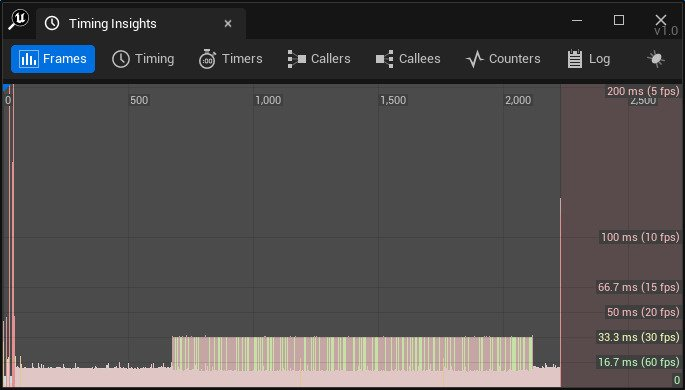
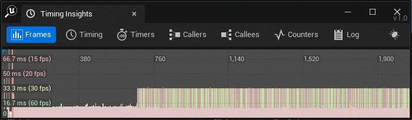
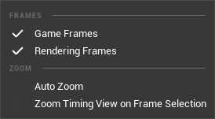

# 帧面板

> 路径：虚幻引擎5.7文档 / 测试并优化你的内容 / Unreal Insights / Timing Insights / 帧面板

> 原始页面：https://dev.epicgames.com/documentation/unreal-engine/using-the-frames-panel-in-unreal-insights-for-unreal-engine

**帧（Frames）** 面板使用条形图格式显示每帧所用的总时间。这对于识别一般趋势很有用，例如加载关卡、未优化场景可见，或同时生成大量Actor时性能低下或帧率下降。

帧面板会显示帧、时序、定时器、调用者、被调用者、计数器和日志轨道。

将光标悬停在条形上可显示该帧的索引和运行时间。

如果右键点击条形，以下 **缩放（Zoom）** 上下文菜单选项将显示：

| **选项** | **说明** |
| --- | --- |
| **自动缩放（Auto Zoom）** | 切换自动缩放，使整个会话时间范围拟合帧显示窗口。 |
| **帧选择的缩放时序视图（Zoom Timing View on Frame Selection）** | 切换选择帧时是否缩放时序视图。 |

> [!NOTE]
> 这些选项在UnrealInsightsSettings.ini文件中也可供编辑。
