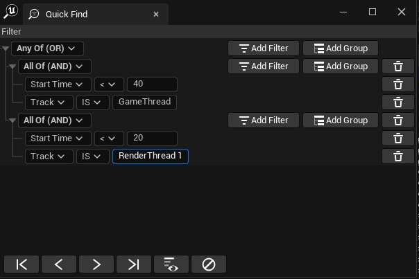
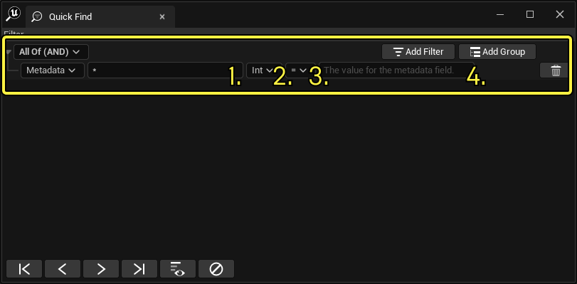
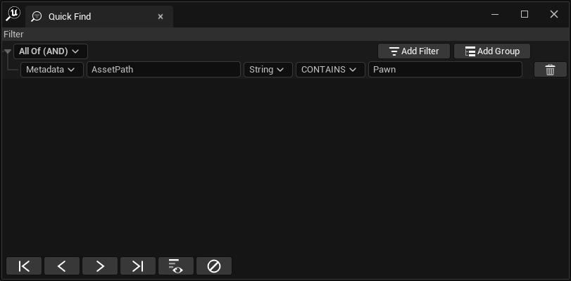
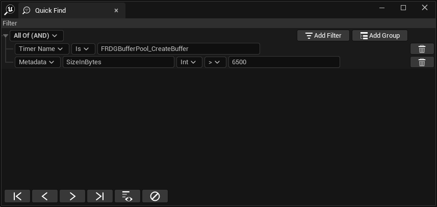

# 快速查找控件

> 路径：虚幻引擎5.7文档 / 测试并优化你的内容 / Unreal Insights / Timing Insights / 快速查找控件

> 原始页面：https://dev.epicgames.com/documentation/unreal-engine/using-the-quick-find-widget-in-timing-insights-for-unreal-engine

**快速查找（Quick Find）** 控件用于搜索和筛选[时序视图](https://dev.epicgames.com/documentation/404)中显示的事件。控件可以通过右键点击 **时序事件（Timing event）** 从时序（Timing）视图上下文菜单中打开，也可以在时序视图具有焦点时使用 **CTRL** + **F** 快捷键打开。

快速查找（Quick Find）控件搜索逻辑使用 **组（Group）** 和 **筛选器（Filter）** 定义。组节点包含子筛选器节点，并定义应用于子项结果的逻辑。筛选器节点是叶节点，每个节点都每包含一个筛选器。

每个筛选器包含：

- 筛选器类型，可以从下拉菜单中选择。
- 筛选器运算符，也可以使用下拉菜单选择。
- 筛选器值，可以使用文本框输入。

创建筛选器逻辑后，它可以用于从时序视图搜索事件或筛选轨道。

## 筛选器组和组类型

筛选器组决定了值应该如何按其下的筛选器分组被返回。以下是可用的筛选器组类型：

| **筛选器组类型** | **说明** |
| --- | --- |
| All Of (AND) | 仅返回匹配组中所有筛选器的筛选结果。 |
| All Of (OR) | 仅返回匹配组中任何筛选器的筛选结果。 |

可以添加多个筛选器组以创建更复杂的逻辑。

## 筛选器值

你可以使用下列参数作为单个筛选器的值：

| **筛选器名称** | **值类型** | **说明** |
| --- | --- | --- |
| 开始时间（Start Time） | 浮点 | 定时器的开始时间。 |
| 结束时间（End Time） | 浮点 | 定时器的结束时间。 |
| 时长（Duration） | 浮点 | 定时器处于激活状态的时长。 |
| 轨道（Track） | 字符串 | 定时器所属轨道的名称。 |
| 定时器ID（Timer ID） | 整型 | 定时器的唯一ID。 |
| 定时器名称（Timer Name） | 字符串 | 定时器的名称。 |
| 元数据（Metadata） | 见说明 | 使用两个不同的字段，根据键值对进行搜索。第一个字段是键，你可以自行指定值的类型。这将是元数据筛选器所要搜索的键。第二个值是要与之比较的元数据的值。 |

### 开始时间、结束时间、时长和定时器ID的运算符

数值筛选器使用标准布尔运算符进行比较。

### 轨道和定时器名称的运算符

基于字符串的筛选器使用以下字符串运算符进行比较：

| **运算符** | **说明** |
| --- | --- |
| IS | 返回与所提供字符串完全匹配的值。 |
| IS NOT | 返回与所提供字符串不匹配的值。 |
| CONTAINS | 返回包含作为子项字符串而提供的字符串的值。 |
| NOT CONTAINS | 返回不包含所提供字符串的值。 |

### 如何使用元数据筛选器

添加元数据筛选器后，该筛选器会提供多个字段，供你在其中填写想要筛选的元数据。具体字段如下：

| **索引** | **字段** | **说明** |
| --- | --- | --- |
| 1 | 键（Key） | 包含一个元数据字段。必须是字符串值且完全匹配。 |
| 2 | 数据类型（DataType） | 需搜索的元数据字段类型。例如字符串或浮点。 |
| 3 | 运算符（Operator） | 需应用到元数据值和值（Value）文本框（见下行）中值的运算符。可用的运算符取决于所选的数据类型（DataType）。 |
| 4 | 值（Value） | 要用作运算符第二成员的值。输入的值必须与所选的数据类型（DataType）兼容。 |

例如，你可以创建一个元数据筛选器，键为"AssetPath"，类型字为符串，而值则包含字符串"Pawn"。

下面的第二个示例展示的是元数据筛选器与其他类型筛选器的组合。它搜索所有名称为"FRDGBufferPool_CreateBuffer"、元数据字段键为"SizeInBytes"、类型为整型、值大于6500的定时器名称事件。

> [!NOTE]
> 你可以用特殊字符串 `*` 来显示所有附带元数据的事件，不论其键、类型或值为何。

## 功能按钮

快速查找（Quick Find）面板底部的功能按钮如下：

| **操作** | **说明** |
| --- | --- |
| **查找第一个（Find First）** | 按事件开始时间的顺序搜索与筛选器匹配的第一个事件。如果找到匹配项，它将被选中，并且时序视图会将其显示在视图中。 |
| **查找上一个（Find Previous）** | 从当前所选事件的开始时间起，搜索与筛选器匹配的上一个事件。如果未选择事件，该筛选器将作为 **查找第一个（Find First）** 来使用。 |
| **查找下一个（Find Next）** | 从当前所选事件的开始时间起，搜索与筛选器匹配的下一个事件。如果未选择事件，该筛选器将作为 **查找最后一个（Find Last）** 来使用。 |
| **查找最后一个（Find Last）** | 按事件开始时间的顺序搜索与筛选器匹配的最后一个事件。如果找到匹配项，它将被选中，并且时序视图会将其显示在视图中。 |
| **元数据（Metadata）** | 提供一个可使用多个元数据字段进行筛选的字段。更多详情请参阅下文的"如何使用元数据筛选器"一节。 |
| **应用筛选器（Apply Filter）** | 突出显示传递轨道筛选器逻辑的所有时序事件。 |
| **清除筛选器（Clear filters）** | 根据筛选器的逻辑停止突出显示事件。 |

> [!NOTE]
> 如果你更改筛选器的逻辑，就必须再次点击 **应用筛选器（Apply Filter）** 才能根据新逻辑突出显示事件。
