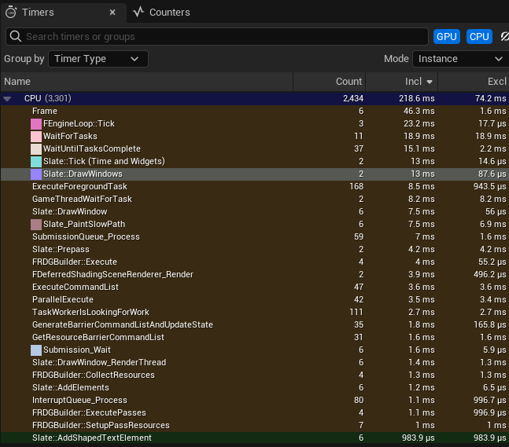
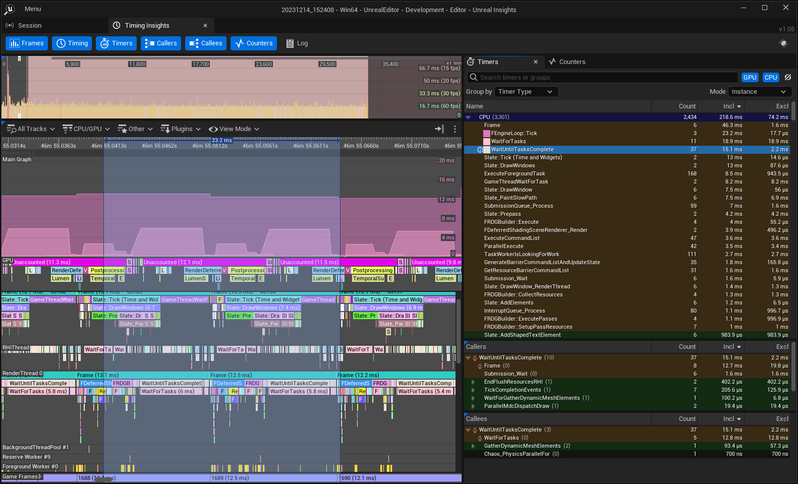
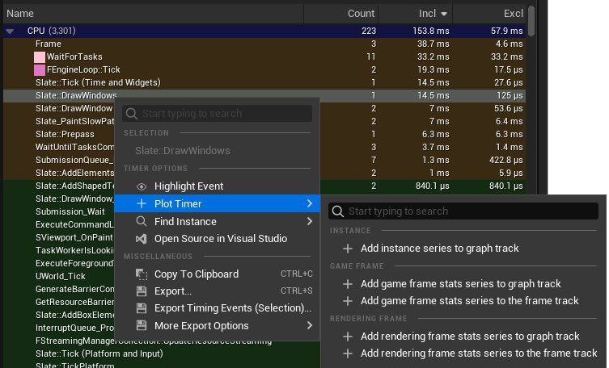
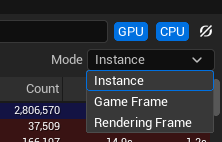
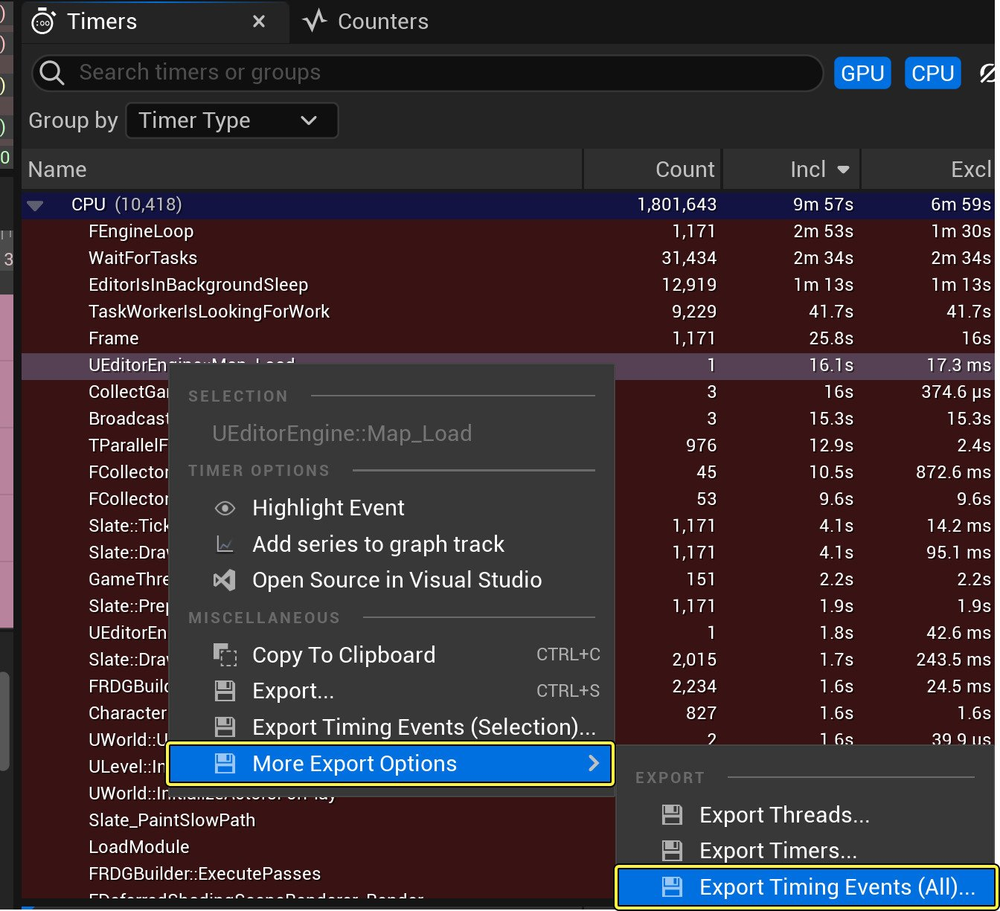
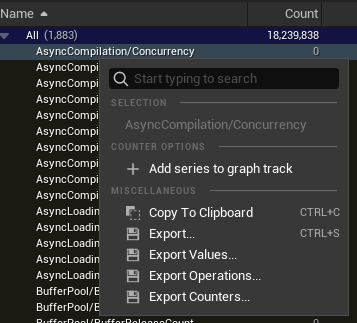
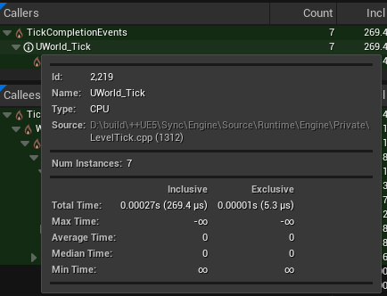

# 计时器和计数器

> 路径：虚幻引擎5.7文档 / 测试并优化你的内容 / Unreal Insights / Timing Insights / 计时器和计数器

> 原始页面：https://dev.epicgames.com/documentation/unreal-engine/using-the-timers-and-counters-tabs-in-unreal-insights-for-unreal-engine

**计时器（Timers）** 和 **调用者（Callers）** 面板列出了在时序（Timing）面板中高亮的范围内发生的事件。每个面板都有类似的功能按钮，但显示各个事件的不同信息。

## 计时器



**计时器（Timers）** 面板列出了在时序（Timing）面板中指定时间范围内运行的所有计时器事件。除了基于时间范围的分组数据外，列表还可以按激活列中的值升序或降序排列。

| **组名称** | **说明** |
| --- | --- |
| **扁平（Flat）** | 创建单个组。包含所有计时器。 |
| **计时器名称（Timer Name）** | 为一个字母创建一个组。 |
| **计时器类型（Timer Type）** | 为每个计时器类型创建一个组。 |
| **实例数量（Instance Count）** | 为每个对数范围（1-10、10-100、100-1000）创建一个组。 |

### 在主图表中绘制事件

双击计时器面板列表中的事件，即可将其高亮显示。这时列表中的事件旁会出现一个彩色方框，而主图表则会用相应的颜色绘制该事件。再次双击该事件可将其删除。



右键点击该事件并前往绘制计时器（Plot Timer）子菜单，以获取更多绘图表选项。



| **选项** | **说明** |
| --- | --- |
| 将实例系列添加至图表轨道（Add instance series to graph track） | 将所选事件的所有实例绘制在计时器面板的主图表上。 |
| 将游戏帧统计数据系列添加至图表轨道（Add game frame stats series to graph track） | 在计时器面板的主图表中绘制所选事件的游戏帧信息。 |
| 将游戏帧统计数据系列添加至帧轨道（Add game frame stats series to the frame track） | 在帧面板的图表中绘制所选事件的游戏帧信息。 |
| 将渲染帧统计数据系列添加至图表轨道（Add rendering frame stats series to graph track） | 在计时器面板的主图表中绘制所选事件的渲染帧信息。 |
| 将渲染帧统计数据系列添加至帧轨道（Add rendering frame stats series to the frame track） | 在帧面板的图表中绘制渲染帧信息。 |

### 聚合模式



点击 **模式（Modes）** 下拉菜单，选择一种可用的聚合模式。每种模式都以不同的方式计算计时器统计数据，显示的数据也不同。

| **模式** | **说明** |
| --- | --- |
| 实例（Instance） | 逐计时器实例计算计时器统计数据。 |
| 游戏帧（Game Frame） | 逐游戏帧计算计时器统计数据。 |
| 渲染帧（Rendering Frame） | 逐渲染帧计算计时器统计数据。 |

#### 实例模式

在实例模式中，计时器列表将显示下列数据：

| **值** | **说明** |
| --- | --- |
| 计时器或组名称（Timer or Group Name）（名称） | 计时器或组的名称。 |
| 实例数量（Instance Count）（数量） | 所选计时器的时序事件实例的数量。 |
| 非独占帧时间（Inclusive Frame Time）（非独占） | 所选计时器实例的总非独占时长。 |
| 独占帧时间（Exclusive Frame Time）（独占） | 所选计时器实例的总独占时长。 |

#### 游戏/渲染帧模式

在游戏（Game）或渲染（Rendering）帧模式下，计时器列表会显示所列计时器事件的非独占时长。单一帧的非独占时长为相应帧中所有计时器实例的非独占时长之和。所列的全部时间数值单位均为毫秒（ms）。

| **值** | **说明** |
| --- | --- |
| 计时器或组名称（Timer or Group Name）（名称） | 计时器或组的名称。 |
| 最大非独占时间（Max Inclusive Time）（最大非独占） | 计算所选计时器事件的帧的最大非独占时长。最大值从每帧非独占的时长中选出。 |
| 平均非独占时间（Average Inclusive Time）（平均非独占） | 计算所选计时器事件的平均每帧非独占时长。 |
| 中值非独占时间（Median Inclusive Time）（中值非独占） | 所选计时器事件的每帧非独占时长的中位数近似值。 |
| 最小非独占时间（Minimum Inclusive Time）（最小非独占） | 计算所选计时器事件的帧的最小非独占时长。最大值从每帧非独占的时长中选出。 |

### 更改排序

要更改排列顺序，或者激活或停用列，请右键点击列。以下选项可用：

| **排序选项** | **额外排序选项** | **说明** |
| --- | --- | --- |
| **升序排序（Sort Ascending）** （按计时器、组名称、实例数量、总独占时间、总非独占时间。） |  | 按升序对列排序。 |
| **降序排序（Sort Descending）** （按计时器、组名称、实例数量、总独占时间、总非独占时间。） |  | 按降序对列排序。 |
| **排序依据（Sort By）** ： | 计时器或组名称（Timer or Group Name） |  |

实例数量（Instance Count） 总非独占时间（Total Inclusive Time） 总独占时间（Total Exclusive Time） 升序排序（Sort Ascending） 降序排序（Sort Descending） | 计时器或组的名称。 所选实例的数量。 所选计时器实例的总非独占时长。 所选计时器实例的总独占时长。 |

| **列可视性组** | **说明** |
| --- | --- |
| **视图列（View Column）** | 隐藏或显示以下列。 |

计时器或组名称（Timer Or Group Name） 元组名称（Meta Group Name） 类型（Type） 实例数量（Instance Count） 总非独占时间（Total Inclusive Time） 最大非独占时间（Max Inclusive Time） 平均非独占时间（Average Inclusive Time） 中值非独占时间（Median Inclusive Time） 最小非独占时间（Min Inclusive Time） 总独占时间（Total Exclusive Time） 最大独占时间（Max Exclusive Time） 平均独占时间（Acerga Exclusive Time） 中值独占时间（Median Exclusive Time） 最小非独占时间（Min Exclusive Time）|

| 列 1 | 列 2 |
| --- | --- |
| **显示所有列（Show All Columns）** | 重置树状图以显示所有列。 |
| **将列重置为最小值/最大值/中值预设（Reset Columns to Min/Max/Median Preset）** | 将列重置为最小/最大/中值预设。 |
| **将列重置为默认值（Reset Columns to Default）** | 将列重置为默认值。 |

### 资产加载时间

从命令行启动Timing Insights时，资产加载时间通道可用于为UObject::Serialize启用指定的CPU计时器并切换追踪蓝图名称。

要从命令行启用资产加载时间追踪，你可以使用下列参数

```
  -trace=default,AssetLoadTime
```

由于在开启蓝图名称时会添加许多计时器，所以蓝图名称在Trace Insights中默认隐藏。

### 启用蓝图名称

> [!NOTE]
> 如果你想启用蓝图名称追踪，则必须在命令行中开启此参数。

启用资产加载时间追踪后，你可以添加以下参数来显示蓝图名称：

```
  `-statnamedevents`
```

### 在不打开UI的情况下执行命令

Timing Insights可以在不打开UI的情况下直接从命令行运行。你可以直接在命令行中指定单个命令，也可以使用响应文件执行一系列命令。在每种情况下，都会将一组数据导出为.csv或.tsv文件。

| **命令** | **说明** |
| --- | --- |
| `TimingInsights.ExportThreads` | 导出GPU和CPU线程的列表。 |
| `TimingInsights.ExporTimers` | 该命令会导出GPU和CPU计时器的列表。 |
| `TimingInsights.ExportTimingEvents` | 导出GPU和CPU时序事件的列表。导出的事件列表可以按线程、计时器或时间范围筛选。 |
| `TimingInsights.ExportTimerStatistics` | 该命令会导出GPU和CPU计时器及其聚合统计数据的列表。导出的文件数量限制为：单个区域限100个，导出的.csv文件总数限10000个。在指定区域时，此命令支持使用?-类型的通配符。 |

这些命令很适合用于运行自动测试。

要在命令行中指定响应文件，请使用参数 `-ExecOnAnalysisCompleteCmd` ，并提供将响应文件导出为.`rsp` 文件的位置。例如：

```
 UnrealInsights.exe -OpenTraceFile=path/file.utrace -AutoQuit -NoUI -ExecOnAnalysisCompleteCmd="@=D:\Tests\export.rsp" 
```

### 导出功能

计时器（Timers）面板具有通过选择一个或多个计时器并右键点击上下文菜单来导出时序事件数据的功能。



**计时器选项（Timer Options）** 包括：

| **选项** | **说明** |
| --- | --- |
| **高亮显示事件（Highlight Event）** | 高亮显示所选计时器的所有时序事件实例。 |
| **绘制计时器（Plot Timer）** |  |
| **查找实例（Find Instance）** | 找到并选中指定时长的事件实例。这包括以下选项： |

最大时长实例（Maximum Duration Instance） -- 选择时长最大的事件实例。 最小时长实例（Minimum Duration Instance） -- 选择时长最小的事件实例。 所选项中的最大时长实例（Maximum Duration Instance in Selection） -- 同最大时长实例，但只在用户当前所选项中选择。 所选项中的最小时长实例（Minimum Duration Instance in Selection） -- 同最小时长实例，但只在用户当前所选项中选择。 |

| 列 1 | 列 2 |
| --- | --- |
| **在Visual Studio中打开源（Open Source in Visual Studio）** | 在Visual Studio中打开所选消息的源文件。 |
| 在使用此选项之前，必须已经打开Visual Studio，否则可能只会打开其开始（Start）页面。 |  |

其他 **杂项（Miscellaneous）** 导出选项包括以下内容：

| **选项** | **说明** |
| --- | --- |
| **复制到剪贴板（Copy To Clipboard）** （CTRL+C） | 将选定的计时器及其事件复制到剪贴板。 |
| **导出（Export）** （CTRL+S） | 将选定的计时器及其分组统计数据导出为文本文件。 |

你可以找到时序（Timing）视图，点击并拖动时间栏，从主时间轴视图中标记你有兴趣导出的时间。 观察分组统计信息在计时器（Timers）面板中更新，体现时间选择。 从计时器（Timers）面板中，手动选择你有兴趣保存的计时器，或使用Ctrl+A选择所有计时器。 然后，按CTRL+S，或从上下文菜单中选择导出（Export）并选择 *.tsv、*.txt或*.csv文件，保存所选计时器及其聚合统计数据（针对所选时间范围）。 |

| 列 1 | 列 2 |
| --- | --- |
| **导出时序事件（Export Timing Events）** | 将时序事件导出为文本文件。 |

找到时序（Timing）视图，点击并拖动时间栏，从主时间轴视图中标记你有兴趣导出的时间。 如果没有选择时间，将导出整个时间轴。 在时序（Timing）面板中，点击CPU/GPU线程轨道，以显示或隐藏你想导出的轨道。 选择你感兴趣的计时器，或使用Ctrl+A选择所有计时器。 从上下文菜单选择 **导出时序事件（选择）...（Export Timing Events (Selection)...）** ，并选择用制表符分隔的值（*.tsv/*.txt）或用逗号分隔的值（*.csv）文件。 你可以导出"线程"和"计时器"，以便将线程ID和计时器ID与线程和计时器的名称相匹配。 |

| 列 1 | 列 2 |
| --- | --- |
| **更多导出选项（More Export Options）** / **导出线程（Export Threads）** | 将计时器列表导出为文本文件。（.tsv或.csv）。 |
| **更多导出选项（More Export Options）** / **导出时序事件（全部）（Export Timing Events (All)）** | 将所有CPU/GPU线程的全部时序事件导出为文本文件（.tsv或.csv）。 |
| 导出的文件可能很大，即使是小会话也可能有数以百万计的时序事件。 |  |

### CPU计时器的源文件

在"计时器（Timers）"面板中，源文件和行号在每个计时器的提示文本中可见。

## 计数器

**计数器（Counters）** 面板列出了在与计时器（Timers）面板相同的时间段内递增的所有统计数据。你可以通过更新排序顺序和整理列来重新排列该面板。

以下组可用：

| **组名称** | **说明** |
| --- | --- |
| **扁平（Flat）** | 创建单个组。包括所有计数器。 |
| **统计数据名称（Stats Name）** | 为一个字母创建一个组。 |
| **元组名称（Meta Group Name）** | 根据计数器的元数据组名称创建组。 |
| **计数器类型（Counter Type）** | 为每个计数器类型创建一个组。 |
| **数据类型（Data Type）** | 为每个数据类型创建一个组。 |
| **数量（Count）** | 为每个对数范围（1-10、10-100、100-1000）创建一个组。 |

### 上下文菜单

计数器（Counters）的上下文菜单提供了选项，用于复制数据和将数值导出为制表符分隔值（TSV）电子表格。



| **选项** | **说明** |
| --- | --- |
| 所选项（Selection） | 显示所选计数器的摘要。 |
| 将系列添加到图表轨道（Add Series to Graph Track） | 将所选计数器添加到主图表。 |
| 复制到剪贴板（Copy To Clipboard） | 将所选计数器的数据按制表符分隔的格式复制到剪贴板。 |
| 导出（Export） | 导出包含所选计数器数据的制表符分隔值（.tsv）文件。 |
| 导出值（Export Values） | 导出所选计数器的 `.tsv` 文件，但其中只包含主图表中选定时间区域的计数器数值。 |
| 导出操作（Export Operations） | 导出所选计数器操作的 `.tsv` 文件，但其中只包含主图表中选定时间区域的操作。 |
| 导出计数器（Export Counters） | 以 `.tsv` 文件形式导出完整的计数器列表。 |

### 1/帧计数器

正常的计数器会显示单帧活动中的所有中间点。**1/帧（1/frame）** 的变体则使用 `ShouldClearEveryFrame` 标记，并显示 `(1/frame)` 后缀。这种计数器只显示每个游戏线程的单个值，特别是对应帧中的最后一个值。在研究多帧之间的变化时，这种计数器更为适用。

### 窗口性能计数器

在满足以下先决条件时，计数器列表中会出现窗口性能计数器：

- 命令行中存在 `-perfcounters` 。
- 启用了计数器追踪通道。

这些计数器将显示前缀"PC /"。

## 调用者和被调用者

**调用者（Callers）** 和 **被调用者（Callees）** 面板将显示任务事件的层级列表。从时序（Timing）视图选择事件时，将鼠标悬停在单个任务的信息图标上，即可显示以下信息：

- Id
- 名称（Name）
- 类型（Type）
- 源（Source）
- 实例数量（Num Instances）（Num Instances）

  - 关于

    实例数量（Instance count）

    、总

    非独占（Inclusive）

    和

    独占（Exclusive）

    时间的详细信息。
- 平均非独占/独占时间（Average Inclusive / Exclusive Time）

  - 总非独占/独占时间除以实例数量得到的平均时长。
- 子实例数量（Child Instance Count）

  - 子计时器的时序事件总数（调用者或被调用者）。


