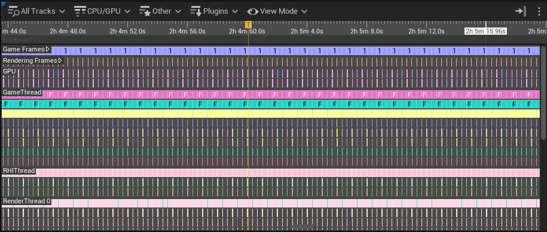
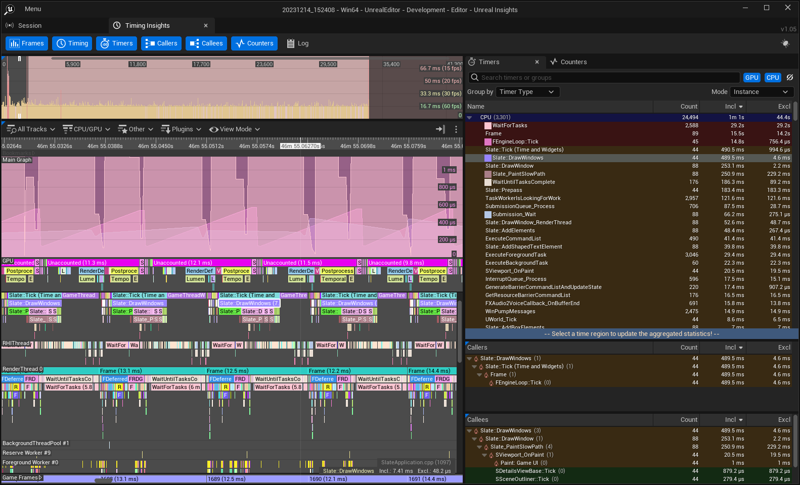
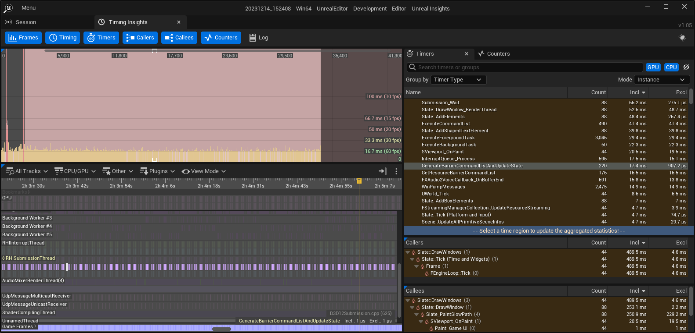
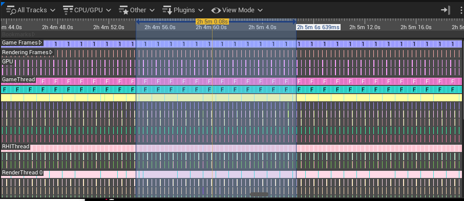
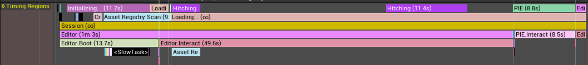
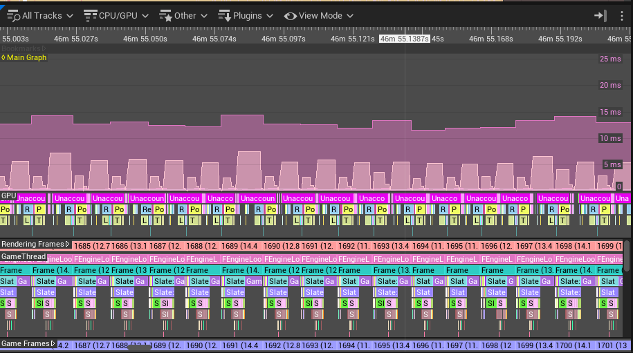
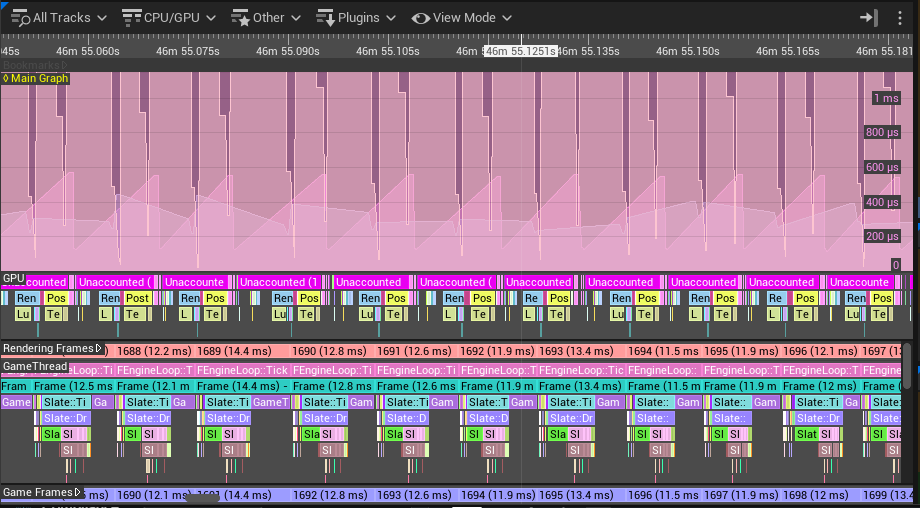
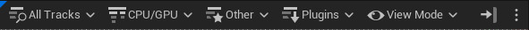

# 时序面板

> 路径：虚幻引擎5.7文档 / 测试并优化你的内容 / Unreal Insights / Timing Insights / 时序面板

> 原始页面：https://dev.epicgames.com/documentation/unreal-engine/using-the-timing-panel-in-unreal-insights-for-unreal-engine

**时序面板（Timing Panel）** 显示CPU/GPU占用的详细视图，将每个线程按不同轨道排列。每个轨道都代表一个处理线程，并显示事件的时间轴。每个事件的宽度表示线程处理该事件所消耗的时间。



## 选择事件

单击时间轴上任何轨道中的事件，即可在计时器（Timers）和计数器（Counters）面板中高亮显示该事件。



双击某个事件即可高亮显示该事件及该事件的任何其他实例。此时所有其他事件都将变为灰色。再次双击该事件的实例，即可让所有其他事件重新高亮显示。



## 浏览时间轴

点击并拖曳时间轴下方的任意位置，即可浏览时序面板。

点击时序面板内的任意位置，使用鼠标滚轮，即可放大或缩小时间轴。这样就可以扩大或缩小显示的时间范围。

## 选择时间范围

要高亮显示时序面板的某个区域，请在面板顶部的时间轴内点击并拖曳。该区域内的所有进程都会显示在计时器（Timers）和计数器（Counters）面板中。



你也可以使用"帧（Frames）"面板来选择时间范围。点击帧面板中的某个帧，然后按住Shift并点击另一个帧，即可选择两个帧之间所包含的区域。

## 时序区域轨道



**时序区域（Timing Regions）** 轨道显示由 `TRACE_BEGIN_REGION` 和 `TRACE_END_REGION` API所发出的长期事件。此追踪数据由最新的 **区域（Regions）** 追踪通道控制，而该通道位于 **默认（Default）** 预设中。

## 主图表

点击 **所有轨道（All Tracks）** > **主图表（Main Graph）** 以显示主图表。主图表将显示你在计时器（Timers）和计数器（Counters）面板中高亮显示的所有事件，并以另一种可视化方式显示这些事件所用的时间。



点击主图表，按住Shift键，并使用鼠标滚轮缩放图表。这样做并不会放大或缩小时间轴。相反，这样可以改变纵轴上的时间比例，从而使较小的时间值更加清晰易读。



## 绘制事件

要在主图表中绘制事件，请按住 **Shift** 键并点击时间轴中的事件。这时事件将在主图表中显示，并带有指定的颜色代码。如需详细了解绘制事件及其选项，请参阅下文的"在主图表中绘制事件"小节。

## 时序筛选器



时序面板给出了筛选条件列表，可以用来缩小轨道的显示范围。

### 所有轨道

点击 **所有轨道（All Tracks）** 下拉箭头将显示所有可用轨道的列表。

### CPU/GPU

> 图片已省略：CPU和GPU筛选器的下拉菜单。

点击 **CPU/GPU** 下拉箭头，即可显示"CPU和GPU轨道和线程"的组选项。

### 其他

> 图片已省略：其他筛选器的下拉菜单。

点击 **其他（Other）** 下拉箭头将显示 **主图表（Main Graph）** 、 **文件活动（File Activity）** 、 **资产加载（Asset Loading）** 和 **帧轨道（Frames Tracks）** 可视性的选项。

### 插件

点击 **插件（Plugins）** 下拉箭头将显示插件公开的轨道和选项，包括有关 **Slate** 、 **Gameplay** 、 **动画（Animation）** 和 **RDG轨道（RDG Tracks）** 的信息。

### 如何使用元数据筛选器

添加元数据筛选器后，该筛选器会提供多个字段，供你在其中填写想要筛选的元数据。具体字段如下：

| **索引** | **字段** | **说明** |
| --- | --- | --- |
| 1 | **键（Key）** | 包含一个元数据字段。必须是字符串值且完全匹配。 |
| 2 | **数据类型（DataType）** | 需搜索的元数据字段类型。例如字符串或浮点。 |
| 3 | **运算符（Operator）** | 需应用到元数据值和值（Value）文本框（见下行）中值的运算符。可用的运算符取决于所选的数据类型（DataType）。 |
| 4 | **值（Value）** | 用作运算符第二成员的值。输入的值必须与所选的数据类型（DataType）兼容。 |

例如，你可以创建一个元数据筛选器，键为"AssetPath"，类型字为符串，而值则包含字符串"Pawn"。

下面的第二个示例展示的是元数据筛选器与其他类型筛选器的组合。它搜索所有名称为"FRDGBufferPool_CreateBuffer"、元数据字段键为"SizeInBytes"、类型为整型、值大于6500的计时器名称事件。

> [!NOTE]
> 你可以用特殊字符串 * 来显示所有附带元数据的事件，不论其键、类型或值为何。

## 视图模式

> 图片已省略：展开的视图模式下拉菜单。

**视图模式（View Mode）** 下拉箭头将显示时序视图的各种选项的功能按钮。

| **时序视图选项** | **说明** |
| --- | --- |
| **紧凑模式（Compact Mode）** （ *快捷键：C* ） | 切换紧凑模式，该模式将显示带有降低高度支持轨道的时序轨道。 |
| **自动隐藏空轨道（Auto Hide Empty Tracks）** （ *快捷键：V* ） | 自动隐藏没有时序事件的空轨道。此选项对UnrealInsightsSettings.ini文件是持久的。 |
| **深度限制（Depth Limit）**（ *快捷键：X* ）* 无限制/4通道/单通道 | 开关不同CPU深度选项的显示。**X** 键可用作循环选择不同CPU深度选项的快捷方式。 |
| **着色模式（Coloring Mode）** （CPU线程轨道） | 你可以为CPU/GPU时序事件指定颜色。如需了解详情，请参阅下文的"着色模式"。 |
| **允许在屏幕边缘平移（Allow Panning on Screen Edges）** | 启用后，鼠标光标到达屏幕边缘时，平移会继续。 |

### 着色模式

CPU和GPU线程轨道可用的着色模式如下：

| **模式** | **说明** |
| --- | --- |
| 按计时器名称（By Timer Name） | 根据与CPU/GPU轨道相关的计时器名称为轨道着色。 |
| 按计时器ID（By Timer ID） | 根据与CPU/GPU轨道相关的计时器唯一ID为轨道着色。 |
| 按源文件（By Source File） | 根据负责计时器的文件为CPU/GPU轨道着色。时序面板的右下角会显示所选事件的文件名。完整的文件名（包括路径）会显示在时序面板针对计时器的提示文本中。没有相关文件名的事件将显示为黑色。 |
| 按时长（By Duration） | 根据CPU/GPU轨道的时长（非独占时间）为其着色。此模式的颜色编码如下： |

≥ 10毫秒：红色。 ≥ 1毫秒：黄色。 ≥ 100微秒：绿色。 ≥ 10微秒：青色。 ≥ 1微秒：蓝色。 < 1微秒：灰色。 |

## 上下文切换

> [!NOTE]
> Windows、XB1/XSX和PS4/PS5平台支持上下文切换。

**上下文切换（Context Switches）** 为在时序面板中查看GPU和CPU线程提供了额外的显示选项，并为其上下文菜单提供了新选项。但是上下文切换功能并未默认启用。要启用 **上下文切换（ContextSwitch）** 追踪通道，请在运行虚幻编辑器或你的应用程序的命令行中添加 `-trace=default,contextswitch` 。例如：

命令行

```
	MyGame.exe -trace=default,ContextSwitch -tracehost=1.2.3.4
```

> [!WARNING]
> 在Windows上，根据你的用户权限设置，你需要以管理员身份运行命令行或应用程序，才能使上下文切换通道生效。

在该通道激活时，记录了追踪会话后，请在Unreal Insights中打开追踪文件。如果该会话启用了上下文切换，则Timing Insights视图中将显示以下信息：

如需了解详情，请参阅[上下文切换](../context-switches/index.md)页面。

## 任务

要记录和查看 **任务（Task）** 信息，请在用命令行运行虚幻编辑器或应用程序时将 `task` 添加到-trace参数中的轨道列表中。例如：

```
 D:\EpicGames\UE_5.4\Engine\Binaries\Win64\UnrealEditor.exe -trace=default,task -tracehost=127.0.0.1 
```

启用任务（Task）支持后，任务事件将出现在时间轴中。此外， **其他（Other）** 下拉菜单将提供新的任务子菜单。该子菜单中的选项可切换在时序面板中显示的任务间的关系，能帮你追踪任务之间的逻辑流程。

> 图片已省略：时序面板中显示的任务示例。

如需了解详情，请参阅[Task Graph Insights](../task-graph-insights/index.md)页面。
