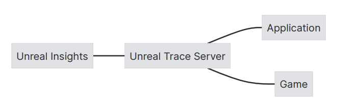
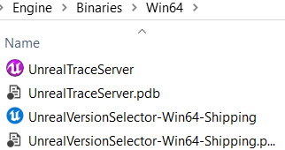
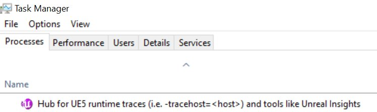
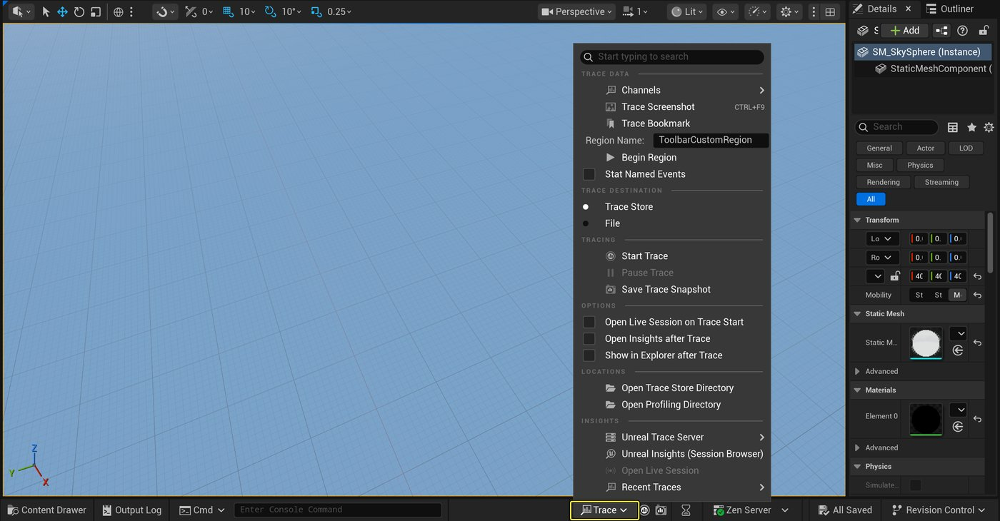
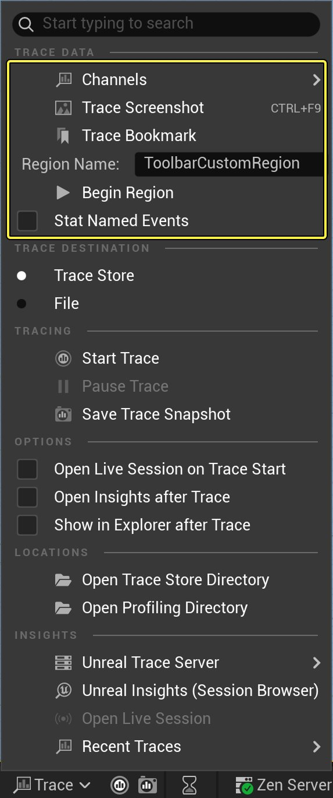
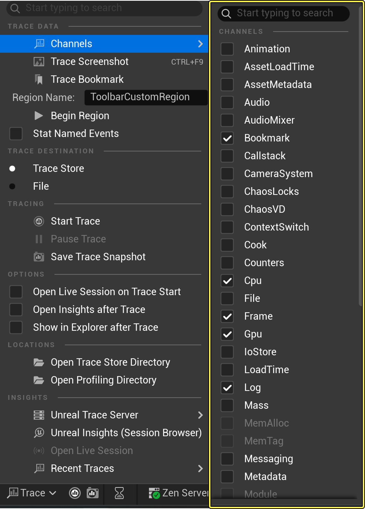
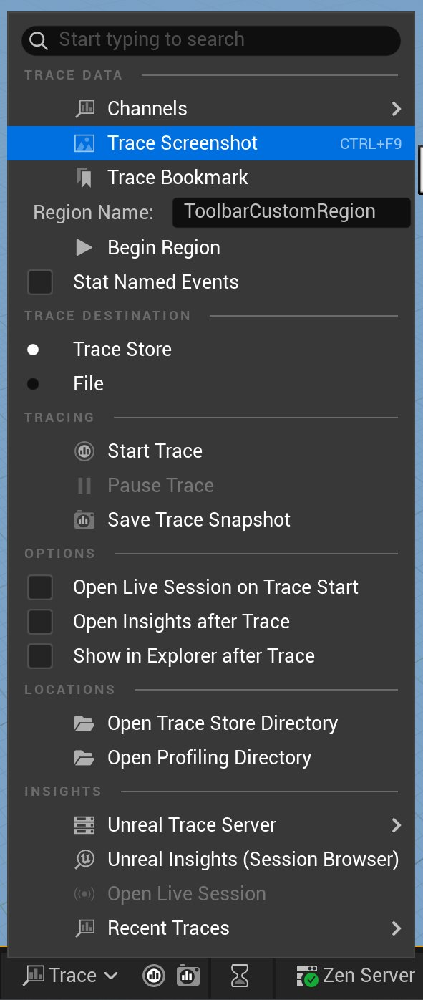
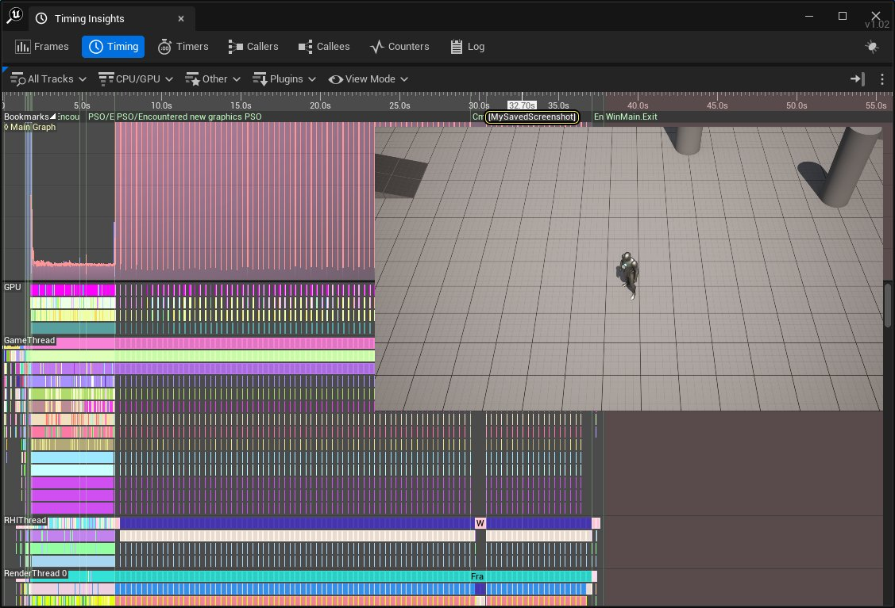

# 追踪

> 路径：虚幻引擎5.7文档 / 测试并优化你的内容 / Unreal Insights / 追踪

> 原始页面：https://dev.epicgames.com/documentation/unreal-engine/trace-in-unreal-engine-5

**Trace**是一种结构化的日志记录框架，用于追踪正在运行流程中的仪表测量事件。 模块**TraceLog**和**TraceAnalysis**是构成框架的主要模块。 **虚幻Trace服务器**作为单一服务器实例会在后台运行，可以由项目的多个实例或分支共享。 这个经优化的程序对性能产生的影响微乎其微，并且不包含用户界面。

Trace服务器由位于`Engine/Binaries/Win64`目录下的单独服务器进程`UnrealTraceServer.exe`自动启动。



Trace服务器由两部分组成

- **Trace Recorder**在1981端口监听传入的跟踪连接并记录实时跟踪流。
- **Trace Store**将记录的跟踪信息作为文件存储在一个文件夹中。 它会监测这个文件夹的变化并在Unreal Insights 的用户交互界面显示可用的追踪器列表。

以下是一个追踪文件夹的路径的例子：

C++

```
C:/Users/<user>/AppData/Local/UnrealEngine/Common/UnrealTrace/Store/001/
```

## 虚幻Trace服务器（Unreal Trace Server）

当你从虚幻Trace会话浏览器建立连接时，虚幻编辑器构建版本会自动启动`UnrealTraceServer.exe`。 虚幻Trace服务器作为单一服务器实例会在后台运行，可以由项目的多个实例或分支共享。



你可以通过访问系统的任务管理器并导航到进程选项卡来关闭虚幻Trace服务器。



虚幻Trace服务器在后台作为单独实例运行，无须终止便可启动新版本。 它可以同时从多个来源接收与记录数据。

> [!NOTE]
> 目前，我们仅支持每台机器一个用户使用虚幻Trace服务器。 如果多个用户同时登录，则追踪将存储在第一个用户的追踪目录中，因此无法供其他用户访问。

## Trace Insights控件

**Trace Insights控件**提供了一种使用编辑器界面来控制和管理**Trace数据**的方法。 你可以通过导航到底部工具栏并点击**Trace**按钮从编辑器访问**Trace Insights控件**。



以下部分描述Trace菜单每个类别中的设置。

### Trace数据

**Trace数据**类别包含有关数据通道、Trace书签、Trace截图等的设置。



#### 通道

Trace能够记录大量的数据。 你可以使用**Trace通道**来选择记录哪种类型的数据。

通道控制追踪时的数据率。 每个事件类型都与一个或多个通道相关联。 如果没有启用必要的通道，那么该事件将不会被发射到追踪流中。



**通道预设**将通道组合在一起，提供基于场景的切入点。

| Channel | 说明 |
| --- | --- |
| **Animation** | Animation Insights Plugin. |
| **AssetLoadTime** | Contains named CPU timers for `UObject::Serialize`. |
| **AssetMetadata** | Asset Names and Class Names as metadata for memory allocations. Requires **Metadata** channel. Used by **Memalloc** channel. |
| **Audio** | Audio Insights Plugin. |
| **AudioMixer** | AudioMixer Insights Plugin. |
| **Bookmark** | Low-frequency markers to signify important transitions. Bookmarks provide a quick overview of features such as level loading or engine boot phases. |
| **Callstack** | Callstack descriptions. Allows allocations to be associated with callstacks. |
| **ContextSwitch** | Trace context switch events. On Windows, game or editor runtime should be run as administrator. |
| **Cook** | Displays named CPU timers specific to cooking. This requires the CPU channel to be enabled. Cook will add the both the `CookByTheBook` and `SaveCookedPackage` CPU timing events. |
| **Counters** | Generic counters. Traces float and integer values over time. Counters Trace API. It enables the CSV Profiler Trace. |
| **Cpu** | Named CPU timers. Additional timers can be added by enabling the Stat Named Events channel from the Insights Widget or using the `-statnamedevents` command line argument. |
| **File** | File I/O trace channel that contains Open, ReOpen, Read, Write, Close events. |
| **Frame** | Game and Rendering frames. |
| **Gpu** | Named GPU timers. Based on GpuProfiler data. |
| **LoadTime** | Asset Loading Insights trace channel. Only works for runtime loading from the pak/iostore. |
| **Log** | Logs Messages. |
| **MemAlloc** | Memory allocations. Uses Module and Callstack. |
| **MemTag** | Memory tag statistics. Traces snapshots of memory usage per tag at regular rate. Relies on LLM subsystem for tracing. Implies "-llm". Available after `Init()`. |
| **Messaging** | UDP Messaging plugin. |
| **Metadata** | Support for generic metadata scopes. |
| **Module** | Module loading information. |
| **Net** | Networking trace channel. |
| **Niagara** | Niagara Plugin. |
| **Object** | GameplayInsights/RewindDebugger plugin. `UObject` classes, worlds, instances, and events. |
| **Physics** | [Chaos Visual Debugger](../../../gameplay-systems/physics/chaos-visual-debugger/index.md). |
| **RDG** | RDG Insights Plugin. |
| **RHICommands** | CPU or GPU named timers for RHI commands. |
| **RenderCommands** | CPU or GPU named timers for commands executed on the rendering thread. |
| **SaveTime** | Named CPU timers specific to package saving. |
| **Screenshot** | Captures screenshots triggered with `Trace.Screenshot` console command or using the `TRACE_SCREENSHOT()` API. |
| **Slate** | Slate Insights Plugin. |
| **StackSampling** | Trace stack sampling events based on Event Tracing for Windows (ETW). |
| **Stats** | Stats counters. Based on the Stats system. |
| **Task** | Task Graph trace channel. |
| **VisualLogger** | Visual Logger starts recording to file. |

以下通道默认启用：

- 书签
- Cpu
- 帧
- GPU
- 日志
- 区域
- 截屏

> [!NOTE]
> MemAlloc、MemTag和Module通道是灰色的，因为它们必须通过命令提示符运行。 请参阅[使用命令提示符](index.md)

> [!NOTE]
> 你可以使用已添加到`Trace.ChannelPresets`类别中的配置文件来定义你自己的预设。 有关文档，请参阅[Trace开发者指南](developer-guide-to-tracing/index.md)。

#### Trace截图

**Trace截图**在该帧中拍摄你的项目视口的图片，并将其发送给追踪器。 默认情况下，Trace截图在通道面板上是启用的。 你可以用以下两种方式截取Trace截图：

- 在底部工具栏，点击**Trace** > **Trace截图（Trace Screenshot）**。

  
- 在控制台中，输入命令`trace.screenshot`。

当使用Trace截图时，Timing Insights时间线显示一条垂直线，其中包含当前时间戳，名称为你截图的日期和时间。



#### Trace书签

**Trace书签**使用给定的字符串名称发送一个`TRACE_BOOKMARK()`事件。 当在编辑器中使用时，截图和书签事件都将根据当前的时间戳，根据日期和时间的格式生成名称。 你可以用以下两种方式设置Trace书签：

- 在底部工具栏，点击**Trace > Trace书签（Trace Bookmark）**。

  > 图片已省略：Trace书签
- 在控制台中，输入命令`trace.bookmark`。

书签和截图在**Timing Insights**选项卡中是可见的。 你可以在顶部工具栏中，**标尺追踪（ruler track）**下方的**标记追踪（markers track）**中找到它们。 书签在**日志**视图中是可用的。

> 图片已省略：trace书签

> 图片已省略：日志窗口

#### 统计数据名称事件

**统计数据名称事件**提供额外的分析指标。 你可以通过点击**统计数据名称事件（Stat Named Events）**复选框来启用或禁用它们。

> 图片已省略：统计数据名称事件

### Trace目标

在**Trace目标**类别中，你可以选择存储trace数据的位置。

> 图片已省略：Trace目标

| 选项 | 说明 |
| --- | --- |
| **Trace存储** | 将trace数据写入其管理的trace存储目录中的文件。 |
| **文件（File）** | 将trace数据直接写入指定文件。 |

### 追踪

**追踪**类别包含用于开始和停止录制以及保存Trace快照的设置。

> 图片已省略：追踪

#### 开始和停止录制

| 选项 | 说明 |
| --- | --- |
| **开始追踪** | 启动一个追踪器，追踪选定的追踪目标。 你可以通过点击**开始追踪（Start Trace）**按钮使用Trace Insights控件启动追踪器。 |
| **停止追踪** | 当一个Trace开始时，开始Trace UI图标将显示为红色。 你可以通过点击**停止追踪（Stop Trace）**按钮停止追踪器进行记录。 |

#### 保存Trace快照

有两种方式保存**Trace快照**：

- 在底部工具栏，点击**保存Trace快照（Save Trace Snapshot）**按钮。

  > 图片已省略：保存快照按钮
- 在底部工具栏，点击**Trace****>****保存Trace快照（Save Trace Snapshot）**。

  > 图片已省略：保存Trace快照

### 选项

**选项**类别控制自动化功能，例如自动打开Unreal Insights或目标文件夹。

> 图片已省略：选项

| 选项 | 说明 |
| --- | --- |
| **在追踪开始时打开实时会话** | 当启用时，开始追踪后，实时会话将自动在Unreal Insights中打开。这个选项只在Trace存储中进行追踪时适用。 |
| **追踪后打开Insights** | 当追踪停止或快照保存后，录制的会话将自动在Unreal Insights中打开。 |
| **追踪后在资源管理器中显示** | 当追踪停止或快照保存后，包含录制会话的文件夹将自动打开。 |

### 位置

**位置**类别控制trace（保存到文件和Trace服务器）的存储位置。

> 图片已省略：位置

| 选项 | 说明 |
| --- | --- |
| **打开追踪存储目录** | 保存在Trace服务器中追踪器的位置。 |
| **打开分析目录** | 打开当前项目的分析目录。 这是存储文件追踪器的位置。 |

### Insights

**Insights**类别包含打开Unreal Insights、实时会话和录制文件的设置。

> 图片已省略：Insights

| 选项 | 说明 |
| --- | --- |
| **Unreal Insights**（**会话浏览器**） | 启动Unreal Insights会话浏览器（Session Browser）。 |
| **打开实时会话** | 打开当前的实时会话。 这只有在对库进行追踪时才能实现。 |
| **最近追踪** | 打开记录在追踪库或文件中最近打开的追踪器。 |

## Trace状态

你可以通过使用控制台命令`Trace.Status`检查有关**连接**、**内存使用**、**重要事件缓存**、**已发送**数据、**已启用**和**可用**的追踪通道信息。

> 图片已省略：Trace状态

## 使用命令提示符运行Insights

要从命令提示符运行Unreal Insights，请按以下步骤操作：

1. 导航到你的`Engine\Binaries\Win64`文件夹并双击`UnrealInsights.exe`。

   > 图片已省略：binaries文件夹中的unreal-insights可执行文件
2. 从操作系统启动**命令提示符（Command Prompt）**并运行你的项目。 在以下示例中，请将安装路径和项目名称替换为你自己的：

   C++

   ```
   cd C:\[MyEngineInstallLocation]\         Samples\Games\Binaries\Win64\[YourProject].exe
   ```

## 尾部追踪

**尾部追踪（Tail Tracing）**会追踪最近几秒内的事件（取决于缓冲区大小）。 因此所有设备都可以显示出一定的提前量。

缓冲区的默认大小为4MB，但是如果你希望修改或停用它，可以使用控制台命令`-tracetailmb=X`。

将**X**设置为**0MB**可以将其停用，其他数值则会相应地更改缓冲区大小。

## 延迟连接

虚幻引擎的客户端会将**重要事件**进行缓存，然后在连接过程中发送至延迟连接的机器。 因此在你可以进行连接之前不会错过一次性的事件（重要事件）。

Insights可以指示远程运行的虚幻引擎实例从其本地UI实例连接到远程跟踪服务器，并且不需要涉及本地机器。

延迟连接可以通过导航到**Unreal Insights** **>** **Connect**启动，或者在编辑器控制台中输入以下任意命令：

- `"trace.send [ip]" / "trace.start [filename]"`
- `-trace.start [file] [channelSet] -tracehost=[ip]`
- `-tracefile = [filepath]`

Unreal Insights有一个基于文件的缓存系统，使应用程序可以将额外的信息附加到追踪器中。 这可以用来更快地检索以前的计算结果，或储存可能会丢失的数据，如符号。 缓存被存储在trace文件旁边的<code>.ucache</code>文件中。

## Trace用户指南

你可以使用不同的工作流程在Unreal Insights中执行追踪。 有关文档，请参阅[Trace用户指南](trace-quick-start-guide/index.md)。

## Trace开发者指南用户指南

你可以在Unreal Insights中开发你自己的追踪器。 有关文档，请参阅[Trace开发者指南](developer-guide-to-tracing/index.md)。
