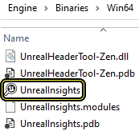
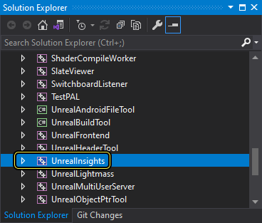
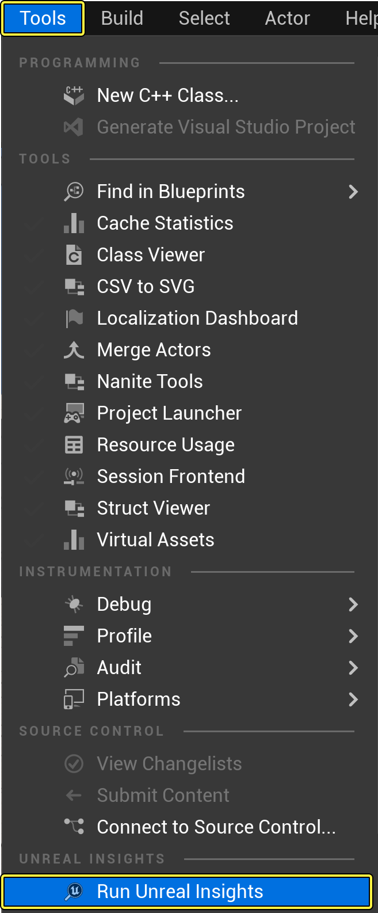
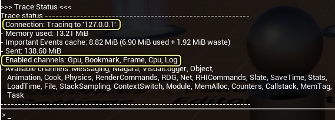
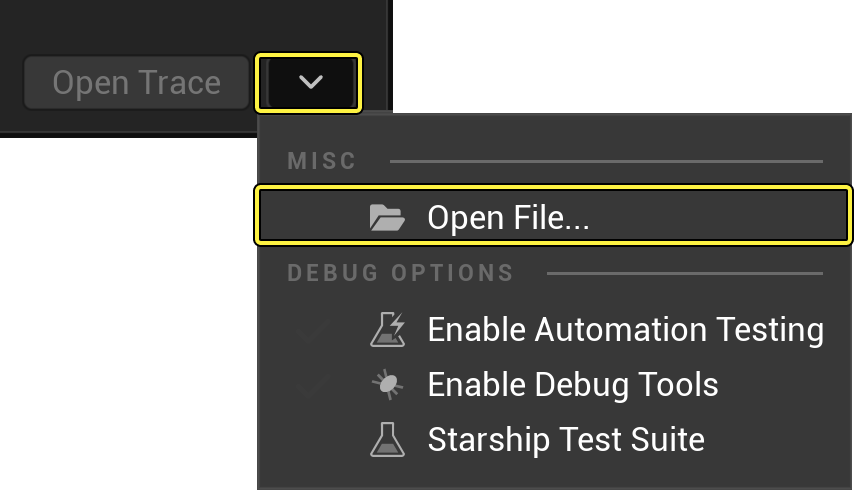
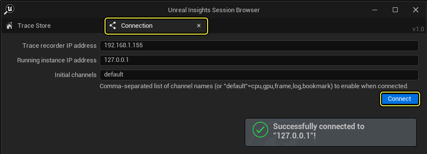

# Unreal Insights Trace快速入门指南

> 路径：虚幻引擎5.7文档 / 测试并优化你的内容 / Unreal Insights / 追踪 / Unreal Insights Trace快速入门指南

> 原始页面：https://dev.epicgames.com/documentation/unreal-engine/trace-quick-start-guide-in-unreal-engine

## 设置Unreal Insights

构建 **Unreal Insights**的时候，有以下几种选项：

#### 方法1：从文件资源管理器启动Unreal Insights

检查你的引擎中是否已经内置了Unreal Insights。找到 `Engine\Binaries\Win64\UnrealInsights.exe`



#### 方法2：使用Visual Studio编译

在你的 **解决方案资源管理器（Solution Explorer）** 中 **程序（Program）** 目录下，你可以手动构建Unreal Insights。



#### 方法3：使用命令提示符

找到 **开始（Start）** > **命令提示符（Command Prompt）**，然后从命令目录构建设Unreal Insights。

```
		cd C:\MyEngineInstallLocation\ 		Engine\Build\BatchFiles\RunUBT.bat UnrealInsights Win64 Development 
```

#### 方案4：用编辑器打开

要从 **虚幻编辑器** 中打开Unreal Insights，找到 **工具（Tools）** >**Unreal Insights** > **运行 Unreal Insights**。Insights将会试图自动编译。



取决于虚幻引擎的版本和操作系统，为配置项目数据运行Trace时有多种工作流程可选。

## 默认追踪工作流程 (Win64, 二进制文件启动器)

#### 1. 运行Unreal Insights:

找到 `Engine\Binaries\Win64` 文件夹并且双击UnrealInsights.exe。


#### 2. Insights会话浏览器：

当你启动 **Unreal Insights会话浏览器（Unreal Insights Session Browser）**，可以看到当前没有可用的活跃会话。

#### 3. 运行你的游戏项目：

从操作系统启动 **命令提示符（Command Prompt）** 并且运行Lyra样板游戏。

```
	cd C:\MyEngineInstallLocation\ 	Samples\Games\Lyra\Binaries\Win64\LyraGame.exe 
```

> [!NOTE]
> 如果你从Epic Games商城下载了Lyra，可以从默认路径将其启动 `UnrealProjects\Lyra\Lyra.uproject` 。

#### 4. 活跃Insights会话浏览器：

返回到Unreal Insights会话浏览器，能够看到现在有了一个新的会话，带有 "LIVE" 状态，说明其现在正在进行录制。

#### 5. 检查Trace的状态：

在Lyra中，双击波浪键 (`) 来打开控制台，然后输入指令

```
	Trace.Status.
```



**Gpu**、**Bookmark**、**Frame**、**Cpu** 以及 **Log** 这些通道默认启用。

> [!NOTE]
> 如果Unreal Insights在打开项目之前就已经在运行，那么它会自动连接到本地Trace服务器并启用默认的通道。

#### 6. 打开你的Trace会话：

返回至Unreal Insights会话浏览器，然后双击你的 `.utrace` 文件来打开它，用于在一个新的虚幻 **计时Insights（Timing Insights）** 窗口中进行分析。

> [!TIP]
> 要打开一个Trace文件，可以将 `.utrace` 文件从文件资源管理器拖入Unreal Insights会话浏览器。除此以外，点击 **打开Trace（Open Trace）** 旁的 **箭头** 按钮，然后从下拉菜单中选择 **打开文件（Open File）**，这样可以从指定的文件夹打开.utrace文件。
>
> 

打开Trace时会启动一个新的Unreal Insight实例。计时Insight是默认打开的组件，可以让你与Trace会话进行互动，以了解你的项目在不同任务上花费的时间。

参考[计时Insights](../../timing-insights/index.md)文档来了解如何查看你的数据并进行分析。

### 追踪的高级控制

Unreal Insights提供几种Trace指令来让你控制数据如何配置。

- `Trace.SnapshotFile <filename>`：将当前内存内跟踪缓冲区的快照写入一个文件。如果你已经在主动跟踪，它不会中断主动跟踪，而是为这个快照并行地记录第二个跟踪文件。
- `Trace.Bookmark <name>`：使用给定的字符串名称发射一个Bookmark事件。被记录的Bookmark以竖线的形式出现在Timing Insights中。之前这只能通过API调用`TRACE_BOOKMARK()`实现。
- `Trace.Screenshot <Name> <bIncludeUI>`:：如上文所述，你可以运行此控制台指令以生成竖线，并通过在Timing Insights中指定快照的true或者false来选择是否包含UI。


你可能需要看到CPU或者GPU配置数据这样的追踪通道，或者需要停用追踪通道。参考 [Trace](../index.md) 和[参考](../../unreal-insights-reference/index.md)文档来了解Trace指令的更多信息。

## 延迟连接

一些情况下你可能会忘记在打开项目之前启动UnrealInsights.exe，或者你需要不从一开始就记录。通过以下步骤可以 **延迟连接（Late Connect）** 到Unreal Insights。

> [!WARNING]
> 继续操作之前，检查 **Unreal Insights会话浏览器** 以确保没有正在运行的活跃会话。你可以输入以下控制台指令，停止连接：
>
> ```
> 	Trace.Stop
> ```

1. 像通常一样构建、烘焙或者运行你的项目。
2. 打开Unreal Insights.
3. 点击 **连接（Connection）** 来打开连接选项卡。确认需要的连接设置，然后点击 **连接（Connect）**。



成功连接后，点击 **Trace存储（Trace Store）** 选项卡。一个新的活跃会话会出现在会话列表中。

> 图片已省略：undefined
