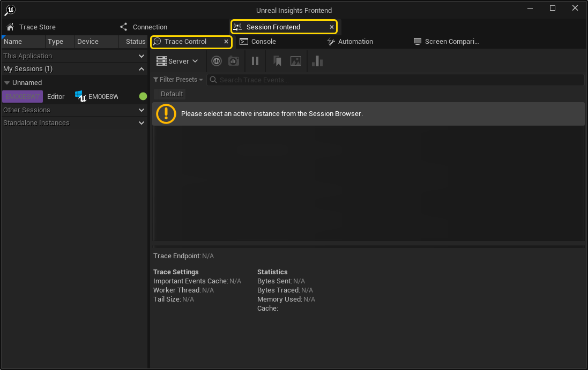
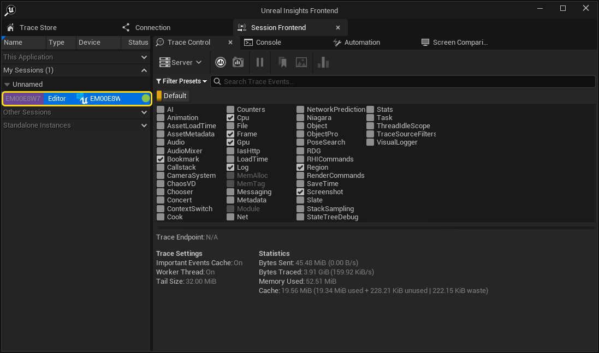
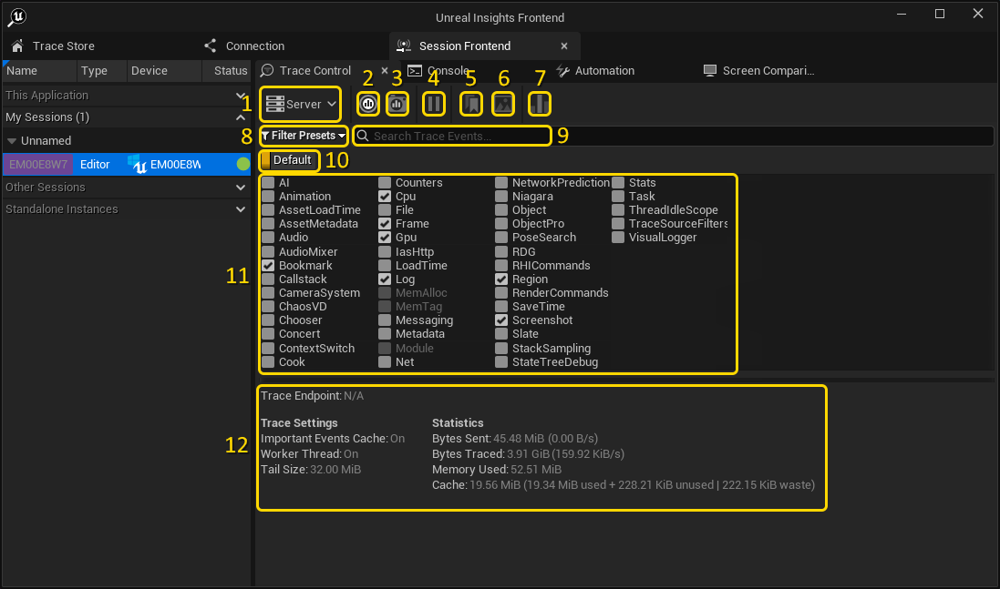
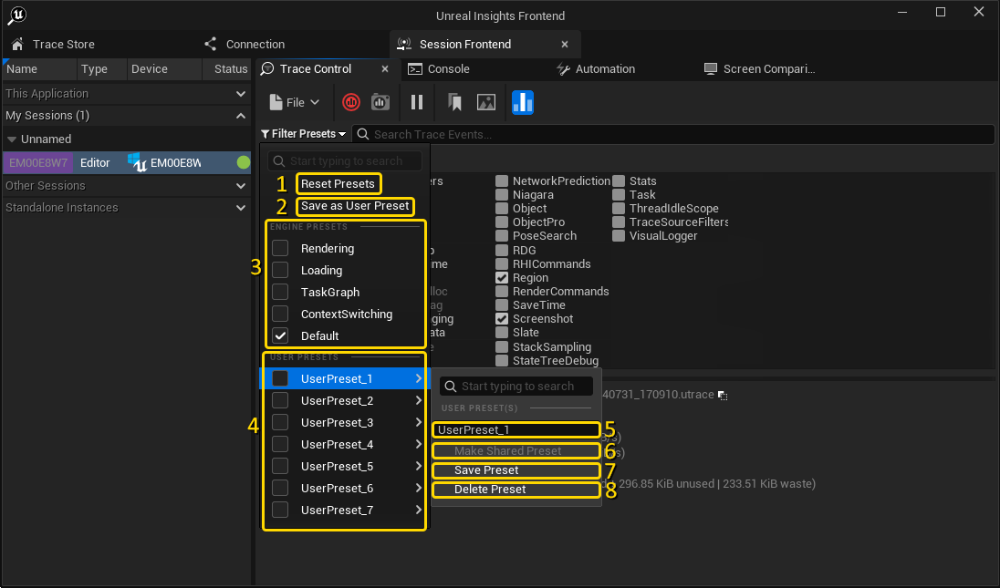
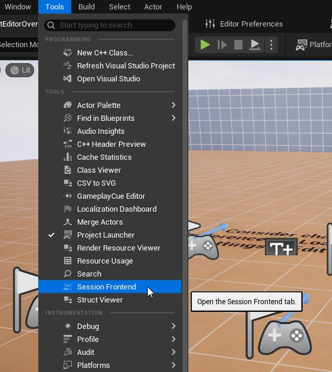
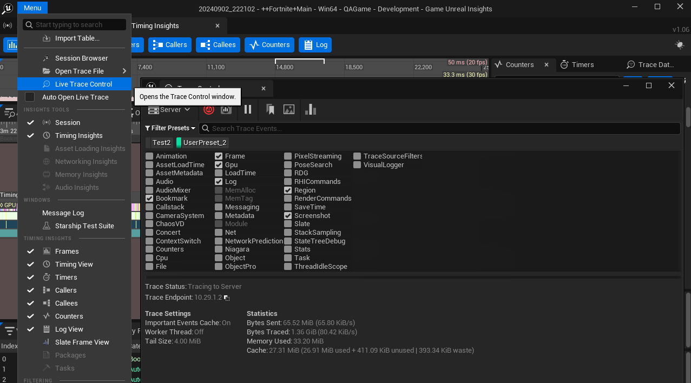

# Trace Control Tab

> 路径：虚幻引擎5.7文档 / 测试并优化你的内容 / Unreal Insights / Trace Control Tab

> 原始页面：https://dev.epicgames.com/documentation/unreal-engine/using-the-trace-control-tab-in-unreal-insights-for-unreal-engine

该 **Trace Control** 标签页让用户可以为 Unreal Engine（UE）项目中正在运行的会话启动并控制 tracing。用户还可以设置自己的 trace 通道筛选器，以便轻松控制会话捕获哪些 trace 数据。

## 如何找到 Trace Control 标签页

可以在 **Unreal Insights Frontend** 对话框中找到该标签页；启动 Insights 时会打开此对话框。

要打开该标签页，请启动 **Insights**，点击 **Session Frontend** 标签页，然后点击 **Trace Control** 标签页。

## 如何选择会话

要选择 Unreal Editor 会话，请在 **Session Frontend** 标签页左侧列中点击某个正在运行的会话。必要时展开分组标题。

> [!NOTE]
> 选择会话后，Trace Control 标签页可能需要几秒钟才会更新。

以下会话会显示：

- Unreal Editor 会话。
- 使用

  Play

  按钮启动的 Play-In-Editor 会话。
- 使用

  -messaging

  命令行参数启动的 Standalone 会话。

如果会话未出现在列表中，请再次确认启动时使用了 `-messaging` 参数。

## 如何配置和控制 Tracing

选择会话后，可以控制该会话的 tracing。

最常见工作流如下：

1. 点击单个通道复选框，或使用 filter presets 下拉菜单选择常用通道组，以选择要收集 trace 数据的通道。
2. 开始 tracing Unreal Editor 会话（见下方按钮 2）。

开始 tracing 后，会立即在 **Trace Store** 标签页中出现一个条目，可在 Insights 中打开新的 trace 数据进行分析。

下表完整说明所有可用选项。

| **元素** | **名称** | **说明** |
| --- | --- | --- |
| **1** | **Trace 目标** | 配置会话 trace 数据写入位置。可选择： **Server**：将 trace 数据写入 trace server 管理的存储目录中的文件。 **File**：将 trace 数据直接写入文件。 Tracing 已经运行时无法更改此设置（见元素 2）。 |
| **2** | **Start / Stop trace** | 开始和停止为所选通道收集 trace 数据。 开始 tracing 后，Trace Store 标签页中会出现一个标记为 **LIVE** 状态的条目。随后可以在 Insights 中打开该会话进行分析。 |
| **3** | **保存快照** | 为会话采集 trace 快照。该快照会出现在 Trace Store 标签页中，之后可打开进行分析。 |
| **4** | **暂停/恢复 trace 通道** | 禁用所有选中的 trace 通道。再次点击此按钮会恢复，并重新启用此前选中的所有通道。 |
| **5** | **Trace 书签** | 如果 tracing 正在运行，则在 trace 数据中发出 `TRACE_BOOKMARK` 事件。该事件会根据创建时间戳命名。 |
| **6** | **截屏** | 如果 tracing 正在运行，则截取运行会话画面并将其包含在 trace 数据中。截图会根据创建时间戳命名。 |
| **7** | **启用/禁用 stat named events** | 启用或禁用 stat named events 的 tracing。这些事件提供额外性能分析指标，但会带来额外开销。 |
| **8** | **筛选预设** | 启用或禁用通道组。更多信息请参阅 [如何设置预设通道筛选器](#howtosetuppresetchannelfilters) 章节。 |
| **9** | **搜索通道** | 搜索（元素 11）中显示的 trace 通道。 |
| **10** | **切换筛选预设** | 所有选中的筛选预设都会显示在这里，并可单独开关，以启用/禁用通道组。 |
| **11** | **Trace 通道** | 启用或禁用要捕获数据的单个 trace 通道。 任何变灰的通道只支持启动时已启用 tracing 的会话，无法在此视图中启用。最值得注意的是 memory tracing 通道。 |
| **12** | **Trace 信息** | 当前会话的信息，包括： **Trace Endpoint：** Trace server IP 地址，或 trace 数据正在写入的文件（见元素 1）。 **Important Events Cache**：表示是否使用 important events cache。Tracing 未激活时，关键事件会存储在这里。 **Worker Thread：** 如果开启，则由单独的 worker thread 发送 trace 数据；否则只会在每帧结束时发送。 **Tail Size**：tail buffer 的大小，最近收集的 trace 数据会存储在其中。 **已发送字节：** 发送到 trace 目标/端点的字节数。 **已 Trace 字节：** 从会话 trace 到的未压缩字节数。 **已用内存：** Tracing 系统的总内存开销。 **缓存：** Important events cache 使用的总内存。 |

## 如何设置预设通道筛选器

预设通道筛选器是一种便捷方式，可通过单击启用和禁用 trace 通道组。可以使用 **Filter Presets** 下拉菜单配置这些筛选器。各选项详情见下表。

| **元素** | **名称** | **说明** |
| --- | --- | --- |
| **1** | **重置预设** | 清除当前选中的预设筛选器（见 [配置 tracing](#howtoconfigureandcontroltracing) 章节中的元素 10）。 |
| **2** | **另存为用户预设** | 将当前选中的通道保存为新的预设筛选器。 |
| **3** | **Engine 预设** | 基于用户可能想要分析的常见领域选择筛选预设。 这些 Engine 预设定义在： `BaseEngine.ini` 中的 `[Trace.ChannelPresets]` 部分（Engine\\Config_\\BaseEngine.ini）。 在代码中使用 `FTraceAuxiliary::FChannelPreset` 结构体。 |
| **4** | **用户预设** | 选择用户定义的筛选预设。 这些会保存到本地 `Engine.ini` 文件，用于 Insights（Engine\\Programs\\UnrealInsights\\Saved\\Config\\WindowsEditor\\Engine.ini）。 |
| **5** | **重命名用户预设** | 重命名此用户筛选器。 |
| **6** | **设为共享预设** | 与其他人共享该筛选预设。 共享用户预设会保存到 Insights 的默认 Engine.ini 文件（Engine\\Programs\\UnrealInsights\\Config\\DefaultEngine.ini）。 配置文件必须可写，或已签出。 |
| **7** | **保存预设** | 将当前选中的通道保存到此用户筛选器下。如果该预设是共享的，请确保 `Engine.ini` 文件可写或已先签出。 |
| **8** | **删除预设** | 从筛选预设菜单中移除用户筛选器。 |

## 如何从编辑器使用 Trace Control 标签页

也可以在编辑器中选择以下菜单找到新的 Trace 标签页： **Tools > Session Frontend**.

从编辑器打开时，Trace 标签页会有一组不同的用户预设。这些预设会基于编辑器中打开的项目存储。

本地用户预设保存到：

- 本地

  Engine.ini

  项目配置文件

  ([PROJECT_ROOT]\Saved\Config\WindowsEditor\Engine.ini)

  .

共享用户预设保存到：

- 默认

  Engine.ini

  项目配置文件，前提是该文件可写或已签出

  ([PROJECT_ROOT]\Config\DefaultEngine.ini)

  .

## 如何从 Insights 使用 Trace Control 标签页

也可以在 Insights 中为 Live 会话打开 Trace Control 标签页，方法是选择 **Menu > Live Trace Control**.

