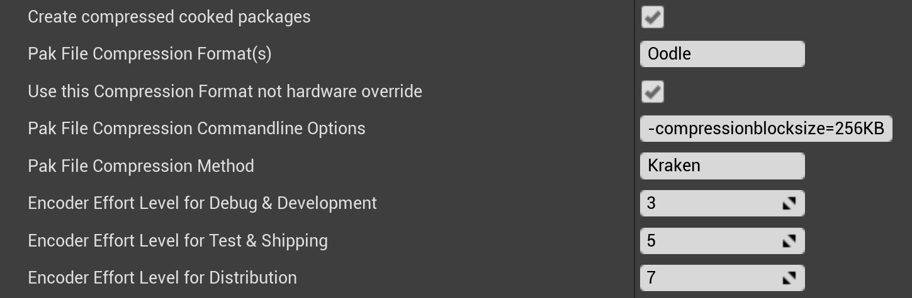

# Oodle数据

> 路径：虚幻引擎5.7文档 / 测试并优化你的内容 / 使用Oodle / Oodle数据

> 原始页面：https://dev.epicgames.com/documentation/unreal-engine/oodle-data

**Oodle 数据** 提供了 `.pak` 文件和 IOStore 文件的压缩格式。它作为插件提供，该插件在默认情况下应该启用。

> [!NOTE]
> 若要将Oodle数据用于IOStore文件，其参数和设置与 **虚幻引擎** 中的.pak文件的参数和设置相同。

打包时，如果你看到类似于以下内容的日志，其中针对方法和级别列出了你的特定设置，那么你使用的就是Oodle数据：

`Oodle v2.9.0 initializing with method=Kraken, level=3=Fast`

在需要Oodle数据来解码程序包文件的其他上下文中，你将在日志中看到以下内容：

`LogPluginManager: Mounting plugin OodleData`

## Oodle数据的关键概念

Oodle数据公开了用于管理输出的两个控件：**压缩方法** 和 **压缩级别**。请务必理解它们之间的区别：

- 压缩 *方法* 会在降低数据大小与提高解码速度之间进行权衡。
- 压缩 *级别* 会确定编码数据所用时间。

> [!NOTE]
> 运行时的解码器从不需要知道使用了什么方法。

### 压缩方法

有四种不同的压缩方法可用，代表不同的压缩级别和解码速度。

| 方法 | 说明 |
| --- | --- |
| Kraken | 压缩率高，解码速度不错，通常为默认值。 |
| Mermaid | 压缩率更低，解码速度更快；在CPU使用量受限制时或者在CPU计算力较低的平台上很有效。 |
| Selkie | 相较于Mermaid，压缩率更低，速度更快。 |
| Leviathan | 相较于Kraken，压缩率更高，解码速度更慢。 |

### 压缩级别（工作级别）

压缩级别是-4到9之间的数字，代表编码速度。压缩级别值定义为如下所示：

| 级别 | 名称 | 其他信息 |
| --- | --- | --- |
| -4 | HyperFast4 |  |
| -3 | HyperFast3 |  |
| -2 | HyperFast2 |  |
| -1 | HyperFast1 |  |
| 0 | None | 仅仅复制原始字节。 |
| 1 | SuperFast |  |
| 2 | VeryFast |  |
| 3 | Fast | 适合日常使用。 |
| 4 | Normal |  |
| 5 | Optimal1 |  |
| 6 | Optimal2 | 推荐的基线最优编码器。 |
| 7 | Optimal3 |  |
| 8 | Optimal4 |  |
| 9 | Optimal5 |  |

## 启用Oodle数据

由于各种覆盖情况，你需要在多个不同的地方启用和配置Oodle数据。 将其启用的基线方法是使用 **项目设置（Project Settings）** 窗口中的 **打包（Packaging）** 设置。

> [!NOTE]
> 在"项目打包（Project Packaging）"设置中，你必须展开 **高级（Advanced）** 参数才能看到这些设置。



这些设置还可以直接在 `BaseGame.ini` 文件的 `[/Script/UnrealEd.ProjectPackagingSettings]` 标题下进行编辑。

### 属性 / 设置

这些是"项目打包（Project Packaging）"区域中的相关属性，并带有等效的 `.ini` 文件设置。

| 属性 | .ini 文件设置 | 说明 |
| --- | --- | --- |
| 创建压缩的已烘焙程序包 | bCompressed | 启用此属性后，除非被覆盖，否则虚幻将压缩输出程序包。 |
| Pak文件压缩格式 | PakFileCompressionFormats | 设置压缩格式列表。将其设置为Oodle以使用Oodle数据。 |
| Pak文件压缩命令行选项 | PakFileAdditionalCompressionOptions | 指定要传递给压缩格式的额外选项。对于Oodle，我们建议将此属性设置为 `-compressionblocksize=256KB`。 |
| 使用此压缩格式而非硬件覆盖 | bForceUseProjectCompressionFormatIgnoreHardwareOverride | 如果设置此属性，将忽略 `DataDrivenPlatformInfo.ini` 文件中的 `HardwareCompressionFormat`，并且将使用这些设置。因此，你可以使用上述设置进行设置，使用 `HardwareCompressionFormat` 将其忽略，然后使用此设置忽略后者，回到一开始使用的设置。 |
| Pak文件压缩方法 | PakFileCompressionMethod | 指定压缩方法，如前所述（例如，Kraken）。 |
| 用于调试和开发的编码器工作级别 | PakFileCompressionLevel_DebugDevelopment | 指定用于编码的时长。这是之前描述的"压缩级别"设置中的数字（默认为3）。 |
| 用于测试和发行的编码器工作级别 | PakFileCompressionLevel_TestShipping | 指定用于编码的时长。这是之前描述的"压缩级别"设置中的数字（默认为5）。 |
| 用于分发的编码器工作级别 | PakFileCompressionLevel_Distribution | 指定用于编码的时长。这是之前描述的"压缩级别"设置中的数字（默认为7）。 |

### 示例设置

在你的 `BaseGame.ini` 文件中，这是一组具有代表性的设置：

```
     [/Script/UnrealEd.ProjectPackagingSettings]    bCompressed=True    PakFileCompressionFormats=Oodle    PakFileAdditionalCompressionOptions=-compressionblocksize=256KB    PakFileCompressionMethod=Kraken    PakFileCompressionLevel_Distribution=7    PakFileCompressionLevel_TestShipping=5    PakFileCompressionLevel_DebugDevelopment=3    bForceUseProjectCompressionFormatIgnoreHardwareOverride=False 
```

### 特定于平台的例外

如果给定目标平台支持硬件数据压缩，可能会在该平台的配置目录中的 `DataDrivenPlatformInfo.ini` 文件中公开，例如：

```
     [DataDrivenPlatformInfo]    HardwareCompressionFormat=Zlib 
```

但是，如果你想要绕过硬件数据压缩，并仍然使用Oodle数据，你可以在平台的 `(Platform)Game.ini` 文件设置中设置 `bForceUseProjectCompressionFormatIgnoreHardwareOverride=True`。

这将导致为目标平台打包时使用Oodle数据，而不是（本示例中的）硬件zlib。
