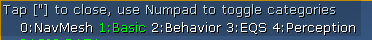
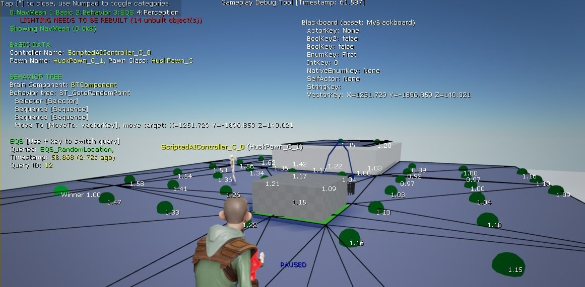
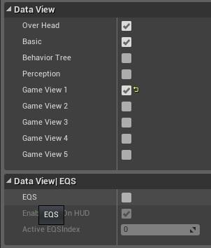
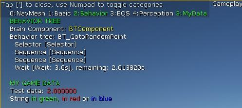
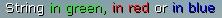

# Gameplay调试程序

> 路径：虚幻引擎5.7文档 / 测试并优化你的内容 / Gameplay调试程序

> 原始页面：https://dev.epicgames.com/documentation/unreal-engine/using-the-gameplay-debugger-in-unreal-engine

**Gameplay调试程序** 用于监控运行时的实时数据，可用于使用复制的联网游戏客户端。它可用于 **在编辑器中运行**（Play in Editor）（PIE）、**在编辑器中模拟**（Simulate in Editor）（SIE）和独立游戏会话，所有数据皆以覆层显示在游戏视口上。此系统提供了一个可延展的框架，以启用游戏特定数据的调试。

**虚幻引擎** 实现可以显示：

- 从Pawn获得的基础数据
- 从AI控制器获得的基本数据
- 行为树和黑板数据的信息
- 已执行环境查询（EQS）的信息
- 来自感知系统的信息
- 拥有所有细节（如链接和区域），在玩家或所选Pawn周围的寻路网格体

通常存在大量数据，因此GDT会使用类别来限制屏幕上显示的信息量。仅来自支持类别的数据会被复制，从而节省复制信道带宽。有5种默认类别，项目使用5种类别：



- 寻路网格体
- 基础
- 行为树
- EQS
- 感知
- 和5种项目使用的类别

现有类别也可以展开以显示更多特定于游戏的数据。

下面是在启用了一些类别的客户端上截取的屏幕截图：**基础**、**EQS**、**寻路网格体** 和 **行为树**。



Gameplay调试程序默认可以使用 **撇号（'）** 键或 `EnableGDT` 作弊激活。键绑定在文件中设置，可以轻松更改。要选择调试的敌人，在指向屏幕上的敌人的同时按撇号（'）键。使用数字键盘切换可见类别。GameplayDebugger模块必须添加到项目的依赖性模块才能激活和使用。

## 编辑器——使用Gameplay调试程序

在编辑器中工作时，可以在PIE或模拟中使用GDT。在PIE中，可以使用绑定键或 `EnableGDT` 作弊来激活GDT。模拟模式与PIE稍有不同；激活该调试工具需要启用 `Debug AI` 显示标志。模拟中还有一个选项可以更改可见类别。**GameplayDebuggingReplicator** Actor可以用于此目的。该Actor可以在场景大纲（Scene Outliner）中找到，其属性用来控制GDT：



## 调试相机控制器

DebugCameraController还有以下功能：

- 盘旋（Orbit）

  功能 - 可以让相机围绕选定位置、或选定Actor的中心旋转，以便更仔细地查看资源。
- 缓冲区可视化概览（Buffer visualization overview）

  - 此选项可以为全屏视图选择缓存，并允许其检查显卡缓存的内容。
- 视图模式循环（View mode cycling）

  - 此功能可以查看处理中的、不同类型的场景数据。

新功能提升了在PIE中使用调试相机控制器的游戏内调试能力。查看视图模式和显卡缓存的功能可以协助诊断游戏内不符合预期的场景结果。

要在PIE中打开调试相机控制器，可在控制台命令行中输入 `ToggleDebugCamera` 或使用 **分号（;）** 热键。

## 基础扩展

Gameplay调试程序只能使用C++代码扩展。对于蓝图项目，它只能原样使用，目前用于显示基本调试信息。扩展Gameplay调试程序很简单，扩展后可以收集和显示游戏特定数据。为此，需要使用继承自*UGameplayDebuggingComponent*类和*AGameplayDebuggingHUDComponent*类的自定义类。第一个类用于收集并最终复制数据，第二个类用于在屏幕上显示所有收集的数据。

下面是用于收集游戏特定数据的简单类：

```
	GDTComponent.h 	// Copyright 1998-2018 Epic Games, Inc. All Rights Reserved.	#pragma once	#include "GameplayDebuggingComponent.h"	#include "GDTComponent.generated.h" 	UCLASS()	class UGDTComponent : public UGameplayDebuggingComponent	{	public:		GENERATED_UCLASS_BODY()		virtual void CollectBasicData() override; 		UPROPERTY(Replicated)		float TestData; //复制到客户端的自定义数据	}; 	GDTComponent.cpp 	// Copyright Epic Games, Inc. All Rights Reserved.	#include "MyGameProject.h"	#include "GameplayDebuggingComponent.h"	#include "GDTComponent.h" 	UGDTComponent::UGDTComponent(const class FPostConstructInitializeProperties& PCIP) : Super(PCIP) { } 	void UGDTComponent::GetLifetimeReplicatedProps(TArray<FLifetimeProperty> &OutLifetimeProps) const	{		Super::GetLifetimeReplicatedProps( OutLifetimeProps );	#if !(UE_BUILD_SHIPPING || UE_BUILD_TEST)		DOREPLIFETIME( UGDTComponent, TestData);	#endif	} 	void UGDTComponent::CollectBasicData()	{		Super::CollectBasicData();	#if !(UE_BUILD_SHIPPING || UE_BUILD_TEST)		TestData= FMath::RandRange(2.75, 8.25); //收集并存储数据	#endif	} 
```

使用下一个类在屏幕上显示新数据：

```
	GDTHUDComponent.h 	// Copyright Epic Games, Inc. All Rights Reserved.	#pragma once 	#include "GameplayDebuggingHUDComponent.h"	#include "GDTHUDComponent.generated.h" 	UCLASS(notplaceable)	class AGDTHUDComponent: public AGameplayDebuggingHUDComponent	{		GENERATED_UCLASS_BODY()	protected:		virtual void DrawBasicData(APlayerController* PC, class UGameplayDebuggingComponent *DebugComponent) override;	}; 	GDTHUDComponent.cpp 	// Copyright Epic Games, Inc. All Rights Reserved.	#include "MyGameProject.h"	#include "GDTComponent.h"	#include "GDTHUDComponent.h" 	AGDTHUDComponent::AGDTHUDComponent(const class FPostConstructInitializeProperties& PCIP)		: Super(PCIP)	{	}	void AGDTHUDComponent::DrawBasicData(APlayerController* PC, class UGameplayDebuggingComponent *DebugComponent)	{		Super::DrawBasicData(PC, DebugComponent);	#if !(UE_BUILD_SHIPPING || UE_BUILD_TEST)		const UGDTComponent* MyComp = Cast<UGDTComponent>(DebugComponent);		if (MyComp)		{			PrintString(DefaultContext, FString::Printf(TEXT("{white}Test data: {red}%f\n"), MyComp->TestData));		}	#endif	} 
```

Gameplay调试程序需要知道新类，该信息可以在DefaultEngine.ini配置文件中设置：

```
	DefaultEngine.ini 	[/Script/GameplayDebugger.GameplayDebuggingReplicator]	DebugComponentClassName="/Script/MyGameProject.GDTComponent"	DebugComponentHUDClassName="/Script/MyGameProject.GDTHUDComponent" | 
```

## 自定义类别

还需要再执行一些步骤来将项目特定类别添加到Gameplay调试程序。

首先扩展 `GDTComponent` 类：

```
	GDTComponent.h 	// Copyright Epic Games, Inc. All Rights Reserved.	#pragma once	#include "GameplayDebuggingComponent.h"	#include "GDTComponent.generated.h" 	UCLASS()	class UGDTComponent : public UGameplayDebuggingComponent	{	public:		GENERATED_UCLASS_BODY()	protected:		virtual void CollectDataToReplicate(bool bCollectExtendedData) override;		void CollectCustomData();	public:		UPROPERTY(Replicated)		float TestData; //复制到客户端的自定义数据	}; 	GDTComponent.cpp 	// Copyright Epic Games, Inc. All Rights Reserved.	#include "MyGameProject.h"	#include "GameplayDebuggingComponent.h"	#include "GDTComponent.h" 	UGDTComponent::UGDTComponent(const class FPostConstructInitializeProperties& PCIP) : Super(PCIP) { } 	void UGDTComponent::GetLifetimeReplicatedProps(TArray<FLifetimeProperty> &OutLifetimeProps) const	{		Super::GetLifetimeReplicatedProps( OutLifetimeProps );	#if !(UE_BUILD_SHIPPING || UE_BUILD_TEST)		DOREPLIFETIME( UGDTComponent, TestData);	#endif	} 	void UGDTComponent::CollectCustomData()	{		Super::CollectBasicData();	#if !(UE_BUILD_SHIPPING || UE_BUILD_TEST)		TestData= FMath::RandRange(2.75, 8.25); //收集并存储数据	#endif	} 	void UGDTComponent::CollectDataToReplicate(bool bCollectExtendedData)	{		Super::CollectDataToReplicate(bCollectExtendedData);	#if !(UE_BUILD_SHIPPING || UE_BUILD_TEST)		if (ShouldReplicateData(EAIDebugDrawDataView::GameView1))		{			CollectCustomData();			if (bCollectExtendedData)			{				// 收集所选Pawn/AIController的额外数据			}		}	#endif	} 
```

扩展HUD组件以在新视图中显示数据：

```
	GDTHUDComponent.h 	// Copyright Epic Games, Inc. All Rights Reserved.	#pragma once 	#include "GameplayDebuggingHUDComponent.h"	#include "GDTHUDComponent.generated.h" 	UCLASS(notplaceable)	class AGDTHUDComponent: public AGameplayDebuggingHUDComponent	{		GENERATED_UCLASS_BODY()	protected:		virtual void DrawGameSpecificView(APlayerController* PC, class UGameplayDebuggingComponent *DebugComponent) override;		virtual void GetKeyboardDesc(TArray<FDebugCategoryView>& Categories) override;		void DrawCustomData(APlayerController* PC, class UGameplayDebuggingComponent *DebugComponent);	}; 	GDTHUDComponent.cpp 	// Copyright Epic Games, Inc. All Rights Reserved.	#include "MyGameProject.h"	#include "GDTComponent.h"	#include "GDTHUDComponent.h" 	AGDTHUDComponent::AGDTHUDComponent(const class FPostConstructInitializeProperties& PCIP)		: Super(PCIP)	{	}	void AGDTHUDComponent::DrawCustomData(APlayerController* PC, class UGameplayDebuggingComponent *DebugComponent)	{	#if !(UE_BUILD_SHIPPING || UE_BUILD_TEST)		const UGDTComponent* MyComp = Cast<UGDTComponent>(DebugComponent);		if (MyComp)		{			PrintString(DefaultContext, FString::Printf(TEXT("{white}Test data: {red}%f\n"), MyComp->TestData));		}	#endif	}	void AGDTHUDComponent::GetKeyboardDesc(TArray<FDebugCategoryView>& Categories)	{		Super::GetKeyboardDesc(Categories);	#if !(UE_BUILD_SHIPPING || UE_BUILD_TEST)		Categories.Add(FDebugCategoryView(EAIDebugDrawDataView::GameView1, TEXT("MyData")));	#endif	}	void AGDTHUDComponent::DrawGameSpecificView(APlayerController* PC, class UGameplayDebuggingComponent *InDebugComponent)	{		 Super::DrawGameSpecificView(PC, InDebugComponent);	#if !(UE_BUILD_SHIPPING || UE_BUILD_TEST)		if (InDebugComponent && GameplayDebuggerSettings(GetDebuggingReplicator()).CheckFlag(EAIDebugDrawDataView::GameView1))		{			PrintString(DefaultContext, FColor::Green, TEXT("\nMY GAME DATA\n"));			 DrawCustomData(PC, InDebugComponent);		}	#endif	} 
```

新类别已准备就绪，可以用于调试特定于项目的数据。



要用颜色绘制调试信息，`PrintString` 函数可以在字符串中使用标记来更改活跃颜色。这样更便于使用不同的颜色绘制字符串。

```
	void PrintString(FPrintContext& Context, const FString& InString );	void PrintString(FPrintContext& Context, const FColor& InColor, const FString& InString );	PrintString(DefaultContext, FColor::Green, TEXT("Whole text in green"));	PrintString(DefaultContext, TEXT("String {green}in green, {red}in red {white}or {R=0,G=0,B=255,A=255}in blue")); 
```

最后的 `PrintString` 函数生成有4种不同颜色的字符串。


