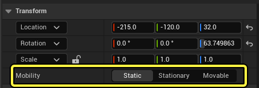

# Actor移动性

> 路径：虚幻引擎5.7文档 / 理解基础知识 / Actor和几何体 / Actor移动性

> 原始页面：https://dev.epicgames.com/documentation/unreal-engine/actor-mobility-in-unreal-engine

**移动性（Mobility）** 设置可控制Actor在Gameplay期间是否能够以某种方式移动或变化。此设置主要适用于静态网格Actor和光源Actor。它位于Actor的 **细节（Details）** 面板中Actor的变换坐标下。

Actor的细节面板中的 移动性（Mobility） 设置。

支持此设置的Actor可以是三个移动性状态之一：

- 静态
- 固定
- 可移动

## 静态Actor

**静态（Static）** 移动性面向Gameplay期间根本不会移动或更新的Actor。

若 **静态网格体（Static Mesh）** Actor将其移动性设置为静态，其阴影将帮助生成预计算光照贴图，从而使用[Lightmass](../../../building-virtual-worlds/lighting-the-environment/global-illumination/index.md#%E9%A2%84%E8%AE%A1%E7%AE%97%E5%85%A8%E5%B1%80%E5%85%89%E7%85%A7)生成和处理它们。此移动性让静态网格Actor成为在Gameplay期间永不需要重新定位的结构性或装饰性网格的理想之选。然而，要注意其材质仍可动画化。

若 **光源（Light）** Actor将其移动性设置为静态，这将使用[Lightmass](../../../building-virtual-worlds/lighting-the-environment/global-illumination/index.md#%E9%A2%84%E8%AE%A1%E7%AE%97%E5%85%A8%E5%B1%80%E5%85%89%E7%85%A7)帮助生成预计算光照贴图。它们会照亮静态和固定Actor的关卡。对于可移动Actor，它们使用间接光照方法，如[体积光照贴图](../../../building-virtual-worlds/lighting-the-environment/global-illumination/volumetric-lightmaps/index.md)。

如需更多信息，请参阅[静态光源的移动性](../../../building-virtual-worlds/lighting-the-environment/light-types-and-their-mobility/static-light-mobility/index.md)页面。

## 固定Actor

**固定（Stationary）** 移动性面向Gameplay期间可以变化但不移动的Actor。

若 **静态网格体（Static Mesh）** Actor将其移动性设置为固定，则可以变化，但无法移动。它们不会使用[Lightmass](../../../building-virtual-worlds/lighting-the-environment/global-illumination/index.md#%E9%A2%84%E8%AE%A1%E7%AE%97%E5%85%A8%E5%B1%80%E5%85%89%E7%85%A7)帮助生成预计算光照贴图，照亮方式和被静态或固定光源照亮的可移动Actor一样。但是，由可移动光源照亮时，它们将使用[缓存阴影贴图](../../../building-virtual-worlds/lighting-the-environment/light-types-and-their-mobility/movable-light-mobility/index.md#%E9%98%B4%E5%BD%B1%E8%B4%B4%E5%9B%BE%E7%BC%93%E5%AD%98)，在光源不移动时复用于下一帧，这可以提高使用动态光照的项目的性能。

若 **光源（Light）** Actor将其移动性设置为固定，则可以在Gameplay期间以某种方式更改，例如更改其颜色或强度，变得更亮或更暗，甚至完全没有亮度。固定光源仍会使用[Lightmass](../../../building-virtual-worlds/lighting-the-environment/global-illumination/index.md#%E9%A2%84%E8%AE%A1%E7%AE%97%E5%85%A8%E5%B1%80%E5%85%89%E7%85%A7)帮助生成预计算光照贴图，而且还可以为移动中的对象投射动态阴影。

> [!NOTE]
> 如果影响相同Actor的固定光源太多，可能会对性能产生显著影响。请参阅[固定光源的移动性](../../../building-virtual-worlds/lighting-the-environment/light-types-and-their-mobility/stationary-light-mobility/index.md)页面，了解更多信息。

## 可移动Actor

**可移动（Movable）** 移动性面向Gameplay期间需要以某种方式添加、删除或变化的Actor。这包括移动、缩放、与其他Actor交换，等等。

若 **静态网格体（Static Mesh）** Actor将其移动性设置为可移动，则将投射完全动态的阴影，这些阴影不会帮助生成光照贴图中存储的预计算光照。可移动静态网格体Actor与光源交互的方式取决于光源类型：

- 可移动（Movable）

  光源：Actor仅投射动态阴影。
- 固定（Stationary）

  光源：Actor组合使用动态阴影和预计算光照数据，例如体积光照贴图。
- 静态（Static）

  光源：Actor仅由预计算光照数据照亮，不会投射动态阴影。

若 * **光源（Light）** Actor将其移动性设置为可移动，则只能投射动态阴影。除了能够在Gameplay期间移动光源外，它们还可以在运行时更改其颜色和强度，并相应更新场景。但是，务必谨慎使这些光源投射动态阴影，因为其阴影投射方法的性能占用程度最高，具体取决于你为项目启用了哪些[阴影投射功能](../../../building-virtual-worlds/lighting-the-environment/shadowing/index.md#%E6%94%AF%E6%8C%81%E7%9A%84%E9%98%B4%E5%BD%B1%E6%8A%95%E5%B0%84%E6%96%B9%E6%B3%95)。

可移动光源还支持[Lumen](../../../building-virtual-worlds/lighting-the-environment/global-illumination/lumen-global-illumination-and-reflections/index.md)，这是一种动态全局光照和反射系统。

由于虚幻引擎的延迟渲染系统，不投射阴影的可移动光源不会为场景渲染增加开销。
