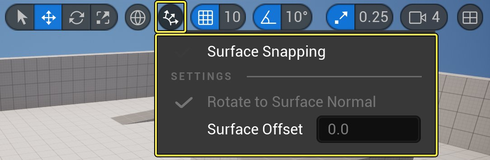
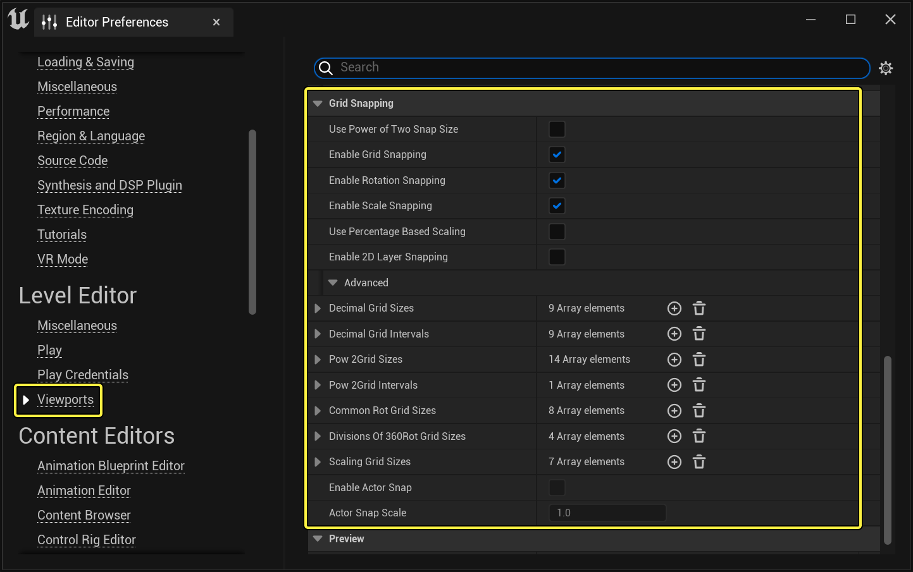

# Actor对齐

> 路径：虚幻引擎5.7文档 / 理解基础知识 / Actor和几何体 / Actor对齐

> 原始页面：https://dev.epicgames.com/documentation/unreal-engine/actor-snapping-in-unreal-engine

你可以利用 **对齐（Snapping）** 功能轻松定位Actor，将其与网格或其他对象对齐。启用对齐后，Actor将在变换后跳至固定位置。

**虚幻引擎** 会通过多种不同的方式实现对齐：

- 表面对齐
- 网格对齐
- 顶点对齐

## 表面对齐

**表面对齐** 使Actor对齐到地面或其他表面。从 **关卡视口（Level Viewport）** 工具栏启用表面对齐：点击 **表面对齐（Level Viewport** ）**按钮，然后启用**表面对齐（Surface Snapping）** 选项。

点击查看大图

"关卡视口"工具栏中的"表面对齐"按钮和选项。

启用表面对齐后，你还可以设置以下选项：

| 选项 | 说明 |
| --- | --- |
| **旋转到表面法线（Rotate to Surface Normal）** | 如果启用此选项，Actor将自动旋转，使对齐方式匹配其所对齐到的表面。 |
| **表面偏移（Surface Offset）** | 修改此值以配置Actor与其所对齐到的表面之间的距离。 |

> [!TIP]
> 如果你选择Actor并按 **End** 键，该Actor会对齐到最接近的表面，例如，关卡的地面平面。

## 网格对齐

在虚幻引擎中启用 **网格对齐** 时，Actor将按特定值的增量移动、旋转或缩放。例如，平移对齐值设置为10个单位，你就只能按10个单位的增量移动Actor。

虚幻引擎会为每个变换使用单独的网格。

- **拖动网格（Drag Grid）** 允许对齐到关卡中的三维隐式网格。
- **旋转网格（Rotation Grid）** 可用于进行增量旋转对齐。
- **缩放网格（Scale Grid）** 会强制"缩放"控件对齐到累加增量，但可以在"编辑器偏好设置"中设置为百分比值（请参阅下面的"对齐偏好设置（Snapping Preferences）"分段）。

| 列 1 | 列 2 | 列 3 |
| --- | --- | --- |
| [Drag Grid](https://d1iv7db44yhgxn.cloudfront.net/documentation/images/352c9e44-cea3-4446-8990-64e936892dd2/02-drag-grid.png) 点击查看大图 | [Rotation Grid](https://d1iv7db44yhgxn.cloudfront.net/documentation/images/2c24d3c1-aff2-46b2-a75e-5af1360dce18/03-rotation-grid.png) 点击查看大图 | [Scale Grid](https://d1iv7db44yhgxn.cloudfront.net/documentation/images/6c9d2d20-f6ee-441a-b84d-93e20ad74bd5/04-scale-grid.png) 点击查看大图 |
| 拖动网格 | 旋转网格 | 缩放网格 |

在 **关卡视口（Level Viewport）** 工具栏中点击对齐网格的图标，即可激活该网格。网格激活后，图标会高亮显示。你可以从激活按钮右侧的下拉菜单更改每个网格的增量。

### 对齐偏好设置

"拖动网格"、"旋转网格"和"缩放网格"的设置都可以在 **编辑器偏好设置（Editor Preferences）** 面板中配置，其中还提供了对齐行为的额外选项。要访问这些偏好设置，请从主菜单选择 **编辑（Edit）> 编辑器偏好设置（Editor Preferences）> 视口（Viewports）**，然后向下滚动到 **对齐（Snap）** 类别。

点击查看大图

虚幻引擎编辑器偏好设置中的网格对齐偏好设置。

你可以设置以下选项：

| 选项 | 说明 |
| --- | --- |
| **使用二的乘方对齐大小（Use Power of Two Snap Size）** | 启用此选项以使用2的乘方网格设置（1、2、4、8、16……），而不是十进制网格大小。 |
| **启用网格对齐（Enable Grid Snapping）** | 如果启用此选项，Actor位置将对齐到网格。这与"关卡视口（Level Viewport）"工具栏上的开关按钮相同。 |
| **启用旋转对齐（Enable Rotation Snapping）** | 如果启用此选项，Actor旋转将对齐到网格。 |
| **启用缩放对齐（Enable Scale Snapping）** | 如果启用此选项，Actor缩放（大小）将对齐到网格。 |
| **使用百分比缩放（Use Percentage Based Scaling）** | 启用此选项以使用虚幻引擎的旧版乘法（百分比）缩放，而不是当前的累加方法。 |
| **启用2D层对齐（Enable 2D Layer Snapping）** | 这将在"关卡视口（Level Viewport）"工具栏中启用额外的选项，你可以用于根据项目的需要，将对象对齐到2D层。默认层是"前景（Foreground）"、"默认（Default）"和"背景（Background）"。你可以从下拉菜单点击"编辑层（Edit Layers）"进行自定义。 |
| **十进制网格大小（Decimal Grid Sizes）** | 使用此数组自定义对齐网格大小。这些值显示在"关卡视口（Level Viewport）"的工具栏中。 |
| **十进制网格间隔（Decimal Grid Intervals）** | 此设置将控制正交视口中的网格参考线之间的十进制间隔。 |
| **2的乘方网格大小（Pow 2Grid Sizes）** | 如果你启用了"使用二的乘方对齐大小（Use Power of Two Snap Size）"，请使用此数组自定义2的乘方对齐网格大小。 |
| **2的乘方网格间隔（Pow 2Grid Intervals）** | 此设置将控制正交视口中的网格参考线之间的2的乘方间隔。 |
| **常用旋转网格大小（Common Rot Grid Sizes）** | 使用此数组自定义常用旋转网格间隔。这些值显示在"关卡视口（Level Viewport）"的工具栏中的"旋转网格对齐（Rotation Grid Snap）"下拉菜单下。 |
| **360度划分旋转网格大小（360Rot Grid Sizes）** | 使用此数组自定义360度划分旋转网格间隔。这些值显示在"关卡视口（Level Viewport）"的工具栏中的"旋转网格对齐（Rotation Grid Snap）"下拉菜单下。 |
| **缩放网格大小（Scaling Grid Sizes）** | 使用此数组自定义缩放网格间隔。这些值显示在"关卡视口（Level Viewport）"的工具栏中。 |

## 顶点对齐

你可以使用 **顶点对齐** 功能将一个对象对齐到另一个对象，方法是使用其各自网格体的多边形顶点。顶点是两条或多条边相交处的点。

要使用顶点对齐，请在按住 **V** 键的同时使用平移控件。按住 **V** 键的同时，只要开始移动对象，你就会看到该对象可以对齐到的多边形顶点。此功能在与枢轴点调整一起使用时尤其有用：你可以将枢轴点直接对齐到顶点，然后用此方法将该对象对齐到另一个对象上的顶点。

下面的视频演示了如何使用此技巧将两个管道精确地对齐在一起。另请注意两个"静态网格体"的枢轴点所在的位置。

此技巧很适合走道、墙壁、门以及其他需要参照他物精确放置的对象。
