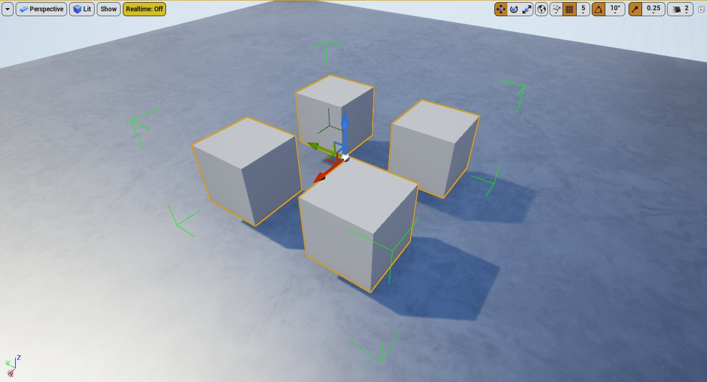
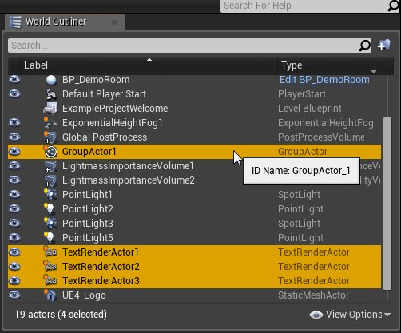

# Actor分组

> 路径：虚幻引擎5.7文档 / 理解基础知识 / Actor和几何体 / Actor分组

> 原始页面：https://dev.epicgames.com/documentation/unreal-engine/grouping-actors-in-unreal-engine

将Actor分成一组，你就可以同时管理多个Actor。利用Actor组，你可以执行以下操作：

- 将分成一组的Actor作为一个整体变换，比如旋转、平移、缩放。多个Actor属于一个组时，单个Actor变换将锁定。
- 临时解锁一个组，变换单个Actor，然后重新锁定该组以冻结组中的各个Actor，防止对单个Actor的变换进行更改。
- 在组中添加和删除Actor。

> [!NOTE]
> 一个Actor一次只能属于一个组。

要将多个Actor分成一组，你需要首先确保启用了 **允许组选择（Allow Group Selection）**。此选项位于 **主工具栏（Main Toolbar）** 上的 **设置（Settings）** 菜单中。你还可以使用 **Ctrl + Shift + G** 键盘快捷方式切换此选项。

设置（Settings） 菜单中的 允许组选择（Allow Group Selection） 选项。

## Actor分组

要将两个或多个Actor分成一组，请选择相应Actor，然后执行以下任一操作：

- 右键点击任一所选Actor，弹出 **上下文菜单（context menu）**，然后选择 **组（Group）**。
- 使用 **Ctrl + G** 键盘快捷方式。

Actor组通过 **视口（Viewport）** 中的绿色括号定界。

一个Actor组包含四个静态网格体Actor。只要进行变换，就会同时影响此组中的所有Actor。

> [!NOTE]
> 处于不同关卡中的Actor不能分成一组。将当前位于组中的Actor从一个关卡移到另一个关卡，就会将其从现有组中删除。但是，你可以在不同关卡之间移动整个组。

将多个Actor分成一组时，你将在 **世界大纲视图（World Outliner）** 中创建 **组Actor（Group Actor）**。要选择该组中的所有Actor，你可以选择组Actor或组中的成员。

世界大纲视图中的一个组Actor。

有关Actor选择的更多信息，请参阅[选择Actor](../selecting-actors/index.md)文档。

## 处理Actor组

你在 **视口（Viewport）** 或 **世界大纲视图（World Outliner）** 中右键点击一系列Actor或一个Actor组时，系统会打开 **上下文菜单（context menu）**，你可以在其中的 **组（Group）** 分段中看到Actor组选项。

下面的分段描述了在虚幻引擎中处理组的选项。

### 重新分组

如果你的选择中包含至少一个组和其他未分组的Actor，那么上下文菜单中将提供 **重新分组（Regroup）** 选项。

重新分组会从全部现有组中删除所有选定的Actor，然后将所有选定的Actor创建成一个新组。使用此选项可将你的所有选择快速创建成一个新组，而无需手动解散其他组。

> [!TIP]
> 你还可以使用 **Ctrl + G** 键盘快捷方式将Actor重新分组。根据你是否选择了以下选项，此快捷方式的行为会有所不同：
>
> - **无Actor组（No Actor groups）：**Ctrl + G会创建一个新组，其中包含所有选定的Actor。
> - **至少一个Actor组（At least one Actor group）：**Ctrl + G会执行重新分组操作，如上所述。

### 取消分组

**取消分组（Ungroup）** 选项会从所选组中删除所有Actor，然后删除这些组。

对于未锁定的组，取消分组操作将从组中删除所选的Actor，而不会尝试将其保留在现有组层级中。

> [!TIP]
> 你还可以使用 **Shift + G** 键盘快捷方式将Actor和/或嵌套组取消分组。

### 锁定和解锁组

当你处理现有组时，可以选择 **锁定（Lock）** 和 **解锁（Unlock）** 选项。

默认情况下，新创建的组处于 **已锁定（locked）** 状态。当某个组处于已锁定状态时：

- 如果你选择锁定组中的Actor，将选择整个组。
- 变换会影响组中的所有Actor。

如果某个组 **未锁定（unlocked）**，你可以执行以下操作：

- 选择和变换属于该组的单个Actor。
- 从该组中删除Actor。

组周围的括号表示该组当前是已锁定还是未锁定。绿色括号表示该组已锁定。红色括号表示该组未锁定。

已锁定组

未锁定组

左：锁定的Actor组。周围的括号为绿色，枢轴点位于该组中心。 右：未锁定的Actor组。最右侧的立方体当前已选择，可以单独变换。

### 添加和删除Actor

仅在你选择一个组和其他未分组的Actor之后，系统才会提供 **添加到组（Add to Group）** 选项。此选项会将未分组的Actor添加到现有组。

仅在你选择未锁定组中的一个或多个Actor之后，系统才会提供 **从组中删除（Remove from Group）** 选项。此选项将从组中删除所选的Actor。如果一个嵌套组从更大的组中删除，它本身仍是一个组。

如果一个组不包含Actor，将会自动删除，并且其组Actor会从 **世界大纲视图（World Outliner）** 中删除。

### 变换Actor和Actor组

Actor组的 **枢轴点** 会自动设置为该组的中心点。锁定该组时，你只能绕该组的枢轴点变换该组内的 **全部** Actor。要将单个Actor绕其自己的枢轴点变换，你必须首先解锁该组。

要设置Actor组的枢轴点，请选择该组，然后按住 **Alt** 键的同时 **中键点击** 你想设置枢轴点的位置。或者，**中键点击并拖动** 该组的变换控件中心处的球体来移动枢轴点。

此GIF演示了如何移动Actor组的枢轴点，并说明了Actor组如何绕新的枢轴点旋转。
