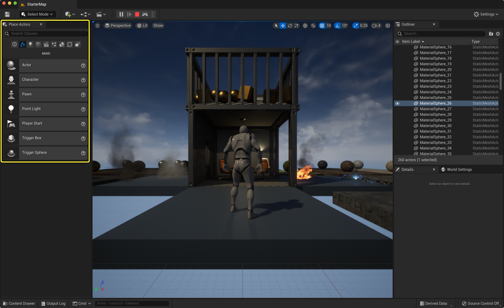
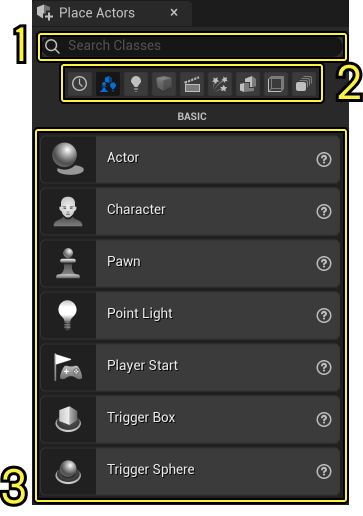
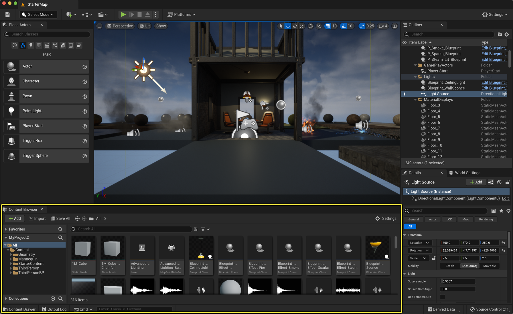
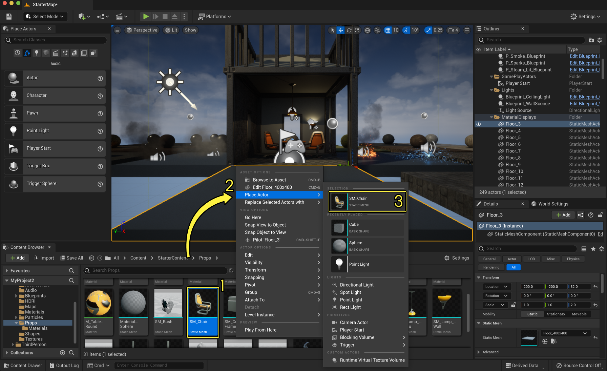

# 放置Actor

> 路径：虚幻引擎5.7文档 / 理解基础知识 / Actor和几何体 / 放置Actor

> 原始页面：https://dev.epicgames.com/documentation/unreal-engine/placing-actors-in-unreal-engine

**Actor** 是一种可以放置在 **关卡（Level）** 中的对象，从游戏场景中的 **静态网格体（Static Meshes）**，到声音、摄像机、玩家角色等，都是Actor。本页将介绍如何在关卡中放置这些Actor，这样你就可以让自己的世界"活起来"。

在关卡中放置Actor时，本质上是在关卡中创建了一个基于该Actor的 **实例（instance）** 对象。

> [!TIP]
> 在关卡中添加Actor还会自动将它们添加到 **世界大纲视图（World Outliner）** 中，该视图默认位于虚幻编辑器右上角。如需更多信息，请参阅 [世界大纲视图](../../../building-virtual-worlds/level-editor/outliner/index.md) 。

## 所需设置

在跟随本页面提供的工作流进行操作前，你必须创建一个新的项目，并在虚幻编辑器中打开。本页面中提供的示例会使用[第三人称模板](https://dev.epicgames.com/documentation/404)，不过你也可以随意选择其他的模板。

## 使用放置Actor面板

这一部分将向你展示如何使用 **放置Actor（Place Actors）** 面板放置Actor。要打开此面板，在主菜单中点击 **窗口（Window） > 放置Actor（Place Actor）**。放置Actor面板会出现在虚幻编辑器窗口的左侧。

虚幻编辑器中的放置Actor面板。点击查看大图。

接下来继续在关卡中放置一个立方体。在 **放置Actor（Place Actors）** 面板中，点击 **基础（Basic）** 选项卡，然后左键点击 **点光源（Point Light）** Actor并将它拖拽到关卡中，如下面的GIF所示。

你可以在 **放置Actor（Place Actors）** 面板中为任意Actor进行此项操作。

### 放置Actor面板界面

**放置Actor（Place Actors）** 面板由三个主要部分组成：

1. 搜索
2. 过滤
3. 资产视图

#### 1. 搜索

使用 **搜索（Search）** 栏按名称查找Actor。

#### 2. 过滤

使用这些选项卡快速切换Actor类型。

| 选项卡 | 内容 |  |
| --- | --- | --- |
| **最近放置（Recently Placed）** | 最近在关卡中放置的资产类型历史记录，最多20项。 | 此历史记录特定于每个项目。 |
| **基本（Basic）** | 基本Actor包括平面、Pawn和触发体积。还包含空Actor和角色。 |  |
| **光源（Lights）** | 包含所有可以放置在关卡中的光源类型。 |  |
| **形状（Shapes）** | 基本几何体（立方体、球体、圆柱体、锥体和平面）。 |  |
| **过场动画（Cinematic）** | 包含过场动画摄像机以及相关Actor类型，可用于模拟现实摄像机运动。 |  |
| **视觉效果（Visual Effects）** | 在某种程度上影响关卡视觉效果的体积，例如例如雾、后期处理和反射等。 |  |
| **几何体（Geometry）** | 你可以使用几何体笔刷迅速构建出关卡的雏形。 使用增加或减少的单选按钮可以更改笔刷向关卡中添加几何体或移除现有的几何体。 |  |
| **体积（Volumes）** | 包含所有可放置的体积类型。 |  |
| **所有类（All Classes）** | 包含所有可放置的Actor类型。 |  |

#### 3.资产视图

该视图显示选择搜索和筛选后的所有资产。

> [!TIP]
> **资产（Asset）** 是虚幻引擎项目中的任意一块内容。所有的Actor都是资产。

## 使用快捷菜单放置Actor

这一部分将展示如何使用 **快捷菜单（context menu）** 放置Actor。在虚幻引擎中，右击显示的任何菜单都是快捷菜单。

你可以在[内容浏览器](../../content-browser/index.md)中选择想要放置的Actor。打开内容浏览器的最快方法是点击虚幻编辑器窗口左下角的 **内容侧滑菜单** 按钮。如果你想让浏览器在失去焦点时（当你点击其他位置时）仍然显示，请点击其右上角的 **停靠在编辑器中（Dock in Editor）** 按钮。

虚幻编辑器中的内容浏览器。点击查看大图。

请按照以下步骤，从内容浏览器中放置Actor：

1. 在 **内容浏览器（Content Browser）** 中，找到你想要放置的 **资产（Asset）** 。
2. 左键点击选中 **资产（Asset）**。
3. 在选中 **资产（Asset）** 时，在 **视口（Level Viewport）** 中右键点击任意处打开快捷菜单。
4. 点击 **放置Actor（Place Actor）** 分段下方的 **资产（Asset）**。

使用快捷菜单从 内容浏览器（Content Browser） 中放置Actor。点击查看大图。

在快捷菜单中选择了资产后，你可以在关卡中之前右击的位置看到该资产。

你也可以使用快捷菜单快速向关卡添加不同类型的资产，甚至当你在 **内容浏览器（Content Browser）** 中选中了特殊的资产时也可以添加。在 **关卡视口（Level Viewport）** 中右键点击任意位置并悬停在 **放置Actor（Place Actor）** 上，可以查看你能够添加的资产类型。点击分段中看到的任意Actor并进行放置。

### 替换Actor

你也可以通过快捷菜单，用在 **内容浏览器（Content Browser）** 中选择的资产来替换 **关卡视口（Level Viewport）** 中的一个或多个Actor。 如果你想要一次替换多个资产，这一项操作十分有用。

请按照以下步骤替换一个或更多Actor：

1. 在 **内容浏览器（Content Browser）** 中，选中你想替换另一个Actor的Actor。
2. 在 **关卡视口（Level Viewport）** 中右击一个或多个Actor，打开快捷菜单。
3. 点击 **替换选中的Actor（Replace Selected Actors with）**。

你也可以用这个方法，选择 **放置Actor** 面板中的其他Actor，替换选中的Actor。

## 使用拖放放置Actor

你也可以从内容浏览器中拖放Actor，将其添加到关卡。你可以按照如下步骤操作：

1. 在

   内容浏览器（Content Browser）

   中，找到你想要放置的

   资产（Asset）

   。

1.左键点击 **资产（Asset）**，然后将其拖放到 **关卡视口（Level Viewport）** 中想要放置的位置。

当你从内容浏览器中拖放资产时，将为关联的资产类型创建以下类型的Actor：

- **蓝图（Blueprint）**：放置蓝图的一个实例
- **骨骼网格体（Skeletal Mesh）**：放置一个骨骼网格体Actor
- **静态网格体（Static Mesh）**：放置一个静态网格体Actor
- **Sound Cue**：放置一个环境音效
- **音波（Sound Wave）**：放置一个环境音效

## 从类查看器放置Actor

一个更高级的方式是通过 **类查看器（Class Viewer）** 放置Actor，它是虚幻编辑器使用的类的一个层级列表。

请按照以下步骤，从类查看器放置Actor：

1. 打开

   类查看器（Class Viewer）

   。在主菜单中找到

   窗口>开发者工具（Window > Developer Tools）

   。

> [!TIP]
> 在此窗口中，任意可以在关卡中放置的Actor会显示为蓝色。

1. 选择你想要放置的

   资产（Asset）

   ，然后将它拖拽到

   关卡视口（Level Viewport）

   中。

如需获取更多信息，请参阅[类查看器](../../assets-and-content-packs/class-viewer/index.md)文档。
