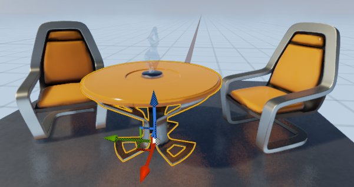
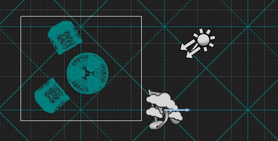

# 选择Actor

> 路径：虚幻引擎5.7文档 / 理解基础知识 / Actor和几何体 / 选择Actor

> 原始页面：https://dev.epicgames.com/documentation/unreal-engine/selecting-actors-in-unreal-engine

要选中Actor尽管并不难，但这类操作却是关卡编辑中的重要组成部分。能够快速、轻松地选中要使用的Actor，可提高效率并加快设计过程。

本页详细介绍了在虚幻引擎中选择Actor的不同方法。

## 简单选择

选择Actor的最基本方法是在视口中 **左键单击** 它们。单击一个Actor将取消选择任何当前选中的Actor并选择新的Actor。如果在单击新的（未选择的）Actor时按住 **Ctrl️** 键，则新的Actor将添加到选择中。如果在单击选中的Actor的同时按住 **Ctrl️** 键，则将从选择中移除该Actor。

此方法适用于选择少量Actor或分散在一个关卡中的多个孤立Actor，但在选择大量Actor时，此方法可能会比较低效且枯燥。

选中的Actor在视口中突出显示。在此示例中，选择了表格，如黄色高亮显示和出现的变换控件所示。

当你选择多个Actor时，你可以将它们转换为一个组，你可以在 **细节（Details）** 面板中同时修改它们的属性。

> [!TIP]
> 当你选择了两个或多个Actor时，你可以将它们添加到一个组中，以便更轻松地重新选择或同时更改它们的属性。有关更多信息，请参阅[Actor分组](../grouping-actors/index.md)页面。

## 在世界大纲视图中选择Actor

**世界大纲视图（World Outliner）** 是虚幻编辑器中的一个面板，其中包含关卡中所有Actor的层级树状图。默认情况下，它位于虚幻编辑器窗口的右侧。

你可以像在视口中一样选择和取消选择列表中的单个Actor。

此外，你可以通过以下方式选择多个Actor：

- 单击一个Actor，然后按住 **Shift️** 键并单击另一个Actor以在列表中选择它们之间的所有Actor。
- 按住 **Ctrl** 键并单击多个Actor以将它们全部选中。Actor不必按顺序排列。

> [!NOTE]
> 在 **世界大纲视图（World Outliner）** 中选择任何Actor也会在视口中将其选中，反之亦然。

## 区域选择（单击并拖动）

区域选择是一种快速方法，可在视口中的特定区域内选择或取消选择一组Actor。此类选择通过单击并拖动鼠标来执行，同时按住一个键或组合键（可选）。根据你在拖动鼠标时按住的键和鼠标按钮的组合，将选择或取消选择方框内的所有Actor。

虚幻编辑器中的区域选择。请注意，此视口采用从上到下的正交视图，这样可以更轻松地使用单击并拖动来选择多个对象。

下表显示了用于区域选择的键组合。

| **鼠标和键盘快捷键** | **操作** |
| --- | --- |
| **左键单击并拖动** | 将当前选择替换为方框内包含的Actor。 |
| **左键单击并拖动** + **Shift** | 将方框内包含的Actor添加到当前选择中。 |
| **左键单击并拖动** + **Ctrl** + **Alt** | 从当前选择中移除方框内的Actor。 |

## 使用选择菜单

虚幻编辑器菜单栏中的 **选择（Select）** 菜单提供了一些高级选择技术。

> [!TIP]
> 该子菜单中可用的选项因你选择的Actor类型而异。例如，如果你选择了静态网格体，所看到的选项与选择蓝图时不同。

下表详细介绍了 **选择（Select）** 子菜单中的一些常见选项。

| **选项** | **描述** |
| --- | --- |
| **全选（Select All）** | 选择当前关卡中的所有Actor。 |
| **取消全选（Unselect All）** | 清除当前选择。 |
| **反向选择（Invert Selection）** | 反向当前选择（选择当前未选择的所有Actor，并将当前选择的Actor取消）。 |
| **聚焦选中（Focus Selected）** | 将选中的Actor在关卡视口内居中。 |
| **选择直接子项（Select Immediate Children）** | 选择当前选中的Actor的 *直接* 子项。例如，如果你的Actor层级如下所示： Actor 1 Actor 2 Actor 3 Actor 4 Actor 5 Actor 6 Actor 7 此操作仅选择Actor 2、3和6。 |
| **选择所有后代（Select All Descendants）** | 选择当前选中的Actor的 *所有* 子项。 |
| **选择相关光源（Select Relevant Lights）** | 选择所有影响当前选中的Actor的光源Actor。 |
| **选择匹配（选中的类）（Select Matching (Selected Classes)）** | （对于网格体Actor）选择与选中的Actor具有相同静态网格体和相同Actor类的所有Actor。 |
| **选择匹配（所有类）（Select Matching (All Classes)）** | （对于网格体Actor）选择与选中的Actor具有相同静态网格的所有Actor。 |
| **选择所有叠加型笔刷（Select All Additive Brushes）** **选择所有挖空型笔刷（Select All Subtractive Brushes）** **选择所有表面（Select All Surfaces）** | 选择与指定类型（叠加型、挖空型或表面）匹配的所有笔刷Actor。 |
| **选择所有具有同样材质的项（Select All With Same Material）** | 选择所有使用相同材质的Actor。 |
| **选择层级中的所有几何体（Select All Geometry in Hierarchy）** **取消选择层级中的所有几何体（Deselect All Geometry in Hierarchy）** **反向选择层级中的几何体（Select Inverse Geometry in Hierarchy）** | 选择、取消选择或反向选择关卡中所有几何体的当前选择。 |
