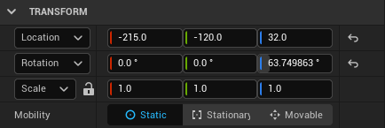
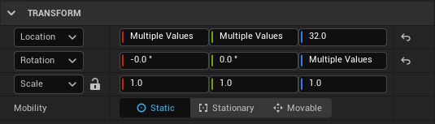
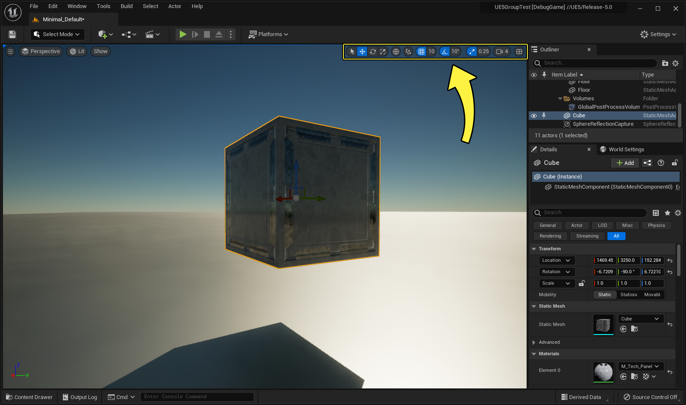

# 变换Actor

> 路径：虚幻引擎5.7文档 / 理解基础知识 / Actor和几何体 / 变换Actor

> 原始页面：https://dev.epicgames.com/documentation/unreal-engine/transforming-actors-in-unreal-engine

在 **虚幻引擎** 中 **变换（Transforming）** Actor是指对其进行移动、旋转或缩放（也就是，调整Actor的位置、方向和/或大小）。本页描述了如何执行这些操作，以及一些常用的Actor操作快捷键。

在虚幻编辑器中，有两种变换Actor的方法：

- 手动变换
- 交互式变换

> [!TIP]
> 在虚幻引擎中，**Z轴** 为纵轴。

## 手动变换

你可以通过 **细节（Details）** 面板的"变换"（Transform）分段进行 **手动变换**。当你在 **关卡视口（Level Viewport）** 中选择一个或多个Actor时，可在此分段查看和编辑它们的 **位置（Location）**、**旋转（Rotation）** 和 **缩放（Scale）**。在适用的情况下，此分段还包含[Actor移动性（Actor mobility）](../actor-mobility/index.md) 设置。

Actor"细节"（Details）面板的"变换"（Transform）分段中，会显示Actor的 位置（Location）、旋转（Rotation） 和 缩放（Scale） 的数值。

每个 **变换（Transform）** 属性都提供了分别对应X、Y和Z轴的数字输入字段。你可以直接在这些字段中输入特定值来调整选定的Actor，或者在字段内单击并上下拖动鼠标来调整该字段的数值。

如果选择了多个Actor，并且它们的位置（Location）或旋转（Rotation）有多个数值，则相关字段将显示 *多个值（Multiple Values）*。在这种情况下，你输入的数字将覆盖所有选定Actor的对应值。请注意，这可能会导致Actor重叠。

选择多个Actor后，一个或多个变换（Transform）字段可以有多个数值，如本例所示。

要在更改后将Actor的 **位置（Location）**、**旋转（Rotation）** 或 **缩放（Scale）** 重置为其默认值，请单击 **重置为默认值（Reset to Default）** 按钮（Reset to Default button）。

你可以通过单击 **锁定缩放（Lock Scale）** 按钮来锁定 **缩放（Scale）** 字段（Lock Scale button）。锁定后，每个轴（X、Y和Z）的数值会同步变化，从而实现等分缩放并防止失真。

变换（Transform）属性默认 *相对（relative）* 坐标空间，这意味着变换相对于Actor的父节点进行。通过单击属性标签旁边的下拉箭头，可在 *相对（relative️）* 和 *世界（world️）* 变换之间切换。*世界（world️）* 变换相对于世界坐标进行，而不是相对于Actor的父节点。有关更多信息，请参阅此页面上的 **世界和局部变换模式** 小节。

## 交互式变换

你可以使用一种名为 **小工具（gizmo️）** 的可视化工具，直接在 **关卡视口（Level Viewport）** 内进行 **交互式变换（Interactive transformation）**。小工具（gizmo）有时也称为 **控件（widget）**；在虚幻引擎中，这些术语的含义相同。

小工具由几个部分组成，分别根据其作用的轴进行颜色编码：

- 红色代表X轴。
- 绿色代表Y轴。
- 蓝色代表Z轴。

你可以使用变换小工具来移动、旋转或缩放Actor。

> [!TIP]
> 小工具使用起来更直观，但不如手动输入坐标精确。使用小工具时可使用 **网格对齐（grid snapping）** 进行精确定位。 有关更多信息，请参阅[Actor对齐](../actor-snapping/index.md)页面。

根据正在执行的变换类型，小工具会采用不同的形式：平移、旋转或缩放。你可以通过以下方法选择要使用的小工具类型：单击位于视口右上角的 **关卡视口（Level Viewport）** 工具栏中的图标，或使用键盘快捷方式。

关卡视口（Level Viewport）工具栏位于视口的右上角。点击图片以查看大图。

从左到右：关卡视口（Level Viewport）工具栏中的选择、平移、旋转和缩放小工具的快捷方式。

> [!TIP]
> 选择一个或多个Actor后，你可以通过在键盘按下 **空格键** 在不同类型的小工具之间切换。

> [!TIP]
> 通过从主工具栏的 **设置（Settings️）** 菜单启用或禁用 **显示变换控件（Show Transform Widget）** 选项，你可以打开或关闭变换小工具的可见性。

### 平移小工具

**平移（Translation）** 小工具是一组颜色编码的箭头，指向世界中每个轴的正方向。可用于沿轴、平面移动或自由移动Actor。

单击箭头并拖动箭头以沿该轴移动选定的Actor。

沿单轴平移立方体。

要同时沿两个轴移动Actor，请单击两个轴相交点处的正方形，然后拖动，即可沿两个轴（XY、XZ或YZ）定义的平面移动Actor。

沿两个轴（单个平面）平移立方体。

要沿所有三个轴自由移动Actor，请单击并拖动所有三个轴相交处的白色球体。你还可以使用鼠标滚轮将Actor向近处或远处移动。

沿所有三个轴平移立方体。

#### 使用平移小工具复制Actor

要复制一个Actor，请按住 **Alt** 键，然后单击并拖动平移小工具的一个箭头。这将创建并移动所选Actor的副本，而原始Actor在起始位置保持不变。

使用平移小工具复制Actor。

### 旋转小工具

**旋转（Rotation）** 小工具是一组三个颜色编码的弧线，每个弧线与一个轴相关联。当你拖动其中一条弧线时，选定的Actor将围绕该轴旋转。对于这个小工具，任一弧线所影响的轴是垂直于弧线的轴。例如，与XY平面对齐的弧线使Actor围绕Z轴旋转。

使用旋转小工具旋转Actor。

当你将光标悬停在特定弧线上时，该弧线会变为黄色，表示你可以拖动它来旋转Actor。当你开始旋转Actor时，小工具会改变形状，仅显示Actor的旋转轴。旋转量也会实时显示，以帮助你把控进度。

### 缩放小工具

**缩放（Scale）** 小工具带有末端为立方体的手柄。当你通过其中一个手柄拖动小工具时，可沿关联的轴缩放选定的Actor。手柄按轴进行颜色编码，类似于 **平移（Translation）** 和 **旋转（Rotation）** 小工具。

沿单轴缩放Actor。

你可以同时沿两个轴缩放Actor，类似于使用 **平移（Translation）** 小工具沿由两个轴定义的平面移动Actor。每两个轴通过一条线连接，形成一个三角形。这些三角形分别对应三个平面之一（XY、XZ、YZ）。拖动其中一个三角形即可沿定义该平面的两个轴缩放Actor。当鼠标悬停在其中一个三角形上时，相应手柄变为黄色。

沿单个平面缩放Actor。

你还可以沿所有三个轴缩放Actor，从而保持其原始比例。如果将光标悬停在所有三个轴相交的立方体上，三个手柄都变为黄色。拖动该中心立方体即可按比例缩放Actor。

按比例缩放Actor。

### 世界和局部变换模式

使用交互式变换方法时，你可以选择执行变换时所使用的参考坐标系。这意味着你可以按以下方式变换Actor：

- 世界空间，也就是沿世界轴；或者
- Actor的局部空间，也就是沿其局部轴。

下面的示例使用静态网格体Actor显示了世界空间和局部空间之间的差异。

| 列 1 | 列 2 |
| --- | --- |
|  |  |
| 世界空间：平移小工具的XYZ轴与世界的XYZ轴相同。沿Z轴拖动可相对于地面上下移动立方体。 | 局部空间：平移小工具的XYZ轴使用立方体的局部坐标。沿Z轴拖动也会上下移动立方体，但会倾斜一个角度。 |

默认情况下，虚幻编辑器的启动模式为世界变换模式。要切换到局部变换模式，请单击 **关卡视口（Level Viewport）** 工具栏中的 **地球** 图标。地球变成一个立方体图标，表示你现在处于局部变换模式。单击立方体可切换回世界坐标。

地球图标表示当前选定Actor的变换使用世界空间坐标。

## 调整Actor的枢轴点

变换Actor时，你通常会从Actor的基础枢轴点执行变换。如果你启用了变换小工具，则会在该小工具的三个轴相交处看到 **枢轴点**。

你可以临时调整Actor枢轴点的位置，方法是鼠标中键单击 **变换** 小工具的中心处的球体并拖动，即可移动枢轴点。然后，你可以围绕新的枢轴点变换对象。

> [!TIP]
> 枢轴点可位于Actor内部或外部。

在此示例中，静态网格体Actor围绕外部枢轴点旋转。

> [!NOTE]
> 取消选择该Actor后，枢轴点会立即跳回原位。若要永久更改枢轴点，在调整枢轴点后，右键单击该静态网格体，并选择 **枢轴点（Pivot）> 设置为枢轴点偏移（Set as Pivot Offset）**。
>
> 若要将枢轴点重置为其默认位置，右键单击该静态网格体，然后选择 **枢轴点（Pivot）> 重置枢轴点偏移（Reset Pivot Offset）**。

## 键盘快捷方式

以下是使用Actor时的一些常用键盘快捷方式。

| **功能按钮** | **工具或操作** |
| --- | --- |
| **W** | 选择移动工具。 |
| **E** | 选择旋转工具。 |
| **R** | 选择缩放工具。 |
| **V**（使用平移小工具时按住） | 切换顶点对齐。 |
| **左键单击并拖动**（在变换小工具上） | 移动、旋转或缩放选定的Actor，具体取决于当前活动的变换小工具。 |
| **中键单击并拖动**（在枢轴点上） | 移动选定Actor的枢轴点。 |
| **Ctrl + W**（在Actor上） | 将选定的Actor复制到原始Actor所在的相同坐标处。 |
| **Alt + 左键单击并拖动**（在平移小工具上） | 复制选定的Actor。 |
| **H**（在Actor上） | 隐藏选定的Actor。 |
| **Ctrl + H** | 显示所有隐藏的Actor。 |
| **Shift + E**（在Actor上） | 选择关卡中与所选Actor类型相同的所有匹配Actor。 |
| **Ctrl + 左键单击**（在Actor上） | 将该Actor添加到当前Actor选择中。 |
