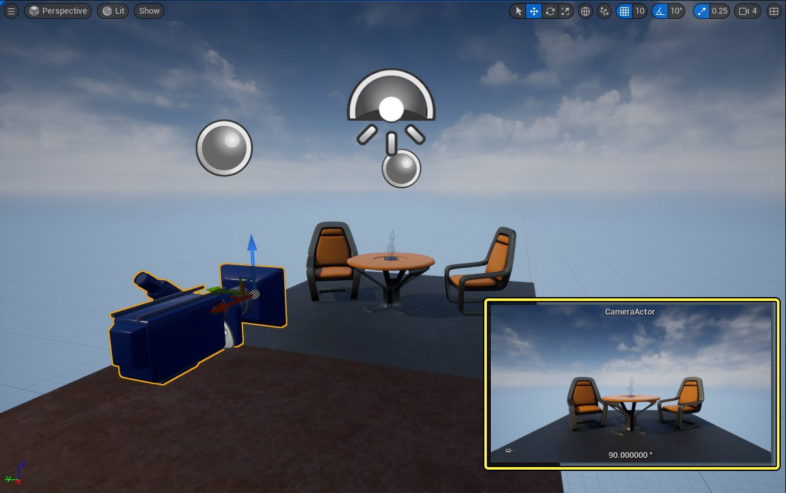

# 摄像机Actor

> 路径：虚幻引擎5.7文档 / 理解基础知识 / Actor和几何体 / Actor参考 / 摄像机Actor

> 原始页面：https://dev.epicgames.com/documentation/unreal-engine/camera-actors-in-unreal-engine

在 **虚幻引擎5** 中制作的游戏或者其他任何场景，都需要至少一个摄像机让用户来观察该场景。你可以使用虚幻引擎中的不同 **摄像机Actor（Camera Actor）** 来达到此目的。

虚幻引擎中有如下几种摄像机Actor：

- **摄像机Actor（Camera Actor）**, 通用摄像机，可以用作固定或者移动的视口。
- **电影摄像机Actor（Cine Camera Actor）**, 用于制作过场动画的专用摄像机。详情参阅[电影摄像机Actor（Cine Camera Actor）](../../../../animating-characters-and-objects/cinematics-and-movie-making/movie-and-cinematic-cameras/cinematic-cameras/index.md)。

除了摄像机Actor以外，你还可以使用以下几种Actor，在虚幻引擎中与摄像机一同使用：

| Actor类型 | 描述 | 详情 |
| --- | --- | --- |
| 摄像机阻挡体积（Camera Blocking Volume） | 用于防止摄像机进入特定的空间。可以用于防止出现摄像机穿过墙壁或者进入其他环境的情况。 |  |
| 摄像机吊臂（Camera Rig Crane） | 模拟摄像机升降机系统，用于制作俯视视角的画面。吊臂架可以在水平和垂直轴上旋转，同时还可以根据需求伸缩。 | [摄像机绑定](../../../../animating-characters-and-objects/cinematics-and-movie-making/movie-and-cinematic-cameras/camera-jibs-and-dollies/index.md) |
| 摄像机轨道（Camera Rig Rail） | 模拟摄像机滑轨系统，可以用于制作滑动的镜头画面。根据画面的需求可以调节滑轨的长度和弯曲。 | [摄像机绑定](../../../../animating-characters-and-objects/cinematics-and-movie-making/movie-and-cinematic-cameras/camera-jibs-and-dollies/index.md) |
| 关卡序列Actor（Level Sequence Actor） | 用于容纳关卡序列资产。关卡序列资产包括位于内容浏览器（Content Browser）中 ，容纳包括轨道、摄像机、关键帧、动画在内的Sequencer数据。这些资产被分配至一个关卡序列Actor来将其中的数据与关卡绑定。 | [Sequencer概述](../../../../animating-characters-and-objects/cinematics-and-movie-making/unreal-engine-sequencer-movie-tool-overview/index.md) |

## 放置一个摄像机Actor

摄像机Actor可以通过[放置Actor面板（Place Actors panel）](../../placing-actors/index.md)来添加。在 **放置Actor（Place Actor）** 面板中找到摄像机，然后将其拖至关卡视口。

## 预览摄像机Actor

当你选中一个摄像机Actor或者包含摄像机组件的蓝图时，关卡视口中将会出现一个单独的预览窗口。该窗口会显示选中的摄像机所看到的画面。

摄像机Actor的预览窗口。点击查看大图。
