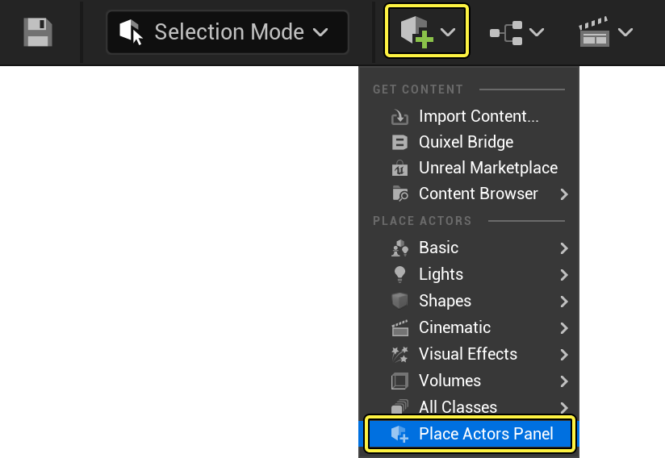
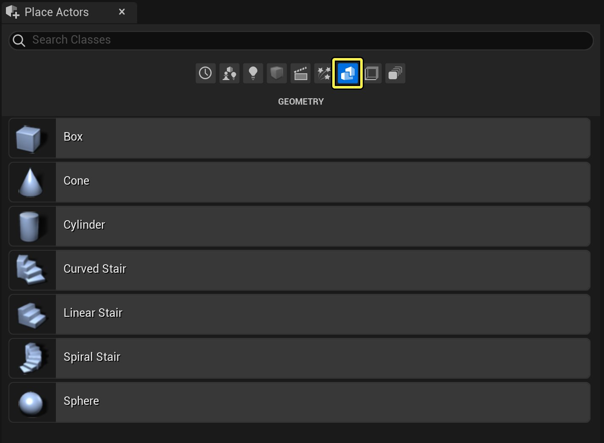
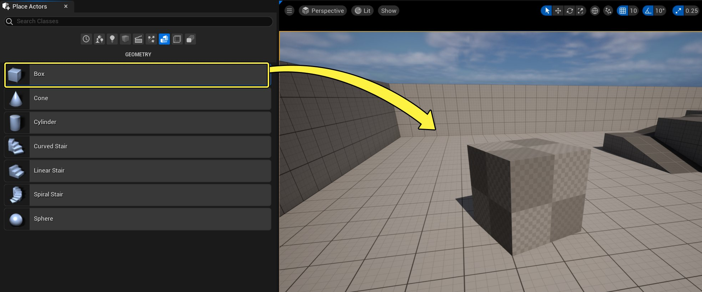
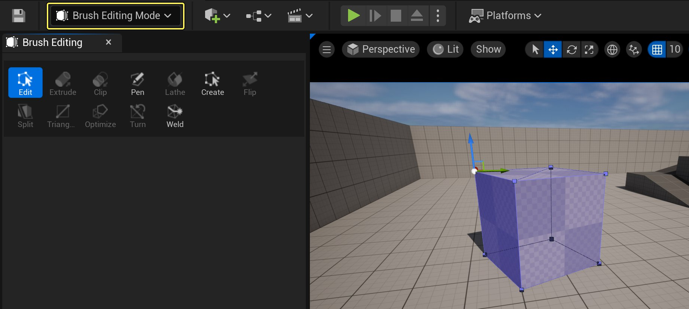
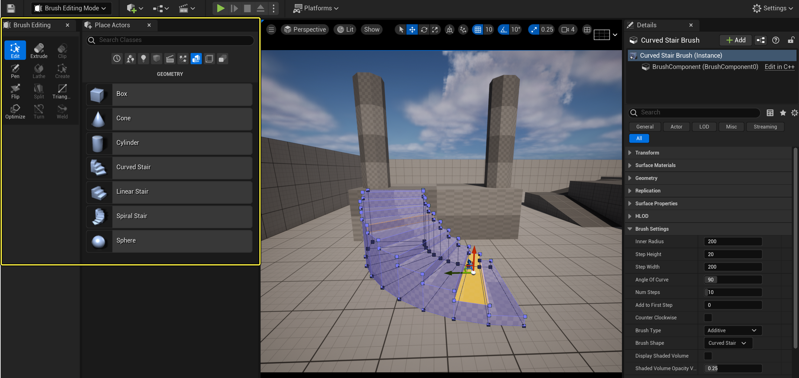
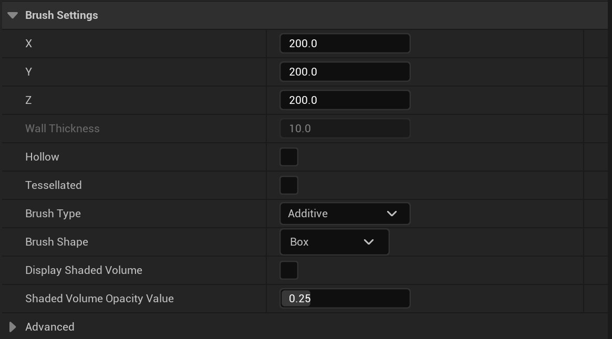
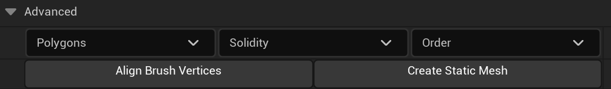

# 几何体笔刷Actor

> 路径：虚幻引擎5.7文档 / 理解基础知识 / Actor和几何体 / Actor参考 / 几何体笔刷Actor

> 原始页面：https://dev.epicgames.com/documentation/unreal-engine/geometry-brush-actors-in-unreal-engine

几何体笔刷，又称二进制空间划分（BSP）笔刷，是虚幻引擎的关卡构建工具。理论上说，建议将几何体笔刷用于在关卡中填充、雕刻空间体积。在关卡设计过程中，你可以使用笔刷为关卡创建基础形状。在美术师创建最终网格体时，它可以作为始终存在的用具，也可作为测试用的临时工具。

之前，几何体笔刷一直作为关卡设计的主要模块。现在，这个任务已交给[静态网格体](../../../../working-with-content/static-meshes/index.md)和引擎内[建模工具](../../../../working-with-content/modeling-and-geometry-scripting/getting-started-with-modeling-mode/index.md)，后两者效率远高于几何体笔刷。但在产品的早期阶段，几何体笔刷依旧有用——它可以快速设置关卡和对象的原型，也可用于无法使用3D建模工具的关卡构建。本文将介绍几何体笔刷的用途及用法。

> [!WARNING]
> 不建议将几何体笔刷用作关卡设计的单一方法。它应视情况使用，在关卡早期搭建阶段较为有用。

## 几何体笔刷的用途

尽管现在主要使用静态网格体来填充关卡，但几何体笔刷仍有用武之地，比如规划关卡或创建填充用几何体。

### 规划关卡

创建关卡的标准工作流程大致为：

- 规划关卡和设计关卡路径
- 游戏玩法测试流程
- 修改布局并重复测试
- 初始建模阶段
- 初始光照阶段
- 碰撞和性能问题的测试
- 完善阶段

|  |  |
| --- | --- |
| UE中的关卡规划 | Final level design in UE |
| 笔刷规划/草拟 | 最终关卡 |

第一步是在使用静态网格体和其他成品美术资源填充关卡前，先规划关卡以确定布局和流程。通常使用几何体笔刷创建关卡的轮廓，然后通过测试和迭代，由团队确定最终布局。由于无需美术团队，因此在关卡设计的这方面最适用几何体笔刷。关卡设计师可使用虚幻编辑器中的内置工具创建和修改几何体笔刷，以达到满意的关卡布局和效果。

测试结束后便开始建模，关卡设计师会逐渐用静态网格体取代几何体笔刷将。这一替换过程可实现更快的初始迭代，同时也为美术团队的建模工作提供了极好的参考。

### 简单填充几何体

关卡设计师创建关卡时，时常需要使用较为简单的几何体填充间隙或空间。若无用于填充区域的现成静态网格体，设计师可直接使用几何体笔刷进行填充，无需美术团队创建自定义网格体。尽管静态网格体性能更好，但对于简单几何体而言，偶尔使用几何体笔刷也不会造成严重影响。

## 创建笔刷

使用 **放置Actor（Place Actors）** 面板中的 **几何体（Geometry）** 选项卡创建笔刷：

1. 在添加下拉菜单中选择 **放置Actor（Place Actors）** 面板。

   
2. 选择几何体图标。

   
3. 将列表中的某一个图元类型拖入 **视口**。

   
4. 在 **细节** 面板中选择[笔刷类型](#%E7%AC%94%E5%88%B7%E7%B1%BB%E5%9E%8B)（叠加或删减）。
5. 使用细节面板中的 **笔刷设置（Brush Settings）** 、变换控件或激活 **笔刷编辑模式（Brush Editing Mode）** 修改笔刷。详见[修改笔刷](#%E4%BF%AE%E6%94%B9%E7%AC%94%E5%88%B7)。

## 笔刷图元

| 图元 | 说明 |  |
| --- | --- | --- |
|  | 创建盒体形状的几何体笔刷Actor，之后可在 **细节（Details）** 面板中自定义。选项包括： **X**：设置X轴上的大小。 **Y**：设置Y轴上的大小。 **Z**：设置Z轴上的大小。 **墙壁厚度（Wall Thickness）**：若勾选 **中空（Hollow）**，则设置笔刷内壁厚度。 **中空（Hollow）**：勾选此框，笔刷内部将出现中空（用于快速创建房间），而非实心。若勾选，则启用 **墙壁厚度（Wall Thickness）** 设置。 **曲面细分（Tessellated）**：勾选此框会将盒体面曲面细分为三角形，而非保持四边形。 |  |
|  | 创建椎体形状的几何体笔刷Actor，之后可在 **细节（Details）** 面板中自定义。选项包括： **Z**：在Z轴上设置高度。 **Z上限（Cap Z）**：若勾选 **中空（Hollow）** ，则设置在Z轴上设置高度的内部上限。 **外部半径（Outer Radius）**：设置椎体基座半径。 **内部半径（Inner Radius）**：若勾选 **中空（Hollow）**，则设置椎体内壁半径。 **面数（Sides）**：设置椎体形状周围的面数。 **面对齐（Align to Side）**：勾选此框，将沿X轴与面的旋转对齐。禁用会将其中一角指向轴下方。 **中空（Hollow）**：勾选此框，笔刷内部将出现中空（用于快速创建房间），而非实心。若勾选，则启用 **内部半径（Inner Radius）** 设置。 |  |
|  | 创建圆柱体形状的几何体笔刷Actor，之后可在 **细节（Details）** 面板中自定义。选项包括： **Z**：在Z轴上设置高度。 **外部半径（Outer Radius）**：设置圆柱体的半径。 **内部半径（Inner Radius）**：若勾选 **中空（Hollow）**，则设置圆柱体内的中空空间半径。 **面数（Sides）**：设置圆柱体形状周围的面数。 **面对齐（Align to Side）**：勾选此框，将沿X轴与面的旋转对齐。禁用会将其中一角指向轴下方。 **中空（Hollow）**：勾选此框，笔刷内部将出现中空（用于快速创建房间），而非实心。若勾选，则启用 **内部半径（Inner Radius）** 设置。 |  |
|  | 创建曲线楼梯形状的几何体笔刷Actor，即楼梯可弯曲，但无法自我环绕 - 因此需要螺旋式楼梯。曲线楼梯将一直延伸到地面。可在 **细节（Details）** 面板中自定义形状。选项包括： **内部半径（Inner Radius）**：设置阶梯环绕的内柱半径。 **阶梯高度（Step Height）**：设置每级阶梯的高度。 **阶梯宽度（Step Width）**：设置每级阶梯的宽度。 **曲线角度（Angle of Curve）**：设置每级楼梯的旋转角度。 **阶梯数（Num Steps）**：设置楼梯中阶梯的数量。 **添加到第一级阶梯（Add to First Step）**：向第一级阶梯添加额外高度，可有效更改楼梯的整体高度。（输入负值则降低第一级阶梯高度）。 **逆时针方向（Counter Clockwise）**：勾选此框使楼梯逆时针弯曲，而非顺时针。 |  |
|  | 创建线性楼梯形状的几何体笔刷Actor，即无弯曲的直线楼梯。楼梯将一直延伸到地面。之后可在 **细节（Details）** 面板中自定义形状。选项包括： **阶梯长度（Step Length）**：设置每级阶梯的长度。 **阶梯高度（Step Height）**：设置每级阶梯的高度。 **阶梯宽度（Step Width）**：设置每级阶梯的宽度。 **阶梯数（Num Steps）**：设置楼梯的阶梯数。 **添加到第一级阶梯（Add to First Step）**:向第一级阶梯添加额外高度，可有效更改楼梯的整体高度。（输入负值则降低第一级阶梯高度）。 |  |
|  | 创建螺旋楼梯形状的几何体笔刷Actor，即楼梯可重复自我环绕。此类楼梯不会一直延伸到地面。可在 **细节（Details）** 面板中自定义形状。选项包括： **内部半径（Inner Radius）**：设置阶梯环绕的内柱半径。 **阶梯宽度（Step Width）**：设置每级阶梯的宽度。 **阶梯高度（Step Height）**：相对下一级阶梯，设置各级阶梯的高度差。 **阶梯厚度（Step Thickness）**：设置阶梯的厚度。 **360度阶梯数（Num Steps Per 360）**：设置一次完整旋转所需的阶梯数。 **阶梯数（Num Steps）**：设置楼梯中阶梯的数量。 **添加到第一级阶梯（Add to First Step）**：向第一级阶梯添加额外高度，可有效更改楼梯的整体高度。（输入负值会降低第一级阶梯的高度）。 **倾斜天花板（Sloped Ceiling）**：勾选此框将创建楼梯的倾斜底面，而非分层底面。 **倾斜地板（Sloped Floor）**：勾选此框将创建倾斜地板，可快速将其转换为斜坡，而非传统楼梯。 **逆时针方向（Counter Clockwise）**：若要让楼梯逆时针而非顺时针弯曲，选中此框。 |  |
|  | 创建球体形状的几何体笔刷Actor，之后可在 **细节（Details）** 面板中自定义。选项包括： **半径（Radius）**：设置球体半径。 **曲面细分（Tessellation）**：设置用于构成球体的面数。受曲面细分法的限制，此值上限为5。 |  |

## 修改笔刷

可使用数种方法修改笔刷，每项方法均适用于特定情况，也可按需编辑笔刷。

### 笔刷编辑模式

建议使用 **笔刷编辑模式（Brush Editing Mode）** 修改笔刷的实际形状。利用此编辑器模式可直接操作笔刷的顶点、边和面。其与极简3D建模应用程序的工作方式极其类似。

> [!TIP]
> 你可以同时打开笔刷编辑（Brush Editing）和放置Actor（Place Actors）面板，使工作流程效率更高。
>
> 

欲了解 **笔刷编辑模式（Brush Editing Mode）** 以及如何利用其修改笔刷的更多相关信息，参阅[关卡编辑器模式](../../../../building-virtual-worlds/level-editor/level-editor-modes/index.md)页面。

### 变换控件

你可使用不同编辑器变换控件修改笔刷。此类变换控件支持交互式平移、旋转和缩放，并可通过视口工具栏中的控件按钮进行访问。

欲了解变换控件及其用法的更多信息，参阅[变换Actor](../../transforming-actors/index.md)。

## 笔刷属性

你可以选择笔刷，然后使用 **细节（Details）** 面板编辑现有笔刷。若选择整个笔刷，可看到 **笔刷设置（Brush Settings）** 类别：

### 笔刷类型

**笔刷类型（Brush Type）** 下拉列表包括以下选项：

| 笔刷类型下拉列表 |  |
| --- | --- |
| **叠加（Additive）** | 将笔刷（Brush）设置为叠加（Additive）。 |
| **删减（Subtractive）** | 将笔刷（Brush）设置为删减（Subtractive）。 |

每种笔刷类型都适用于特定情况。

#### 叠加

**叠加（Additive）** 笔刷是实体的填充空间。你可以使用叠加笔刷添加到关卡中的笔刷几何体。想象一下房间的四面墙、地板和天花板，就可以直观地理解什么事叠加笔刷。在地图中，它们均为单独的盒状叠加笔刷，并匹配各角形成封闭空间。

#### 删减

**删减（Subtractive）** 笔刷为中空的镂空空间。使用该笔刷可在之前创建的叠加笔刷中删除实心控件，以创建门窗等项目。删减空间是玩家可自由移动的唯一区域。

### 高级属性

点击 **笔刷设置（Brush Settings）** 底部的高级按钮将公开高级笔刷属性：

#### 多边形

**多边形（Polygons）** 下拉列表提供以下选项：

| 多边形下拉列表 |  |
| --- | --- |
| **合并（Merge）** | 合并笔刷上的平面。 |
| **分割（Separate）** | 反转合并效果。 |

#### 实心度

**实心度（Solidity）** 下拉列表包括以下选项：

务必阅读[笔刷实心度部分](#brushsolidity)了解更多详情。

| 实心度下拉列表 |  |
| --- | --- |
| **实心（Solid）** | 将笔刷实心度设为实心。 |
| **半实心（Semi Solid）** | 将笔刷实心度设为半实心。 |
| **非实心（Non Solid）** | 将笔刷实心度设为非实心。 |

#### 顺序

**顺序（Order）** 下拉列表包括以下选项：

务必阅读[笔刷顺序](#brushorder)了解更多详情：

| 顺序下拉列表 |  |
| --- | --- |
| **首先（To First）** | 首先计算选定笔刷。 |
| **最后（To Last）** | 最后计算选定笔刷。 |

### 对齐和静态网格体按钮

展开 **笔刷设置（Brush Settings）** 类别下的属性，将显示以下按钮：

| 笔刷类型下拉列表 |  |
| --- | --- |
| **笔刷顶点对齐（Align Brush Vertices）** | 将笔刷顶点对齐到网格。 |
| **创建静态网格体（Create Static Mesh）** | 将当前笔刷转换为保存在指定位置的静态网格体Actor。 |

## 拖动网格

使用笔刷时，用于在场景中对齐对象的拖动网格是十分重要的项目。如果不将笔刷的边或角设在网格上，可能会发生错误，从而导致渲染瑕疵或其他问题。使用笔刷时，应务必确保启用拖动网格，并将笔刷顶点始终保持在该网格上。

## 笔刷顺序

叠加或删减运算均按照笔刷的放置顺序进行，因此该顺序极为重要。即使是在放置删减笔刷的位置放置叠加笔刷，其效果也不同于放置叠加笔刷后放置删减笔刷的效果。

由于无法删减空白，因此空白空间中的删减处进行叠加，将忽略删减笔刷的效果。若以相反顺序放置以上笔刷，将会在空白空间中叠加，并在该该空间中的叠加处删减出镂空。

有时需打乱笔刷顺序，或添加需在现有笔刷前计算的新笔刷。正如在[笔刷属性](#brushproperties)一节所述，笔刷顺序可以进行修改。

## 笔刷表面

若选择笔刷表面（使用 **Ctrl + Shift +点击左键** 选择表面而非笔刷），**细节（Details）** 面板中将显示以下类别：

> 图片已省略：Geometry Brush surface

### 几何体类别

**几何体（Geometry）** 类别包含部分工具，可协助管理笔刷表面的材质应用。

| 几何体类别按钮 |  |
| --- | --- |
| **选择（Select）** | 基于不同情况，协助选择笔刷表面。 |
| **对齐（Alignment）** | 根据所需设置，重新对齐表面的纹理坐标。在需要沿地板复杂排列的笔刷来对齐以显示为类似单个表面的情况下，该设置十分有用。 |
| **清理几何体材质（Clean Geometry Materials）** | 若在操作时丢失笔刷表面的其材质，利用此按钮可进行修复。 |

### 表面属性

**表面属性（Surface Properties）** 区域包含多种工具，可协助控制表面上纹理的放置方式和光照贴图分辨率。

| 表面属性类别 |  |
| --- | --- |
| **平移（Pan）** | 此部分中的按钮可用于按给定单元数，水平或垂直平移材质的纹理。 |
| **旋转（Rotate）** | 按给定角度旋转笔刷表面材质上的纹理。 |
| **翻转（Flip）** | 可水平或垂直翻转笔刷表面的纹理。 |
| **缩放（Scale）** | 按给定数量调整笔刷表面的纹理大小。 |

#### 光照

利用 **光照（Lighting）** 部分可修改笔刷表面各类以光源为中心的重要属性。

| 光照属性 |  |
| --- | --- |
| **光照贴图分辨率（Lightmap Resolution）** | 可本质上调整该表面的阴影。数字越小，阴影越紧密。 |
| Lightmass设置 |  |
| **使用双面光照（Use Two Sided Lighting）** | 若勾选，此表面将在各多边形的正反面接收光线。 |
| **仅间接阴影（Shadow Indirect Only）** | 勾选此框，此表面可利用间接光照产生阴影。 |
| **使用静态光照的自发光（Use Emissive for Static Lighting）** | 勾选此框，表面的自发光颜色将影响静态对象的光照。 |
| **使用半球体收集的顶点法线（Use Vertex Normal for Hemisphere Gather）** | 勾选此框，将使用顶点法线，而非阻止自投影的默认三角形法线。 |
| **自发光增强（Emissive Boost）** | 调整自发光颜色对间接光照的影响程度。 |
| **漫反射增强（Diffuse Boost）** | 衡量漫反射颜色对间接光照产生的影响程度。 |
| **完全遮蔽样本部分（Fully Occluded Samples Fraction）** | 在间接光照计算中遮蔽前，必须遮蔽该表面上的样本部分。 |

## 笔刷实心度

笔刷可为 **实心（Solid）**、**半实心（Semi-solid）** 或 **非实心（Non-solid）**。笔刷的实心度指的其是否与场景中的对象发生碰撞，以及在构建几何体时，其是否会在周围笔刷中创建BSP剪切。

创建笔刷后可在 **细节（Details）** 面板中更改笔刷的实心度：

> 图片已省略：Geometry Brush Solidity

下面为三种实心度类型。

### 实心

**实心（Solid）** 笔刷为默认笔刷类型。新建叠加或删减笔刷时将使用该类型。其具有以下属性：

- 在游戏中阻挡玩家和发射物。
- 可为叠加或删减。
- 在周围笔刷上创建剪切。

### 半实心

**半实心** 笔刷为碰撞笔刷，可放置在关卡中而不会剪切场景周围的几何体。该类型可用于创建如柱子和支撑梁等物体，但通常会使用静态网格体创建此类物体。其具有以下属性：

- 与实心笔刷类似，会阻挡玩家和发射物。
- 仅可为叠加，不可为删减。
- 不会在周围笔刷中创建剪切。

### 非实心

**非实心** 笔刷为非碰撞笔刷，不会在场景周围中创建剪切。其效果可见，但无法与之交互。其具有以下属性：

- 不会阻挡玩家或发射物。
- 仅可为叠加，不可为删减。
- 不会在周围笔刷中创建剪切。

## 下一步

在了解了几何体笔刷的基本知识后，你可以再熟悉一下[建模模式](../../../../working-with-content/modeling-and-geometry-scripting/getting-started-with-modeling-mode/index.md)中的几何体工具，以便进一步开发你的关卡。要在当前几何体笔刷上使用建模模式工具，必须使用 **高级（Advanced）** 选项卡中的 **创建静态网格体（Create Static Mesh）** 转换它们。
