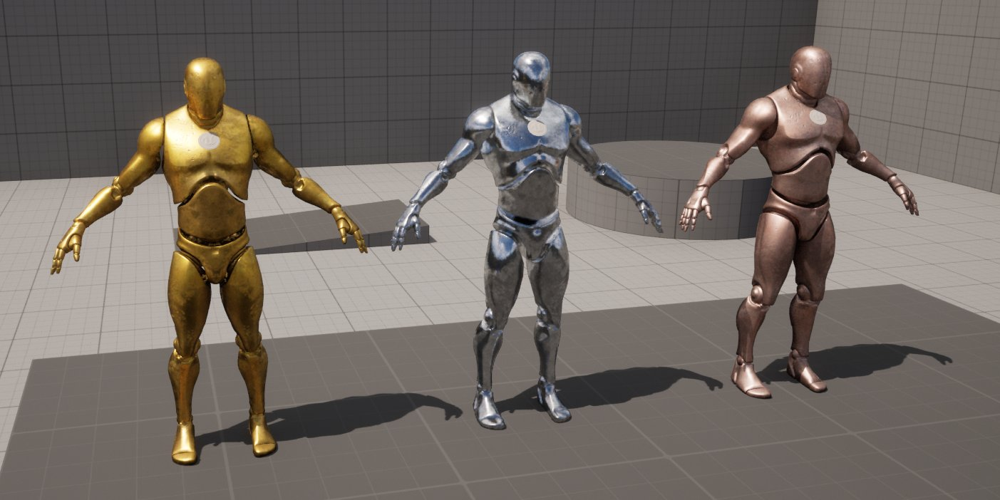
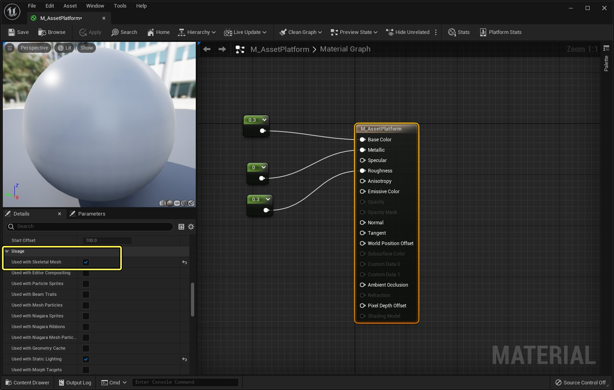
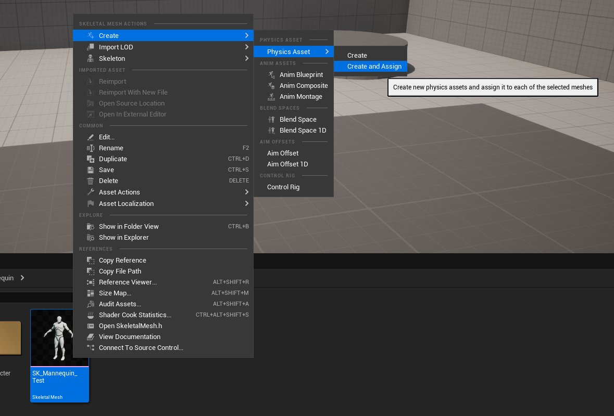

# 骨骼网格体Actor

> 路径：虚幻引擎5.7文档 / 理解基础知识 / Actor和几何体 / Actor参考 / 骨骼网格体Actor

> 原始页面：https://dev.epicgames.com/documentation/unreal-engine/skeletal-mesh-actors-in-unreal-engine

**骨骼网格体Actor（Skeletal Mesh Actor）** 显示动画网格体，其几何体可以变形，通常是通过使用动画序列期间的控制点来变形。这些Actor可以从外部3D动画应用程序创建和导出，也可以直接在虚幻引擎中编程来实现。

> [!TIP]
> 要详细了解如何将内容导入到虚幻引擎中，请参阅[直接导入资产](../../../assets-and-content-packs/importing-assets-directly-into/index.md)页面。

顾名思义，骨骼网格体包含由多个 **骨骼** 组成的 **骨架** 。这些用于动画过程。

骨骼网格体Actor常用于表示玩家角色、NPC、其他动画生物和复杂的机制。[第三人称模板](https://dev.epicgames.com/documentation/404)中显示的虚幻引擎人体模型是骨骼网格体Actor的示例。

## 放置骨骼网格体Actor

要放置骨骼网格体Actor，最快的方式是从[内容浏览器](../../../content-browser/index.md)将其拖入关卡视口中。接着，你可以使用其变换属性将其放在需要的地方。

> [!TIP]
> 要了解放置Actor的其他方法，请参阅[放置Actor](../../placing-actors/index.md)页面。

## 制作骨骼网格体Actor的动画

要在虚幻引擎中制作骨骼网格体Actor的动画，有两种基本方法可用：

- 使用[动画蓝图](../../../../animating-characters-and-objects/skeletal-mesh-animation-system/animation-blueprints/index.md)播放和混合多个动画。
- 使用动画资产一次性或循环播放单个[动画序列](../../../../animating-characters-and-objects/skeletal-mesh-animation-system/animation-assets-and-features/animation-sequences/index.md)。

> [!TIP]
> 要详细了解如何制作骨骼网格体的动画，请参阅[骨骼网格体动画系统](../../../../animating-characters-and-objects/skeletal-mesh-animation-system/index.md)页面。

## 更改骨骼网格体Actor的材质

你可以单独覆盖骨骼网格体Actor的材质以更改其外观。如果你想在关卡中多次使用同一个静态网格体，但想在它们之间有一些变化，这会很有用。

下面的示例显示了使用虚幻人体模型骨骼网格体的三个骨骼网格体Actor。每个Actor使用不同的材质。

要替换分配给骨骼网格体的材质，请在内容浏览器中找到材质，然后将其拖到关卡视口中的骨骼网格体Actor上，如以下示例所示。

要将材质用于骨骼网格体Actor，你需要启用 **用于骨骼网格体（Used with Skeletal Mesh）** 选项。为此，请执行以下操作：

1. 在 **内容浏览器（Content Browser）** 中，双击 **材质（Material）** 在 **材质编辑器（Material Editor）** 中打开。
2. 在 **细节（Details）** 面板中，启用 **用于骨骼网格体（Used with Skeletal Mesh）** 选项。

材质编辑器中的 用于骨骼网格体（Used with Skeletal Mesh） 选项。点击查看大图。

## 骨骼网格体Actor碰撞

法线碰撞创建和检测不适用于骨骼网格体Actor。要让你的骨骼网格体与关卡中的对象碰撞，你的骨骼网格体Actor需要有专门为其创建的 **物理资产（Physics Asset）** 。

> [!TIP]
> 要详细了解物理资产及其用法，请参阅[物理资产编辑器](../../../../gameplay-systems/physics/physics-asset-editor/index.md)文档。

要创建物理资产并将其分配给骨骼网格体Actor，请执行以下步骤：

1. 在 **内容浏览器（Content Browser）** 中找到 **骨骼网格体（Skeletal Mesh）** 并右键点击它。
2. 在 **上下文菜单** 中，选择 **创建（Create）> 物理资产（Physics Asset）> 创建并分配（Create and Assign）** 。

创建物理资产并将其分配给骨骼网格体
