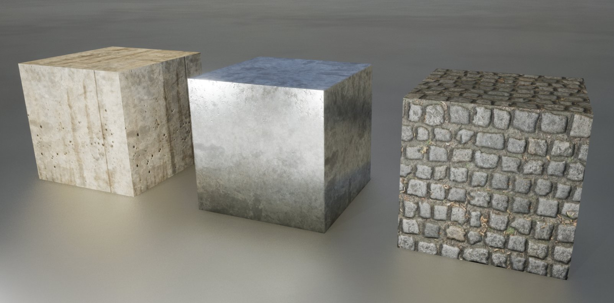
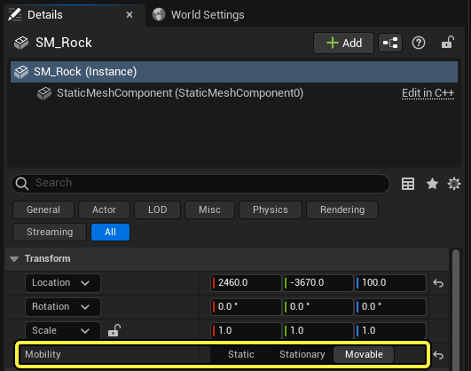
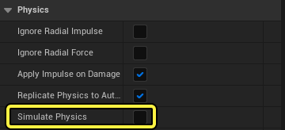

# 静态网格体Actor

> 路径：虚幻引擎5.7文档 / 理解基础知识 / Actor和几何体 / Actor参考 / 静态网格体Actor

> 原始页面：https://dev.epicgames.com/documentation/unreal-engine/static-mesh-actors-in-unreal-engine

**静态网格体Actor（Static Mesh Actor）** 是一种简单的Actor类型，用于在关卡中显示3D网格体。尽管名称暗示Actor是静态的（或无法移动），但这里"静态"指的是所使用的网格体类型，而不是指Actor能否移动。如果网格体的几何体不会改变，该网格体就是 **静态* 的。否则，Actor本身可以在运行期间以其他方式移动或更改。

静态网格体Actor常用于创建游戏世界或其他类型的环境。

虚幻引擎包含以下默认的静态网格体Actor：

- 立方体
- 球体
- 圆柱体
- 椎体
- 平面

除了这些之外，你还可以导入你自己的在其他3D应用程序中创建的静态网格体Actor。

> [!TIP]
> 要详细了解如何将内容导入到虚幻引擎中，请参阅[直接导入资产](../../../assets-and-content-packs/importing-assets-directly-into/index.md)页面。

## 放置静态网格体Actor

要放置静态网格体Actor，最快的方式是从[内容浏览器](../../../content-browser/index.md)将其拖入关卡视口中。接着，你可以使用其变换属性将其放在需要的地方。

> [!TIP]
> 要了解放置Actor的其他方法，请参阅[放置Actor](../../placing-actors/index.md)页面。

## 更改静态网格体Actor的材质

你可以为每个静态网格体Actor单独覆盖应用于静态网格体的材质。这样一来，你可以在关卡中使用单个静态网格体资产多次，同时每次显示唯一的外观。

下面的示例显示了使用相同静态网格体（一个简单的三维立方体）的三个静态网格体Actor。每个Actor使用不同的材质。

要替换分配给静态网格体的材质，请在内容浏览器中找到该材质，然后将其拖到关卡视口中的静态网格体Actor，如以下示例所示。

> [!TIP]
> 要了解将材质分配给静态网格体的其他方法，请参阅[设置静态网格体的材质](../../../../working-with-content/static-meshes/using-materials-with-static-meshes/index.md)页面。

## 在Gameplay期间移动静态网格体Actor

Actor的 **移动性（Mobility）** 设置可控制Actor在Gameplay期间是否能够以某种方式移动或变化。

默认情况下，静态网格体Actor的移动性为 **静态（Static）** 。要在运行期间移动、旋转或缩放静态网格体Actor，你必须首先将其设为 **可移动（Movable）** 。为此，在Actor的 **细节（Details）** 面板中，将其 **移动性（Mobility）** 设置为 **可移动（Movable）** 。

> [!TIP]
> 要详细了解不同的移动性设置及其如何影响静态网格体Actor，请参阅[Actor移动性](../../actor-mobility/index.md)页面。

## 为静态网格体Actor启用物理

如果你希望静态网格体Actor受重力和碰撞影响，请在Actor的 **细节（Details）** 面板中启用 **模拟物理（Simulate Physics）** 属性。

> [!TIP]
> 你可以在[物理](../../../../gameplay-systems/physics/index.md)小节中详细阅读在虚幻引擎中实现物理效果的方式。

在下面的示例中，球体静态网格体Actor启用了 **模拟物理（Simulate Physics）** 。模拟开始时，重力会影响球体，使其坠落，直至与地面碰撞。

## 为静态网格体Actor启用碰撞

**碰撞（Collision）** 是Actor的一个属性，用于在环境中的其他Actor碰撞该Actor时做出反应。

默认情况下，如果静态网格体有 **物理形体（Physics Bodies）** ，无论是在你的3D编辑包中生成（请参阅[FBX内容管线](../../../../working-with-content/fbx-content-pipeline/index.md)）还是在 **静态网格体编辑器（Static Mesh Editor）** 中生成（请参阅[碰撞响应参考](../../../../gameplay-systems/physics/collision/collision-response-reference/index.md)），该网格体都会发生碰撞，并且将设置为 **全部阻止（Block All）** 。

> [!TIP]
> 请参阅[碰撞](../../../../gameplay-systems/physics/collision/index.md)文档，详细了解不同类型的碰撞及其如何影响静态网格体Actor。
