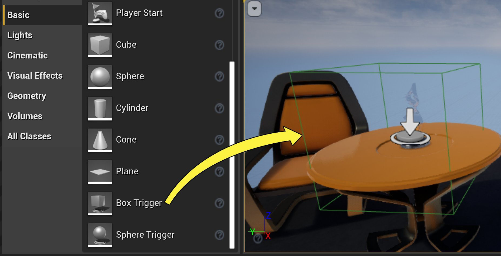
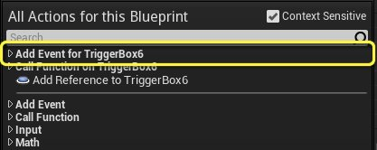
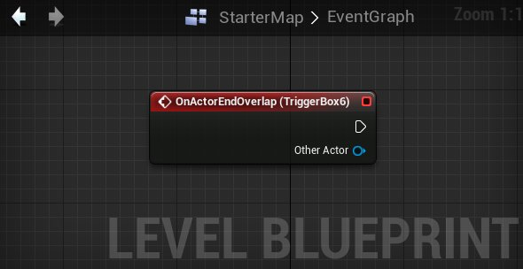

# 触发器体积Actor

> 路径：虚幻引擎5.7文档 / 理解基础知识 / Actor和几何体 / Actor参考 / 触发器体积Actor

> 原始页面：https://dev.epicgames.com/documentation/unreal-engine/trigger-volume-actors-in-unreal-engine

**触发器（Triggers）** 属于Actor，当它们与关卡其他对象交互时，可以触发关卡事件。换而言之，它们负责响应关卡对象的动作并触发事件。所有触发器都差不多，区别在于形状不同——有盒体、胶囊体和球体——触发器通过这些形状来判断其他对象是否碰撞并激活了它。

| box trigger | capsule trigger | sphere trigger |
| --- | --- | --- |
| 盒体触发器 | 胶囊体触发器 | 球体触发器 |

## 放置触发器

你可以通过拖拽触发器类型在关卡中放置触发器。在 **选择（Select）** 模式中，你可以在 **放置Actors（Place Actors）** 的 **基本（Basic）** 选项卡中拖拽触发器类型。

## 触发事件

触发器用于激活放置在[关卡蓝图](../../../../blueprints-visual-scripting/specialized-blueprint-visual-scripting-node-groups/types-of-blueprints/level-blueprint/index.md)中的事件。触发器可以激活几种不同类型的事件。主要类型的事件用于响应与另一个对象的某种类型的碰撞，例如某物与触发器碰撞或重叠，或响应来自玩家的输入。

当在 **视口（Viewport）** 中选择了触发器时：

- 在 **关卡蓝图事件图表** 中 **单击右键**，并在 **为[触发器Actor名称]添加事件（Add Event for [Trigger Actor Name]）** 下选择一个事件。

  

通过这两种方法中的任何一种选择一个事件，都会将一个[事件节点](../../../../blueprints-visual-scripting/specialized-blueprint-visual-scripting-node-groups/events/index.md) 添加到当前关卡的关卡蓝图中：

每当发生该事件，都会触发该事件节点的执行引脚——在上述示例中，每当一个Actor与触发器重叠（或穿过触发器）时：
